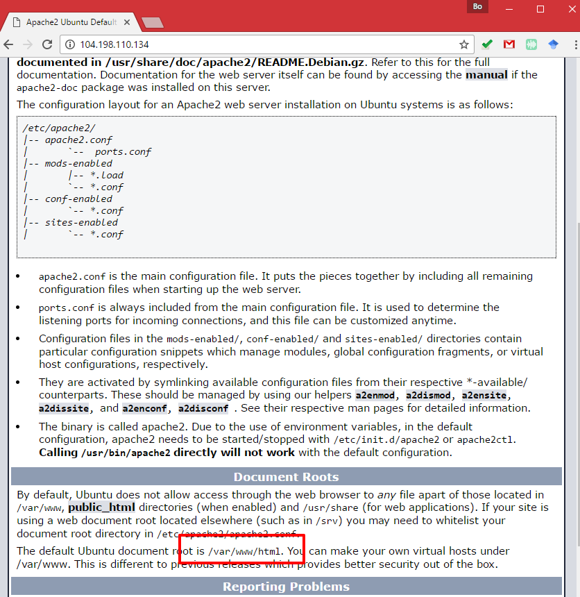
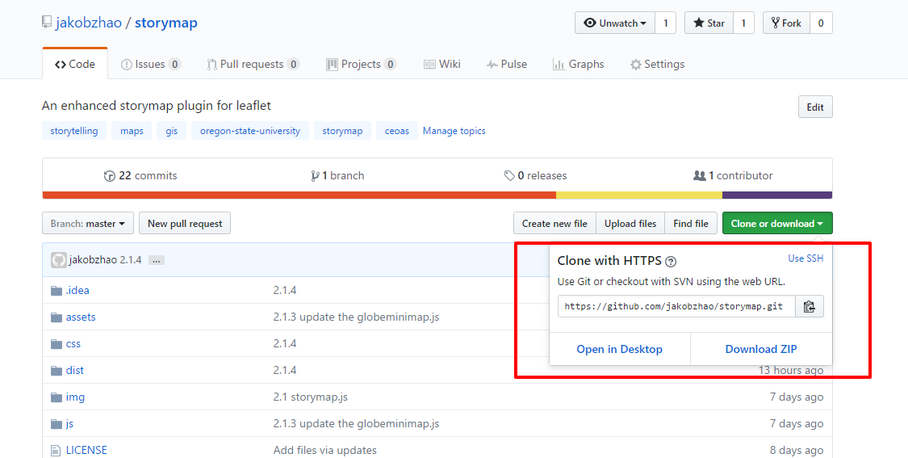
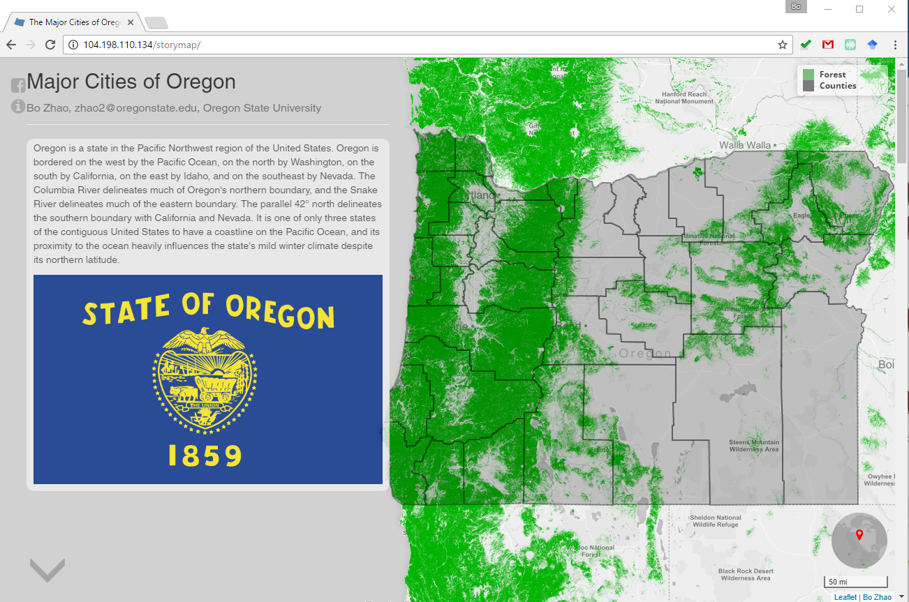

# (Optional) PE5 cont'd: Deployment via GitHub

> Winter 2017 | Geography 371 | Geovisualization: Web Mapping
>
> Instructor: Bo Zhao | TA: Andy Wilson | Location: 210 Wilkinson | Time: Thursday 2-3:50pm
>
> Assigned: 02/23/2017 | Due: `03/09/2017 @11:59pm` | Points Available = 50

This follow-up tutorial will help you to deploy a web mapping application to a remote server. Based on the GitHub synchronization you have learned in PE 5, the way to deploy a web server should be straightforward, you can simply use the `git` command to complete the task. 

1\. Take Google platform for example, please open your compute engine page on Google cloud platform.

2\. Enter the remote terminal by clicking the `ssh` button.


3\. As informed in the front page of your remote server `http://<external-ip>/`, the root of the web site locate at `/var/www/html`. 



4\. In the terminal, navigate to the root directory

```powershell
$cd /var/www/html
```

5\. make sure the server has installed `git`, if not, please execute the following code,

```powershell
sudo apt-get update
sudo apt-get install git
```

6\. Find the git url location of your project at GitHub. Take the storymap.js repository ([https://github.com/jakobzhao/storymap](https://github.com/jakobzhao/storymap)) for example, you can find the git url by clicking the  `Clone or download` button. 



7\. To deploy a web application, you can simple execute `git clone` to copy the GitHub repository to the server.

```powershell
$ sudo git clone https://github.com/jakobzhao/storymap.git
```

Then you can check the status of the repository by the following code:

```powershell
$ ls -l 
$ cd <the name of your repository>
$ ls -l
```

You will see the screenshot below:


Now, you can access your web map application by `http://<external-ip>/<your-repository-name>` , For example, I can visit [http://104.198.110.134/storymap](http://104.198.110.134/storymap) through a web browser.



8\. If your repository got updated and you want to implement these updates on the server, you can simply synchronize the updates via GitHub by the following code.

```powershell
$ cd /var/www/html/<the name of your repository>
$ sudo git checkout --force
$ sudo git pull
```

This follow-up helps you deploy a project to your remote server through GitHub, and also makes the update process really convenient. Free feel to practice the web mapping deployment on google cloud platform or other servers.