# Practical Exercise 1: First Web Map Using Google My Maps

> Winter 2017 | Geography 371 | Geovisualization: Web Mapping
>
> Instructor: Bo Zhao | TA: Andy Wilson | Location: 210 Wilkinson | Time: Thursday 2-3:50pm
>
> Assigned: 01/12/2017 | Due: `01/19/2017 @11:59pm` | Points Available = 50

Welcome to the lab session of Geog 371! The first lab helps you get familiar with the lab (Digital lab @OSU), the software setup, and the structure of the lab session. In addition, this lab helps you build up your first web mapping application. The objectives of this practical exercise are:

- Get to know the Digital Lab @ OSU.
- Create a web map using Google My Maps.
- Create, manage and export geospatial data.
- Share a web map to public.

## 1. Introduction

Specifically, your first web map application will be built upon [Google My Maps](https://www.google.com/maps/d). This application allows you create a customized map, create geospatial data of various types (e.g., point, polyline, polygon, etc.), manage the map layers, export standard geospatial data for reuse, and share your map to public. Let's first explore the Lab environment and the software setup for this course.

### 1.1 Digital Earth Lab @ Oregon State University

Digital Earth Lab is a teaching facility primarily for GIS, remote sensing, cartography, numerical analysis, and scientific visualization. The classroom is a facility of the OSU College of Earth, Ocean, and Atmospheric Science and is supported by the OSU Media Services. The lab was originally funded by a NASA infrastructure grant to Sherm Bloomer (professor & Dean, College of Science) and Nick Pisias (professor & former associate dean of COAS). Digital Earth is located in 210 Wilkinson Hall and is one of the most advanced teaching facilities on the Oregon State campus. We have been operational since the beginning of Spring term, 1999.

The lab generally opens 8am-5pm , a detailed schedule can be found at http://dusk.geo.orst.edu/de/de_teach.html. The manager of the facility is COry Langhoff. If you need afterhours access, contact Cory Langhoff langhofc@oregonstate.edu, or dial 7-2532 to make arrangements. Please ahead of time.

### 1.2 Software Setup

This course relies on a series of professional software and web applications to make, debug, and browse web maps, including:

- **Webstorm:** A web mapping programming development environment;
- **GeoServer:** An integrated platform for web mapping services;
- **QGIS:** An open source GIS desktop;
- **Chrome:** A Web browser;
- **Google Earth Pro:** A three-dimensional virtual globe with various geopstial data;
- **Google My Maps:** A handy Web Mapping application which allows its user to create, edit, export and share web maps.

Okay, now let us get started! The first web map is to visualize an arbitrary OSU student's activity in a day. To do that, a time table of the student's daily activity in Januanry 12th, 2017 is shown below.

| Location                  | Time                          | Description                        |
| ------------------------- | ----------------------------- | ---------------------------------- |
| Park West Apartments      | 0600 to 0759                  | Getting up, washing, and breakfast |
| On the way to campus      | 0800 to 0815                  | Riding a bike to campus            |
| Valley Library            | 0816 to 1259                  | Studying in the library            |
| On the way to cafeteria   | 1300 to 1310                  | Walking to Monroe Avenue           |
| Local Boyz Hawaiian Café  | 1311 to 13:49                 | Lunch                              |
| On the way back to campus | 1350 to 1359                  | Walking back to campus             |
| Wilkison Hall             | 1400 to 1450                  | Taking a class                     |
| On the way back home      | 1451 to 1505                  | Riding back home                   |
| Park West Apartments      | 15:06 to 0599 of the next day | Supper, family time, and sleep.    |

## 2. Create a map on Google My Maps

Create custom maps to share and publish online with Google My Maps. You can make maps that show different kinds of information.

### 2.1 Create a new map

1\. Open Google My Maps https://mymaps.google.com/.

2\. Sign in with your Google Account.

3\. Click `Create a new map`.

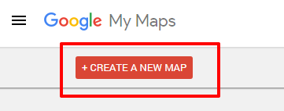

### 2.2 Title your map

1\. Click `Untitled map` at the top of the left panel.

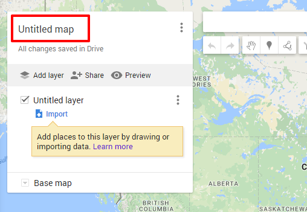

2\. Add a map title and description. These details will appear when you open the map again or share it with others.

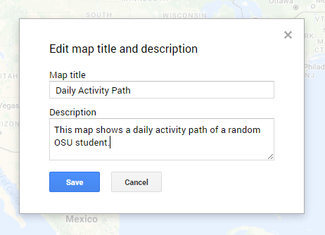

3\. Press `Save`.

4\. click on the layer title `Untitled layer`, and change the title to `Jan 12, 2017`

## 3. Add places and search results

 Let us zoom in to the region of oregon state university on the map.

### 3.1 Draw to add a place

1\. In the toolbar, click Add marker  . Your cursor changes into a “+”.

2\. Click on the map where you want to place your marker. For example, click on the valley library. An info window will pop up.

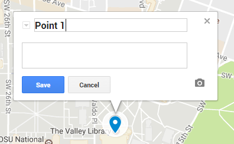

3\. In the info window, add a title and description.

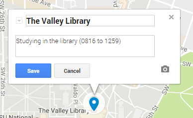

4\. To save, click Save or press Enter.

5\. In addition to simply drawing markers, you may also want to add markers by searching for the name of a specific place, like a restaurant, hotel, or museum to add to your map. For example, if you are not familiar with "Park West Apartment", type it in the Searchbox.

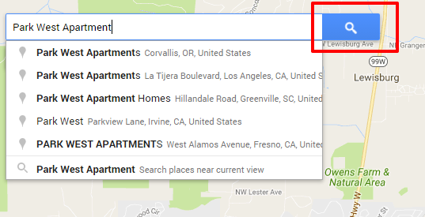

6\. After you press the search button, A new, non-permanent layer entitled “Park West Apartments” will automatically appear in the left panel and your results will show as green pins on the map.

7\. To add that pin to your layers, click the result. Then click `Add to map`.

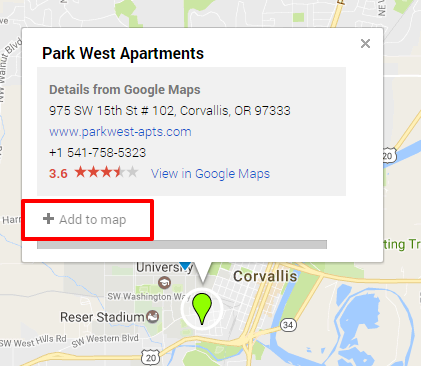

You can add up to `2,000` map features per layer.

8\. Remove the default marker info by click `Remove`, and then fill customized info in the time table.

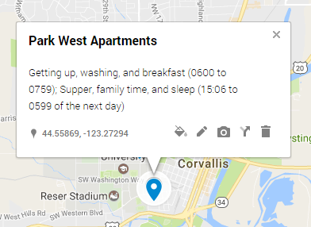

9\. Following the same procedure, add Local Boyz Hawaiian Cafe and Wilkinson Hall.

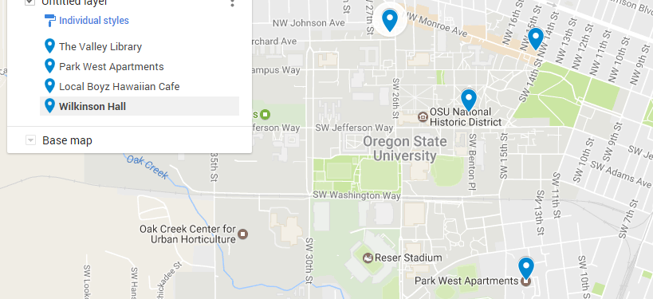

### 3.2 Add a lines and polygons

Using Google My Maps, we can add lines and shapes to your map to trace your roadtrip, keep track of your property line, or box off a neighborhood you want to live in. Now let us add the routes between each two locations.

1\. In the toolbar, click the line or shape icon draw a line or shape . There is a list of options, click `Add line or shape'.

2\. Your cursor changes to a “+”. Move the cursor to where you want to start drawing, then click once. For example, let us draw the route from Park West Apartment to the Valley Library.

3\. Click at each point of your line or shape. The more you click, the more precise your line or shape will be. To move the map, click and hold the mouse.

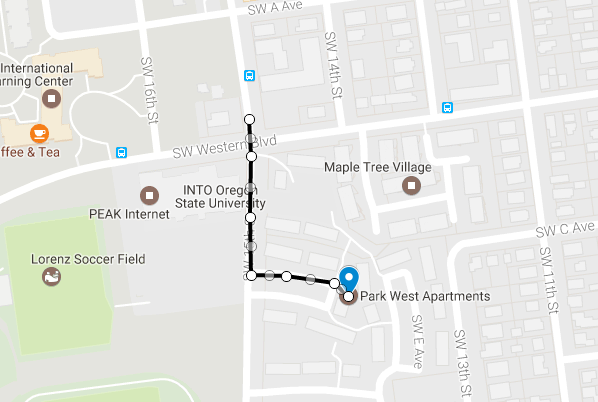

4\. To finish drawing your line, double click on the last point. And also fill in the popuped up info window to describe the route. If you did not see the popupped up info window, click on the polyline you have just drawn. *PS: to finish drawing your polygon, click on the starting point.*

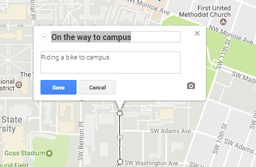

5\. To save, Hit `Save` button.

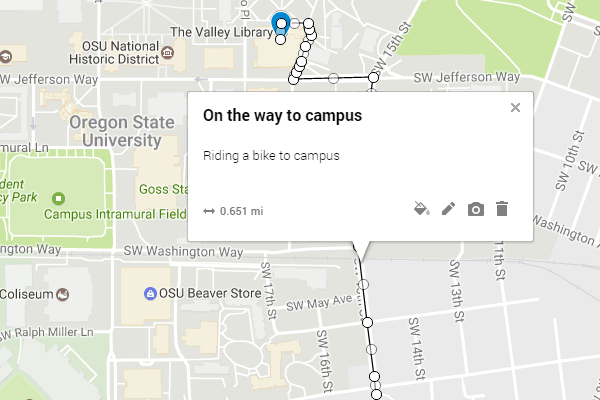

6\. Following the same procedure, please draw other routes according to the time table. Then we can get a map as shown below.

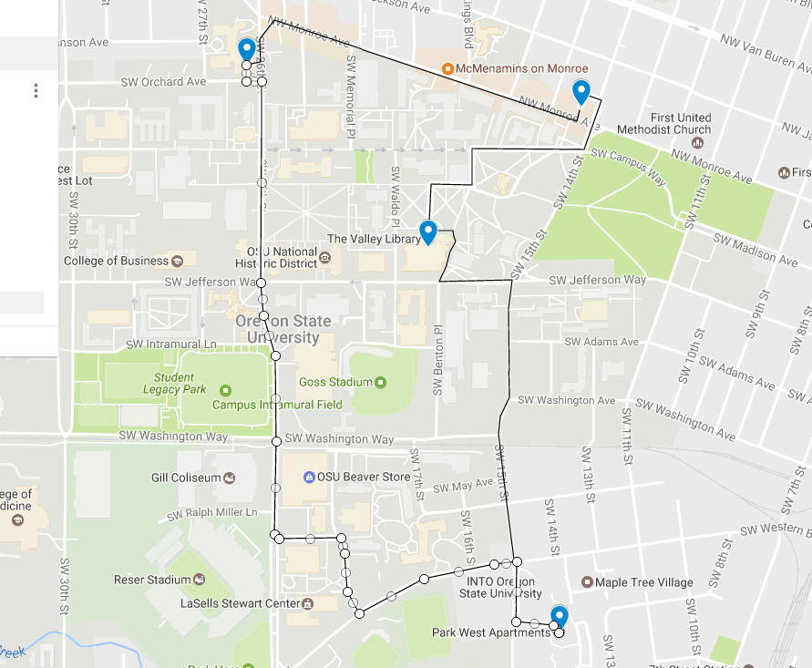

> **Note: You can also add walking, driving or biking routs along roads:**
>
> 1. In the toolbar, click the line or shape icon draw a line or shape . There is a list of options, click `Add line or shape'.
> 2. Whether you want driving, biking, or walking directions, click one of the `Add route` options. A new layer will be created.
> 3. Click once to mark your starting point.
> 4. Click at each point of your route. The more you click, the more precise your route will be. To pan the map, click and hold the mouse then move your cursor to the corner of the map.
> 5. To finish adding your directions route, double click on your final destination.

> **Why are my lines curved?** If you've used My Maps in the past, you may notice that straight lines or shapes you added previously now have a curved appearance. We use the Mercator projection to unwrap and flatten the earth’s curved surface into the flat representation used in My Maps. Previously, lines and polygons were directly drawn on top of the flat map. Now, they will follow the shortest path between their endpoints on the earth’s surface. This is why they may appear curved on the map, especially for lines longer than 200 miles towards the North and South poles.

### 3.3 Add photos and more to your map

Types of content you can add:

- Photos and videos;
- Extra info, like a description, price, or website;
- Text notes about places on the map.

1\. Click on the marker of valley library, In the box that appears on the map, click the `camera icon`​​.

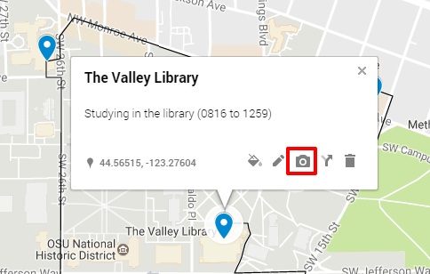

2\. Choose how you want to add a photo or video. To add more photos or videos, click the + button. To remove a photo or video, click `delete`. Let us drag the image named valley_library.png from the assets folder or select the file from your computer.

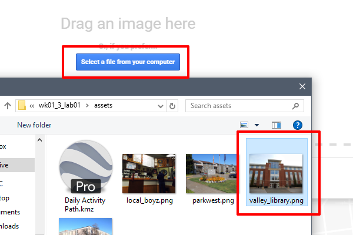

3\. Click `Save`, then you will see.

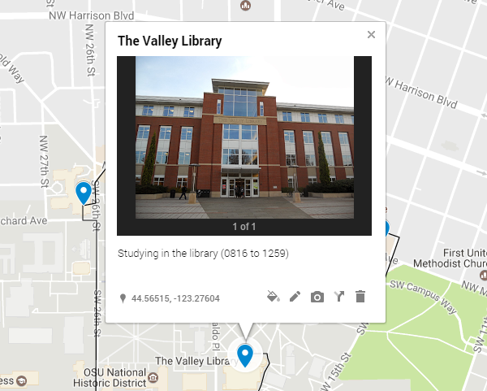

4\. Following the same procedure, we add pictures for the other locations.

## 4. Style your placemarks, lines, and shapes

You can style all your items in a layer together, or style them separately.

1\. Click `Indiviudal styles` below the layer title.

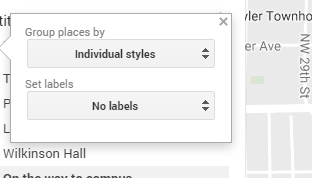

2\. Under the `Set labels` option, click on dropdown list, and select "name", in this way, the name of marker or polyline is used as the label.

3\. Under the `Group places by` option, you can select how you want to style your layer content:

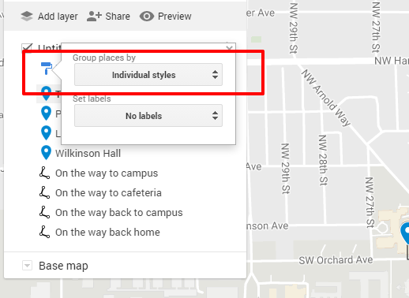

There are several items in the dropdown list:

    - `Uniform style` - This choice makes all the content looks the same but allows you to change the color and icon shape of the places at once.
    - `Sequence of numbers` - This choice automatically assigns a number to each placemark icon, keeping the same order as Individual styles. The numbers follow the same order as the map legend. To change the number of a placemark, change its order in the legend by dragging. In this mode, you have the option to assign any color to your icons.
    - `Individual styles` - This choice gives you the option to color all of your content one by one, and give them all different styling.
    - `Style by data column` - This choice gives you the option to use a data column to group your data for styling. Click one of the column titles to select it, then click the radio button next to the type of style:
    
        - `Range` - This option breaks up your numeric data set into up to 8 buckets. You have the option to have this displayed in a gradient or assign each respective bucket a unique color.
        - `Categories` - This option groups your data into matching attributes and sorts them in descending order by amount of map content present.

try each of the options under the dropdown list, and see the difference of the styles of markers and polylines.

You can also style individual marker or polyline.

1\. Let us choose `Individual styles`.

2\. Hover on the piece of content in the left panel you want to style. For example, hover on The Valley Library. The color button  will appear.

3\. Click the color button  to change the style.

    - Select 'orange' color, and;

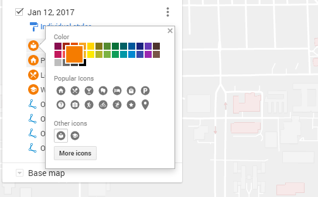

    - Click `More icons`, in the filter box, type "library", and then select the `library` icon. press "OK".

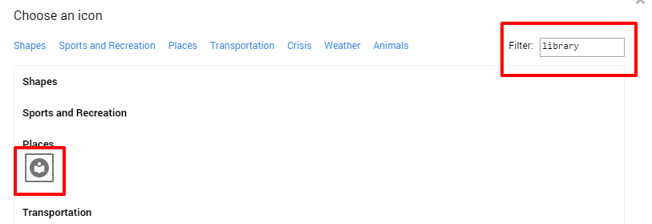

4\. Following the same procedure, we change all the icons into orange color, set the Part West apartment as `house` icon, the Local Boyz cafe as `restaurant` icon, and the Wilkinson hall as `university` icon. Moreover, we set the color of all polylines as "Blue", and widen them.

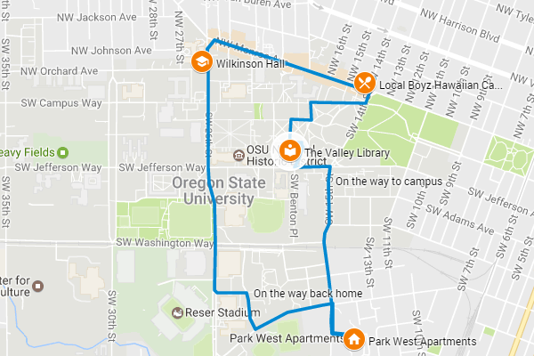

> **You can also add a custom icon**
>
> You can add your own icons for map placemarks if you’d like to use an image that’s not already available. For example, add an icon that represents your store to mark locations on the map. Your custom icon must be a live link on the web. You can upload a .jpg, .png, .bmp, or .gif file of any size to an image hosting website, like imgur.com. My Maps will scale the icon to the right size, which is `32x32 pixels`.
>
> If you want to use an icon with a transparent background, create your custom icon in RGB color mode. Icons with a transparent background created in Indexed color mode won't work. Custom icons are available only for the map you add them to. They aren't stored in the list of available icons for later use.

**Change map base layer**

To enable the map readers focus on the main feature of the map (the daily activity path), we need to swtich to another base map layer.

1\. Click on the `Base map` on the legend panel on the left.

2\. Choose the "mono city" base map layer.

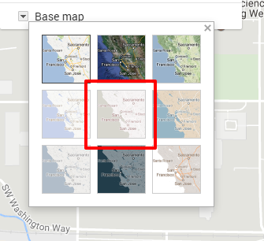

3\. In the end, you will see a web map like this.

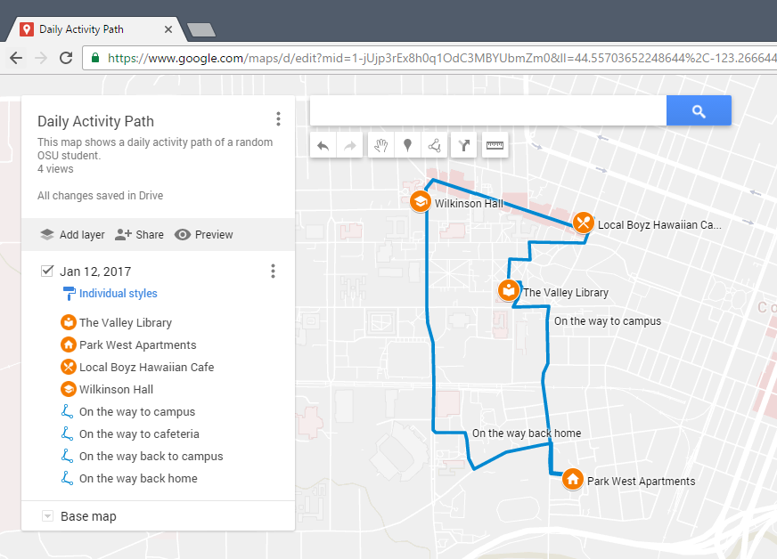

## 5.Export and share a map

You can export and download an entire map or just some information on it. That way, you can import and see your geographical data in other apps. For example, on a map with cross-country driving directions and restaurants along the way, download just the directions so you can visualize it in Google Earth.

### 5.1 Export your map's data

1\. In the left panel, click Menu .

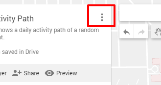

2\. Select `Export to KML` to export,  and make sure you export the `Entire map`.

3\. To download without the custom icons, check `Export to a .KML file instead of .KMZ`. In this practical exercise, do not check the box, you will export a KMZ file.

4\. Click `Download` button and a KMZ file will be downloaded.

> **Note:** A KMZ map link updates about every 10 minutes. If you see a delay in updates, check back shortly.

5\. Make sure the computer you are working with right now has installed `Google Earth Pro`. If installed, open this software, and navigate from the main menu file-> open.

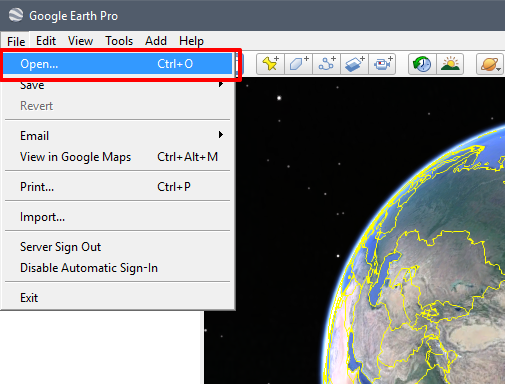

6\. In the open dialog, select the downloaded KMZ file and open. Then you can see the KMZ file is properly loaded.

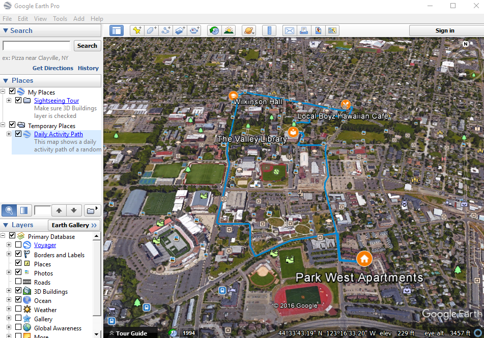

### 5.2 Share your maps

Show a map to others, or crowdsource information from your community or team to make your map even more powerful. Once you’ve granted access to your recipients, you can share in a few ways:

- Use the URL itself.
- Share a link via Gmail, Google+, Facebook, or Twitter.
- Add names of Google Contacts, email addresses, or Google Groups to allow others to view or edit.

To share your map,

1\. In the left panel, click the `Share` button .

2\. To share the map more widely, click `Change`.

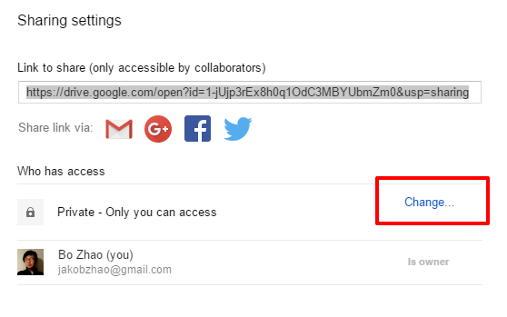

3\. Then choose your visibility and access settings. Choose the `On - Anyone with the link` option, and make sure the access right is `Can view`.

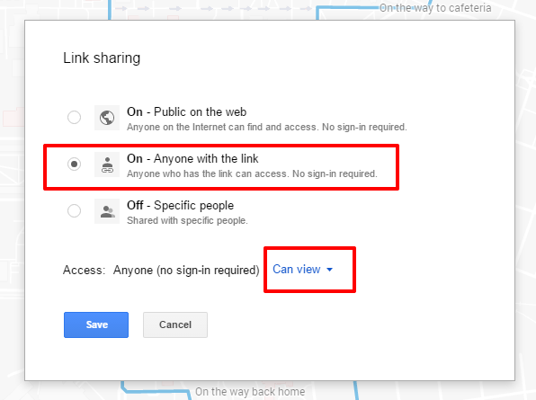

4\. you can view this web map by visiting the url link [https://drive.google.com/open?id=1-jUjp3rEx8h0q1OdC3MBYUbmZm0&usp=sharing](https://drive.google.com/open?id=1-jUjp3rEx8h0q1OdC3MBYUbmZm0&usp=sharing).

> **Permissions and privacy**
>
> All maps are private by default, so only you (the owner and creator) can view or edit it. However, you can allow other My Maps users to view or edit your shared maps.
>
> To allow others to change permissions, click Change in the small font at the bottom of the share menu. Here, you can allow other editors to add people and change permissions.

## 6. Deliverable

### 6.1 How to save your work

In the lab environment, it is essential that you frequently save your work. Many hours of work may be lost if you forget to save, the computer crashes, or you forget to take your work with you. Therefore please follow the simple procedures below for saving your work.

1\.	Work on your local machine

Often working across a network or to a zip drive can be very time consuming. Therefore, work on your local machine and then you can cut and save your result into your flash drive if you want.

-  First create a folder on the c:\ drive.
   -Name it using the following convention: XXX_GEOG371_PE# where XXX are your initials and # is the PE # (e.g. BZ_GEOG371_PE1).
   -Make sure there are NO spaces in your folder name. The example uses the underscore _ character, which works fine to add a space for clarity.

   2\.Save your work

   -Save all of your work in your newly created folder on the c:\ XXX_GEOG371_PE# drive location.
   -Feel free to create new folders under your folder, just make sure there are NO spaces in your folder/file names.

   3\.Copy your work to a removable device (BACKUP!!!)

   -When you are finished, or at a stopping point for the day, insert your jump drive into the computer and copy your c:\ XXX_GEOG371_PE#  folder onto your jump drive. This will ensure that everything in your folder is copied and backed-up.
   -Remove your removable media and take it with you.
   -If you don’t have a jump drive, you can also ZIP your workspace folder up and email it to you, or your Google drive.

   4\.Working at a new workstation

Now that you have all of your work saved on your removable media, for whichever workstation you choose to work on, all you need to do is copy your folder (XXX_GEOG371_PE#) to the c:\ drive. This will ensure all of your files are present on the local drive AS WELL AS your path names of your folders and files are the same as when you saved them.

### 6.2 Questions for this Practical Exercise

Please create a PE report as a word document, and answer all the following questions in the PE report.

**Question 1.** Please follow the steps above and make the daily activity path using Google My Maps. You may need to make the web map publicly visible. In the end, copy and paste the url link of the web map in the Word Document. (5 points)

**Question 2.** Choose a topic of your interest, and make a web map based on what you have learned from this lab. We would like to see how well the web map you made may deliver the topic, have you used multiple types of geographic features (points, lines, polygons), have you attached descriptions and pictures to the geographic features. Again, make this map publicly visible, and share the url link of the web map in the Word Document. (25 points)

**Question 3.** please export the kml/kmz data of the web map you made in Question 2, and open the data in Google Earth Pro. Zoom into to the region of the extent of your data, and take a screenshot and insert the screenshot in a Word Document.  (5 points)

**Question 4.** Please reflect on how google my maps may assist you on your own research of interest. (15 points)

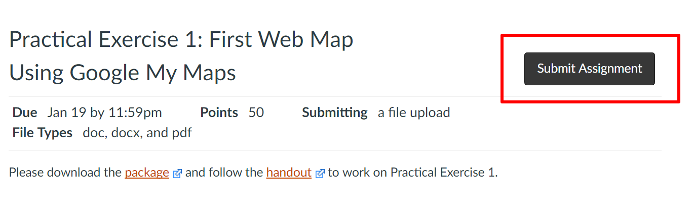

Once you finish this PE, you need to submit the PE report to **Canvas Dropbox**. On the assignment tab,  check the item of this PE, press the `Submit Assignment` button to submit your PE report. Please contact the instructor or TA if you have any difficulty. Note: only submit your PE report in Word or PDF format.