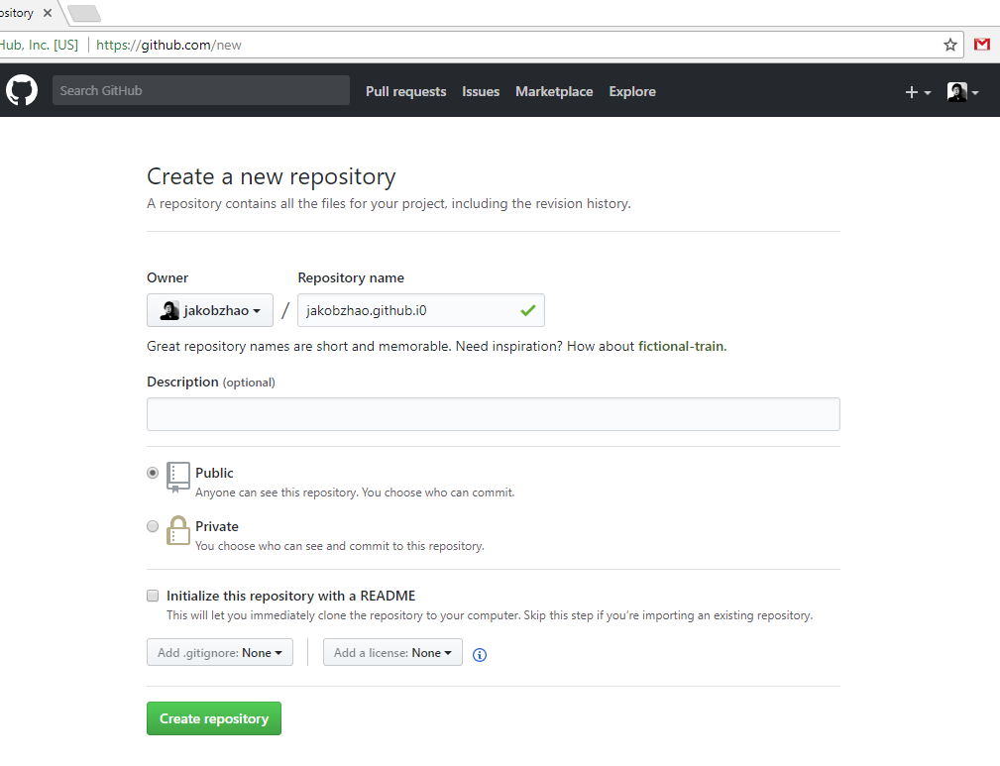
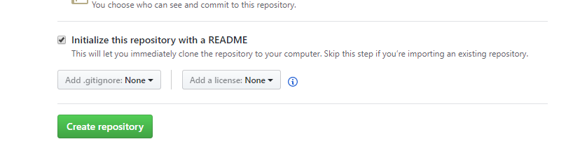
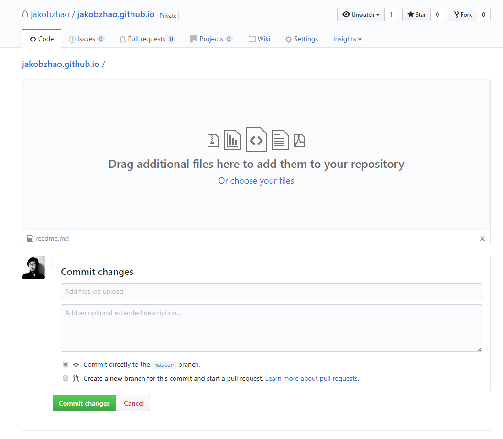

# Practical Exercise 1: Project Management

> Winter 2017 | Geography 371 | Geovisualization: Web Mapping
>
> Instructor: Bo Zhao  Location:  Wilkinson 210 | Time: Thursday 1000 to 1150
>
> Assigned: 09/21/2017 | Due: `09/28/2017 @11:59pm` | Points Available = 50

Welcome to the lab session of GEOG 371: Web Mapping! As the first lab, we will introduce the Digital Earth Lab at Wilkinson 210, download the course material and more importantly, help you get familiar with the major operations on web mapping project management. You will start with registering a github account, and learn how to use several software products, such as Webstorm, Typora, and Git. To test the learning objectives, we will ask you to publish your resume on github. Okay, let us get started!

# 1. Preparations

## 1.1 Digital Earth Lab @ Oregon State University

Digital Earth Lab is a teaching facility primarily for GIS, remote sensing, cartography, numerical analysis, and scientific visualization. The classroom is a facility of the OSU College of Earth, Ocean, and Atmospheric Science and is supported by the OSU Media Services. The lab was originally funded by a NASA infrastructure grant to Sherm Bloomer (professor & Dean, College of Science) and Nick Pisias (professor & former associate dean of CEOAS). Digital Earth is located in 210 Wilkinson Hall and is one of the most advanced teaching facilities on the Oregon State campus. We have been operational since the beginning of Spring term, 1999.

The lab generally opens 8am-5pm , a detailed schedule can be found at [http://dusk.geo.orst.edu/de/de_teach.html](http://dusk.geo.orst.edu/de/de_teach.html). The manager of the facility is Cory Langhoff. If you need afterhours access, contact Cory Langhoff [langhofc@oregonstate.edu](mailto:langhofc@oregonstate.edu), or dial 7-2532 to make arrangements. Please ahead of time.

## 1.2 Software Setup

For this lab, you will need to install the following software:

- **Webstorm:** A professional web mapping programming development environment ([Click here for the installation instruction](https://www.jetbrains.com/webstorm/buy/#edition=discounts)). and make sure you install the edition **for students and teachers**). Once you installed it, you will need to register it, usually the registration need to be renewed on an annual basis;

- **Typora:** An editor for composing Markdown files ([Click here to download Typora](https://typora.io/)). Typora is dedicated to process markdown files. It can browse, edit, and even convert markdown files to pdf or word documents; and

- **Git:** A version control system (VCS) for tracking changes in computer files and coordinating work on those files among multiple people ([Click here to download, choose the right platform, and then install](https://git-scm.com/downloads)). 

If **Git** is successfully installed, type `git` in command prompt (if you are a Windows user) or terminal (if you are a Mac or Linux user), the following screen will be shown up.


Once you have `git`  up and running,  you can sync the course material and also publish your own project repository.  We will talk about that in details in the following sections of this lab.

### 1.3 Register a Github account

1\. You will apply for a Github account for managing and sychronizing your web mapping project. If you do not have a Github account yet, please sign up at [https://www.github.com](https://www.github.com)

> **Do you know the differences between Git and Github?**
>
> **Git** is a version control system (VCS) for tracking changes in computer files and coordinating work on those files among multiple people. It is primarily used for software development, but it can be used to keep track of changes in any files. Git was created by **Linus Torvalds** in 2005 for development of the Linux kernel, with other kernel developers contributing to its initial development.
>
>  **GitHub** is a web-based Git or version control repository and Internet hosting service. GitHub offers both plans for private and free repositories on the same account which are commonly used to host open-source software projects. As of April 2016, GitHub reports having more than 14 million users and more than 35 million repositories, making it the largest host of source code in the world.

## 2\. Download the course material

In this course, all the material is stored on GitHub. We will go through the steps how to download the course materials as below.

1\. Every project is stored on GitHub as a repository. The repository for this course is located at [https://github.com/jakobzhao/geog371](https://github.com/jakobzhao/geog371). Please navigate to this url on a browser like Chrome. As shown, this course is created by me, my GitHub account name is `jakobzhao`, and the repository name is `geog371`. 

2\. On the front page of this repository, please click the green button named after `Clone or download` . To download the course material, you can click the `Download ZIP` button, as a result, a compressed file of the course material will be downloaded. 

3\. However, we recommend you to clone this project repository. You can get the **git url** of this repository on the popped up information panel [https://github.com/jakobzhao/geog371.git](https://github.com/jakobzhao/geog371.git).

4\. Next, open your working space on your own computer through commend prompt if you are a Windows user or through terminal if you are a Mac or Linux user. For example, the working space of my computer is located as `C:\Workspace`.

```powershell
C:\Users\[your_username]>cd C:\Workspace
C:\Workspace>
```

5\. Having the **git url**, we can use the command `git clone` in order to clone/download the repository of the course materials. 

 ```powershell
C:\Workspace\git clone https://github.com/jakobzhao/geog371.git
Cloning into 'geog371'...
remote: Counting objects: 962, done.
remote: Compressing objects: 100% (750/750), done.
remote: Total 962 (delta 214), reused 917 (delta 177), pack-reused 0Receiving objects:  99% (953/962), 158.77 MiB | 1.60 MiB/s
Receiving objects: 100% (962/962), 158.88 MiB | 1.60 MiB/s, done.
Resolving deltas: 100% (214/214), done.
Checking out files: 100% (650/650), done.
 ```

6\. To read the content in the downloaded repository, we need to `cd` into the directory of this repository. If you are on a Mac or Linux, type `ls` to check the file list of this repository, or try `dir` if you are on a Windows. Take windows for example.

```powershell
C:\Workspace>cd geog371

C:\Workspace\geog371>dir
 Volume in drive C has no label.
 Volume Serial Number is 3E8C-9A9E

 Directory of c:\Workspace\geog371

09/19/2017  09:12 PM    <DIR>          .
09/19/2017  09:12 PM    <DIR>          ..
09/19/2017  01:41 AM               412 .gitignore
09/19/2017  09:49 PM    <DIR>          .idea
09/19/2017  01:41 AM    <DIR>          img
09/19/2017  02:19 AM    <DIR>          labs
09/19/2017  01:41 AM    <DIR>          lectures
09/19/2017  01:41 AM             7,816 LICENSE
09/19/2017  01:41 AM    <DIR>          projects
09/19/2017  01:41 AM    <DIR>          readings
09/19/2017  04:35 AM             6,011 readme.md
09/19/2017  01:41 AM    <DIR>          resources
               3 File(s)         14,239 bytes
               9 Dir(s)  903,569,551,360 bytes free
```

In the root of this downloaded repository, there are folders like labs, lectures and readings, and files like readme.md and LICENSE. 

7\. Next, we open the `readme.md` file using `Typora`.  If the previous steps work successfully, we can read the similar content as shown below.


8\. One benefits of hosting the course material on GitHub is that you can easily update your project repository by implementing a combination of two command lines `git checkout --force` and `git pull` in the root directory of the repository. Once the two commands are executed. An update notice will be shown as below.

```powershell
C:\Workspace\geog371>git checkout --force
Your branch is up-to-date with 'origin/master'.

C:\Workspace\geog371>git pull
remote: Counting objects: 3, done.
remote: Compressing objects: 100% (3/3), done.
remote: Total 3 (delta 2), reused 0 (delta 0), pack-reused 0
Unpacking objects: 100% (3/3), done.
From https://github.com/jakobzhao/geog371
   13b2cab..baf74b1  master     -> origin/master
Updating 13b2cab..baf74b1
Fast-forward
 readme.md | 3 ++-
```

Now, the course material on your local computer is updated. 

> **Note:** In order to ensure you are reading the latest version of the lecture or lab handouts, you need to synchronize the course material, especially before class. 
>
> If you implement the above two commands in a Mac or Linux system, you might need to add `sudo` before `git`to preventing a lack of privilege issue. For example, `sudo git clone`, `sudo git checkout --force`. In general, the command `sudo` will assign the superuser privilege to the current command line. 

9\. Before we jump to the next section, please

- Star the repository by pressing the `star` button on the top right, and;
- Navigate to Dr. Zhao's front page at [https://github.com/jakobzhao](https://github.com/jakobzhao), and click the `Follow` button to be a follower. 

## 3\. Project management

In this section, we will introduce a series of operations related to project management, such as create a project repository, compile a markdown file, and upload files to GitHub, and at last, publish a repository.

### 3.1 Create a repository for your project

1\. Navigate to [https://github.com/new](https://github.com/new), and input the your repository name in the blank text box for `Repository name`. For example, the repository name of the course material is `geog371`. Here, please name your repository in the format of **[account_username].github.io**. So, if your account_username is `jakobzhao`, this repository name will be **jakobzhao.github.io**. 



2\. Also, please makes sure you **CHECK** the box "Initialize this repository with a README". For other options, you can leave them by default. 



3\. Next, click the `Create repository` button. A new repository `[account_username].github.io` is accordingly created. You can access this repository through the link `https://github.com/[account_username]/[account_username].github.io`. For example,  for the repository I just created, I can access the repository through the link [https://github.com/jakobzhao/jakobzhao.github.io](https://github.com/jakobzhao/jakobzhao.github.io).

### 3.2 Compile a Markdown file

1\. On your local computer, please create a file, and name it `readme.md`.

2\. Open this file `readme.md` with `Typora`. Next, please write down your resume in the opened-up editor.  Here is a template for you to start with:

```markdown
#Your Name

1234 Main St., City, State 12345

(555) 555-5555

your.name@example.com

http://www.example.com

http://www.linkedin.com/in/yourname

#Summary

Quick Summary (not objective) specifically highlighting why you qualify for the job.

#Work Experience (only last 10 years)

## University Name 1 (City, State)
*[Company 1][] description, particularly if not well-known.*

**Position Title (include alternate titles in parentheses)** (Start Date - End Date)

Summary of your role

- Accomplishment that contains **bold text**.
- Accomplishment
- Accomplishment
- Accomplishment

## University Name 2 (City, State)
*[Company 2][] description, particularly if not well-known.*

**Position Title (include alternate titles in parentheses)** (Start Date - End Date)

Summary of your role

- Accomplishment that contains **bold text**.
- Accomplishment
- Accomplishment
- Accomplishment

## University Name 3 (City, State)
*[Company 3][] description, particularly if not well-known.*

**Position Title (include alternate titles in parentheses)** (Start Date - End Date)

Summary of your role

- Accomplishment
- Accomplishment
- Accomplishment
- Accomplishment


[University 1]: http://www.example.com/company1
[University 2]: http://www.example.com/company2
[University 3]: http://www.example.com/company2
```
>**Note:** This resume template is from [http://www.jasonfilley.com/resumeinmarkdown.html](http://www.jasonfilley.com/resumeinmarkdown.html).
### 3.3 Upload files to GitHub

Once you have drafted out your resume in the `readme.md` file. You will upload this file to the **root** of the project repository `https://github.com/[account_username]/[account_username].github.io` on GitHub. You can use two ways as listed below interchangeably. 

#### 3.3.1 Drag & drop

1\. Since the `readme.md` file will be uploaded to the root of the repository, you need to navigate to the front page of your repository  `https://github.com/[account_username]/[account_username].github.io` using a web browser such as Chrome.

2\. Next, use your mouse to drag the `readme.md` file to the front page of the project repository. Once you see a notice saying **Drop to upload your files**, you can now release your mouse. A new interface will appear as below. Certainly, you can drag and drop multiple files and/or folders. In this lab, we just upload one single file.



3\. Before you press the green button `Commit Changes`,  you can add a name and/or some descriptions for this commit. It will help you organize and keep a record of your repository.

#### 3.3.2 Git push

You can also upload the `readme.md` through `git push` command.

1\. Download the repository   `https://github.com/[account_username]/[account_username].github.io`  following the instruction in Section 2 ***"Download the course material”***.

2\. In the root directory of the downloaded repository, please copy the edited `readme.md` to replace the existing  `readme.md`in the root. 

3\. After this replacement, you can push this change to the remote repository by implementing two command lines `git commit` and  `git push`.  As listed below.

```powershell
c:\Workspace\jakobzhao.github.io>git commit -m "update the readme.md"
[master a85f998] update the readme.md
 1 files changed, 106 insertions(+), 32 deletions(-)
 create mode 100644 labs/lab01/img/after-the-drop.png
 
c:\Workspace\geog371>git push
fatal: TaskCanceledException encountered.
   A task was canceled.
Username for 'https://github.com': jakobzhao
Password for 'https://jakobzhao@github.com':
Counting objects: 9, done.
Delta compression using up to 8 threads.
Compressing objects: 100% (9/9), done.
Writing objects: 100% (9/9), 99.58 KiB | 0 bytes/s, done.
Total 9 (delta 4), reused 0 (delta 0)
remote: Resolving deltas: 100% (1/1), completed with 4 local objects.
To https://github.com/jakobzhao/jakobzhao.github.io.git
   b237d06..a85f998  master -> master
```

> **Note:** Again, if you use a Mac or Linux, you might need to add `sudo` in front of the command line to avoid the privilege deny issue. 
>
> Also, the command prompt or terminal may ask you for GitHub username and password, please be prepared with such information.

### 3.4 Publish your repository

Once you uploaded the `readme.md` to the root, you can see your resume showing on the front page. Moreover, GitHub provide a new function named **GitHub Page** that converts a markdown file directly as a web page. Because your resume is located at the root of the repository named  `[account_username].github.io`  , you can directly access your resume by visiting `http://[account_username].github.io`  if you implement the following steps.

1\. please click the `Settings`tab on the top bar of the repository front page. 

2\. On the “GitHub Pages” Section, please click on the  `Source`  dropdown list and choose `master branch`.  Next, press the `Save` button.

3\. It usually takes several seconds to 1~2 minutes to apply this setting. If this setting is activated, you can read your resume from `http://[account_username].github.io`.

