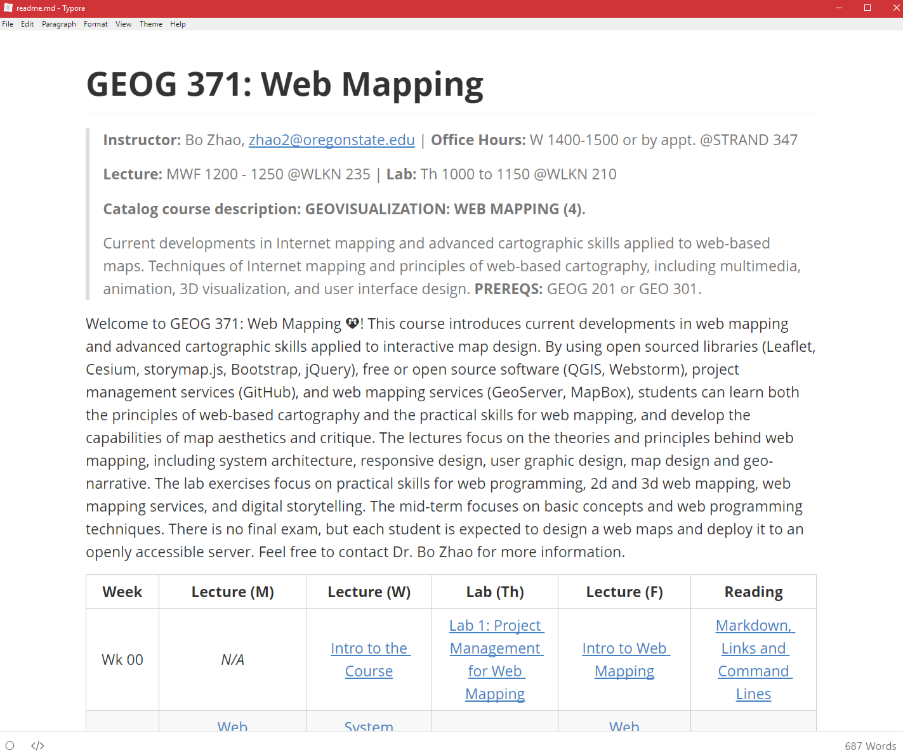

# Practical Exercise 1: Project Management

> Winter 2017 | Geography 371 | Geovisualization: Web Mapping
>
> Instructor: Bo Zhao  Location:  Wilkinson 210 | Time: Thursday 1000 to 1150
>
> Assigned: 09/21/2017 | Due: `09/28/2017 @11:59pm` | Points Available = 50

Welcome to the lab session of GEOG 371: Web Mapping. As the first lab of this course, we will introduce the Digital Earth Lab at Wilkinson 210, download the course material and more importantly, help you be familiar with the major steps of managing a web mapping project. To do that, you will start with registering a github account, and learn how to use several software products, such as Webstorm, Typora, and Git. To test the learning objectives, we will ask you to publish your resume on github. Okay, let us kick off this lab! 

# 1. Preprations

## 1.1 Digital Earth Lab @ Oregon State University

Digital Earth Lab is a teaching facility primarily for GIS, remote sensing, cartography, numerical analysis, and scientific visualization. The classroom is a facility of the OSU College of Earth, Ocean, and Atmospheric Science and is supported by the OSU Media Services. The lab was originally funded by a NASA infrastructure grant to Sherm Bloomer (professor & Dean, College of Science) and Nick Pisias (professor & former associate dean of COAS). Digital Earth is located in 210 Wilkinson Hall and is one of the most advanced teaching facilities on the Oregon State campus. We have been operational since the beginning of Spring term, 1999.

The lab generally opens 8am-5pm , a detailed schedule can be found at [http://dusk.geo.orst.edu/de/de_teach.html](http://dusk.geo.orst.edu/de/de_teach.html). The manager of the facility is Cory Langhoff. If you need afterhours access, contact Cory Langhoff [langhofc@oregonstate.edu](mailto:langhofc@oregonstate.edu), or dial 7-2532 to make arrangements. Please ahead of time.

## 1.2 Software Setup

For this lab, you will need to install the following software:

- **Webstorm:** A professional web mapping programming development environment ([Click here for the installation instruction](https://www.jetbrains.com/webstorm/buy/#edition=discounts)). and make sure you install the edition **for students and teachers**). Once you installed it, you will need to register it, usually the registration need to be renewed on an anual basis;

- **Typora:** An editor for composing Markdown files ([Click here to download Typora](https://typora.io/)); and

- **Git:** A version control system (VCS) for tracking changes in computer files and coordinating work on those files among multiple people ([Click here to download, choose the right platform, and then install](https://git-scm.com/downloads)). 

If **Git** is successfully installed, type `git` in command prompt (if you are a Windows user) or terminal (if you are a Mac or Linux user), the following screen will be shown up.


Once you have `git`  up and running,  you can sync the course material and also publish your own project repository.  We will talk about that in details in the following sections of this lab.

### 1.3 Register a Github account

1\. You will apply for a Github account for managing and sychronizing your web mapping project. If you do not have a Github account yet, please sign up at [https://www.github.com](https://www.github.com)

> **Do you know the differences between Git and Github?**
>
> **Git** is a version control system (VCS) for tracking changes in computer files and coordinating work on those files among multiple people. It is primarily used for software development, but it can be used to keep track of changes in any files. Git was created by **Linus Torvalds** in 2005 for development of the Linux kernel, with other kernel developers contributing to its initial development.
>
>  **GitHub** is a web-based Git or version control repository and Internet hosting service. GitHub offers both plans for private and free repositories on the same account which are commonly used to host open-source software projects. As of April 2016, GitHub reports having more than 14 million users and more than 35 million repositories, making it the largest host of source code in the world.

## 2\. Download the course material

In this course, all the material is stored on GitHub. We will go through the steps how to download the course materials as below.

1\. Every project is stored on GitHub as a repository. The repository for this course is located at [https://github.com/jakobzhao/geog371](https://github.com/jakobzhao/geog371). Please navigate to this url on a browser like Chrome. As shown, this course is created by me, my GitHub account name is `jakobzhao`, and the repository name is `geog371`. 

2\. On the front page of this repository, please click the green button named after `Clone or download` . To download the course material, you can click the `Download ZIP` button, as a result, a compressed file of the course material will be downloaded. 

3\. However, we recommend you to clone this project repository. You can get the **git url** of this repository on the popped up information panel [https://github.com/jakobzhao/geog371.git](https://github.com/jakobzhao/geog371.git).

4\. Next, open your working space on your own computer through commend prompt if you are a Windows user or through terminal if you are a Mac or Linux user. For example, the working space of my computer is located as `C:\Workspace`.

```powershell
C:\Users\[your_username]>cd C:\Workspace
C:\Workspace>
```

5\. Having the **git url**, we can use the command `git clone` in order to clone/download the repository of the course materials. 

 ```powershell
C:\Workspace\git clone https://github.com/jakobzhao/geog371.git
Cloning into 'geog371'...
remote: Counting objects: 962, done.
remote: Compressing objects: 100% (750/750), done.
remote: Total 962 (delta 214), reused 917 (delta 177), pack-reused 0Receiving objects:  99% (953/962), 158.77 MiB | 1.60 MiB/s
Receiving objects: 100% (962/962), 158.88 MiB | 1.60 MiB/s, done.
Resolving deltas: 100% (214/214), done.
Checking out files: 100% (650/650), done.
 ```

6\. To read the content in the downloaded repository, we need to `cd` into the directory of this repository. If you are on a Mac or Linux, type `ls` to check the file list of this repository, or try `dir` if you are on a Windows. Take windows for example.

```powershell
C:\Workspace>cd geog371

C:\Workspace\geog371>dir
 Volume in drive C has no label.
 Volume Serial Number is 3E8C-9A9E

 Directory of c:\Workspace\geog371

09/19/2017  09:12 PM    <DIR>          .
09/19/2017  09:12 PM    <DIR>          ..
09/19/2017  01:41 AM               412 .gitignore
09/19/2017  09:49 PM    <DIR>          .idea
09/19/2017  01:41 AM    <DIR>          img
09/19/2017  02:19 AM    <DIR>          labs
09/19/2017  01:41 AM    <DIR>          lectures
09/19/2017  01:41 AM             7,816 LICENSE
09/19/2017  01:41 AM    <DIR>          projects
09/19/2017  01:41 AM    <DIR>          readings
09/19/2017  04:35 AM             6,011 readme.md
09/19/2017  01:41 AM    <DIR>          resources
               3 File(s)         14,239 bytes
               9 Dir(s)  903,569,551,360 bytes free
```

In the root of this downloaded repository, there are folders like labs, lectures and readings, and files like readme.md and LICENSE. 

7\. Next, we open the `readme.md` file using `Typora`.  If the previous steps work successfully, we can read the similar content as shown below.



8\. One of the benefits of hosting the course material on GitHub is that you can easily update your project repository by two commend lines `git checkout -force` and `git pull` in the root directory of the repository.


Before we jump to next section, we recommend you 

- Star the repository by pressing the `star` button on the top right, and;
- Navigate to Dr. Zhao's front page at [https://github.com/jakobzhao](https://github.com/jakobzhao), and click the `Follow` button to be a follower. 


## Create a Project Repo

a new repo named as [username].github.com


创建 readme.md
license

## Project Edit

readme.md

typora  编辑

编辑自己的Resume

> 要求

> 我希望有表格，图片。

> Skills

图片放到 img 里面。

图片，列表，

## Project Uploading

拖拽，

## Project Clone

working dir
clone

> question：clone course material


## Update Project

Open project in web storm

create a img folder

put head.png in the same folder


## Publish your resume: The Magic of Git Page

github page  open

visit  github.io and github.com

describe the difference you see.


> question: a CV


A new repo: