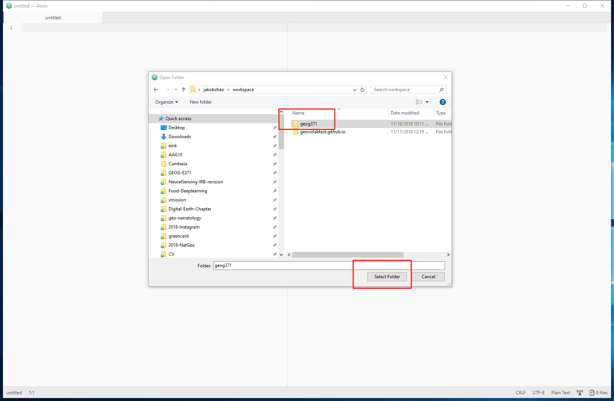
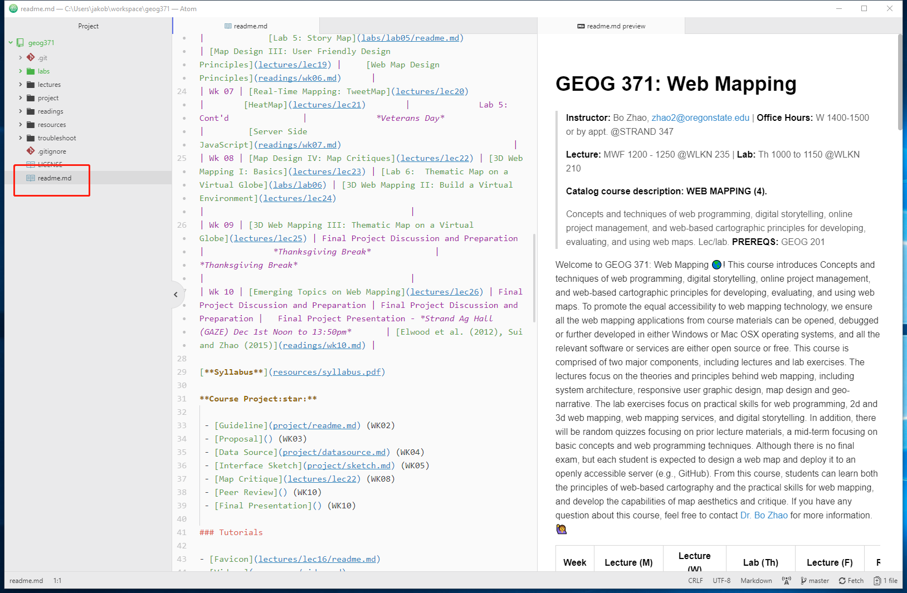
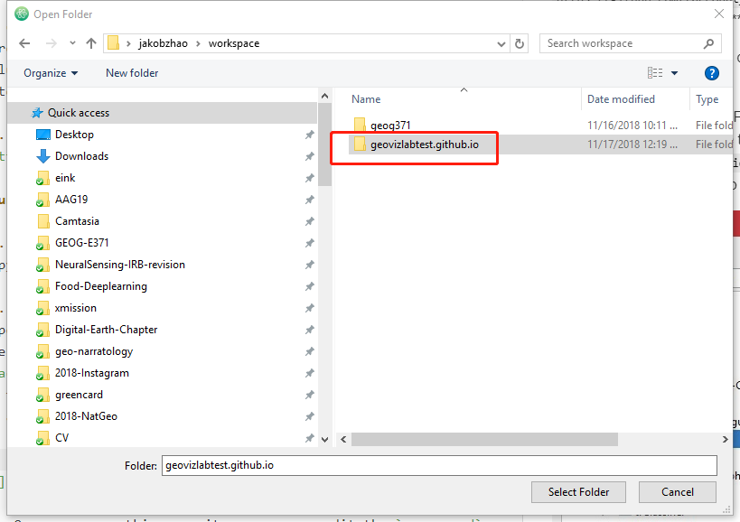
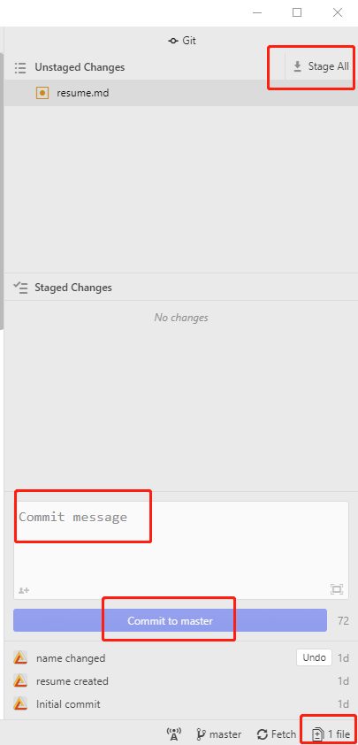

# Lab 1: Project Management for Web Mapping

> Winter 2018 | Geography 371 | Web Mapping
>
> **Instructor:** Bo Zhao  **Location:** Wilkinson 210 | **Time:** Th 0800 - 1150
>
> **Assigned:**  | **Due:**  | **Points Available** = 50

Welcome to the lab session of **GEOG 371: Web Mapping**! In this lab, we will briefly introduce the Digital Earth Lab at Wilkinson 210, download the course material and more importantly, help you get familiar with the major operations on project management for web mapping. In practice, you will use the lab computer, if you use a personal laptop, you will install the required software, and then register a GitHub account, and learn how to use git, atom and github. To test your learning outcomes, you will be asked to create a GitHub repository to publish your resume on the web. Okay, let us get started!

# 1. Preparations

## 1.1 Digital Earth Lab @ Oregon State University

Digital Earth Lab is a teaching facility primarily for GIS, remote sensing, cartography, numerical analysis, and scientific visualization. The classroom is a facility of the OSU College of Earth, Ocean, and Atmospheric Science and is supported by the OSU Media Services. The lab was originally funded by a NASA infrastructure grant to Sherm Bloomer (Professor & Dean, College of Science) and Nick Pisias (Professor & former associate dean of CEOAS). Digital Earth is located in 210 Wilkinson Hall and is one of the most advanced teaching facilities on the Oregon State campus. We have been operational since the beginning of Spring term, 1999.

The lab generally opens 8am-5pm , a detailed schedule can be found at [http://dusk.geo.orst.edu/de/de_teach.html](http://dusk.geo.orst.edu/de/de_teach.html). The manager of the facility is Cory Langhoff. If you need afterhours access, contact Cory by email [langhofc@oregonstate.edu](mailto:langhofc@oregonstate.edu), or dial 7-2532 to make arrangements.

## 1.2 Environment Setup

For this lab, you will use chrome, git and atom. Also these software products have already been installed in the lab computers. But I highly recommend you to install all these three.

- **Atom:** A professional web mapping programming development environment ([Click here to download](https://atom.io/)). Atom is a free and open-source text and source code editor for macOS, Linux, and Microsoft Windows with support for Git Control, developed by GitHub. Atom is a desktop application built using web technologies. Most of the extending packages have free software licenses and are community-built and maintained. It can also be used as an integrated development environment (IDE). Its developers call it a "hackable text editor for the 21st Century".;

- **Chrome:** is a freeware web browser developed by Google. It was first released on September 2, 2008 for Microsoft Windows, and was later ported to Linux, macOS, iOS and Android. Google Chrome is also the main component of Chrome OS, where it serves as a platform for running web apps;and

- **Git:** A version control system (VCS) for tracking changes in computer files and coordinating work on those files among multiple people ([Click here to download](https://git-scm.com/downloads)). It is primarily used for source-code management in software development, but it can be used to keep track of changes in any set of files.  Git was created by **Linus Torvalds** in 2005 for development of the Linux kernel, with other kernel developers contributing to its initial development. Its current maintainer since 2005 is Junio Hamano.

> **Note: What is an integrated development environment (IDE)?**
> IDE is a software application that provides comprehensive facilities to computer programmers for software development. An IDE normally consists of a source code editor, build automation tools, and a debugger. Most modern IDEs have intelligent code completion. The boundary between an integrated development environment and other parts of the broader software development environment is not well-defined. Sometimes a version control system, or various tools to simplify the construction of a graphical user interface (GUI), are integrated. Many modern IDEs also have a class browser, an object browser, and a class hierarchy diagram, for use in object-oriented software development.

> **Note:** Atom is a customizable IDE, so to fully prepare it for web programming, you will need to install additional packages. To do that, press `crtl+shift+p` to open the search dialog, and then input "install packages And Themes" to navigate to the package install interface. In this interface, please search and install the following recommended packages:
>
> - markdown-preview-enhanced
> - teletype
> - atom-live-server
> - file-icons
> - language-markdown
> - pdf-view

If **Git** is successfully installed, type `git` in command prompt (if you are a Windows user) or terminal (if you are a Mac or Linux user), the following screen will be shown up.


Using `git`, you can synchronize the course materials and also publish your own GitHub repository.  We will talk about that later in this lab.

### 1.3 Register a GitHub account

You will apply for a GitHub account for managing and synchronizing your web mapping project. If you do not have a GitHub account yet, please sign up at [https://www.github.com](https://www.github.com). Notably, you will need to choose a username. This username will be used as a part of the domain name of your home github ['username'.github.io](). So, make sure this username is succinct, simple and English-character only. Apparently, an easily-recognized domain name is more popular.

> **Note: Do you know the differences between Git and GitHub?**
>
> **Git** is a version control system for tracking changes in computer files and coordinating work on those files among multiple people. It is primarily used for software development, but it can be used to keep track of changes in any files. Git was created by **Linus Torvalds** in 2005 for development of the Linux kernel, with other kernel developers contributing to its initial development.
>
>  **GitHub** is a web-based Git or version control repository and Internet hosting service. GitHub offers both plans for private and free repositories on the same account which are commonly used to host open-source software projects. As of April 2016, GitHub reports having more than 14 million users and more than 35 million repositories, making it the largest host of source code in the world.

## 2\. Download the course material

In this course, I decide to store all material on GitHub instead of Canvas system. By doing so, my goal is not to create extra trouble or sharp the learn curve. Instead, hosting on github will help you save a lot of time in downloading or migrating course materials, testing lab or lecture applications. Also, more practically, a lot of companies in the geospatial industries have already used github for their project managment, such as [ESRI](https://github.com/Esri), [CartoBD](https://github.com/CartoDB), [MapBox](https://github.com/mapbox), and etc. To prepare you with the capabilities of using github, you will be familiar with an industry-level project management approach. In this lab, let us go through the procedure of downlaoding the course material as below.

1\. On GitHub, each project is stored as a project repository. The repository for this course is located at [https://github.com/jakobzhao/geog371](https://github.com/jakobzhao/geog371). Please navigate to this url on a browser such as `Chrome`. As indicated by the course website url, this repository is created by me; my GitHub account name is `jakobzhao`, while the repository name is `geog371`.

2\. On the front page of this repository, please click the green button named after `Clone or download` . To download the course material, you can click the `Download ZIP` button, as a result, a compressed file of the course material will be downloaded.

3\. However, **we recommend you to clone this project repository**. You can get the **git url** of this repository on the same information window. The git url is [https://github.com/jakobzhao/geog371.git](https://github.com/jakobzhao/geog371.git).

4\. Next, open your working space on your local computer through command prompt if you are on Windows or through terminal if you are on a Mac or Linux. For example, the working space of my computer is located as `C:\Workspace`.

```powershell
C:\Users\[your_username]>cd C:\Workspace
C:\Workspace>
```

> **Note:** If you are working on any computer in the Digital Earth Lab, you would not have the privilege to create a "Workspace" folder under the root of C drive. So you can create one under the root of your personal user folder. To navigate to the root of your personal user folder,  See the command lines below.

```powershell
C:\Users\[your_username]>cd \
C:\>cd Users\[your_username]
C:\Users\[your_username]>
```

> [your_username] indicates your username, for example, if my username is jakob, the path is suppose to be `C:\Users\jakob>`

5\. Having the **git url**, we will need to use the command `git clone` to clone the GitHub repository to your local computer.

 ```powershell
C:\Workspace\git clone https://github.com/jakobzhao/geog371.git
Cloning into 'geog371'...
remote: Counting objects: 962, done.
remote: Compressing objects: 100% (750/750), done.
remote: Total 962 (delta 214), reused 917 (delta 177), pack-reused 0Receiving objects:  99% (953/962), 158.77 MiB | 1.60 MiB/s
Receiving objects: 100% (962/962), 158.88 MiB | 1.60 MiB/s, done.
Resolving deltas: 100% (214/214), done.
Checking out files: 100% (650/650), done.
 ```

6\. To review the files and folders in the downloaded/cloned repository, you need to `cd` into the root directory of this repository. If you are on a Mac or Linux, type `ls` to check the file list of this repository, or try `dir` if you are on a Windows. Take windows for example.

```powershell
C:\Workspace>cd geog371

C:\Workspace\geog371>dir
 Volume in drive C has no label.
 Volume Serial Number is 3E8C-9A9E

 Directory of c:\Workspace\geog371

09/19/2017  09:12 PM    <DIR>          .
09/19/2017  09:12 PM    <DIR>          ..
09/19/2017  01:41 AM               412 .gitignore
09/19/2017  09:49 PM    <DIR>          .idea
09/19/2017  02:19 AM    <DIR>          labs
09/19/2017  01:41 AM    <DIR>          lectures
09/19/2017  01:41 AM             7,816 LICENSE
09/19/2017  01:41 AM    <DIR>          projects
09/19/2017  01:41 AM    <DIR>          readings
09/19/2017  04:35 AM             6,011 readme.md
09/19/2017  01:41 AM    <DIR>          resources
               3 File(s)         14,239 bytes
               8 Dir(s)  903,569,551,360 bytes free
```

In the root directory, there are folders like labs, lectures and readings, and files like readme.md and LICENSE.

7\. Next, we open the `readme.md` file using `Atom`. To do that, make sure you have installed `Atom` and also an `Atom` packge named `markdown-preview-enhanced`.

Once `Atom` is opened, press `crtl+shift+a` to open the open prjoect dialog window, naviagte to `geog371` folder from your workspace and press `select folder`. Then the `geog371` repo will be opened, and a file tree will be shown in the project list panel on the left of the atom editor.



In the project list panel, navigate to the `readme.md` in the project tree panel. Then, double-click this file, both the source code and the compiled page of `readme.md` will be shown in two new panels to the right of the project list panel.




8\. Once the course material is hosted on GitHub, it can be easily shared with a larger community. To synchronize the course material on remote GitHub repository to your local computer, you need to implement two sequential command lines `git checkout --force` and `git pull` in the root directory of the repository. Once the two commands are executed. An update notice will be shown as below.

```powershell
C:\Workspace\geog371>git checkout --force
Your branch is up-to-date with 'origin/master'.

C:\Workspace\geog371>git pull
remote: Counting objects: 3, done.
remote: Compressing objects: 100% (3/3), done.
remote: Total 3 (delta 2), reused 0 (delta 0), pack-reused 0
Unpacking objects: 100% (3/3), done.
From https://github.com/jakobzhao/geog371
   13b2cab..baf74b1  master     -> origin/master
Updating 13b2cab..baf74b1
Fast-forward
 readme.md | 3 ++-
```

Now, the course material on your local computer is updated.

> **Note:** To ensure you are reading the latest version of the lecture or lab handouts, you need to regularly synchronize the course material, especially before the beginin of each class.
>
> If you implement the above two commands in a Mac or Linux system, you might need to add `sudo` before `git` to solve the lack-of-privilege issue. For example, `sudo git clone`, `sudo git checkout --force`. In general, the command `sudo` will assign the superuser privilege to the command line.

9\. Before we jump to the next section, please:

- Star the repository by pressing the `star` button on the top right, and;

- Navigate to Dr. Zhao's front page at [https://github.com/jakobzhao](https://github.com/jakobzhao), and click the `Follow` button to be a follower.

## 3\. Project management

In this section, we will introduce a series of operations related to project management, such as create a project repository, compile a markdown file, and upload files to GitHub, and at last, publish a repository. As a practice, we will build a GitHub repository for your online resume.

### 3.1 Create a repository for your project

1\. Navigate to [https://github.com/new](https://github.com/new), and input your repository name in the blank text box for `Repository name`. Here, please name your repository in the format of **[account_username].github.io**. So, if your account_username is `jakobzhao`, this repository name will be **jakobzhao.github.io**.


2\. Besides, make sure you **CHECK** the box `Initialize this repository with a README`. You can leave other options by default.


3\. Next, click the `Create repository` button. As a result, a new repository `[account_username].github.io` is created. You can access this repository through the link `https://github.com/[account_username]/[account_username].github.io`. For example,  you can access the repository I created through this link [https://github.com/jakobzhao/jakobzhao.github.io](https://github.com/jakobzhao/jakobzhao.github.io).

### 3.2 Craft a Markdown file

1\. On your local computer, create a text file, and name it `resume.md`.

2\. Open this file `resume.md` with `Atom`. Then, you can work on your resume. If you are not familiar with Markdown, please refer to a tutorial at [here](https://guides.github.com/features/mastering-markdown/). Or you can start with copying and pasting the template below. Notably, this template is only for your reference. You probably do not want to share too much about your personal information such as phone number, address and etc.

```markdown
# Your Name

1234 Main St., City, State 12345

(555) 555-5555

your.name@example.com

http://www.example.com

http://www.linkedin.com/in/yourname

# Summary

Quick Summary (not objective) specifically highlighting why you qualify for the job.

# Work Experience (only last 10 years)

## University Name 1 (City, State)

* [University 1][] description, particularly if not well-known.*

** Position Title (include alternate titles in parentheses)** (Start Date - End Date)

Summary of your role

- Accomplishment that contains **bold text**.
- Accomplishment
- Accomplishment
- Accomplishment

## University Name 2 (City, State)
*[University 2][] description, particularly if not well-known.*

** Position Title (include alternate titles in parentheses)** (Start Date - End Date)

Summary of your role

- Accomplishment that contains **bold text**.
- Accomplishment
- Accomplishment
- Accomplishment

## University Name 3 (City, State)
* [University 3][] description, particularly if not well-known.*

** Position Title (include alternate titles in parentheses)** (Start Date - End Date)

Summary of your role

- Accomplishment
- Accomplishment
- Accomplishment
- Accomplishment


[University 1]: http://www.univ1.edu
[University 2]: http://www.univ2.edu
[University 3]: http://www.univ3.edu
```
>**Note:** This resume template is from [http://www.jasonfilley.com/resumeinmarkdown.html](http://www.jasonfilley.com/resumeinmarkdown.html).

3\. In fact, you can use any text editor to generate Markdown files. If you do not have `Atom` at hand, you can use `Notepad` as well. Please let the instructor know if you meet any difficulty in installing this plugin.

### 3.3 Upload files to GitHub

Once you have drafted out your resume in the `resume.md` file. You will upload this file to the **root** of the project repository `https://github.com/[account_username]/[account_username].github.io` . In general, there are three solutions to complete this task, we will introduce them one by one.

#### 3.3.1 Drag & drop

1\. Open a web browser such as `Chrome`, navigate to the front page of the repository you have just created.

2\. Next, use your mouse to drag the `resume.md` file to the front page. Once you see a notice saying **Drop to upload your files**, you can then release your mouse. A new interface will appear as below.

> **Note:** Certainly, you can drag and drop multiple files and/or folders. In this lab, we just upload one single file.


3\. Before pressing the green button `Commit Changes`, you might want to add a title and/or some descriptions for this commit. It will help you organize your commits.

#### 3.3.2 Git push

You can also upload the `resume.md` through `git push` command on either command prompt or terminal.

1\. Download the repository  `https://github.com/[account_username]/[account_username].github.io`  following the instruction in Section 2 ***"Download the course material”***.

2\. In the root directory of the downloaded repository, please copy the edited `resume.md` to the root.

3\. Next, you can push this change to the remote repository by implementing two command lines `git commit` and  `git push`. Since you have add new `untracked` files to this repository, you need to also implement another command line `git add` prior to the `git push`. As listed below.
```powershell
c:\Workspace\jakobzhao.github.io>git add -A
c:\Workspace\jakobzhao.github.io>git commit -a -m "update the resume.md"
c:\Workspace\geog371>git push
Username for 'https://github.com': jakobzhao
Password for 'https://jakobzhao@github.com':
```

> **Note:** Again, if you use a Mac or Linux, you might need to add `sudo` in front of the command line to avoid the privilege deny issue. Besides, the command prompt or terminal may ask you for GitHub username and password, please be prepared with such information.
>

In a nutshell, to push a change from your local computer to GitHub, you will need to (1) `git clone` a repository from GitHub, (2) `git add` the untracked file to the repository, (3) `git commit` that you have made a change, and at last, (4) `git push` your changes to the GitHub repository.

#### 3.3.3 Atom Commit and push

We can also use `Atom` to upload files to GitHub repository or more generally, commit changes. Compared with the first two solutions, I recommend you use Atom if you prefer graphic user interfaces.

1\. Download the repository  `https://github.com/[account_username]/[account_username].github.io`  following the instruction in Section 2 ***"Download the course material"***.

2\. In the root directory of the downloaded repository, please copy the edited `resume.md` to the root.

3\. Open the program `Atom`. Press `crtl+shift+a` to open the "open project" dialog panel. In the panel, navigate to the repo.  The name should be in the format of `[account_username].github.io`. click the `select folder` button on the bottom of the panel to open the repo to the main interface of atom.



4\. Once you open this repository, you can edit the `resume.md` in Atom.

5\. To update any edit changes, to the bottom right of the main interface, Click `files`, a new `git` panel will be added up the right of the main interface. click `Stage All`. on the top and leave some update inforamtion in the `commit message` textbox. When, the `Commit to master` button becomes valid, press it.



6\. Once the update is committed, the `fetch` notice on the bottom right will change to `push`. Then, press the `push` notice to push the commit to the remote repository on github.


> **Note:** As you might already aware of, the first two steps are as same as those in the approache 2 (3.3.2). The difference is, approach 2 works on a terminal/command prompt environment (a command-lline user interface), while approach 3 works in Atom (a graphic user interface).
>
> Using either of the three approaches (3.3.1 to 3.3.3), you can upload your resume or any other files to GitHub. Then, log on to this repository on GitHub to see whether the uploaded content is applied.

Now you have already known how to commit a change. In practice, you will use this operation very frequently. Other than committing changes, you may also need to synchronize, both fetch and push, the latest version of your GitHub repository.

### 3.4 Publish your repository

Once the `resume.md` is uploaded to the root of the GitHub Repository, you can see this file listed in the root. Moreover, GitHub provide a new function named **GitHub Page** that converts a markdown file as a web page. Because your resume is located at the root of the repository, you can directly access your resume by visiting `http://[account_username].github.io/resume` if you implement the following steps.

1\. please click the `Settings`tab on the top bar of the repository front page.

2\. On the `GitHub Pages` Section, make sure `master branch` is chosen in the `Source`  dropdown list.  Next, press the `Save` button.

3\. It usually takes several seconds to 1~2 minutes to apply this setting. If this setting is activated, you can read your resume from `http://[account_username].github.io/resume`.

## 4. Deliverable

Before submitting this lab, please make sure both the **GitHub repository** and the **GitHub page** work properly. In this lab, you are excepted to submit the url of the GitHub repository to the **Canvas Dropbox** of this course. This url should be in the format of `https://www.github.com/[account_username]/[account_username].github.io`. To do that, check the item of this lab on the assignment tab, and then press the `Submit Assignment` button. Please contact the instructor if you have any difficulty in submitting the url link. Here are the grading criteria:

1\. A GitHub account is registered, You have followed the instructor's GitHub account and `star-ed` the course GitHub repository. (6 POINTS)

2\. The repository should be named after `[account_username].github.io`. (5 POINTS)

3\. The `GitHub page` function of the repository should work properly. That said, your resume can be visited from `https://[account_username].github.io/resume` (5 POINTS);

4\. To hone your skills in generating Markdown files, the resume could be built upon the template that was shown in `Section 3.2`, but we still encourage you customize your resume. In terms of the format, your online resume should contain:

* Different levels of headers (4 POINTS);
* A block quote (5 POINTS);
* Several url links (5 POINTS);
* One or several images (10 POINTS);
* A list (5 POINTS);
* A table (5 POINTS); and

> **Note:** Lab assignments are required to be submitted electronically to Canvas unless stated otherwise. Efforts will be made to have them graded and returned within one week after they are submitted.Lab assignments are expected to be completed by the due date. ***A late penalty of at least 10 percentage units will be taken off each day after the due date.***

> If you have a genuine reason(known medical condition, a pile-up of due assignments on other courses, ROTC,athletics teams, job interview, religious obligations etc.) for being unable to complete work on time, then some flexibility is possible. However, if in my judgment you could reasonably have let me know beforehand that there would likely be a delay, and then a late penalty will still be imposed if I don't hear from you until after the deadline has passed. For unforeseeable problems,I can be more flexible. If there are ongoing medical, personal, or other issues that are likely to affect your work all semester, then please arrange to see me to discuss the situation. There will be NO make-up exams except for circumstances like those above.
