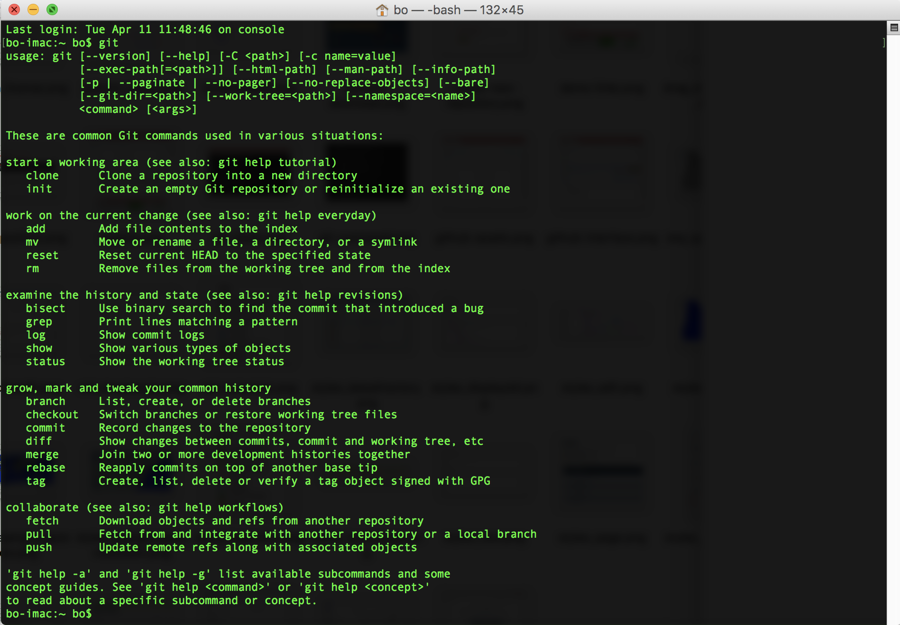
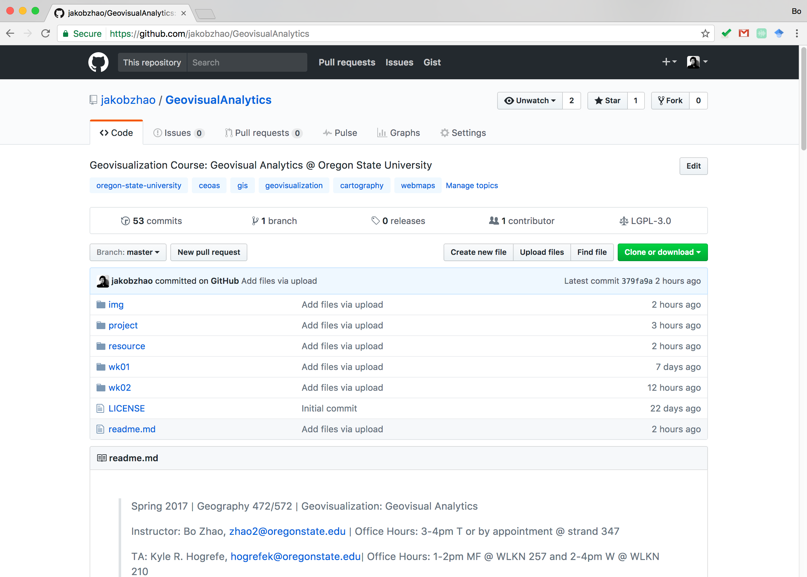
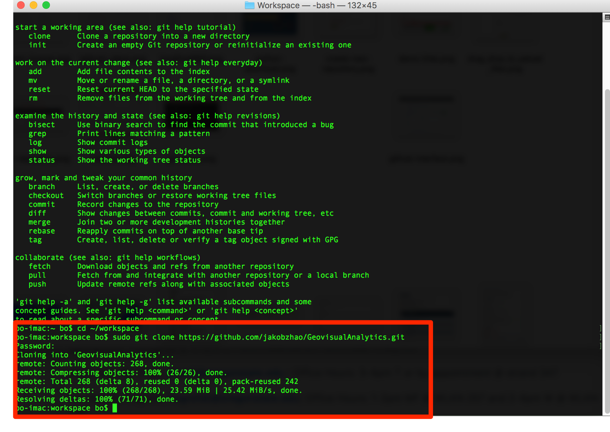
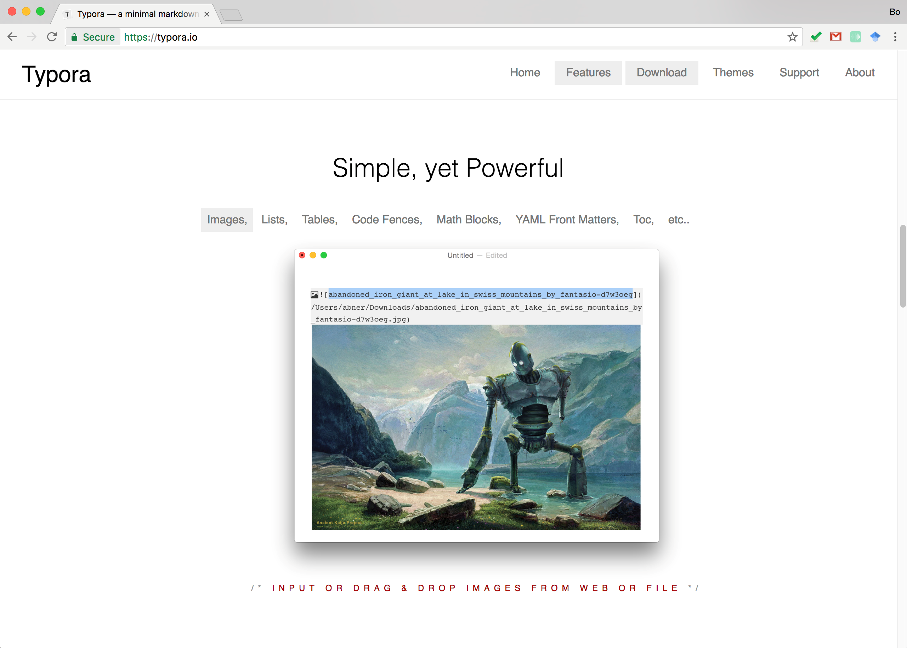
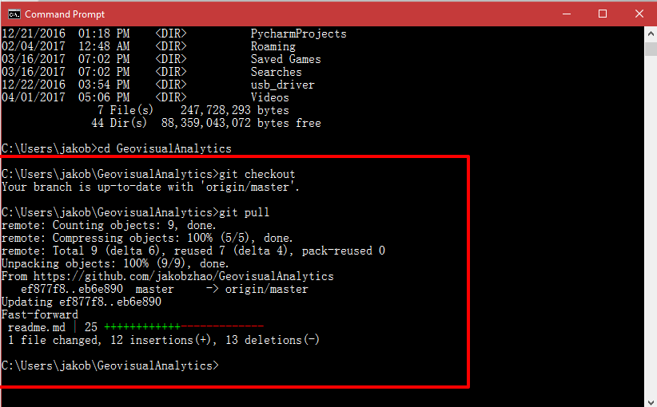
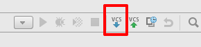

# Synchronize Course Repository with GitHub

> Spring 2017 | Geography 472/572 | Geovisualization: Geovisual Analytics
>
> Instructor: Bo Zhao, zhao2@oregonstate.edu | Office Hours: 3-4pm T or by appointment @ strand 347
>
> TA: Kyle R. Hogrefe, hogrefek@oregonstate.edu| Office Hours: 1-2pm MF @ WLKN 257 and 2-4pm W @ WLKN 210

GEOG 472/572 uses GitHub to distribute course materials. GitHub is designed as a project repository for teamwork, it can be also used to manage projects. This tutorial will allow you quickly walk through the way how to download and sync the latest version of course material.

1\. Above all, You will need a GitHub account. Sign up at [https://github.com/](https://github.com/).


2\. Then, you will synchronize course material from the github. Please make sure the computer to store the course material has installed a shell program `git`. 

Type `git` in command prompt or terminal to see whether `git` is installed or not. If not, you need follow an instruction at https://git-scm.com/book/en/v2/Getting-Started-Installing-Git to install `git`. Usually, a Linux Server, such as your Google Cloud Server, has installed `git` by default. 

> **Git** is a version control system (VCS) for tracking changes in computer files and coordinating work on those files among multiple people. It is primarily used for software development, but it can be used to keep track of changes in any files. Git was created by **Linus Torvalds** in 2005 for development of the Linux kernel, with other kernel developers contributing to its initial development.
>
> **GitHub** is a web-based Git or version control repository and Internet hosting service. GitHub offers both plans for private and free repositories on the same account which are commonly used to host open-source software projects. As of April 2016, GitHub reports having more than 14 million users and more than 35 million repositories, making it the largest host of source code in the world.

If `git` is properly installed, type `git` in command prompt or terminal will show the following information on the window. 



3\. The course material locates at [https://github.com/jakobzhao/GeovisualAnalytics](https://github.com/jakobzhao/GeovisualAnalytics). Please click the `Clone or download` button.



Then, you will find the clone location for today's material. 

```url
https://github.com/jakobzhao/GeovisualAnalytics.git
```

4\. Access your Server via `SSH` if it is remotely deployed, or via Terminal or Command Prompt if it is deployed locally. If you are on a Linux Server, you can create and enter a workspace using the following codes:

```powershell
cd ~
mkdir workspace
cd workspace
```

5\. Navigate to your workspace by the command `cd`. If you do not have a working space, you can create one by `mkdir` command on Linux or Mac OSX, or create a directory manutally on Windows. In your working directory, please type the following command to synchronize the lecture material from GitHub.

```powershell
cd ~/workspace
sudo git clone https://github.com/jakobzhao/GeovisualAnalytics.git
```

> Since Unix, Linux and Mac OSX are built on a higher user authority system, you need to give the user a superuser priviliage when you run `git` command, so the `sudo` command is needed if you are working on Unix, Linux or Mac OSX systen. If you are working on a windows system, usually you do not need to add `sudo` in the front. You can simply type `git clone https://github.com/jakobzhao/GeovisualAnalytics.git`.



After successfully synced the material, you will see them in a sub-directory named **GeovisualAnalytics**, which contains the course material. 

```powershell
├── img
├── project
├── resource
├── wk01
├── wk02
├── LICENSE
└── README.md
```

6\. In order to view the course materials, you can download a markdown viewer. Here, we recommend **[Typora](https://typora.io/)**.  Typora is dedicated to process markdown files. It can browse, edit, and even convert markdown files to pdf or word documents.



7\. The instructor and TA will consistenly update the course material repository. In order to ensure you are reading the latest version of the lecture or lab handouts, you need to synchronize the course material, especially before class. To do that, you will enter the course directory, checkout the current version of the course repository and then pull the entire repository. Once you execute the pull command, the command prompt or the terminal will notify you the recent updates about the course material. Here is the shell command to update the course material:

```powershell
cd ~/workspace
cd GeovisualAnalytics
sudo git checkout
sudo git pull
```

> Again, you do not need to add `sudo` if you are on a windows operating system.



If you open the downloaded course material with webstorm, you can update to the latest course material by clicking the `Update Project` Button.


