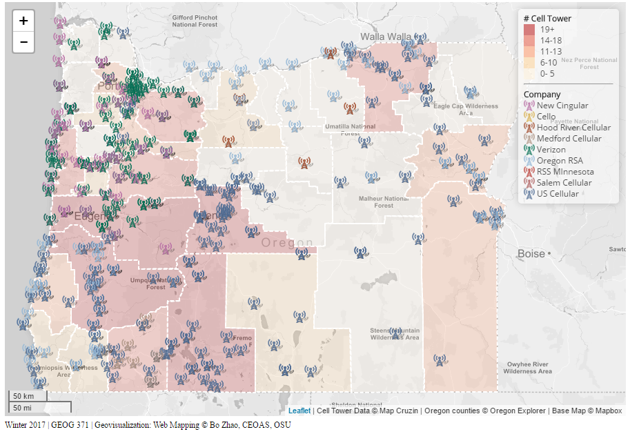
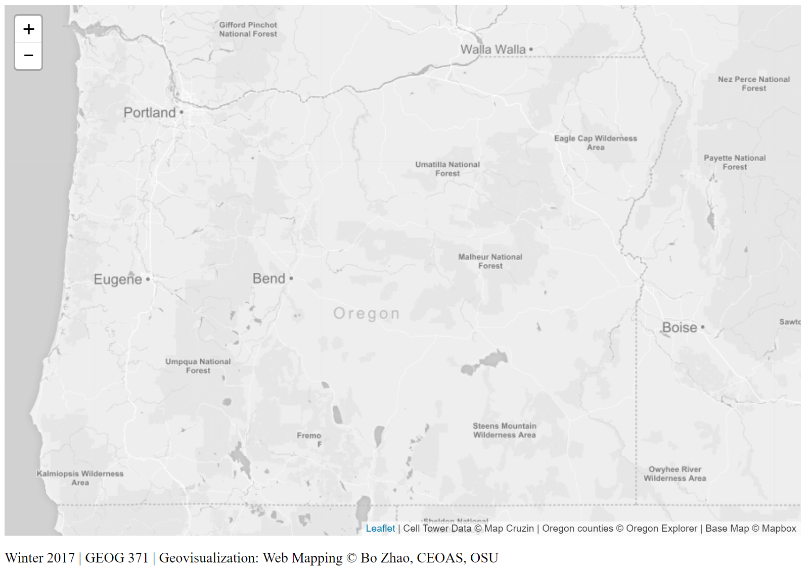
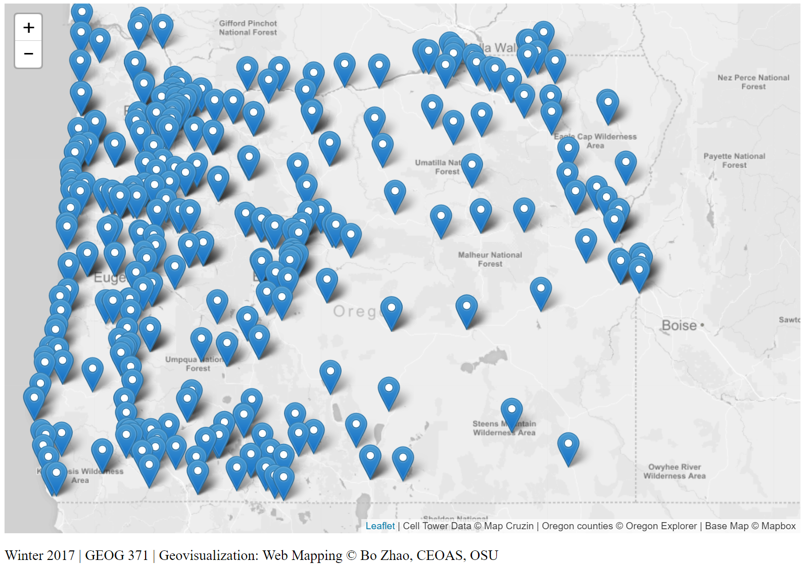
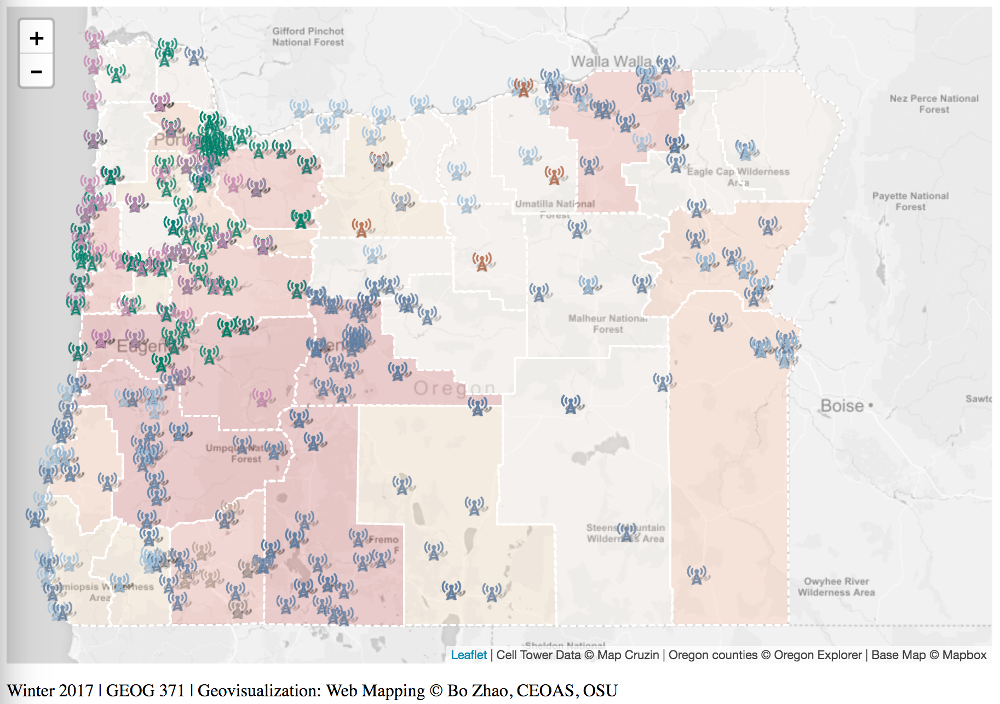

# Lab 3: Thematic Web Map Design

> Winter 2017 | Geography 371 | Geovisualization: Web Mapping
>
> **Instructor:** Bo Zhao  **Location:** Wilkinson 210 | **Time:** Th 1000 - 1150
>
> **Assigned:** 10/05/2017 | **Due:** `10/19/2017 @11:59pm` | **Points Available** = 50

When creating a web map, one of the key components is styling your elements to provide proper symbolization for your data. This increases legibility for users and can give your map an appealing, custom design. Elements that can be custom designed include thematic layers (points, lines, and polygons), basemaps (tile layers), interactive features (the components of the map that allow for user interaction), and legends and supplemental information (such as supplemental prose and titles).

This lab, we will make a web map of cell towers in Oregon. To do that, we collected all the county boundaries from [Oregon Explorer](http://oregonexplorer.info), and the national distribution of cell towers from [Map Cruzin](http://www.mapcruzin.com/google-earth-maps-resources/kml/us-cell.kmz). To get a visual, this is what we are going to make today.



To get started, setup your development environment in a easy to access location on your machine. Sync this lecture's material, and start up your local server by python SimpleHTTPServer or Webstorm.

## 1. Set up our Map and Add Data

With your localhost running, open up the **map1.html** in your IDE (Webstorm) to prepare for editing. When open, you should see a basic map showing the extent of Oregon State.

**The extent of Oregon State**

View this Example View the map1.html document in Webstorm (or your IDE of choice). Here you will see our HTML, with some CSS styling at the top, a couple of div page elements for our map components, linked scripts, and custom scripts. The page elements are as follows:

`map`: the element our map will be attached to;

`credits`: an element inside controls where we can put our contact and copyright information.

**The Script**

Within the script tags, I have added the map object and tile layer for us to use. You've seen the script before. This script creates our map object and adds a basemap.

```js
// 1. Create a map object.
var mymap = L.map('map', {center: [44.13, -119.93], zoom: 7});

// 2. Add a base map.
L.tileLayer('http://{s}.basemaps.cartocdn.com/light_all/{z}/{x}/{y}.png', {
    maxZoom: 11,
    minZoom: 6,
    detectRetina: true, //support Retina Display if the client uses high resolution monitor.
    attribution: 'Cell Tower Data &copy; Map Cruzin | Oregon counties &copy; Oregon Explorer | Base Map &copy; CartoDB'
}).addTo(mymap);
```

Please visit http://localhost:8000/map1.html to see the map at the current stage.



The base map (in tile layer) I am using comes from CartoDB. The light color helps the main features/theme of a web map stand out. In addition to major map providers (Google map, bing map, openstreetmap, mapbox, cartodb), you can look for a list of base map from [Leaflet providers](http://leaflet-extras.github.io/leaflet-providers/preview/), many local municipalities and regions around the globe maintain tile layers that can be accessed through GIS software and mapping libraries. Google search the area in which you are working to see if they maintain base maps, most often you will find Web Map Services (WMS) - a map services we will learn in later, that can be loaded into your map as a base using the Leaflet WMS loader object, `L.tileLayer.WMS`.

>  **Note:** If the provided basemaps do not carter to your flavor, you can create custom tiles that can be served to your maps. This topic, on the whole, is large and we will have another series of lectures that introduces creating web map services by GeoServer.

**Add the Cell Towers Data**

Next, we want to add the data set to the map. To do that, we will add another Javascript library leaflet.ajax in the head tag.

```html
<script src="https://cdnjs.cloudflare.com/ajax/libs/leaflet-ajax/2.1.0/leaflet.ajax.min.js"></script>
```

In the directory `assets` of this lab, you will find a geojson data file `cell_towers.geojson`. At the end of our script, within the script tags, enter the following code to add the cell towers and bind a popup.

```js
// 3.Add cell towers GeoJSON Data
// Null variable that will hold rodent violation data
var cellTowers = null;
// Get GeoJSON and put on it on the map when it loads
cellTowers= L.geoJson.ajax("assets/cell_towers.geojson");
// Add the cellTowers to the map.
cellTowers.addTo(mymap);
```

The cellTowers object will hold the contents of the GeoJSON data, so we can refer to it easily. Save and refresh your map. You should see the points populate. That is a lot of cell towers!  Please open **map2.html** to see the map at the current stage.



## 2. Custom Point Markers

Our point markers showing the cell towers are the default blue Leaflet map pin. While these markers are fine, if you are showing multiple properties or want to create unique symbols, you can set your point symbols to be represented by an icon of your choosing. The steps towards doing this are quite easy, and you can use the Leaflet icon class to set up your parameters. You have two choices for your custom icons. First, you can use existing icons or grab a library of pre made icons. Here are two nice leaflet plugins:

- Mapbox Maki: Allows you to use icons from the terrific Mapbox Maki library.

- Font Awesome: Allows for use of the fantastically useful open source.

Second, you can make your own icons by using an existing image or creating one using graphics software (i.e. Illustrator, Photoshop). If your graphic is saved as an image (the most space efficient images for the web are usually in `png` or `jpg` format), and upload it to your server for use as an icon. If you want a higher level of customization, or the icons found in **Font Awesome** or **Maki** do not work for you, create your own! In this course, we will mainly focus on the first option.

### 2.1 Create the color scheme for markers

Since we will use chroma.js to get the color set and then utilize $ to capture the head tag, we need to include both chroma.js and jquery in the head tag.

```html
<script src="https://ajax.googleapis.com/ajax/libs/jquery/3.1.0/jquery.min.js"></script>
<script src="https://cdnjs.cloudflare.com/ajax/libs/chroma-js/1.3.4/chroma.min.js"></script>
```

Chroma.js is a javascript library to manipulate colors. First, we need to create a set of random colors for each cell tower company. To use this set of random colors, we will dynamically build style classes, each of which will include one color built by chroma.js. The style classes are from `marker-color-1` to `marker-color-9`.Below we shows the code snippet how it works.

```javascript
// 4. build up a set of colors from colorbrewer's set2 category
var colors = chroma.scale('Set2').mode('lch').colors(9);

// 5. dynamically append style classes to this page. This style classes will be used for colorize the markers.
for (i = 0; i < 9; i++) {
    $('head').append($("<style> .marker-color-" + (i + 1).toString() + " { color: " + colors[i] + "; font-size: 15px; text-shadow: 0 0 3px #ffffff;} </style>"));
}
```

>**Note:** The reason why we categorize the companies in 9 classes, because we know there are 9 in Oregon.

### 2.2 Assign the color class to each categories

Next, we will assign the style class to each category. We number the company name from 0 to 8, and then add the color class (from `marker-color-1` to `marker-color-9`) to markers.

We have nine different wireless companies, such as New Cingular, Verizon, Cello, Salem Cellular, etc. When the GeoJSON is added to the map, we need to check the features when we apply the custom icon to see what the value of feature.property.company is. If it is equal to "Verizon", we want the icon to be set to one of the towerXIcon (X = 1, 2, 3...9). Here we learned about conditionals, specifically `If.. Else` statements. To accomplish this, we can put a conditional in our call to the GeoJSON that checks to see if a case status is equal to "Verizon" and then sets an icon, and if it is not, will run the else statement, setting the icon equal to other companies, and so on so forth. The code will look like this:

 ```
function (feature, latlng) {
    var id = 0;
    if (feature.properties.company == "New Cingular") { id = 0; }
    else if (feature.properties.company == "Cellco")  { id = 1; }
    else if (feature.properties.company == "RCC Minnesota")  { id = 2; }
    else if (feature.properties.company == "Verizon")  { id = 3; }
    else if (feature.properties.company == "US Cellular")  { id = 4; }
    else if (feature.properties.company == "Hood River Cellular")  { id = 5; }
    else if (feature.properties.company == "Medford Cellular")  { id = 6; }
    else if (feature.properties.company == "Oregon RSA")  { id = 7; }
    else { id = 8;} // "Salem Cellular"
    return L.marker(latlng, {icon: L.divIcon({className: 'fa fa-signal marker-color-' + (id + 1).toString() })});
}
 ```

### 2.3. Apply an Icon

The marker should adopt an icon. The icon is from [Font Awesome](http://fontawesome.io/icons/). To use an icon, you will simply link the class with the marker. An javacript object or html element can have multiple class. To apply multiple classes, you will need to leave a space between each class. For example, `fa` will inform the element, the font awesome will be applied, and `fa-signal` will inform the specific icon will be in use. And the `marker-color-1~9` deals with color, font-size, as well as text-shadow.

>**Note:** If you feel a little confused about the style properties, please try to change the values to some extreme numbers to see the differences. For example, you can change the font-size from 15 to 100, and then refresh the web page.

### 2.4 Point to Layer

*Use `point to layer` option of `L.geoJson` to set the icon*

With our icon loaded into our document, we need to replace the default icons created when we add the GeoJSON. This is a process of setting the icon option to TowerIcon for each marker when it is added to our map. To set the icon for a GeoJSON, we need to create a layer from the GeoJSON (we can style it if it is a layer) by using the `pointToLayer` option of `L.geoJson`.

```js
pointToLayer: function (feature, latlng) {
    var id = 0;
    if (feature.properties.company == "New Cingular") { id = 0; }
    else if (feature.properties.company == "Cellco")  { id = 1; }
    else if (feature.properties.company == "RCC Minnesota")  { id = 2; }
    else if (feature.properties.company == "Verizon")  { id = 3; }
    else if (feature.properties.company == "US Cellular")  { id = 4; }
    else if (feature.properties.company == "Hood River Cellular")  { id = 5; }
    else if (feature.properties.company == "Medford Cellular")  { id = 6; }
    else if (feature.properties.company == "Oregon RSA")  { id = 7; }
    else { id = 8;} // "Salem Cellular"
    return L.marker(latlng, {icon: L.divIcon({className: 'fa fa-signal marker-color-' + (id + 1).toString() })});
    }
```

Note there are *two equal signs (==)*, this is because JavaScript is very particular about operators. To read more, check out this documentation from `w3schools`. Modify the code within the `L.geoJSON` pointToLayer option, where we set the style previously, to be the following, including the conditional statement to check the status.

**Options available for `L.geoJson` include**:

- `pointToLayer`: Function that will be used for creating layers for GeoJSON points (if not specified, simple markers will be created).
- `style`: Function that will be used to get style options for vector layers created for GeoJSON features.
- `onEachFeature`: Function that will be called on for each created feature layer. Useful for attaching events and popups to features.
- `filter`: Function that will be used to decide whether to show a feature or not.
- `coordsToLatLng`: Function that will be used for converting GeoJSON coordinates to LatLng points (if not specified, coordinates will be assumed to be WGS84 — standard [longitude, latitude] values in degrees).

We are using onEachFeature to set the popup, but you can see that in order to set a icon, we need to use `pointToLayer`. In pseudo-code, pointToLayer runs a function when the GeoJSON is loaded that takes a feature and latitude and longitude and creates a marker at that latitude and longitude. Marker has an option called icon that you set to be our towerIcon variable. Once set, return the marker. This will replace the default blue map pin with our rodentIcon. The code looks like the following. Replace your `L.geoJson` call with this. Note the addition of the pointToLayer option.

```js
// assign a function to the onEachFeature parameter of the cellTowers object.
// Then each (point) feature will bind a popup window.
// The content of the popup window is the value of `feature.properties.company`
onEachFeature: function (feature, layer) {
    layer.bindPopup(feature.properties.company);
},
```
Click save and refresh your map in your browser. Check out our map. We have changed icon to cell tower! Please visit http://localhost:8000/map3.html to see the map at the current stage.


## 3. Polygon Data and Symbolization

In our data folder, you'll see a second dataset, counties.geojson. The counties GeoJSON file contains all the counties of Oregon. Each county contains the number of cell towers. This number is pre-calculated in QGIS. To add the data to the map, create another `L.geoJson` object using the ajax() method. Enter the following lines of code at the end of your script, staying within the `script` tags.


```js
// Null variable that will hold neighborhoods layer
var neighborhoodsLayer = null;
L.geoJson.ajax("assets/counties.geojson"}).addTo(map);
```

Save and refresh your map. Counties of Oregon will be displayed on the map, symbolized in a default blue.


Let's do something about that default blue and thematically style our data to these polygons useful by turning them into a choropleth layer. The counties.geojson file contains numbers of cell towers in each county, calculated in QGIS. Symbolize the counties on the map by the number of counties. This is a three step process. `L.geoJson.ajax()` contains a style option that contains styling properties.

### 3.1 Set up function for Color Ramp

The first step is to set up a function for our color ramp. This is where we set up our classification breaks and color scheme. Setting up a classification scheme can be tricky. The easiest way to set up a standard classification scheme is to use QGIS, select something like Jenk's Natural Breaks, and copy the break numbers. Or you can check out a color ramp from [colorbrewer2.org]() In this lab, you will use chroma.js to get an array of colors. And then set up the setColor function that returns the value of a color based on the input value (the density of cell tower lying in a county). Appand the following code snippet in the script tag.

```js
// Create an array of colors
colors = chroma.scale('OrRd').mode('hsl').colors(5); //colors = chroma.scale('OrRd').colors(5);

// setColor function will return a color value using an input value (the density)
function setColor(density) {
    var id = 0;
    if (density > 18) { id = 4; }
    else if (density > 13 && density <= 18) { id = 3; }
    else if (density > 10 && density <= 13) { id = 2; }
    else if (density > 5 &&  density <= 10) { id = 1; }
    else  { id = 0; }
    return colors[id];
}
```

### 3.2 Set style GeoJson style function

Next, set up a function that will set the properties for the `L.geoJson.ajax()` style option. Call this function style, pass it a GeoJson feature when invoked. Set the fillColor property to be equal to the setColor function, passing it the `CN_CNT` property (the number of cell towers) from the input geojson data. Enter the following code into your script.

```js
// Set style function that sets fill color property equal to cell tower density
function style(feature) {
    return {
        fillColor: setColor(feature.properties.CT_CNT),
        fillOpacity: 0.2,
        weight: 2,
        opacity: 1,
        color: '#ffffff',
        dashArray: '4'
    };
}
```

While `fillColor` and `fillOpacity` properties for the fill; `weight`, `opacity`, `color`, and `dashArray` properties for the border.

### 3.3 Set style option for the GeoJSON

The final step is to set the style option for the neighborhoods layer GeoJSON. Find the Add Neighborhoods Polygons block of code and modify it to include the style option. Set style equal to style to run the style function when the GeoJSON is create. Below shows the code of adding the county polygons to the map.

```js
// Add Neighborhood Polygons
L.geoJson.ajax("assets/counties.geojson", {
    style: style
}).addTo(map);
```

Save and refresh your map. Load your page to see our styled polygons!



## 4. Map Elements

Our map is looking good, but we need a legend to make sense of our data. We could enable popups for each of the counties, but with popups already enabled on our points, it might be overwhelming to the user. Instead, let us add a legend to our map that contains the information the reader will need to know about the data, colors, and classifications, and then add a scale bar to the corner of the map. The main Leaflet object we will use in this section is the `Control` object, or `L.control`. It allows for adding various elements to your map.

### 4.1 Add a Legend

Adding a legend is easy, but requires quite a bit of code. The workflow to create a legend involves creating a Leaflet control, setting the control to populate with HTML that represents the legend components, and styling the HTML with CSS so they appear properly on our screen. I'm going to throw a bit more code at you this time, and we will walk through what it is doing. Enter the following block of code to your `script` (stay in those script tags!).

```js
// Create Leaflet Control Object for Legend
var legend = L.control({position: 'topright'});

// Function that runs when legend is added to map
legend.onAdd = function () {

    // Create Div Element and Populate it with HTML
    var div = L.DomUtil.create('div', 'legend');
    div.innerHTML += '<b># Cell Tower</b><br />';
    div.innerHTML += '<i style="background: ' + colors[4] + '; opacity: 0.5"></i><p>19+</p>';
    div.innerHTML += '<i style="background: ' + colors[3] + '; opacity: 0.5"></i><p>14-18</p>';
    div.innerHTML += '<i style="background: ' + colors[2] + '; opacity: 0.5"></i><p>11-13</p>';
    div.innerHTML += '<i style="background: ' + colors[1] + '; opacity: 0.5"></i><p> 6-10</p>';
    div.innerHTML += '<i style="background: ' + colors[0] + '; opacity: 0.5"></i><p> 0- 5</p>';
    div.innerHTML += '<hr><b>Company<b><br />';
    div.innerHTML += '<i class="fa fa-signal marker-color-1"></i><p> New Cingular</p>';
    div.innerHTML += '<i class="fa fa-signal marker-color-2"></i><p> Cello</p>';
    div.innerHTML += '<i class="fa fa-signal marker-color-3"></i><p> RCC Minnesota</p>';
    div.innerHTML += '<i class="fa fa-signal marker-color-4"></i><p> Verizon</p>';
    div.innerHTML += '<i class="fa fa-signal marker-color-5"></i><p> US Cellular</p>';
    div.innerHTML += '<i class="fa fa-signal marker-color-6"></i><p> Hood River Cellular</p>';
    div.innerHTML += '<i class="fa fa-signal marker-color-7"></i><p> Medford Cellular</p>';
    div.innerHTML += '<i class="fa fa-signal marker-color-8"></i><p> Oregon RSA</p>';
    div.innerHTML += '<i class="fa fa-signal marker-color-9"></i><p> Salem Cellular</p>';
    // Return the Legend div containing the HTML content
    return div;
};

// Add a legend to map
legend.addTo(mymap);
```

So, what did we do here? First, we created an instance of a  **Leaflet Control object**, calling it Legend, and used the position option to tell it to locate in the top right of our map. Next, we used the onAdd method of the control to run a function when the legend is added. That function creates a new div in the DOM, giving it a class of legend. This will let us use CSS to style everything using the legend tag. In the newly created div, we are going to populate it with HTML by using a built-in JavaScript DOM method called innerHTML. Using innerHTML allows us to change the content of the HTML and add to the legend div. Using the plus-equal `+=` instead of equal `=` is the syntax for append. Everytime this is used, code following is appended to existing code. In this, we write the HTML we want to use in our legend. Note, the `i` tag represents our legend icons. Within the HTML, fill in the colors and ranges so that they match our data classification. After the HTML is appended, return the div element. Lastly, add the legend to the map.

**Use CSS to Style**

If we save and refresh, the items you see won't make much sense, we need to use CSS to give them placement and organization on the page. The following CSS code will style our elements. Enter it between the style tags in the head of your HTML document. Like above, we'll then walk through what it does.

```css
.legend {
    line-height: 16px;
    width: 140px;
    color: #333333;
    font-family: 'Open Sans', Helvetica, sans-serif;
    padding: 6px 8px;
    background: white;
    background: rgba(255,255,255,0.5);
    box-shadow: 0 0 15px rgba(0,0,0,0.2);
    border-radius: 5px;
}

.legend i {
    width: 16px;
    height: 16px;
    float: left;
    margin-right: 8px;
    opacity: 0.9;
}

.legend img {
    width: 16px;
    height: 16px;
    margin-right: 3px;
    float: left;
}

.legend p {
    font-size: 12px;
    line-height: 16px;
    margin: 0;
}
```

First, we set properties for the legend using `.legend` to style the legend class. We set a line height, color, font, padding, background, drop shadow, and border corner radius. Next we set our icon (i) tag, this should be set to float: left; so that elements will align into columns, then we set properties for the image (img) tag, making them the same size and giving them the same float as the icons. Lastly, we style our paragraph tag (p), making sure line-height is consistent with the others. Save and refresh your map. You should see your styled legend applied to your map.

This is not the only way to create a legend. An alternative method uses a `For` loop conditional statement to add legend elements based on the number of data classification categories you have. A [legend section of the choropleth tutorial](http://leafletjs.com/examples/choropleth.html#custom-legend-control) at the Leaflet homepage shows this, take a look.

### 4.2 Add a Scale Bar

The Leaflet Control object allows you to add a number of elements, including attribution and zoom controls. One easy component to add is a scale bar. In your script, enter the following line to add a scale bar to your map.

```js
// Add a scale bar to map
L.control.scale({position: 'bottomleft'}).addTo(mymap);
```

Save and refresh. The current state of our map.

## 5. Style your Interface

Let's finish today with some interface customization. Let's just do two simple things to further customize our interface, change the font, and right justify the credits.

**Change the Fonts**

Choosing fonts is an important part of cartography, and an often overlooked one. Right now, our map uses the default Browser font, usually Times New Roman. To edit fonts, we want to style CSS. In CSS, there are a lot of options for fonts, for more reading, check out the [w3schools font documentation](http://www.w3schools.com/css/css_font.asp).

Traditionally, a font is loaded into your page only if you have it on your computer. This presents a problem though, if someone doesn't have the font, it will change the page to use secondary or default fonts. In order to ensure that every visitors computer display the same, you can link to online font libraries. A common, useful online font library is Google Fonts. Google fonts can be added to any site, and since you link to the style, you don't have to worry about the user not having the font installed on their computer. Check out the Google Font library and explore their options. Let's link a common web font called Open Sans to our document so we can use it. To link it to our document, enter the following line of code into the head section of your document. It should go right after your stylesheets.

```html
<head>...
<link href='http://fonts.googleapis.com/css?family=Open+Sans' rel='stylesheet' type='text/css'>
...</head>
```

Next, to style all text in our document with the Open Sans font, modify the body tag in the CSS (the code between the style tags). Modify the body CSS properties to look like the following, adding a font-family property after margin.

```html
body {
    margin: 0px;
    font-family: 'Open Sans', Helvetica, sans-serif;
}
```

Save and refresh your map. Open Sans will now be your preferred font!

**Style the Credits using CSS**

Lastly, to help you explore the power of CSS, style the credits at the bottom of your page. Because the div containing the credits has id="credits", we can style it using #credits. All of the contents in the credits div are between two paragraph tags. CSS styling is written in a nested fashion, to style everything that is in a p element within the #credits div, we use #credits p. Add the following snippet between the style tags in the head section of the document.

```
credits p {
	margin-top: 5px;
	font-size: 12px;
	text-align: right;
	line-height: 16px;
}
```
Save and refresh your map. It will look like the following!


Challenge!! Can you add some interactivity by using JavaScript to implement buttons, checkboxes, and toggles?

## 6. Deliverable

After you successfully deploy this cell tower map, you are expected to build another web map of airports in United States. In the `assets` directory of this lab, you will see two geojson files: one is [`airports.geojson`](assets/airports.geojson), another is [`us-states.geojson`](assets/us-states.geojson).

`airports.geojson` contains all the airports in United States. This data is converted from a shapefile, which was downloaded and unzipped from https://catalog.data.gov/dataset/usgs-small-scale-dataset-airports-of-the-united-states-201207-shapefile. For each airport feature, the field `CNTL_TWR` indicates whether the airport has an air traffic control tower or not. If there is a tower, the value of `CNTL_TWR` is 'Y', otherwise 'N'. You may need to find an appropriate icon on `font awesome`. **(10 points)**

`us-states.geojson` is a geojson data file containing all the states boundaries of United States. This data is acquired from from [Mike Bostock](http://bost.ocks.org/mike) of [D3](http://d3js.org/). The `count` field indicates the number of airports within the boundary of the state under investigation. So please make a choropleth map based on the number of airports within each state.  **(10 points)**

Regarding the grading criteria, this web map of airports needs include:

- an appropriate basemap;  **(5 points)**
- some interactive elements, like a clickable marker; **(5points)**
- some map elements, such as legend, scale bar,  credit;  **(5 points)**
- add on a new feature (e.g., a map control, a map event, or a new map object, etc.) which is not introduced in this lab as well as other lectures of the web map client series; **(10 points)**

- you will need to synchronize this project to a github repository. And make sure the web map is accessible from a url link, which should be similar to `http://[your_github_username].github.io/[your_repository_name]/index.html`. (You may want to check out previous lecture or lab handouts on project management and hosting via github); **(10 points)**

- please make sure the internal structure of the files in your project repository is well organized. For example, it may be similiar to the file structure below.

```powershell
[your_repository_name]
    │index.html
    │readme.md
    ├─assets
    │      airports.geojson
    │      us-states.geojson
    ├─css
    │      main.css
    ├─img
    │      xxx.png
    └─js
            main.js
```

- write up a project description in the `readme.md` file. This file will introduce the project name, a brief introduction, the major functions(especially the function which was not covered in the lectures), libraries, data sources, credit, acknowledgement, and other necessary information.


Before submitting this lab, please make sure both the **GitHub repository** and the **GitHub page** work properly. In this lab, you are excepted to submit the url of the GitHub repository to the **Canvas Dropbox** of this course. This url should be in the format of `https://www.github.com/[your_github_username]/[your_repository_name]`. To do that, check the item of this lab on the assignment tab, and then press the `Submit Assignment` button. Please contact the instructor if you have any difficulty in submitting the url link. Here are the grading criteria:


> If you have a genuine reason(known medical condition, a pile-up of due assignments on other courses, ROTC,athletics teams, job interview, religious obligations etc.) for being unable to complete work on time, then some flexibility is possible. However, if in my judgment you could reasonably have let me know beforehand that there would likely be a delay, and then a late penalty will still be imposed if I don't hear from you until after the deadline has passed. For unforeseeable problems,I can be more flexible. If there are ongoing medical, personal, or other issues that are likely to affect your work all semester, then please arrange to see me to discuss the situation. There will be NO make-up exams except for circumstances like those above.

## Reference

[1] Map Symbolization http://duspviz.mit.edu/web-map-workshop/map-symbolization/

[2] Data source: http://www.mapcruzin.com/google-earth-maps-resources/google-earth-cell-towers.htm

[3] Boundary: http://oregonexplorer.info/ExternalContent/SpatialDataForDownload/RCE_counties.zip

[4] Add topojson instead of geojson http://blog.webkid.io/maps-with-leaflet-and-topojson/