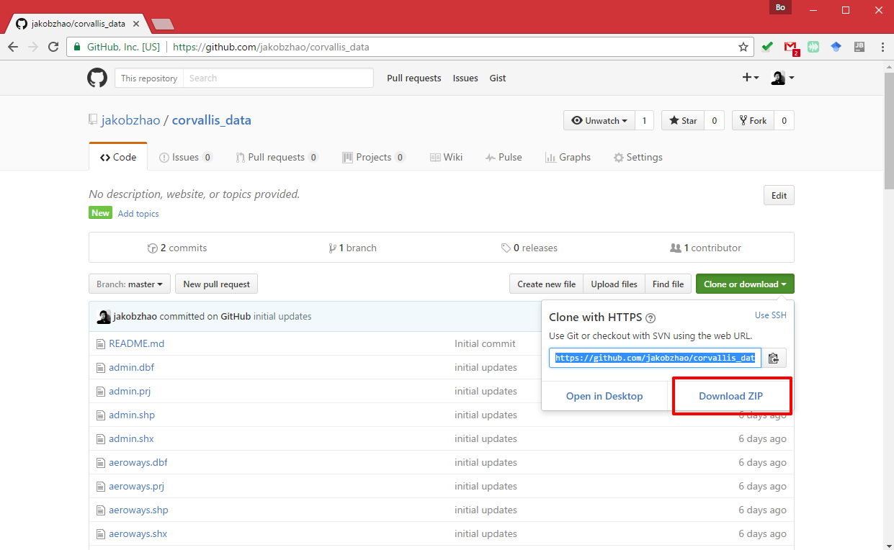
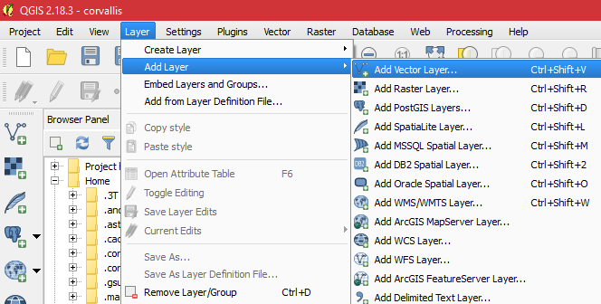
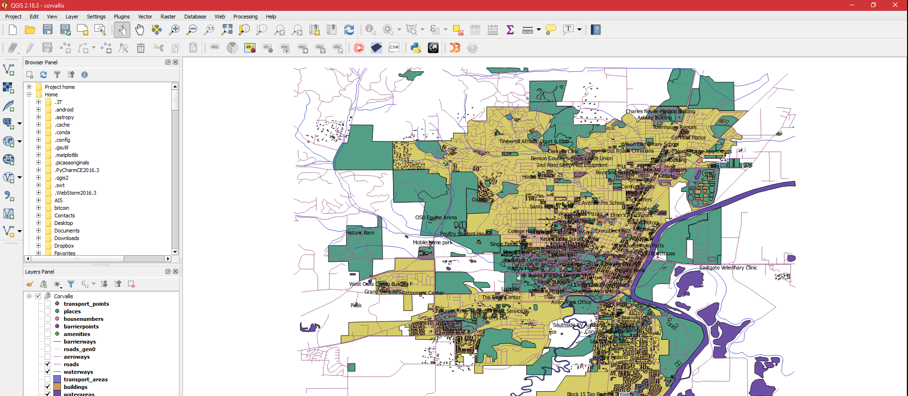

# Lab 4: Web Map Service Publishing

> Winter 2017 | Geography 371 | Geovisualization: Web Mapping
>
> **Instructor:** Bo Zhao  **Location:** Wilkinson 210 | **Time:** Th 1000 - 1150
>
> **Assigned:** 10/19/2017 | **Due:** `11/02/2017 @11:59pm` | **Points Available** = 50


数据下载.

deliverable

1. 生成 github repo

3. 生成 wms, 在 readme 里面，告诉wms 的 ulr， 以及screenshot 点击layer preview.

5. 制作1 个base map.

4. refer to lecture 13,  在一个 html page里面分别调用 生成的1个 mapbox，叫做 index.html. screenshot 放在 readme.html

2. 最终的结构应该是这样的

```Powershell
Mapbox
│readme.md
│map1.html
│map2.html
├─css
│      style.css
├─img
└─js
        main.js
```


4. Share map with us

分别分享


This lab will help you publish a base map of Corvallis using GeoServer. To do that, we provide a  dataset of Corvallis. This dataset was collected from OpenStreetMap using a web data collector - [MapZen](https://mapzen.com/). This dataset can be easily downloaded from GitHub to your local machine, in the meantime, this dataset has already been hosted on a remote map server for your use.  You will be asked to make a Corvallis map based this dataset using GeoServer. Below is a detailed instruction on publishing the web map.

## 1 Data download

To help you style the map layers, you can design your map via QGIS. To do that, you may download the data which was also stored in Github. (make sure you have `git` installed in your local PC.)

Simply run the following shell command on your windows command prompt or Linux/Mac Terminal.

```powershell
$ git clone https://github.com/jakobzhao/corvallis_data.git
```

Or you may click the `Download ZIP` button on the github repository.

[https://github.com/jakobzhao/corvallis_data](https://github.com/jakobzhao/corvallis_data).



Then, you can open the data set on QGIS by adding `new vector layers`.



All of the sudden, you will see all the data in the spatial layout. By default, all the data, coupled with the copy on [geoserver.mapio.us](geoserver.mapio.us), are in WGS 84 datum.




## 4. Deliverable

With the provided data and GeoServer account, you are asked to make a web map of Corvallis. You are required to design a map style, and systhenize all the layers as a **layer group** (refer to http://docs.geoserver.org/stable/en/user/data/webadmin/layergroups.html#data-webadmin-layergroups). In the future, this layer group can serve as a base map for your web map application.  


- A url link to the WMS service of your Corvallis map, and screenshots of the map in different scales (make sure the link is accessible. If not,  you might not get the whole points of this item)  (**30 POINTS**)
- Reflect on your design process - How did you determine the current web map style?  What specific topic motivate you to design the map? For example, you can design a map driven by a LGBT topic (I guess the geometric features on the map will be in a rainbow color ramp), or driven by the idea of Beaver Nation (Orange and Black?).  (**20 POINTS**) 

Submit your PE report in Word or PDF format to **Canvas Dropbox**. On the assignment tab,  check the item of this PE, press the `Submit Assignment` button to submit your PE report. Please contact the instructor or TA if you have any difficulty.


With the help of mapbox, you are expected to make at least two base maps. You can design these two base maps for your group project or design base maps for something of your interests.


While designing the base map, you are expected to practice what you have learned during the lectures, such as symbolization, color, layout, labelling, typography and etc. Also, **Make sure you design a base map rather than a thematic map**. The base map is created for illustrating the contextual information of a geovisualization as well as for standing out the thematic features.


To submit this practical exercise, you will need to create a GitHub repository.  The file structure of your GitHub repository should look like:

```Powershell
Mapbox
│readme.md
│map1.html
│map2.html
├─css
│      style.css
├─img
└─js
        main.js
```

This repository should contain the following items:

- Two html files, each of which shows a base map you have designed via MapBox. (**30 POINTS IN TOTAL, 15 FOR EACH**)
- A readme.md contains:
  - The titles of the basemaps;  (**3 POINTS**)
  - A short descriptions of the basemaps;  (**5 POINTS**)
  - Two rawgit.com url links, each of which directs you to a base map ; and  (**5 POINTS**)
  - Please talk about what specific idea motivates you to design the two maps? For example, you can design a map driven by a LGBT topic (I guess the geometric features on the map will be in a rainbow color ramp), or driven by the idea of Beaver Nation (Orange and Black?), Christmas season or Saint Patrick's Day.  (**7 POINTS**)

Once you finish this practical exercise, please upload the repository of your web map to GitHub, and **only submit the url of the repository to canvas**. Please contact the instructor or TA if you have any difficulty in submitting the url.


## Share your map with us

*Need inspiration?* Check out the other great designs in the Mapbox Studio [map design gallery](https://www.mapbox.com/gallery/).


*Proud of your design?* Fill out our [contact form](https://www.mapbox.com/contact/sales/), including a style URL and screenshot of your map or app and we’ll look into adding it to our gallery. We’d love to showcase some of your map designs and applications.


