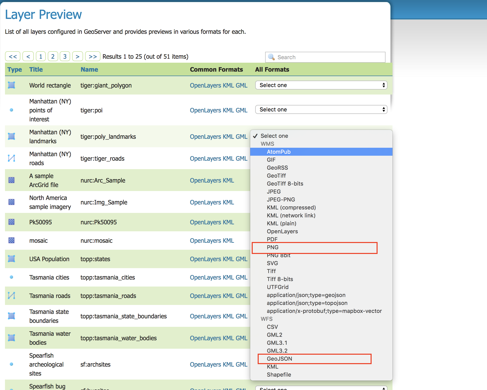
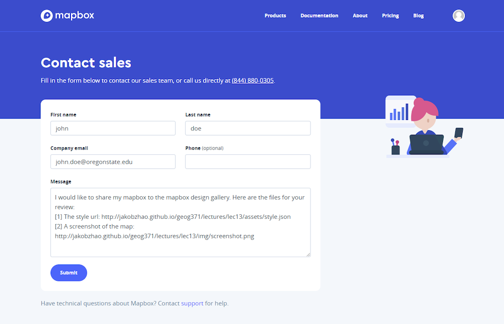

# Lab 4: Web Map Services and Basemap

> Winter 2017 | Geography 371 | Geovisualization: Web Mapping
>
> **Instructor:** Bo Zhao  **Location:** Wilkinson 210 | **Time:** Th 1000 - 1150
>
> **Assigned:** 10/19/2017 | **Due:** `11/02/2017 @11:59pm` | **Points Available** = 50


In this lab, you are expected to make web map services through GeoServer and make base map through mapbox.

## 1. Create wms and wfs using GeoServer

1\.1 A shapefile named after `ore_counties` was stored in the `assets` folder. You will use it to make web map services on GeoServer. Above all, you will need to synchronize the data to your working space.

1\.2 If you a GeoServer on a local computer or one in Digital Earth Lab, the url of GeoServer should be http://localhost:8080/geoserver by default. Also, the default username is `admin`, the password is `geoserver`.

1\.3 Use `ore_counties` shapefile to make a `layer` on GeoServer.

1\.4 In the main page of GeoServer, click on the `Layer Preview` under the `Data` tab. An table of the layer will show up. In this table, please identify the layer you have created, and then click on the `Select one` dropdown menu. In this menu, you will need to generate two services.



- Once you click on the `PNG` item under the WMS category, a new browser web page tab will appeare with a map tile. Please record the url of wms and also save the map tile as an image.

- Also, by click on the `GeoJson` item under the WFS category, a new browser web tab will appear with a raw geojson data. Please record the url and save the geojson data in the name of `ore_counties.geojson`.

## 2\. Create a base map using Mapbox


2\.1 You are expected to generate a base map using mapbox. **Please make sure you design a base map rather than a thematic map**. The base map is created for illustrating the contextual information of your study area. The base map will help you to stand out the thematic layers.

2\.2 you are expected to design your map to embody a specific theme. For example,

- a base map design motivated by a keyword. (refer to [http://palettr.com/](http://palettr.com/));
- a base map design inspired by a picture. (refer to [https://coolors.co/](https://coolors.co/));
- a base map design for color blindness. (refer to [https://coolors.co/](https://coolors.co/));
- a high contrast map (refer to [http://colorpalettes.net/](http://colorpalettes.net/)); and
- a base map design embodying an idea, such as Christmas map, St Patrick Map, LGBT map, Beaver Nation, etc.

2\.3 Once you made the map, please use a leaflet web page to call this map. The tutorial is in the lecture note on this [Wednesday](../../lectures/lec13/). Eventually, you will have a github repo to manage all the files. The mapbox basemap will be shown on an `index.html`. (we will talk about the structure of the github repository in the next section.)


## 3\. Deliverable

You will have two weeks to work on this lab. To submit, please follow the steps below.

3\.1 create a github repository. This repository will store the files of the responded wms image and wfs geojson, and base map web page.  **Note:** Regarding the name of this github repo, please use something related to your base map, names like `lab04`, `assignment04` are not recommended.  (**3 POINTS**)

3\.2 In the readme.md file, please paste the wms url and the screenshot of the responded png image. (**4 POINTS**)

3\.3 In the readme.md, please also past the wfs url, and make an link to the downloaded `ore_counties.geojson` data. (**4 POINTS**)

3\.4 In the readme.md, please add a link (the link should be in the format of `http://[github_username].github.io/[submissio_lab_04]`) to access the web page of the mapbox basemap. This web page to access the base map should be the `index.html` of this github repository. Basically, By clicking on the link, the base map hosted by this github repository will show. Refer to [lecture 13](../../lectures/lec13/) to see a tutorial. (**20 POINTS**)

3\.5 In the readme.md, reflect on your design process - How did you determine the current web map style?  What specific topic motivate you to design the map? For example, you can design a map driven by a LGBT topic (I guess the geometric features on the map will be in a rainbow color ramp), or driven by the idea of Beaver Nation (Orange and Black?).  (**10 POINTS**)

3\.6 Share your mapbox to mapbox design gallary. Check out the other great designs in the Mapbox Studio [map design gallery](https://www.mapbox.com/gallery/). (**4 POINTS**)


Fill out our [contact form](https://www.mapbox.com/contact/sales/), including a style URL and screenshot of your map or app and Mapbox team will look into adding it to their gallery. Mapbox would like to show case of some interesting map design and applications.



3\.7 The structure of the github repository should like something below. (**5 POINTS**)

```Powershell
[Submission_Lab_04]
│readme.md
│index.html
├─assets
│      icons
│            xxx.svg
│            xxx.svg
│            xxx.svg
│      style.json
│      ore_counties.geojson
│      license.txt
├─img
│      screenshot.png
```


Once you complete this lab assignment, please make sure both the github repository and the web site work appropriately. Then, you will need to submit the url of the GitHub repository to **Canvas Dropbox**. (On the assignment tab,  press the `Submit Assignment` button to submit. Please contact the instructor or TA if you have any difficulty.)


## References:

[1] Walton, Amy Lee 2017 [MapBox Design Guide](guide-to-map-design-part-1.pdf), Mapbox, retrieved at Oct 27, 2017.


## Note：

In terms of sharing you style to [MapBox](https://www.mapbox.com/gallery/), you can also Tweet it with #BuiltWithMapbox to submit it to the gallery.