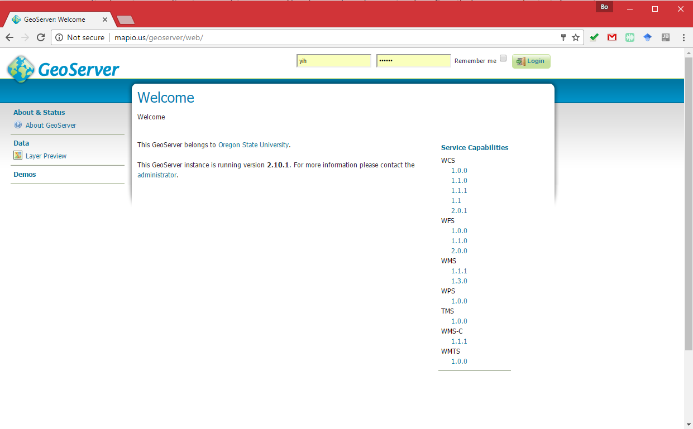
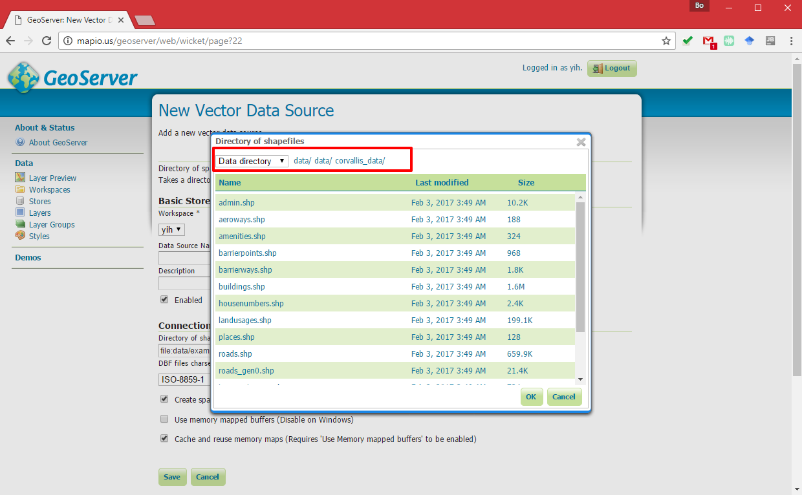
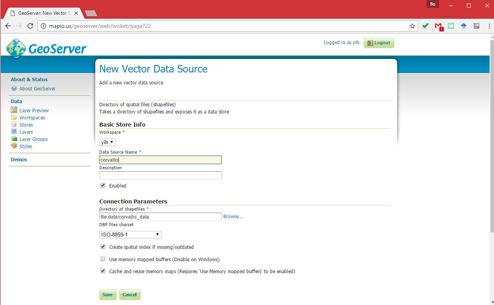
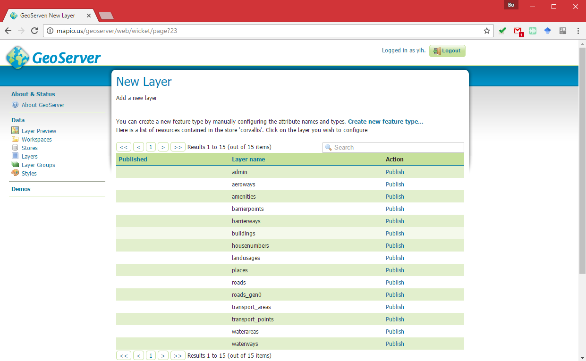
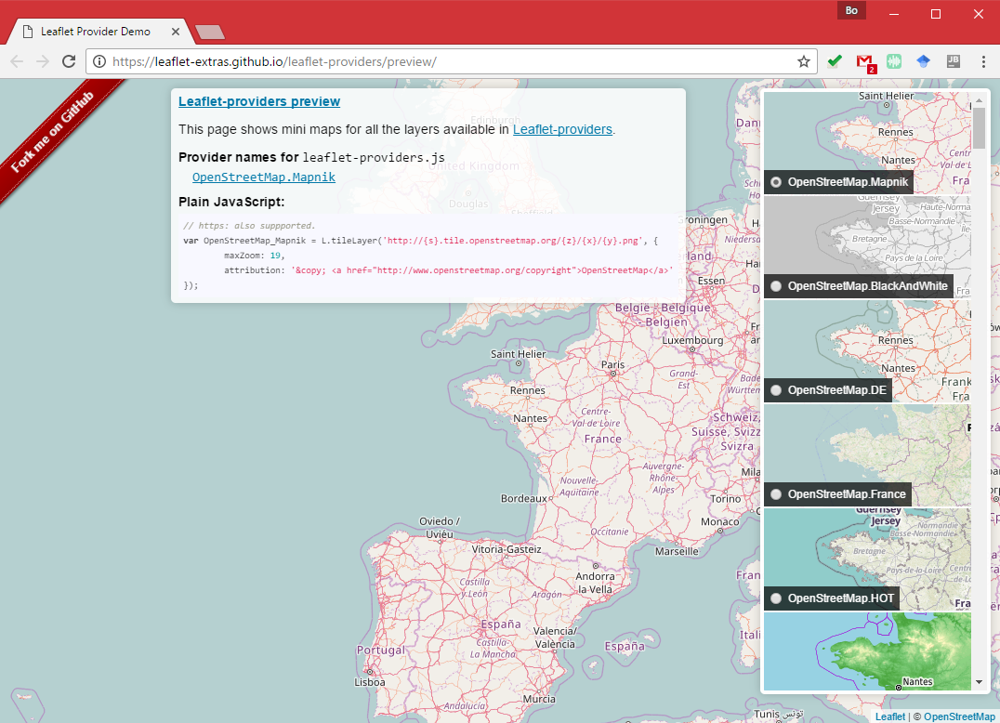
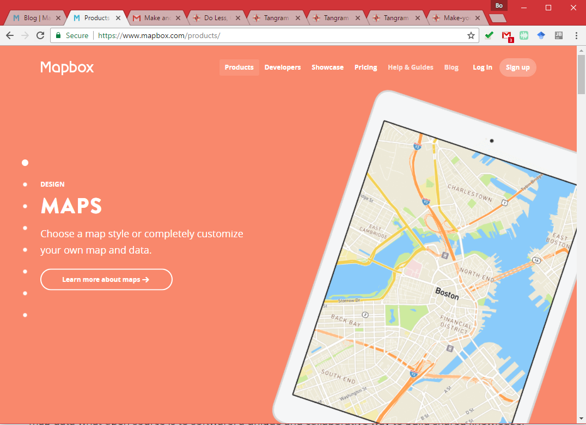
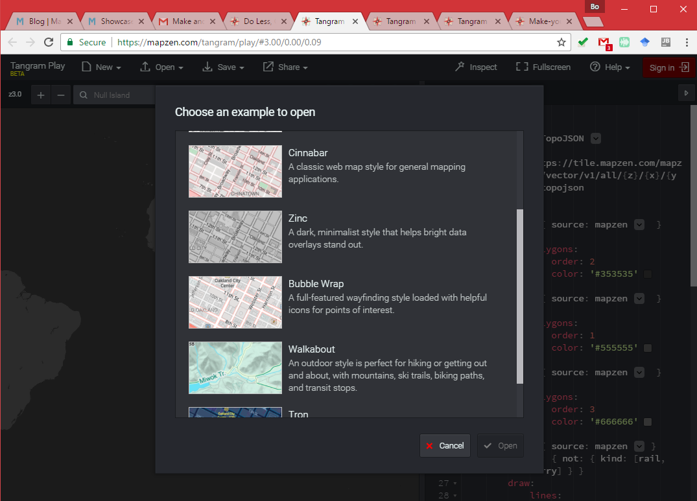
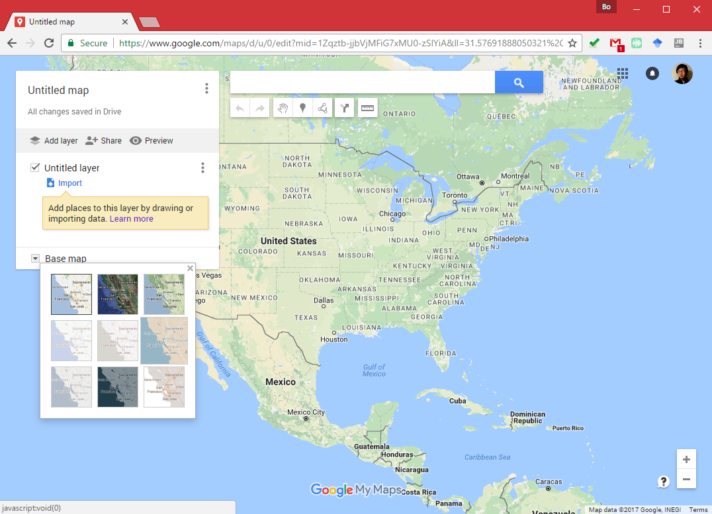
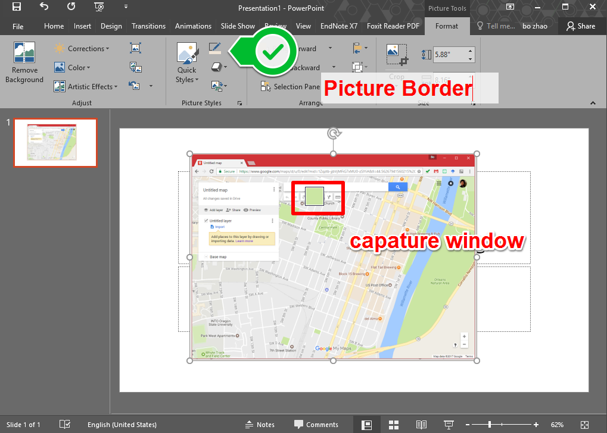
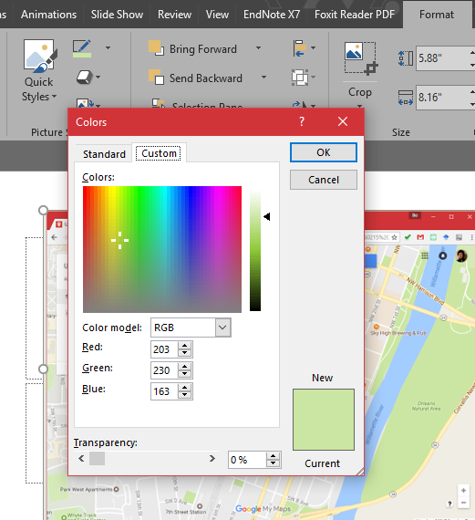

# Practical Exercise 4: Web Map Service Publishing

> Winter 2017 | Geography 371 | Geovisualization: Web Mapping
>
> Instructor: Bo Zhao  Location: 210 Wilkinson | Time: Thursday 1000 to 1150
>
> Assigned: 02/09/2017 | Due: `02/23/2017 @11:59pm` | Points Available = 50

This Practical Exercise will help you publish a base map of Corvallis using GeoServer. To do that, we provide a  dataset of Corvallis. This dataset was collected from OpenStreetMap using a web data collector - [MapZen](https://mapzen.com/). This dataset can be easily downloaded from GitHub to your local machine, in the meantime, this dataset has already been hosted on a remote map server for your use.  You will be asked to make a Corvallis map based this dataset using GeoServer. Below is a detailed instruction on publishing the web map.

## 1. Web Map Server

### 1.1 Login in

To style and publish the map, you will need to work on a remote web map server at [http://geoserver.mapio.us](http://geoserver.mapio.us). This server is dedicated for the use of GEOG 371 students. Towards the end of this course, you might also publish your final project application on this server.  You have already received an Email about your login information. If  you have not, please contact the instructor.


Please use the provided account information to login in [http://geoserver.mapio.us](http://geoserver.mapio.us).



### 1.2 Operation

You can only work on a workspace named after your account username. For example, if  my account name is `zhao2`, the workspace I will work on is `zhao2`.

You do not need to upload data to this server. The instrcutor has already done it for you. However, you need to style the geospatial data via QGIS and upload SLD file to this geoserver instance at [http://geoserver.mapio.us](http://geoserver.mapio.us). To locate the data on the server, you can make a `store` by navigating from the `Stores` on the left side of the interface, click `Add new Store`, then select `Directory of spatial files (shapefiles)` under the Vector Data Source. In the panel on the right side, click `Browse...` and navigate to `data/data/corvallis_data` under the `Data directory`.



By pressing `OK`, you can locate the data set directory. To create a store, you need to further fill in the `Data source name` and other required information items. 



Once you have created a `store`, for each shapefile in the store, you can publish a or multiple layer(s). 



## 2 Data download

To help you style the map layers, you can design your map via QGIS. To do that, you may download the data which was also stored in Github. (make sure you have `git` installed in your local PC.) 

Simply run the following shell command on your windows command prompt or Linux/Mac Terminal.

```powershell
$ git clone https://github.com/jakobzhao/corvallis_data.git
```

Or you may click the `Download ZIP` button on the github repository.

[https://github.com/jakobzhao/corvallis_data](https://github.com/jakobzhao/corvallis_data). 


Then, you can open the data set on QGIS by adding `new vector layers`.


All of the sudden, you will see all the data in the spatial layout. By default, all the data, coupled with the copy on [geoserver.mapio.us](geoserver.mapio.us), are in WGS 84 datum.


## 3. On the shoulder of giants

To design you map, I would encourage you learn from other map style. Here are a list of base map you may feel useful. However, **Learning from a map style is NOT exactly copying a map style. We expect to see your own contribution. **

**OSM Previews**

Please locate and switch to a variety of styles on the right scrollable panel.



**MapBox**



**[MapZen Tangram Play](https://mapzen.com/tangram/play/)**



**Google My Maps**



> **Hint:** To capture the color of a geometric feature, you can make a screenshot of the map, and paste it to one slide in `Microsoft Powerpoint`, and then use the `eyedropper` tool under the `Format` tab and in `Picture Border` dropdown list. You can get the RGB value of the color by clicking the `more color` item.





> And then, based on a RGB to Hex color conversion tool at [http://www.rapidtables.com/convert/color/rgb-to-hex.htm](http://www.rapidtables.com/convert/color/rgb-to-hex.htm), you can get the HEX value of the color, and assign the color to a geometric feature via QGIS and finally in your SLD file.

## 4. Deliverable

With the provided data and GeoServer account, you are asked to make a web map of Corvallis. You are required to design a map style, and systhenize all the layers as a **layer group** (refer to http://docs.geoserver.org/stable/en/user/data/webadmin/layergroups.html#data-webadmin-layergroups). In the future, this layer group can serve as a base map for your web map application.  

To submit this PE, you need to wrap up a PE report, this report should contain the following items:

- A url link to the WMS service of your Corvallis map, and screenshots of the map in different scales (make sure the link is accessible. If not,  you might not get the whole points of this item)  (**30 POINTS**)
- Reflect on your design process - How did you determine the current web map style?  What specific topic motivate you to design the map? For example, you can design a map driven by a LGBT topic (I guess the geometric features on the map will be in a rainbow color ramp), or driven by the idea of Beaver Nation (Orange and Black?).  (**20 POINTS**) 

Submit your PE report in Word or PDF format to **Canvas Dropbox**. On the assignment tab,  check the item of this PE, press the `Submit Assignment` button to submit your PE report. Please contact the instructor or TA if you have any difficulty.


## 4. Deliverable

With the help of mapbox, you are expected to make at least two base maps. You can design these two base maps for your group project or design base maps for something of your interests.  I encourage you start from a mapfox featured style, such as the Mapbox Street, Oudoors, Dark, Light and etc.


While designing the base map, you are expected to practice what you have learned during the lectures, such as symbolization, color, layout, labelling, typography and etc. Also, **Make sure you design a base map rather than a thematic map**. The base map is created for illustrating the contextual information of a geovisualization as well as for standing out the thematic features.


To submit this practical exercise, you will need to create a GitHub repository.  The file structure of your GitHub repository should look like:

```Powershell
GEOG4572-PE2
│readme.md
│map1.html
│map2.html
├─css
│      style.css
├─img
└─js
        main.js
```

This repository should contain the following items:

- Two html files, each of which shows a base map you have designed via MapBox. (**30 POINTS IN TOTAL, 15 FOR EACH**)
- A readme.md contains:
  - The titles of the basemaps;  (**3 POINTS**)
  - A short descriptions of the basemaps;  (**5 POINTS**)
  - Two rawgit.com url links, each of which directs you to a base map ; and  (**5 POINTS**)
  - Please talk about what specific idea motivates you to design the two maps? For example, you can design a map driven by a LGBT topic (I guess the geometric features on the map will be in a rainbow color ramp), or driven by the idea of Beaver Nation (Orange and Black?), Christmas season or Saint Patrick's Day.  (**7 POINTS**)

Once you finish this practical exercise, please upload the repository of your web map to GitHub, and **only submit the url of the repository to canvas**. Please contact the instructor or TA if you have any difficulty in submitting the url.