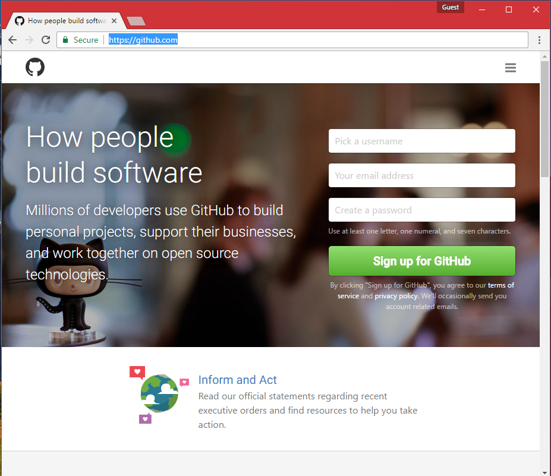
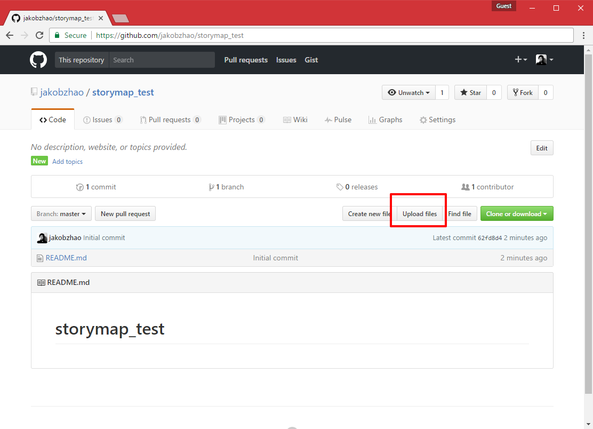
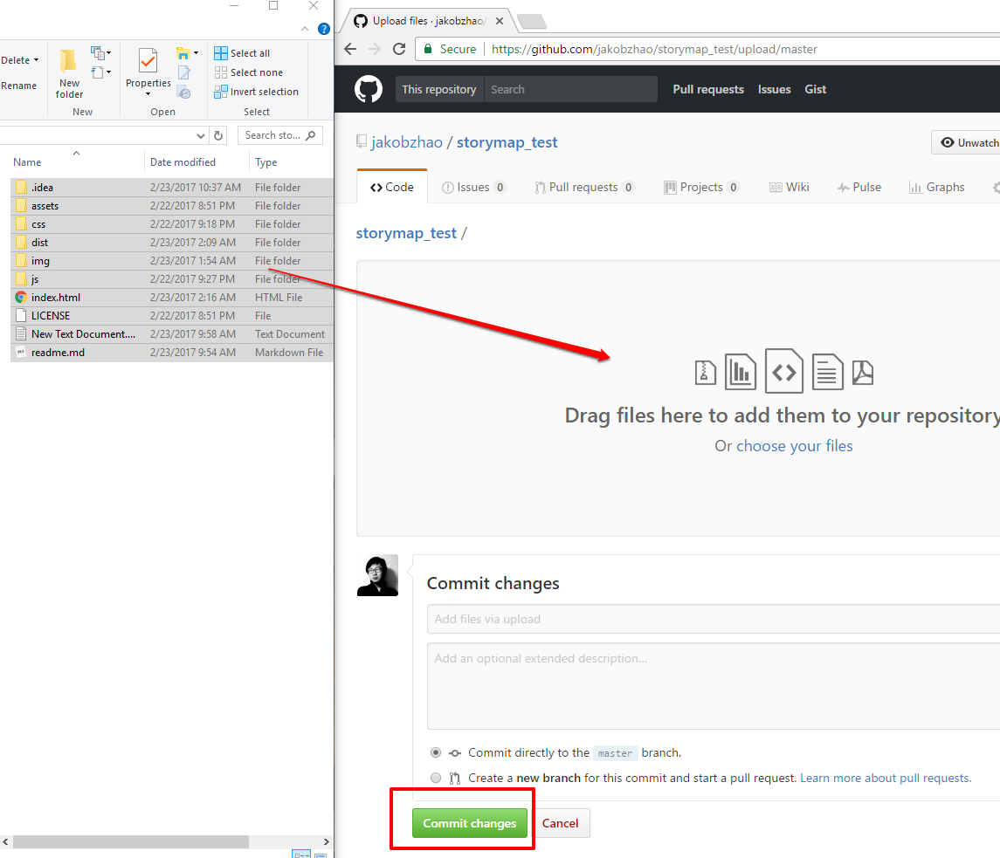
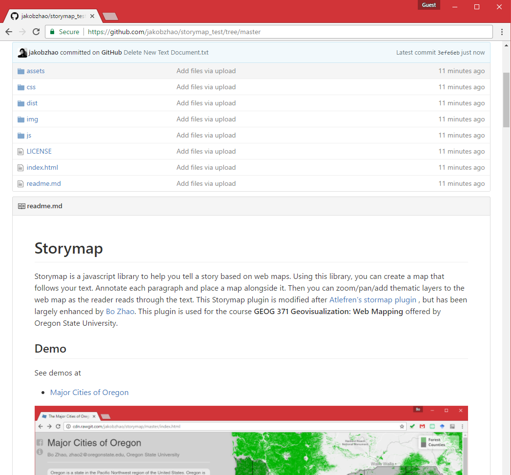
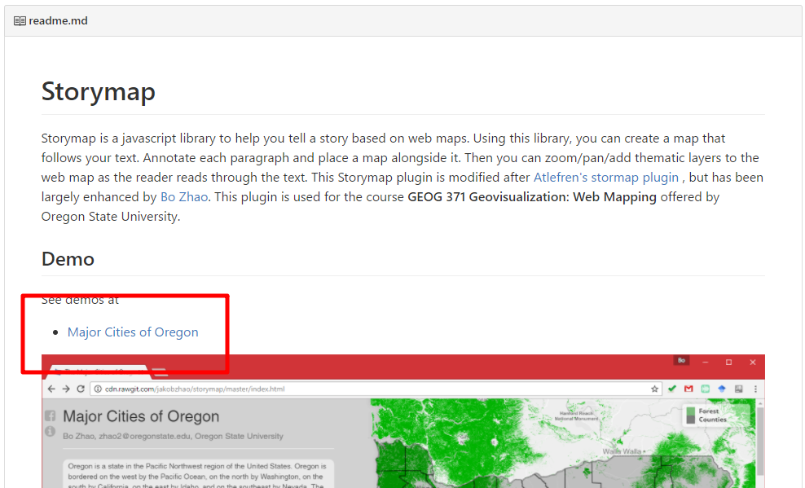

# Practical Exercise 5: An Integrated Web Map Application

> Winter 2017 | Geography 371 | Geovisualization: Web Mapping
>
> Instructor: Bo Zhao | TA: Andy Wilson | Location: 210 Wilkinson | Time: Thursday 2-3:50pm
>
> Assigned: 02/23/2017 | Due: `03/09/2017 @11:59pm` | Points Available = 50

This practical exercise will help you make a storymap using an open-source library `storymap.js` and share it to GitHub.

## 1. Storymap

With this storymap exercise, you are asked to introduce something about Corvallis or Oregon which you feel interested in. For example, the topic can vary from your favorite restaurants in Corvallis, your favorite bookstores in Town, to the snow mountains in Oregon, and etc.

In Practical Exercise 4, you have made a Corvallis basemap and web map & feature services as the side products. You may use them to enrich the storymap.

To make the storymap, you need to use a web map library `storymap.js` at [https://github.com/jakobzhao/storymap](https://github.com/jakobzhao/storymap). There is a detailed tutorial on the [front page](https://github.com/jakobzhao/storymap) of that library.  The handouts for lecture 15, 16, 17 also help.

Your storymap will at least have the following features:

- At least five scenes. The content of the scenes can be obtained from Yelp or Wikipedia, or even writing up by yourself. If you would like to use an external source, please do credit it in the `about page`; (**15 POINTS**)
- At least two types of thematic layers (to name a few, tileLayer, geojson/WFS Layer, OSM Layer, WMS Layer and etc.). These thematic layers can be made by yourself or included from other map providers; (**15 POINTS**)
- An about page; and (**5 POINTS**)
- A favicon;
- A social media button to share the storymap to Facebook. (**5 POINTS**)

>  **Note**: If you can add some extra features other than the ones I listed above, you will earn some bonus credits (**10 POINTS maximum**).  

## 2. GITHUB

Once you create the storymap application, I encourage you proofread and debug it several times in your local environment, and solicit your classmate(s) for comments. If you believe your storymap application is in good shape, this section will guide you to share your storymap as well as its code on GitHub.

2.1\. You will need a GitHub account. Sign up at [https://github.com/](https://github.com/).



2.2\. Once you have signed up, please log into [github.com](github.com), create a new repository by typing [https://github.com/new](https://github.com/new) in the url input box of your browser.


2.3\. Name your repository, and check the `Initialize tis repository with a README` box. Then click the `Create repository` button to create an empty repository. You can always fill in the repository `Description` later. 

2.4\. Then, you will enter the front page of the new github repository.  Click the `Upload files` button, which will lead you to the data uploading page.



2.5\. In the uploading page, you can either drag&drop or choose your files to upload to github. Once the uploading is completed, please press the `Commit Changes` button.



2.6\. Then, the post-processing may take a few minutes to complete. **If you happen to find a bug in the codes, you can always correct it by uploading a new version via `Upload file` button.**

2.7\. As you may be aware of, you have initiated a `README.md` file in the root directory. This `README.md` file is in a markdown format, you can edit a markdown file locally, and upload it to GitHub later. Make sure this file is named after `README.md`. Only then, it can be shown as the front page of the repository. Feel free to edit this file, leave some introduction to the project and/or a short tutorial. You might also want to credit the geospatial data, tools and map libraries which you have used for this storymap. It would be even better if you can credit this course `GEOG 371: Web Mapping`.



2.8\. One magic feature of GitHub is, it can preview your html files. If your web map is a pure client based web application, you might view the application smoothly in your browser. For example, in my storymap repository at [https://github.com/jakobzhao/storymap/](https://github.com/jakobzhao/storymap/), there is a `index.html` file in the root directory, and a `template.html` under the `dist` subdirectory.

you can follow the url syntax below to visualize html files in github repository. 

```http
http://cdn.rawgit.com/<git username>/<git repostory name>/master/<html path>
```

 Accordingly, the above two html pages can be previewed by the following urls respectively:

```http
http://cdn.rawgit.com/jakobzhao/storymap/master/index.html
```

```http
http://cdn.rawgit.com/jakobzhao/storymap/master/dist/template.html
```

2.9\. **You are required to add a link of the web application preview in the `README.md` file**. A link in markdown format is:`[a link title](the url link)`. In this way, you can generate a link like "[a link title](the url link)".

Please take a quick look at the link of storymap demo at the [front page](https://github.com/jakobzhao/storymap) of the storymap repository. The code for the link (in the red box) is `[Major Cities of Oregon](http://cdn.rawgit.com/jakobzhao/storymap/master/index.html)`.



To sum up, for the GitHub session of this practical exercise, you will need to:

- Upload your storymap to GitHub. (**7 POINTS**)
- In the `README.md` file, you need to at least *(a)* credit the web materials you have used, and *(b)* put a link of the storymap application for Instructor and TA to review. (**3 POINTS**)

## 3. Deliverable

Submit the url link of your storymap repository to **Canvas Dropbox**. On the assignment tab,  check the item of this PE, press the `Submit Assignment` button to submit your PE report. Please contact the instructor or TA if you have any difficulty.