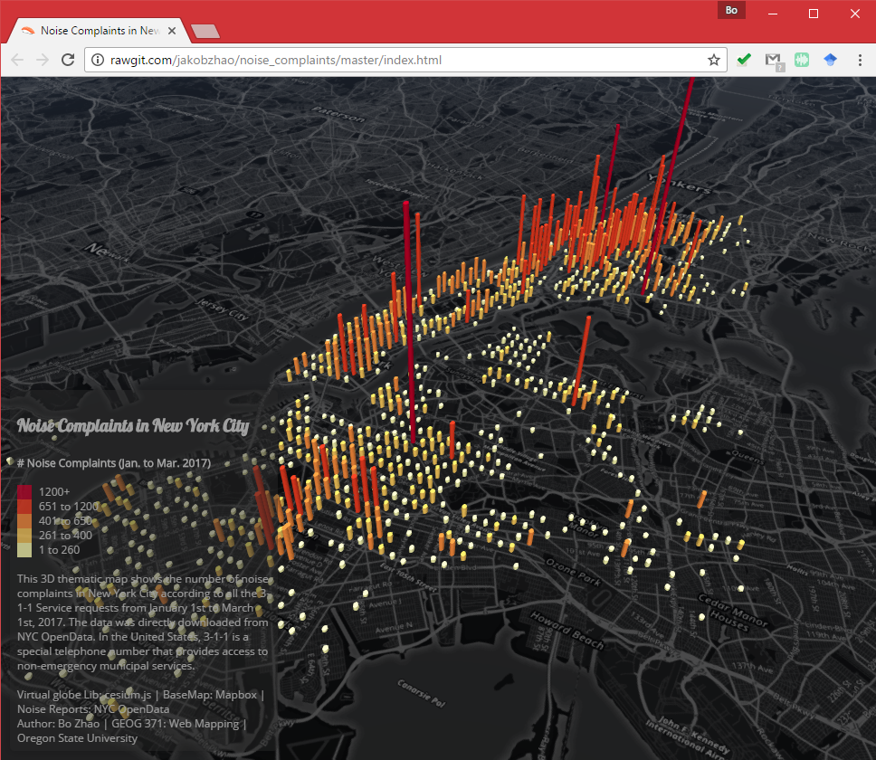
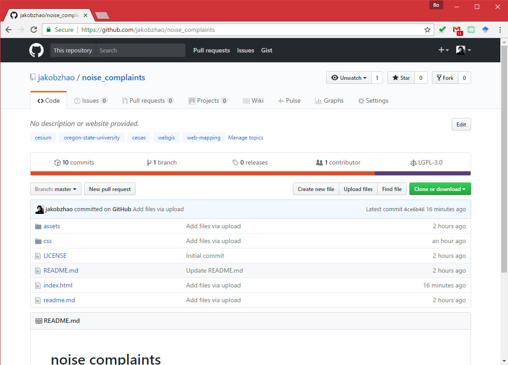
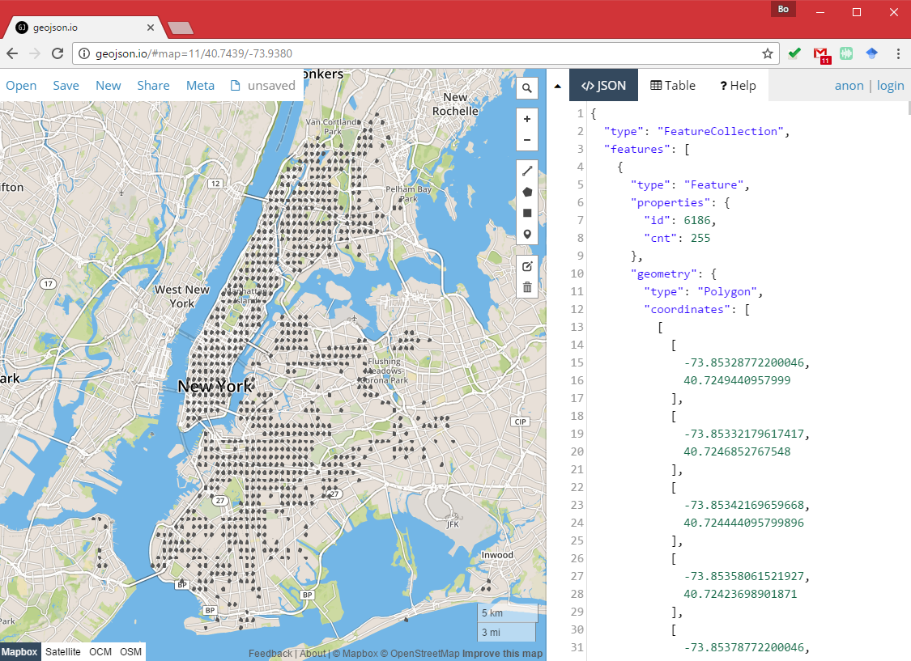
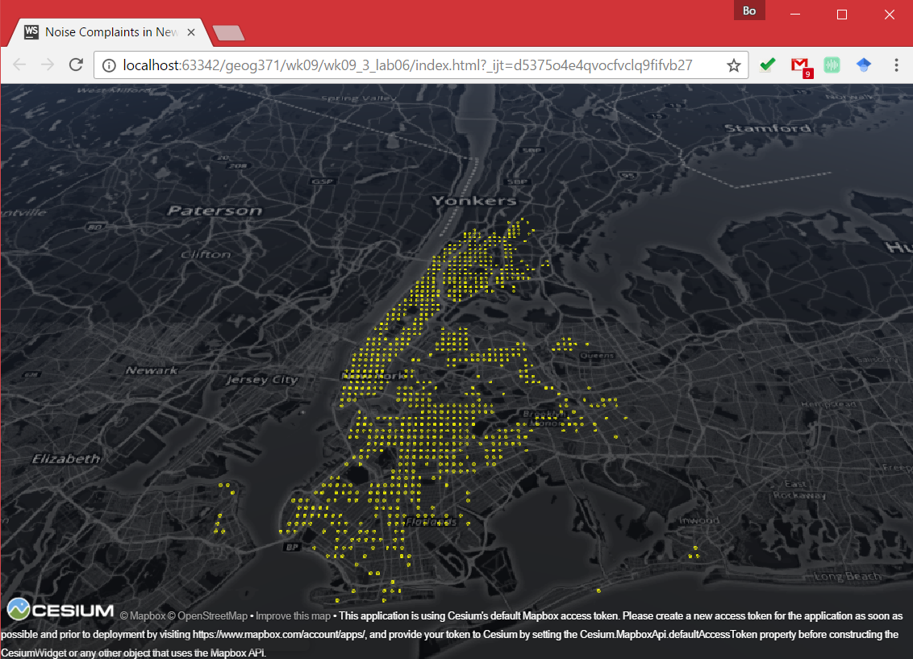
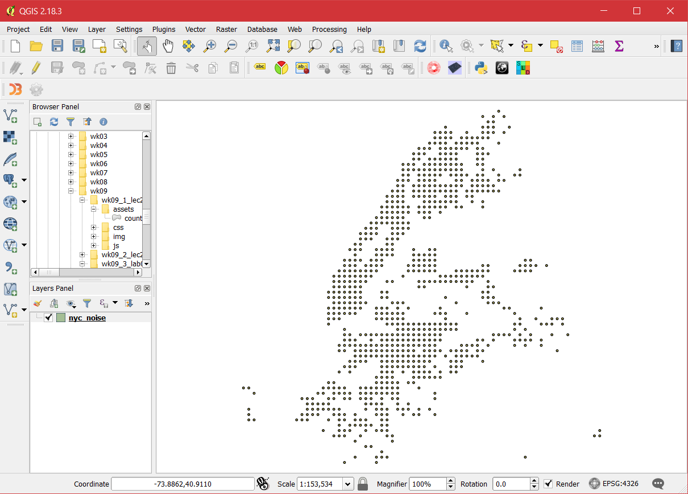
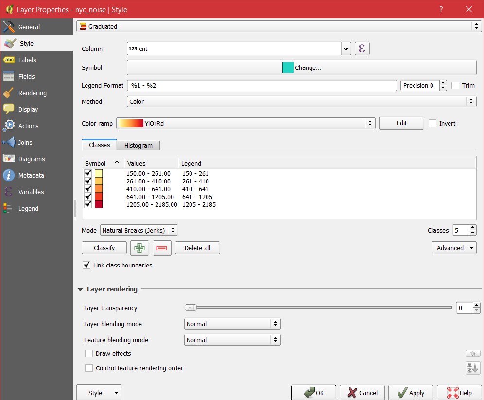
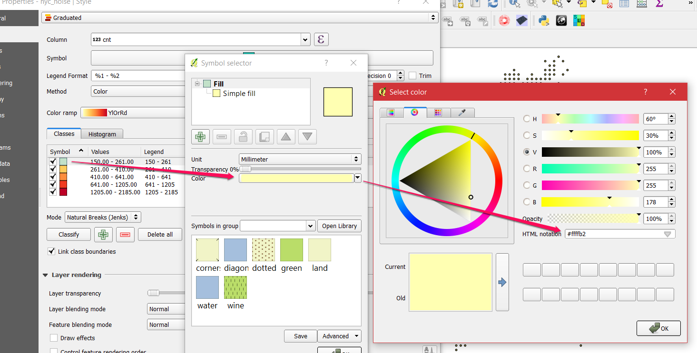
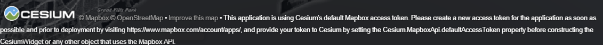
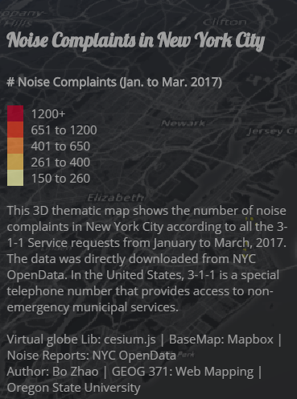

# Practical Exercise 6: 3D Thematic Map using a Virtual Globe

> Winter 2017 | Geography 371 | Geovisualization: Web Mapping
>
> Instructor: Bo Zhao | TA: Andy Wilson | Location: 210 Wilkinson | Time: Thursday 2-3:50pm
>
> Assigned: 03/09/2017 | Due: `03/16/2017 @11:59pm` | Points Available = 50

During the last week, we have learned how to use a virtual globe to make a 3D thematic map. To do that, some of the most frequently used virtual globe libraries are [three.js](https://threejs.org/) and [cesium.js](http://cesiumjs.org/). While three.js is more
compatible with other 3D web applications, cesium.js is dedicated to make virtual globes. As introduced in the lectures, [TerriaJS](http://terria.io/) is an robust open-source geospatial platform built on cesium.js. It provides us
with handy tools for navigating, editing and managing geospatial data. If you are interested in using cesium.js for an integrated web mapping application, I would highly recommend writing the codes of [TerriaJS](http://terria.io/) at GitHub. In this practical exercise, you are asked to make a 3D thematic map using cesium.js. The major learning goal is not to have you grasp the state-of-art skills in 3D mapping. Instead, this exercise prepares you with fundamental skills of making a 3D thematic map, and provides you an opportunity to reflect on the differences between 2D and 3D web mapping. Okay, let us get down the real deal.

In New York City, the local government maintains an open data portal to share a lot of datasets about the city management and administration. Among all the datasets, the 3-1-1 Calls on noise complaints are openly accessible. Since each complaint record comes with locational information, it is possible to visualize them collectively on a web map. In this practical exercise, we will make a 3D bar map to visualize the concentrations of noise complaints in the city. The final web map, as shown below, can be viewed at [http://rawgit.com/jakobzhao/noise_complaints/master/index.html](http://rawgit.com/jakobzhao/noise_complaints/master/index.html).



In the map, each bar indicates a number of noise complaint cases from the region underneath. Each region is a square grid with a side of 0.2 miles. The number of complaint cases is illustrated both through the sequential color scheme (low=yellow, high=red) and through the bar heights. To make such a 3D thematic map, we will need to

- Select cesium.js as the map client library;
- Use the dark theme map from MapBox as the basemap; and 
- Import the georeferenced bars in geojson data format and visualize them.

## 1\. Preparation

Throughout the term, you have frequently used GitHub as a vehicle to sync geospatial data, work in teams, update a web site, and publish web mappings. In this exercise, we will download a GitHub repository to your local working space. 



The repository is located at [https://github.com/jakobzhao/noise_complaints](https://github.com/jakobzhao/noise_complaints), just click "Clone or download" button to download the package, and then extract all the files to the working directory on your local computer. The file structure of this repository looks like the file tree below:

```powershell
noise_complaints
├─assets
├  ├─── nyc_noise.geojson
├─css
├  ├─── style.css
├─img
├  ├─── ...
├─index.html
├─readme.md
├─LICENSE
```

After downloading the files to an appropriate place, you will need to setup a web server. To do that, you can use the **Webstorm** or a python server by executing the following codes under the working directory:

```powershell
$python -m SimpleHTTPServer
```

## 2\. HTML template

Above all, we will create an html page and include the necessary libraries. As shown, within the `body` div, we place two div elements - one for anchoring the virtual globe container and one for anchoring the legend. In addition, the style sheet locates at `css/style.css`. In order to make the application more light-weight, we use external links to include cesium libraries from [http://cesiumjs.org/releases/1.31/Build/Cesium/Cesium.js](http://cesiumjs.org/releases/1.31/Build/Cesium/Cesium.js) and [http://cesiumjs.org/releases/1.31/Build/Cesium/Widgets/widgets.css](http://cesiumjs.org/releases/1.31/Build/Cesium/Widgets/widgets.css).

```html
<!DOCTYPE html>
<html lang="en">
<head>
    <meta charset="utf-8">
    <meta http-equiv="X-UA-Compatible" content="IE=edge">
    <meta name="viewport" content="width=device-width, initial-scale=1, maximum-scale=1, minimum-scale=1, user-scalable=no">
    <link rel="stylesheet" href="http://cesiumjs.org/releases/1.31/Build/Cesium/Widgets/widgets.css">
    <link rel="stylesheet" href="css/style.css">
  	<script src="http://cesiumjs.org/releases/1.31/Build/Cesium/Cesium.js"></script>
  	<title> Cell Towers in Oregon by County </title>
</head>
<div id="cesiumContainer"></div>
<div class="legend"></div>
</body>
</html>
```

Then, we create a `script` div to hold the javascript code. In the script, we begin with declaring the viewer. To help the users focus the web map, we turn off most of the extra features of a `Cesium.Viewer`.

```javascript
//create a cesium view, and use the mapbox dark map as the base map.
var viewer = new Cesium.Viewer('cesiumContainer', {
  ...
  vrButton: false,  // virtual reality support
  infoBox: false, // pick a feature and show its attributes
  sceneModePicker: false, // 2d, 2.5d and 3d
  navigationHelpButton: false,
  baseLayerPicker : false,
  fullscreenButton: false,
  geocoder: false,
  homeButton: false,
  animation: false,
  timeline: false
});
```

To help the thematic map stand out on a virtual globe, we change the base map by changing the **Imagery Provider** to `mapbox.dark`.

```javascript
var viewer = new Cesium.Viewer('cesiumContainer', {
  imageryProvider : new Cesium.MapboxImageryProvider({
    mapId : 'mapbox.dark',
    accessToken : 'pk.eyJ1IjoiamFrb2J6aGFvIiwiYSI6ImNpenh0dG41ZjAyY3gzMXFsdTJqbm5oNmwifQ.ucAGT19EfvxX2EUaHUwAxA'
  }),
   ...
});
```

## 3\. Loading GeoJson data

Then we will load the geojson data and add it to the viewer object. After the data is added, we need to move the viewer by the `zoomTo` function.

The geojson data is stored in `assets/nyc_noise.geojson`, to load and post-process the data, we use the `Cesium.GeoJsonDataSource.load().then()` functions to make sure the data will only be processed after the geojson data is loaded. Then, we switch the map view to see the boundary of the geojson data using the `zoomTo` function.

```javascript
var dataSource = Cesium.GeoJsonDataSource.load('assets/nyc_noise.geojson').then(
  function(dataSource) {
    viewer.dataSources.add(dataSource);
    viewer.zoomTo(dataSource);
  }
);
```

Here, the file **nyc_noise.geojson** contains a set of polygons (circles). Each polygon contains two properties - `id` and `cnt`.

- `id` is a unique identification number; and
- `cnt` indicates the number of noise complaints that came from that region. Please try to validate the geojson data from [geojson.io](file:///C:/Users/Andy/Downloads/geojson.io)



Once the cesium successfully imports the geojson data, we will symbolize the polygons. 



First, we put all the entities in that geojson file in a loop.

```javascript
var dataSource = Cesium.GeoJsonDataSource.load('assets/nyc_noise.geojson').then(
  function(dataSource) {

    var p = dataSource.entities.values;

    for (var i = 0; i < p.length; i++) {
      ...
    }

    viewer.dataSources.add(dataSource);
    viewer.zoomTo(dataSource);
  }
);
```

For each of the entities, we want to de-visualize the outlines and extrude the entities based on the number of complaints. To set up the proper height, it is a matter of adjustment to find the right variable. Try
different values to find the best fit. In the end, we will choose *`complaint_number * complaint_number  * 0.004`*.

```javascript
p[i].polygon.outline = false;
p[i].polygon.extrudedHeight = p[i].properties.cnt * p[i].properties.cnt * 0.004;
```


Also, we will update the color of entities using a sequential color ramp. To do that, we open the geojson data in QGIS.



Then, categorize the data based on the `cnt` attributes – I personally prefer the `natural break` method, which gives a balanced visual experience. (Right-Click the **nyc_noise layer** on the Layer Panel, on the popped up panel, choose Properties, switch to the Style tab, and fill the blanks according to the following screenshot).



After classifying the entities, we will pick a color ramp. We’ll use a yellow to red sequential color ramp to visualize the data. This color ramp provides a useful visualization of how the noise volume increases
from low to high. 

Then, we can obtain the hexadecimal color value by clicking on the color patch. As shown, the light yellow color value is `#ffffb2`. Following the same steps, get the colors for all the patches.



> **Note:** In addition to QGIS, we can also choose a color ramp from [colorbrewer2.org](file:///C:/Users/Andy/Downloads/colorbrewer2.org).

Cesium has a complicated [color system](http://cesiumjs.org/releases/b30/Build/Documentation/Color.html), to be simple, we use the hexadecimal color which was mainly used in CSS. Here is the API for processing a hexadecimal color.

> **Color.fromCssColorString**: Creates a Color instance from a CSS color value.
>

| Name    | Type   | Description                              |
| ------- | ------ | ---------------------------------------- |
| `color` | String | The CSS color value in #rgb, #rrggbb, rgb(), rgba(), hsl(), or hsla() format. |

> **Returns:** The color object, or undefined if the string was not a valid CSS color.

Now, we make a function to determine the color based on the input number of noise complaints.

```javascript
// Set function for color ramp
function setColor(density){
  return density > 1200 ? '#bd0026' :
  density > 650 ?  '#f03b20' :
  density > 400 ?  '#fd8d3c' :
  density > 260 ?  '#fecc5c' :
  '#ffffb2' ;
}
```

Then, we can easily update the material parameter of each entity using the `setColor` function as shown below:

```javascript
p[i].polygon.material = Cesium.Color.fromCssColorString(setColor(p[i].properties.cnt));
```

## 4\. Panel of Description and Legend

Now, a 3D thematic map is made! In order to help users to read this map, we will add a legend and some descriptions. The approach to adding a legend has been already introduced in the map client series and
practiced in PE 3. In general, we will put the content in a `div` and then capture the div using the class name, and style it by css stylesheet. Here, the class of the legend div is `legend`, as shown below.

```html
<p><b> # Noise Complaints (Jan. to Mar. 2017) </b></p><br/>
<i style="background: #bd0026"></i> <p> 1200+ </p>
<i style="background: #f03b20"></i> <p> 651 to 1200 </p>
<i style="background: #fd8d3c"></i> <p> 401 to 650 </p>
<i style="background: #fecc5c"></i> <p> 261 to 400 </p>
<i style="background: #ffffb2"></i> <p> 150 to 260 </p><br/>
```

And the stylesheet is.

```css
.legend {
    line-height: 16px;
    width: 280px;
    position: absolute;
    z-index: 1000;
    left: 10px;
    bottom: 10px;
    color: #a0a0a0;
    font-family: 'Open Sans', sans-serif;
    padding: 6px 8px;
    background: #000000;
    background: rgba(38, 38, 38, 0.5);
    box-shadow: 0 0 15px rgba(0,0,0,0.2);
    border-radius: 5px;
}

h4 {
    font-family:  Lobster, cursive;
    font-size: larger;
}

.legend i {
    width: 16px;
    height: 16px;
    float: left;
    margin-right: 8px;
    opacity: 0.7;
}

.legend p {
    font-size: 12px;
    line-height: 16px;
    margin: 0;
}
```

Someone may find the default cesium.js credit banner is kind of distracting. We can actually turn it off using the following code:



```javascript
document.getElementsByClassName("cesium-widget-credits")[0].style.visibility = "hidden";
```

In addition to the legend, you can add on more descriptive information about this web map. I added a title in the lobster font (which I really like), a short paragraph describing the map, and the proper credits.

```html
<div class="legend">
    <h4> Noise Complaints in New York City </h4>
    <p><b> # Noise Complaints (Jan. to Mar. 2017) </b></p><br/>
    <i style="background: #bd0026"></i> <p> 1200+ </p>
    <i style="background: #f03b20"></i> <p> 651 to 1200 </p>
    <i style="background: #fd8d3c"></i> <p> 401 to 650 </p>
    <i style="background: #fecc5c"></i> <p> 261 to 400 </p>
    <i style="background: #ffffb2"></i> <p> 150 to 260 </p><br/>
    <p> This 3D thematic map shows the number of noise complaints in New York City according to all the 3-1-1 Service requests from January to March, 2017. The data was directly downloaded from <a href="https://data.cityofnewyork.us/Social-Services/Noise-complaints-since-20151101-w-Unspecified-CB/vjav-8yz5">NYC OpenData</a>. In the United States, 3-1-1 is a special telephone number that provides access to non-emergency municipal services.</p><br/>
    <p> Virtual globe Lib: cesium.js | BaseMap: Mapbox | Noise Reports: NYC OpenData </p>
    <p> Author: <a href="http://ceoas.oregonstate.edu/profile/zhao/">Bo Zhao </a>| GEOG 371: Web Mapping | Oregon State University</p>
</div>
```



If everything works smoothly, you will see a 3D web map like this. Well done!


## 5\. Deliverable

Regarding the deliverables of this PE, you will need to:

- Switch to another basemap instead of the current mapbox dark basemap. (**10 POINTS**)
- Change the color ramp of the entities. (**15 POINTS**)
- An updated version of the credits. ***Remember, only credit your portion of the work.*** (**10 POINTS**)
- From an application perspective, what scenario do you think is more appropriate to use a 2D web map (e.g., leaflet), and what scenario is more appropriate to use a 3D virtual globe (e.g., cesium)? Please answer this question with some specific cases. For example, you can find some web mapping applications, and compare why they selected a 2D or 3D layout.  (**15 POINTS**)

Please package up the working directory of codes and the answer in a word document. The package should be in a zip file. On the assignment tab of **Canvas Dropbox**, check the item of this PE, press the `Submit Assignment` button to submit your PE report. Please contact the instructor or TA if you have any difficulty.

## References

[1]. https://data.cityofnewyork.us/Social-Services/Noise-SRs-since-20151101/fqi4-uxkk

[2]. http://cesiumjs.org/releases/b30/Build/Documentation/Color.html

[3]. http://rawgit.com/jakobzhao/noise_complaints/master/index.html