# Introduction to Web Mapping

> Fall 2017 | Geography 371 | Geovisualization: Web Mapping
>
> **Instructor:** Bo Zhao | **Location:** WLKN 235 | **Time:** MWF 1200 - 1250

**Learning Objectives**

- Understand the basic concepts related to web mapping;
- Get to know the four major types of web maps, and its major components;
- Walk through a brief history of web mapping; and
- Understand web mapping API - Proprietary vs. Open Source.

## 1. Overview

Web mapping (also known as Internet mapping, Web GIS, Internet GIS) is the process of using maps on the Internet. Web mapping usually involves a web browser or other user agent capable of client-server interactions. Questions of quality, usability, social benefits, and legal constraints are driving its evolution. A web map is both served and consumed, thus web mapping is more than just web based cartography, it is a service by which consumers may choose what the map will show. Web GIS emphasizes geospatial data processing aspects more involved with design aspects such as data acquisition and server software architecture such as data storage and algorithms, than it does the end-user reports themselves.

The term *"web map"* often implies a map that is not simply on the web, but rather one that is powered by the web. A digital map is a map on a computer, a web map is depends on the internet. It is usually interactive, and **not always self-contained**, meaning it can **grab components from other locations on the web**.

The two big concepts are **tiles**, which are gridded images that make up the *basemaps*, and **geographic features**, which can be points, lines/polylines, and polygons, are used for displaying thematic layers. Tiles are static and non-interactive, while the geographic features layers can be dynamic and offer user interaction.

> System Architecture of web mapping

The advent of web mapping can be regarded as a major new trend in cartography. Until recently cartography was restricted to a few companies, institutes and mapping agencies, requiring relatively expensive and complex hardware and software as well as skilled cartographers and geomatics engineers.

Web mapping has brought many geographical datasets, including free ones generated by **OpenStreetMap** and proprietary/commercial datasets owned by **Navteq, Google, Waze,** and others. A range of free and open source software such as **QGIS**, **uDig**, to generate maps has also been conceived and implemented alongside proprietary tools like **ArcGIS**. As a result, the barrier to entry for serving maps on the web has been lowered.

## 2. Types of web maps

A first classification of web maps has been made by Kraak in 2001. He distinguished static and dynamic web maps and further distinguished interactive and view only web maps. Today there an increased number of dynamic web maps types, and static web map sources.

### 2.1 Analytical web maps

Analytical web maps offer GIS analytical functions. The borderline between analytical web maps and web GIS is fuzzy. Parts of the analysis can be carried out by web mapping servers. Nowadays, web clients can be used for geospatial analytics as well.

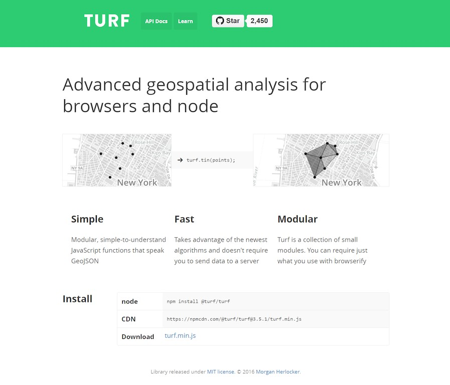

> [Turf.js](http://turfjs.org/) -- A JavaScript library for spatial data analysis. Turf.js is mainly designed for analyzing vector data set.

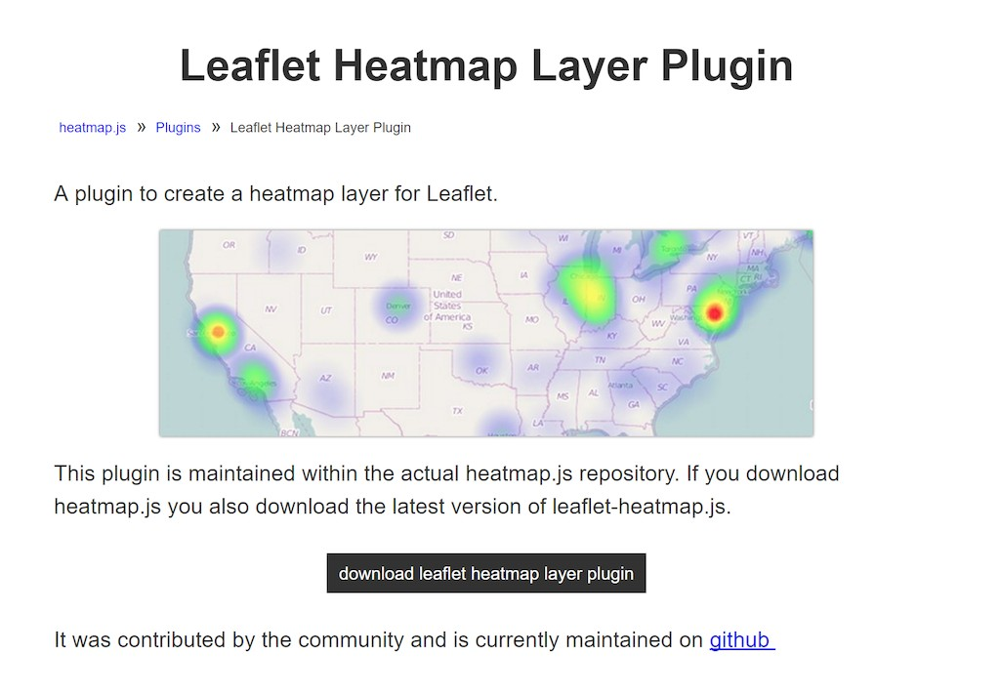

> [Making Heatmap using Leaflet.js](https://www.patrick-wied.at/static/heatmapjs/plugin-leaflet-layer.html)

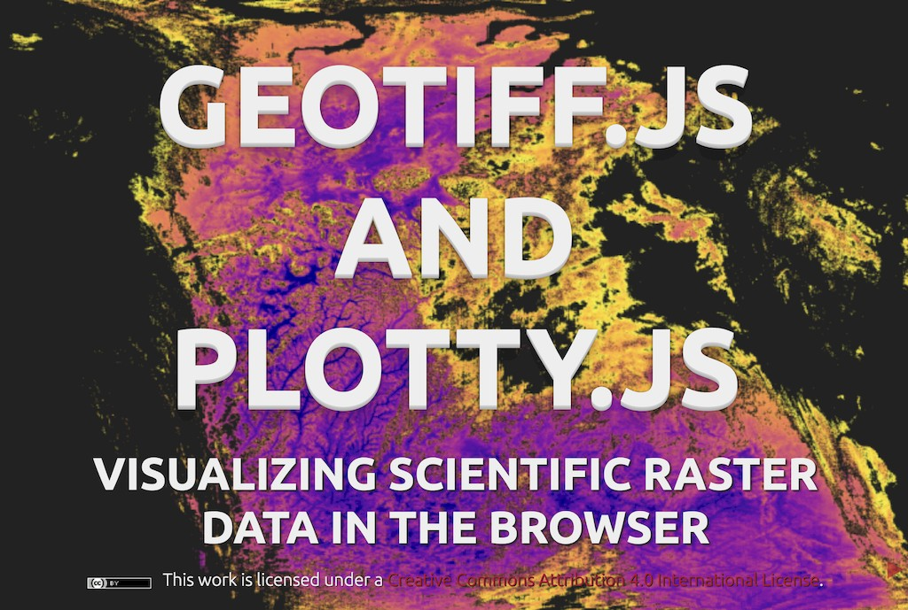

> You can also use Geotiff.js and Plotty.js to visual and analyze raster data. Check [here](https://constantinius.github.io/foss4g-geotiff.js-plotty.js/#/) for details.

### 2.2 Animated and real-time

Realtime maps show the situation of a phenomenon in close to realtime (only a few seconds or minutes delay). They are usually animated. Data is collected by sensors and the maps are generated or updated at regular intervals or on demand. Animated maps show changes in the map over time by animating one of the graphical or temporal variables. 

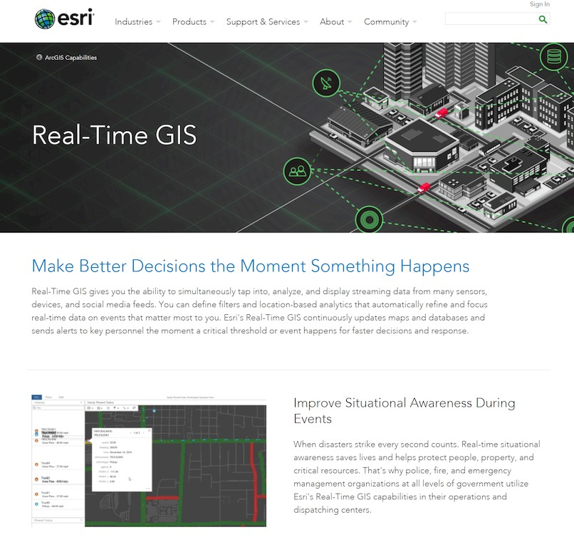

> Real -Time GIS supported by ArcGIS Event

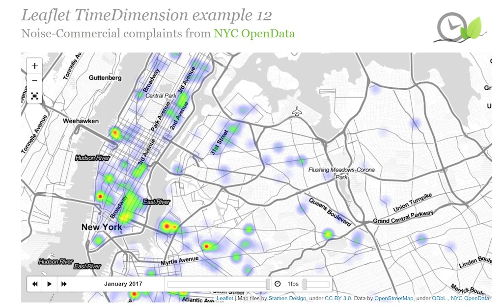

> [TimeDimension plugin for leaflet](http://apps.socib.es/Leaflet.TimeDimension/examples/example14.html)

### 2.3 Collaborative web maps

Collaborative maps are a developing potential. In proprietary or open source collaborative software, users collaborate to create and improve the web mapping experience, such as [OpenStreetMap](https://www.openstreetmap.org/), [WikiMapia](http://wikimapia.org/).

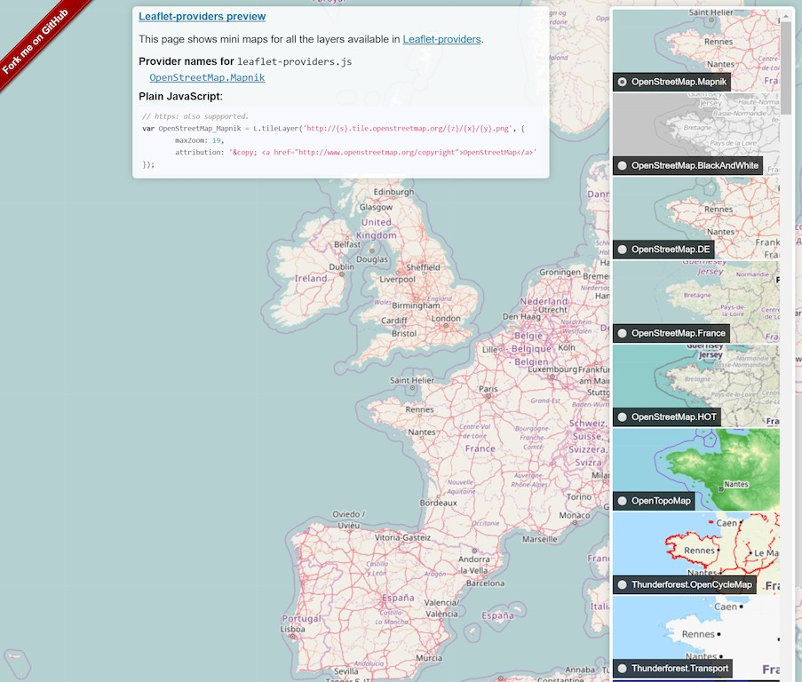

> [OpenStreetMap (a provider preview)](https://leaflet-extras.github.io/leaflet-providers/preview/)

### 2.4 Online atlases

The traditional atlas goes through a remarkably large transition when hosted on the web. Atlases can cease their printed editions or offer printing on demand. Some atlases also offer raw data downloads of the underlying geospatial data sources.

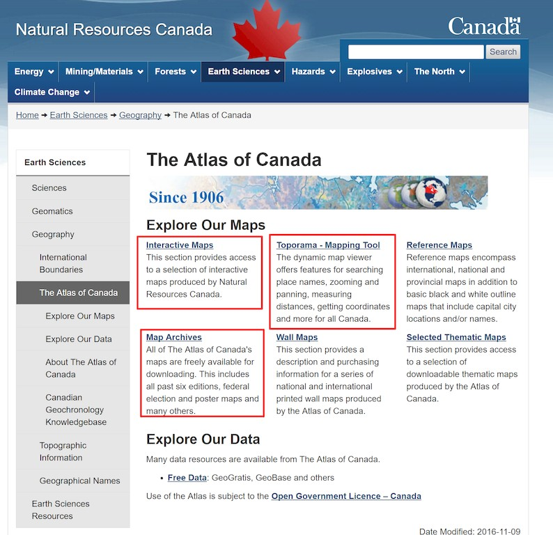

> [Online atlas of Canada](http://www.nrcan.gc.ca/earth-sciences/geography/atlas-canada)

### 2.5 Static web maps

Static web pages are view only without animation or interactivity. These files are created once, often manually, and infrequently updated. Typical graphics formats for static web maps are PNG, JPEG, GIF, or TIFF for raster files, SVG, PDF or SWF for vector files. These include scanned paper maps not designed as screen maps. 

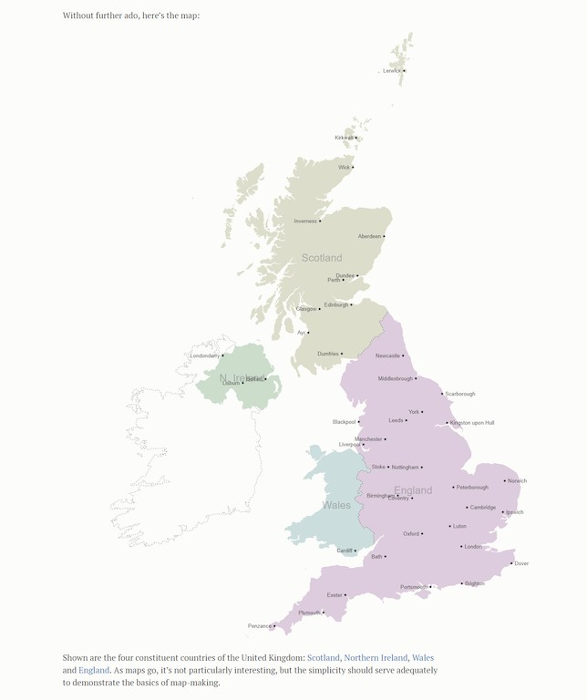

> A static web map made by D3 + TopoJSON, rendered by SVG (Mike Bostock 2012), check it out at [here](https://bost.ocks.org/mike/map/)

## 3. History of web mapping

This section contains some of the milestones of web mapping, online mapping services and atlases.

- 1989: Birth of the WWW, WWW invented for the exchange of research documents.

- 1993: **Xerox PARC Map Viewer**, The first mapserver based on `CGI/Perl`, allowed reprojection styling and definition of map extent. Map Viewer used a customized CGI server module written in Perl. Map images were generated in GIF format from two server side programs. MAP-WRITER created the raster images from the geographic database and RASTOGIF would convert the raster image into the GIF format.

  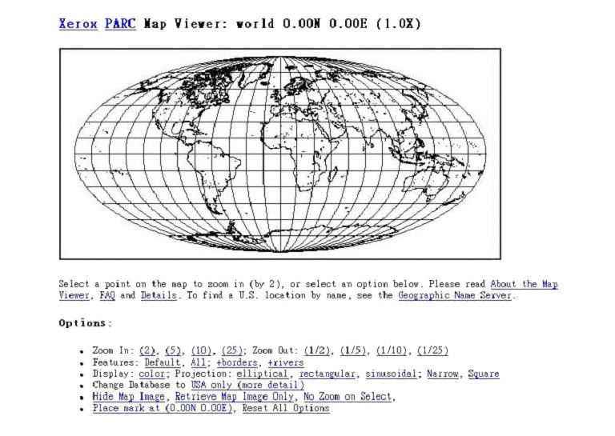

- 1994: The World Wide Earthquake Locator, the first interactive web mapping mashup was released, based on the Xerox PARC map view.

- 1994: The National Atlas of Canada, The first version of the National Atlas of Canada was released. Can be regarded as **the first online atlas**.

- 1995: The Gazetteer for Scotland, The prototype version of the Gazetteer for Scotland was released. The first geographical database with interactive mapping.

- 1995: **MapGuide**, First introduced as Argus MapGuide.

- 1996: Center for Advanced Spatial Technologies Interactive Mapper, Based on CGI/C shell/GRASS would allow the user to select a geographic extent, a raster base layer, and number of vector layers to create personalized map.

- 1996: **Mapquest**, The first popular online Address Matching and Routing Service with mapping output.

  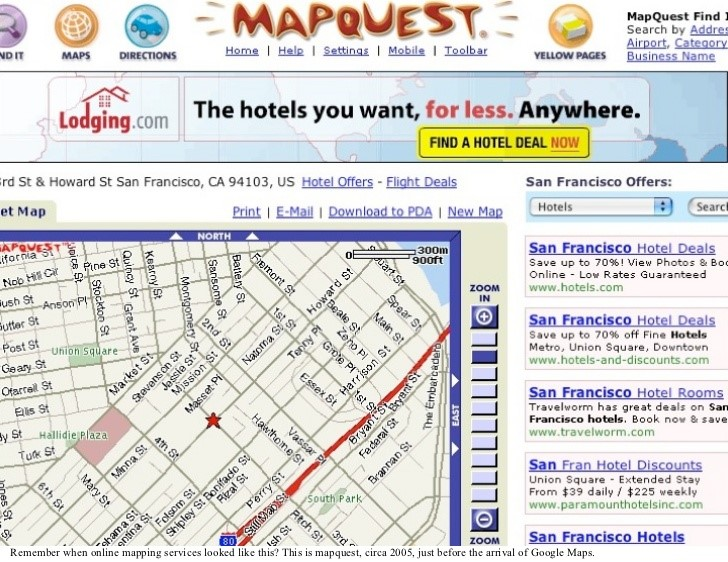

- 1996: MultiMap, The UK-based MultiMap website launched offering online mapping, routing and location based services. Grew into one of the most popular UK web sites.

- 1996: Geomedia WebMap 1.0, First version of Geomedia WebMap, already supports vector graphics through the use of ActiveCGM.

- 1996: MapGuide, Autodesk acquired Argus Technologies.and introduced Autodesk MapGuide 2.0.

- 1997: *US Online National Atlas Initiative*, The USGS received the mandate to coordinate and create the online National Atlas of the United States of America.

- 1997: **UMN MapServer 1.0**, Developed at the University of Minnesota (UMN) as Part of the NASA ForNet Project. Grew out of the need to deliver remote sensing data across the web for foresters.

- 1997: GeoInfoMapper - GeoInfo Solutions developed the first Java GIS Applet called 'JavaMap'. The application supported the export and conversion of MapInfo data for display in the thematic mapping tool for the web. GeoinfoMapper was demonstrated at the Victoria Computer Show in 1997 and referenced in the Universal Locator project at UC Berkeley School of Information.

- 1998: *Terraserver USA*, A Web Map Service serving aerial images (mainly b+w) and USGS DRGs was released. One of the first popular WMS. This service is a joint effort of USGS, Microsoft and HP.

- 1998: MapObjects Internet Map Server, ESRI's entry into the web mapping business.

- 1999: *National Atlas of Canada, 6th edition*, This new version was launched at the ICA 1999 conference in Ottawa. Introduced many new features and topics. Is being improved gradually, since then, and kept up-to-date with technical advancements.

- 2000: **ArcIMS 3.0**, The first public release of ESRI's ArcIMS.

  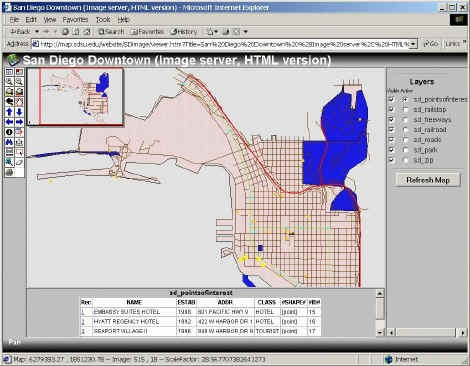

- 2000: ESRI Geography Network, ESRI founded Geography Network to distribute data and web map services.

- 2001: **GeoServer**, started by The Open Planning Project (TOPP), a non-profit technology incubator based in New York. TOPP was creating a suite of tools to enable open democracy and to help make government more transparent.

- 2001: **Tirolatlas**, A highly interactive online atlas, the first to be based on the SVG standard.

- 2002: **ArcIMS 4.0**, Version 4 of the ArcIMS web map server.

- 2003: **NASA World Wind**, NASA World Wind Released. An open virtual globe that loads data from distributed resources across the internet. 

  

- 2004: **OpenStreetMap**, an open source, open content world map founded by Steve Coast.

- 2005: **Google Maps**, The first version of Google Maps. Based on raster tiles organized in a quad tree scheme, data loading done with AJAX (Asynchronous JavaScript and XML).

- 2005: **UMN MapServer** introduced as open source by the Open Source Geospatial Foundation (OSGeo). UMN MapServer 4.6, Adds support for SVG.

  > **OSGeo**: The Open Source Geospatial Foundation (OSGeo) is a not-for-profit organization whose mission is to foster global adoption of open geospatial technology by being an inclusive software foundation devoted to an open philosophy and participatory community driven development. The foundation provides financial, organizational and legal support to the broader open source geospatial community.  
  >
  > **OSGeo sponsored Web mapping tools**: deegree, geomajas, GeoMOOSE, GeoServer, Mapbender, MapFish, MapGuide Open Source,  MapServer, OpenLayers, etc.

- 2005: **MapGuide Open Source** introduced as open source by Autodesk

- 2005: **Google Earth**, The first version of Google Earth was released building on the virtual globe metaphor. Terrain and buildings can be viewed 3 dimensionally. The KML (XML based) markup language allows users to integrate their own personal content. This virtual globe needs special software and doesn't run in a web browser.

- **2005: **[OpenLayers](https://openlayers.org/)**, the first version of the open source Javascript library OpenLayers.**

- 2006: **WikiMapia** Launched. Wikimapia is a privately owned open-content collaborative mapping project, that utilizes an interactive "clickable" web map with a geographically-referenced wiki system, with the aim to mark and describe all geographical objects in the world.

- **2009: [Harvard WorldMap](http://worldmap.harvard.edu/) is an online, open source mapping platform developed to lower barriers for scholars who wish to explore, visualize, edit, and publish geospatial information.**

  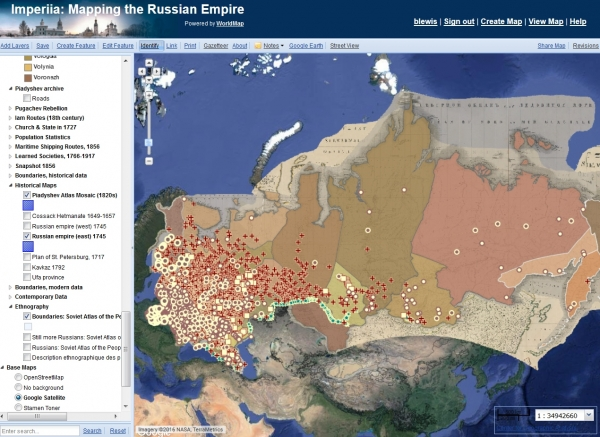

- 2009: Nokia makes *Ovi Maps* free on its smartphones.

- 2010: **MapBox** is founded. Mapbox is a large provider of custom online maps for websites such as Foursquare, Pinterest, Evernote, the Financial Times, The Weather Channel and Uber Technologies. Since 2010, it has rapidly expanded the niche of custom maps, as a response to the limited choice offered by map providers such as Google Maps and OpenStreetMap. Mapbox is the creator of, or a significant contributor to some open source mapping libraries and applications, including the MBTiles specification, the TileMill cartography IDE, the Leaflet JavaScript library, and the CartoCSS map styling language and parser.

  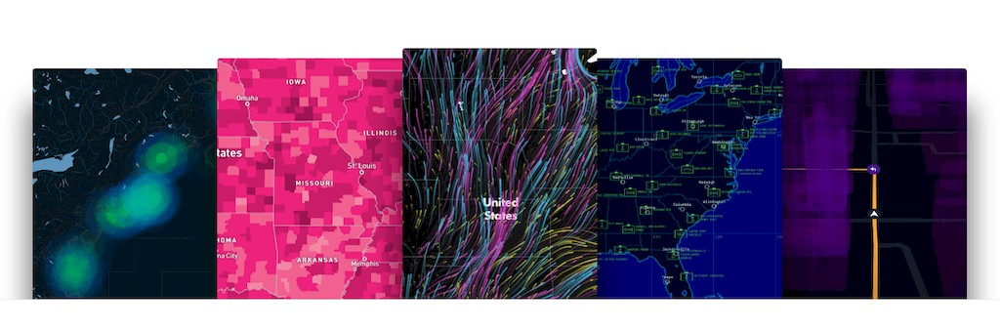

- 2011: **CARTO** (formerly CartoDB) is a Software as a Service (SaaS) **cloud computing** platform that provides GIS and web mapping tools for display in a web browser. 

  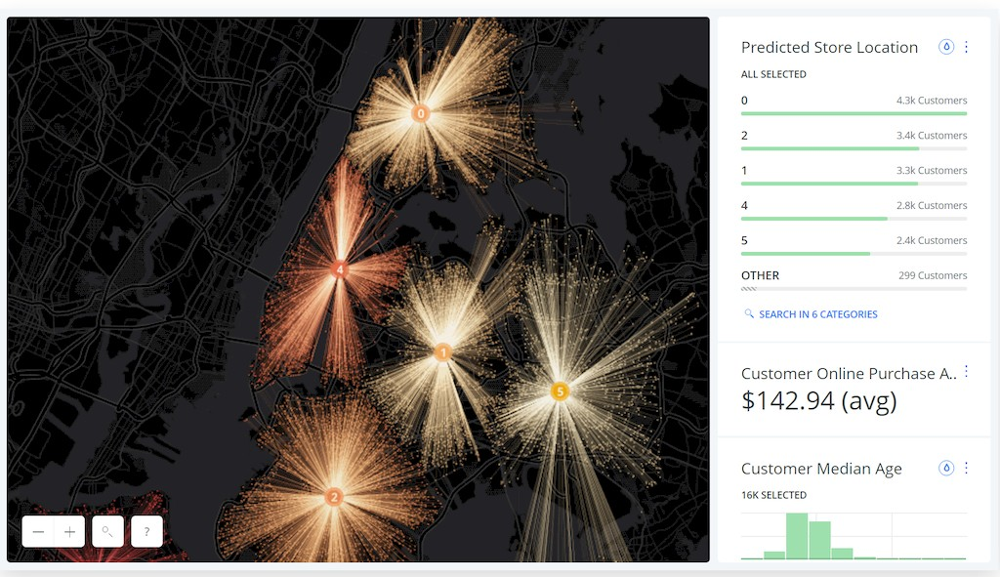

- 2011: **Leaflet**, the initial release, an open-source JavaScript libraryfor **mobile-friendly** interactive maps.

  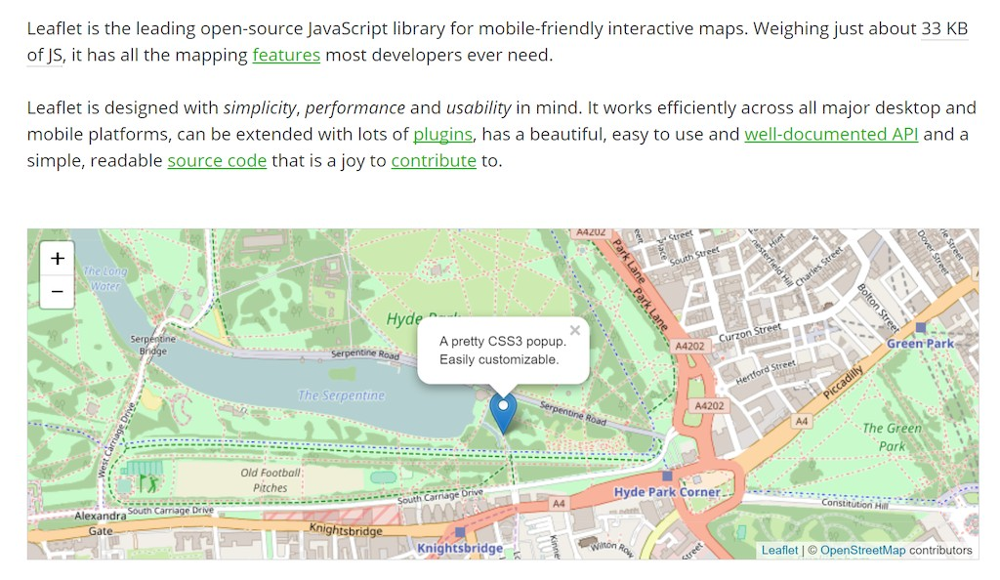

- 2011: **Cesium**, an open-source JavaScript library for world-class **3D** globes and maps, enable users to create the leading 3D globe and map for static and time-dynamic content.

  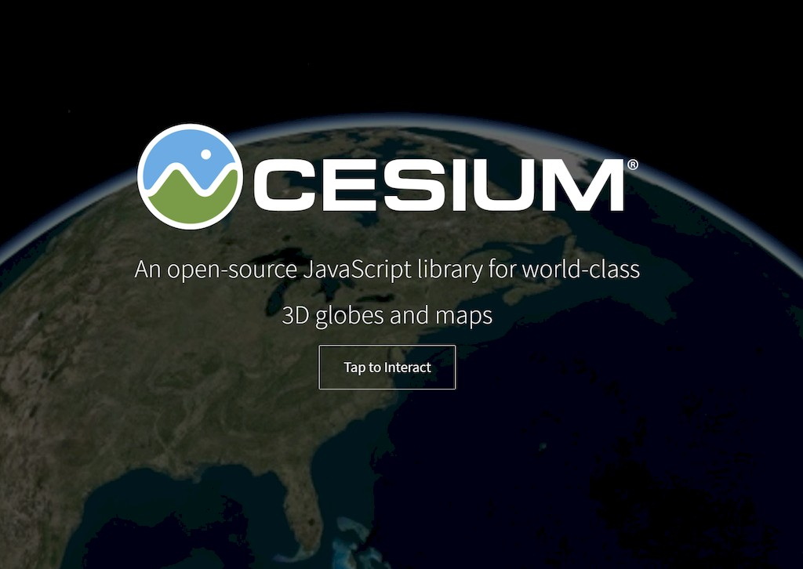

- 2012: Apple removes Google Maps as the default mapping app and replaces it with its own mapping app.

- 2013: MapBox announces Vector Tiles for MapBox Streets.

## 4. Web mapping API

An API (Application Program Interface) is a framework that you can use to write a program. It provides a set of classes and functions that help you avoid writing all the low-level code to perform specific actions. For example, web mapping APIs typically include classes for maps and layers so that you don't have to write all the low-level code for displaying an interactive map image and drawing a new layer on it. Instead, you can just create a new map object, create a new layer object, and call some method such as `map.addLayer` (layer). The API abstracts the complexity of the task and makes it easy for you to focus on the mapping aspects of your application, rather than spending time on the low-level logistics.

APIs designed specifically for the purpose of making web maps include OpenLayers, Leaflet, the Google Maps API, and the ArcGIS API for JavaScript. The latter two are even more specific in that they are designed around particular proprietary/commercial platforms. This lesson introduces some of the different APIs and application development approaches, then gets into detail on how to use the OpenLayers API.

### 4.1 Open Source

**OpenLayers**

OpenLayers is a mature and richly featured JavaScript API for building web map applications. It has an extensive collection of documentation and samples, although some of the materials can be difficult for beginners to grasp. One of nicest things about OpenLayers is the large developer community using the API. This community has created a mass of tips and examples on forums such as **GIS Stack Exchange**. 

**Leaflet**

Leaflet is a younger web mapping API that is designed to be lightweight, mobile-friendly, and easy to get started with. It places heavy emphasis on the use of tiled maps and client-side vector graphics drawn from sources such as GeoJSON. For basic maps that use these layer types, Leaflet is an excellent choice that has already endeared itself to many GIS developers.

**D3**

D3 is a Open source data visualization library that is frequently used for charting but also contains many map examples. It binds data elements to the page's document object model (DOM), allowing for interesting and flexible data animations and transitions. Although it has a steeper learning curve for newbies, D3 is a nice option for composing a web app with interactive maps and charts. It also offers examples for using non-Mercator projections.

> What else? Polymaps, ModestMaps, etc.

### 4.2 Proprietary

**Google Maps and Bing Maps APIs**

The Google Maps API gives developers the opportunity to overlay their own data on top of tiled map layers from Google Maps. The overlayed data is typically supplied through KML files, and is displayed as interactive vector graphics drawn on the client side. These graphics can be restyled by the developer to use custom marker symbols, and can be bound to popups or tables to show additional information on a mouse click.

Applications that use the Google Maps API for free must be publicly accessible and **not incur over 25,000 map loads per day for 90 consecutive days**. Organizations whose applications that do not meet this and other criteria must purchase a Google Maps API for Business license.

Microsoft's Bing Maps (link is external), another large commercial maps provider, offers APIs for web and mobile applications that are similar in scope to Google's. Like Google, Bing Maps offers a free usage tier and an enterprise license that must be purchased under various usage circumstances. 

**ArcGIS APIs**

Esri has created web mapping APIs that fit into its ArcGIS platform, some of which are relatively rich in function compared to the Google Maps API and many of the FOSS APIs. The APIs support multiple languages and platforms, such as JavaScript, Flex, Silverlight, iOS, and Android. In theory, they are roughly equal in functionality, although, in practice, they have matured and thrived at different levels. The ArcGIS API for JavaScript (link is external) is one of the most fully featured and actively developed of these APIs.

The ArcGIS APIs are primarily designed to work with web services that you have published using ArcGIS Online, Portal for ArcGIS (link is external), or ArcGIS for Server. 

>The APIs are free to use for development or educational use, but require a fee if you are selling the application or embedding advertising within it.

## References:

[1] http://maptimeboston.github.io/web-maps-101/

[2] Kraak, Menno Jan (2001) [*Settings and needs for web cartography*](http://icaci.org/files/documents/ICC_proceedings/ICC2005/htm/pdf/oral/TEMA11/Session%205/MICHAEL%20BLACK.pdf), in: Kraak and Allan Brown (eds), Web Cartography, Francis and Taylor, New York, p. 3–4. see also webpage. Accessed 2007-01-04.

[3] https://en.wikipedia.org/wiki/Web_mapping

[4] http://www.geog.ucsb.edu/~good/176c/pindefu.pdf