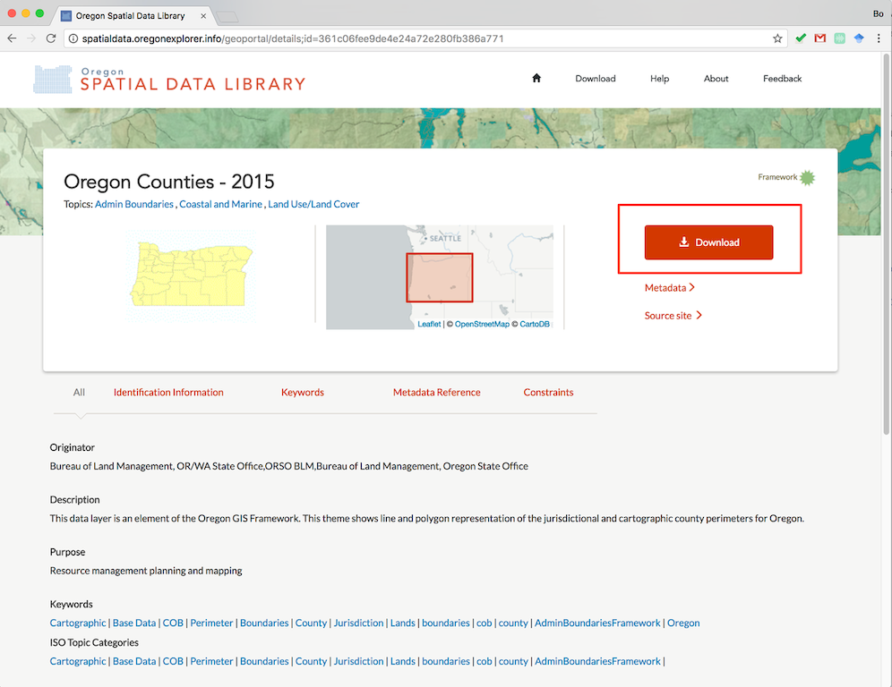
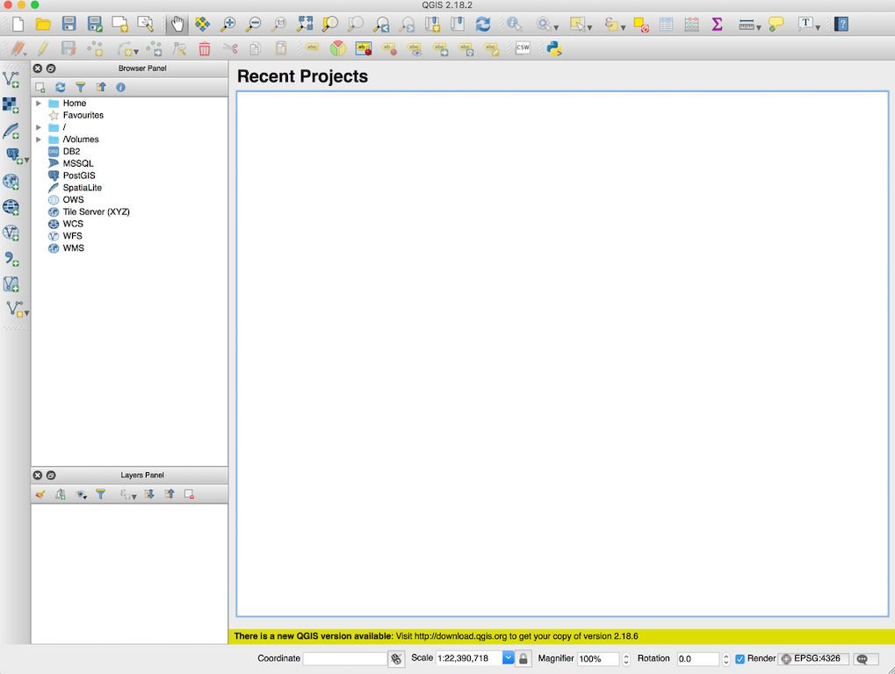
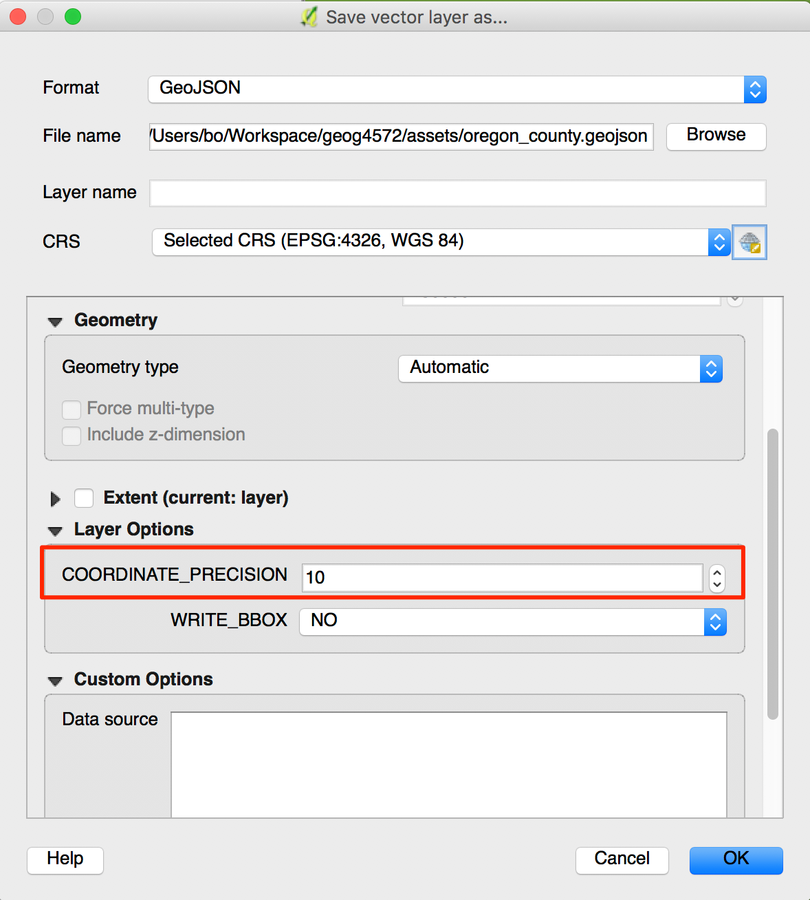
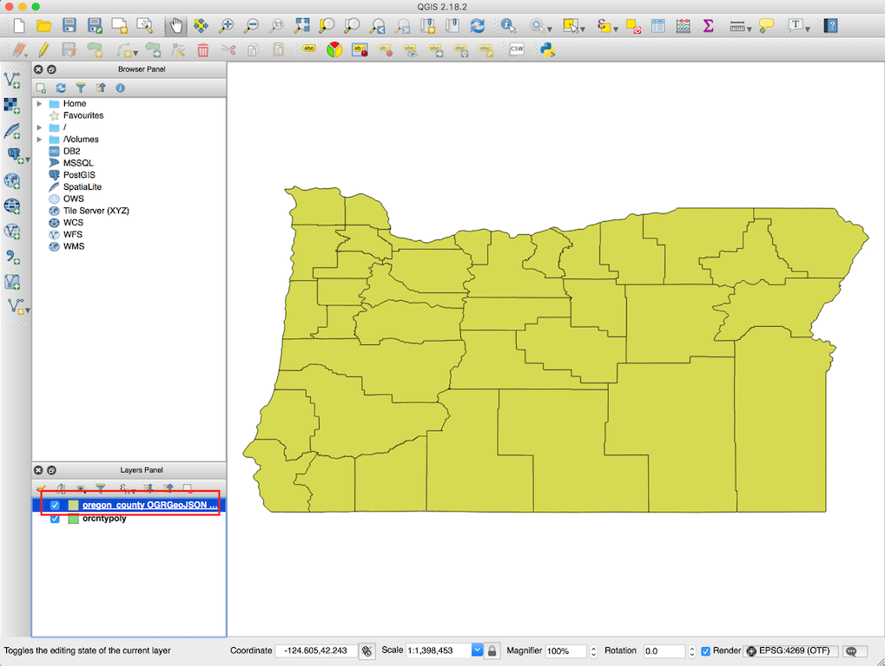
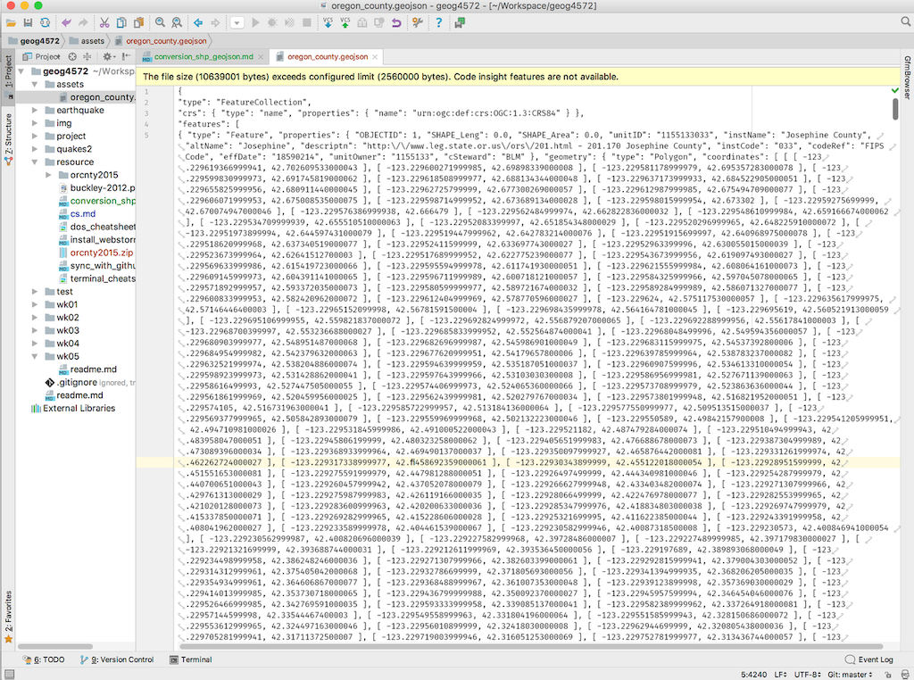
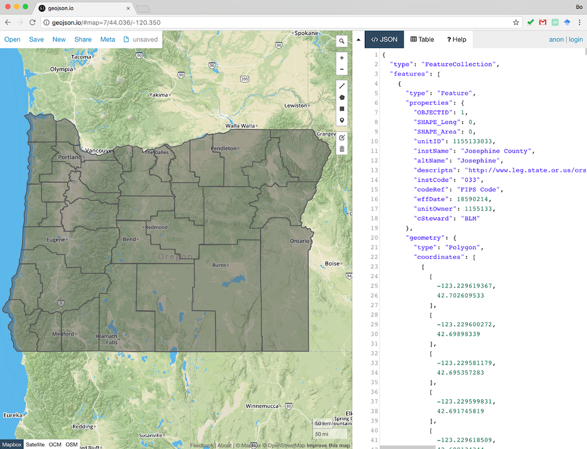

# Convert Shapefile to Geojson

> Fall 2017 | Geography 371 | Geovisualization: Web Mapping
>
> **Instructor:** Bo Zhao | **Location:** WLKN 235 | **Time:** MWF 1200 - 1250

Geojson is one of the most popular geospatial data format for web based geovisualization. This tutorial will show you how to convert a shapefile to a geojson data step by step. Though there are multiple online or desktop based tools we could implement the conversion. Here, we would recommend using QGIS, mainly because it is intuitive to understand the conversion process and easy to use. Once you are familiar with QGIS, I believe you will be more confident in switching to other geospatial data conversion tools (e.g., ogr2ogr).

1\. Above all, we need to get some geospatial data to our pocket. So, we download the Oregon Counties (2015) from the data repository at [oregon explorer](http://oregonexplorer.info/data). This specific data set is located at [http://spatialdata.oregonexplorer.info/geoportal/details;id=361c06fee9de4e24a72e280fb386a771](http://spatialdata.oregonexplorer.info/geoportal/details;id=361c06fee9de4e24a72e280fb386a771). There is another copy of this data set in this repository at [assets/orcnty2015.zip](assets/orcnty2015.zip).

2\. Press the download button to download the data, and unzip the file. you will see two sets of data, in terms of orcntyline and orcntypoly. In this tutorial, we will use the orcntpoly dataset.

The breakdown is as follows:

Mandatory files

**.shp** — shape format; the feature geometry itself
**.shx** — shape index format; a positional index of the feature geometry to allow seeking forwards and backwards quickly
**.dbf** — attribute format; columnar attributes for each shape, in dBase IV format

Other common files

**.prj** — projection format; the coordinate system and projection information, a plain text file describing the projection using well-known text format
**.sbn and .sbx** — a spatial index of the features

source: (https://en.wikipedia.org/wiki/Shapefile)

We are going to transform this current 7 file folder into a single, compact format called GeoJSON (http://geojson.org/). Geojson differs from a shapefile in a few ways. The first is that GeoJSON is an open standard format.

3\. Open QGIS.

4\. A shapefile is a vector file format. We will add our shapefile to our project through the 'Add Vector Layer'. Everything in the Source type dialogue can be left as is. Use the browser to navigate to the location of your shapefile. Click open to load the shapefile into QGIS.

5\. In a new QGIS project, a great first question is what map projection is our shapefile in? Double click on the shapefile in the Table of Contents to pull up the Properties Dialogue Box. In the General tab, under 'Coordinate reference system' you will see a value `EPSG:4269, NAD83` representing our map projection.

For our purposes we will convert our shapefile into a GeoJson and into a geographic projection for web mapping. EPSG is a coded value that is used to identify certain projections, which in this case is 4269. We want to convert this to 4326, WGS84, a more suitable web mapping projection.

6.\ Close the Layer Properties page, and then Right click on the shapefile `orcntypoly` in the Table of Contents, and click Save as.

7\. In the Save As dialogue, switch the format to GeoJson. Then click the small globe-ish icon to the right of the CRS drop down option. Enter '4326' in the Filter box and select EPSG: 4326. Click OK.

>**Note:** in order to reduce the size of geospatial data, you can change the coordinate precision. To do that, in the `Layer Options` Section, Please change the precision value to a smaller number. In our case, we use 10 instead of 15.

 

8\. Browse to your location and save the file. There is a copy of the geojson data in this repository at [assets/oregon_county.geojson](assets/oregon_county.geojson).

9\. The file will be automatically added to the current project view.

10\. Now you can open the geojson file in a text editor (e.g., webstorm) to view the json structure.

11\. And also you can validate the data on [http://www.geojson.io](http://www.geojson.io).

Now we have a single geojson file opposed to a complicated shapefile structure, and a geojson file in a more appropriate for web based geovisualization.

Reference:

[1] https://gist.github.com/YKCzoli/b7f5ff0e0f641faba0f47fa5d16c4d8d