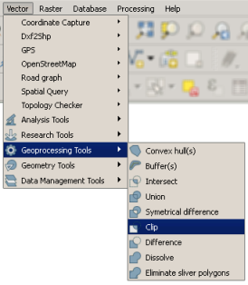
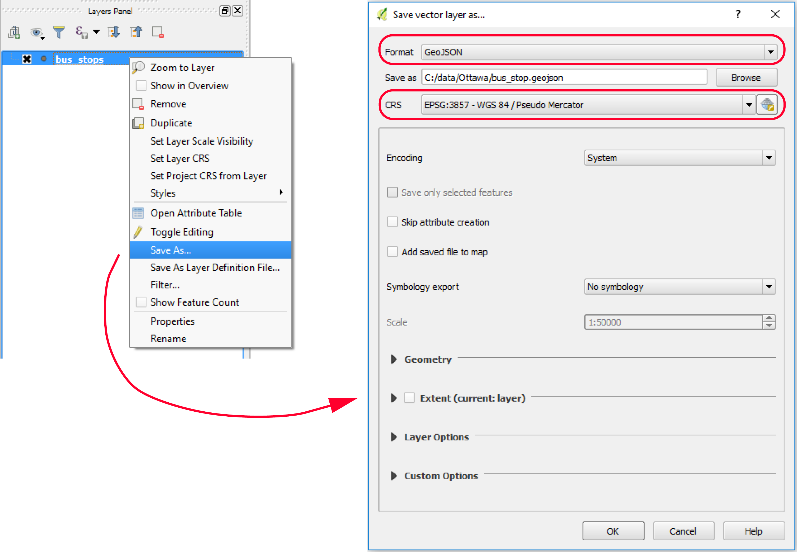
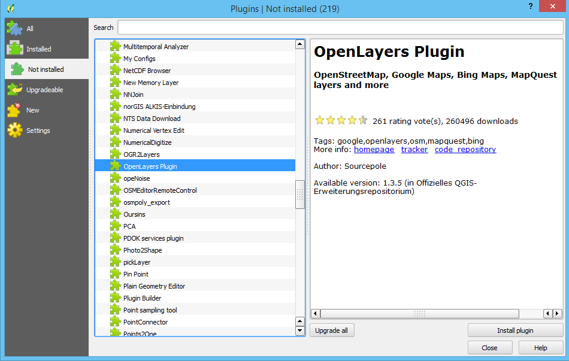

# Processing spatial data with FOSS

Imagine you've identified some spatial data to use in your web map, but the data doesn't quite fit your purposes yet. It covers a broader region than your study area, and you want it to be in a different projection. Maybe you have a raster DEM that you need to convert into a hillshade, or perhaps you want to interpolate some raster surfaces that you can use in a time series animation. Indeed, a large portion of your datasets will probably need some kind of preprocessing before you incorporate them into your web map.

In these situations, you need to:

- identify the FOSS tools that can help you do the data processing;
- learn how to use the tools successfully;
- take notes on what you did so that you remember how to do it in the future!

If you're accustomed to a proprietary GIS software package that contains hundreds of tools and uniform documentation out of the box, it may seem frustrating to move to FOSS. Cobbling together a range of tools and collecting bits of pieces of documentation may seem like a waste of precious time. This is the tradeoff that you make when you use free software. Fortunately, the number of operations to learn is finite, and most of the time you'll probably be doing one of a dozen or fewer common actions, such as selecting data, projecting, clipping, and buffering. After you've learned how to do these once, you can go back and repeat the steps with any dataset, *especially if you have taken good notes*. Also, scripting these actions or running them in batch may require less overhead and processing time than you experience with proprietary software.

This is not a course about spatial data processing; however, this particular lesson attempts to give you some experience doing data processing with FOSS. You will learn a few resources for addressing data processing, and you'll get a feel for how to approach new tools.

### Tools you will use in this course for data processing

In this course, you'll use QGIS and its associated plugins as a GUI tool for data processing. You will also learn how to use the GDAL and OGR command line utilities. These are explained in more detail below.

#### QGIS

QGIS offers a lot of the most common vector and raster processing tools out of the box. Additionally, developers in the QGIS user community have contributed plugins that can extend QGIS functionality.

Open QGIS and explore the **Vector** menu to see some of the operations for processing vector data. You'll notice tools for merging, summarizing, intersecting, buffering, clipping, and more.

Some of the most powerful options are hidden in the **Save As...** context menu item when you right-click a vector layer. The *Save As* dialog box allows you to convert data between different formats (for example, convert a shapefile to GeoJSON) and reproject the data to a new coordinate system.

Now, go back up to the top of the QGIS screen and click the **Raster** menu to see some of the options for processing rasters. Notice that you can warp, clip, contour, and interpolate to raster formats, along with various other operations.

In addition to these common vector and raster processing options, the **Processing > Toolbox **menu at the top of the QGIS screen gives you a dockable side window with access to many additional functions, some of them more obscure than others. This toolbox is akin to the full "ArcToolbox" that you see in Esri software. One of the more common "algorithms" (as they are called in QGIS) that I use in this toolbox is **Create graticule**, which can create square or hexagon lattices for cartographic "binning" or in other words, aggregation to uniformly shaped regions in order to get a better visualization of a point pattern. Creating a lattice of hexagons is a task not easy to do by hand, and is well-suited to a pre-canned tool.

If you don't see what you're looking for in any of the above locations, someone may have developed a plugin for it. QGIS comes with a few of the more useful plugins already installed. Click **Plugins > Manage And Install Plugins** to see what they are. Here you can disable some of these plugins if you don't like them getting in the way.

If you want to add more plugins, you can do it directly from this dialog box by clicking **Not installed**. Do this now, and examine the descriptions of some of the plugins you can add (the list may vary from what you see below).

You can even pick one and install it if you like. The OpenLayers plugin shown above is a handy way to see OpenStreetMap, Google Maps, etc. in QGIS. Be aware that the quality and usability of the plugins may vary.

#### GDAL and OGR utilities

Many spatial data processing functions use well-known logic or documented algorithms. It would cause extra tedious work and possibly introduce errors and inconsistency if every FOSS developer had to code these same operations from scratch. Therefore, many FOSS programs take advantage of a single open source code library called GDAL (Geospatial Data Abstraction Library) to perform the most common functions.

GDAL is most commonly thought of as a raster processing library. But within GDAL is an important repository of vector processing functions called the OGR Simple Features Library. You will hear the terms GDAL and OGR many times as you work with FOSS, so get used to them. You can thank a man named [Frank Warmerdam(link is external)](https://plus.google.com/110849704966597917580/posts) for initiating and maintaining these libraries over time. Although you may have never heard of him, you've probably done something to run his code at one point or another.

One way to use GDAL and OGR is by launching functions from QGIS or some other GUI-based program, like you would get from the menu options pictured above. Another way is to write code in Python, C#, or some other language that calls directly into these libraries. A third way, which lies in the middle in terms of complexity and flexibility, is to call into GDAL and OGR using command line utilities. These utilities were installed for you when you installed QGIS. You will get a feel for them in the lesson walkthrough.

#### Other tools

There are many other FOSS tools out there for wrangling spatial data; new ones appear all the time. Later in this course you'll be required to find one, test it out, review it, and share it with the class. Be an explorer, and if you find something that works for you, stick with it. You can certainly use any FOSS tool that works for you in order to complete the term project.

## References

https://www.e-education.psu.edu/geog585/node/693