# Map Server II: Styling

> Fall 2017 | Geography 371 | Geovisualization: Web Mapping
>
> **Instructor:** Bo Zhao | **Location:** WLKN 235 | **Time:** MWF 1200 - 1250

**Learning Objectives**

- Sync data to web server via GitHub;
- Get to know the basic syntax of Styled Layer Descriptor (SLD);
- Able to read, debug/validate and edit a sld file;
- Able to style a layer using GeoServer.  

GeoServer can render geospatial data as images and return them for viewing in a browser. However, geospatial data has no inherent visualization. Therefore additional information, in the form of a style, needs to be applied to data in order to visualize it. We have already seen automatic/generic styles in action with the layers loaded in previous sections. In this section, we will discuss the map style format and how those styles are generated.  

## Preparation

Before get started, we will synchronize some files to GeoServer. If your GeoServer is installed in your local computer, you can just simply put the data in a directory under your workspace, if the GeoServer is on a remote Server such as the compute engine in Google Cloud, we can upload the data through FTP or GitHub. Today, we would like to talk about how to synchronize data from GitHub to a GeoServer, no matter it is deployed locally or remotely.

1\. Please make sure the machine which hosting GeoServer has installed a shell program `git`. Type `git` in command prompt or terminal to see whether `git` is installed or not. If not, you need follow an instruction at https://git-scm.com/book/en/v2/Getting-Started-Installing-Git to install `git`. Usually, a Linux Server, such as your Google Cloud Server, has installed `git` by default. 

> **Git** is a version control system (VCS) for tracking changes in computer files and coordinating work on those files among multiple people. It is primarily used for software development, but it can be used to keep track of changes in any files. Git was created by **Linus Torvalds** in 2005 for development of the Linux kernel, with other kernel developers contributing to its initial development.
>
> **GitHub** is a web-based Git or version control repository and Internet hosting service. GitHub offers both plans for private and free repositories on the same account which are commonly used to host open-source software projects. As of April 2016, GitHub reports having more than 14 million users and more than 35 million repositories, making it the largest host of source code in the world.

If `git` is properly installed, type `git` in command prompt or terminal will show the following information on the window. 	

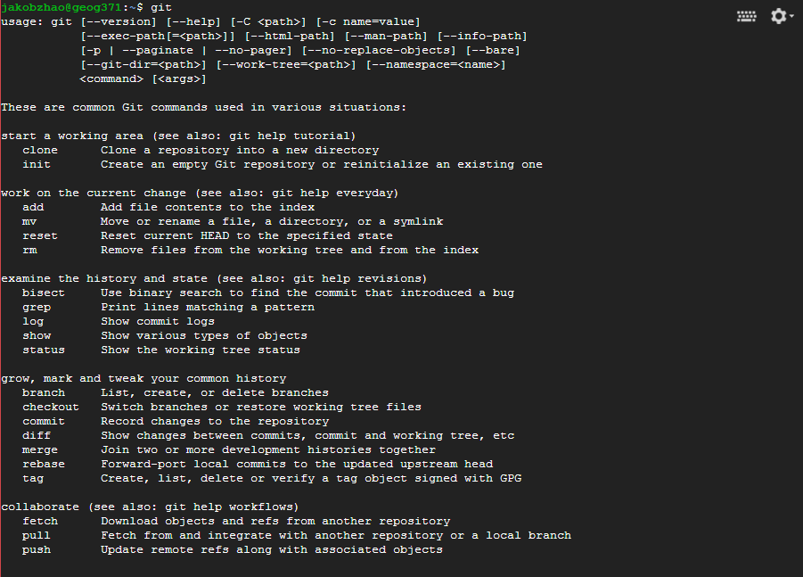

2\. In the course material, the data for today's use is in the folder of this lecture.

```url
https://github.com/jakobzhao/geog371.git
```

3\. Access your server via `SSH` if it is remotely deployed, or via Terminal or Command Prompt if it is deployed locally. If you are on a Linux Server, you can create and enter a workspace using the following codes:

```powershell
cd ~
mkdir Workspace
cd Workspace
```

4\. Navigate to your workspace by the command `cd`. In your working directory, please type the following command to synchronize the lecture material from GitHub.

```powershell
cd ~/Workspace
sudo git clone https://github.com/jakobzhao/geog371.git
```


5\. After successfully synced the material, you will see them in a sub-directory named **geog371/lec11/**, which contains the lecture material for today.

```powershell
bo@bo-nuc:~/Workspace/geog371/lectures/lec11$ tree
.
├── assets
│   ├── cities.cpg
│   ├── cities.dbf
│   ├── cities.prj
│   ├── cities.qpj
│   ├── cities.shp
│   ├── cities.shx
│   ├── globe.tif
│   ├── ore_counties.cpg
│   ├── ore_counties.dbf
│   ├── ore_counties.prj
│   ├── ore_counties.qpj
│   ├── ore_counties.shp
│   ├── ore_counties.shx
│   ├── qgis_county.sld
│   ├── geoserver-style.qgs
├───── img
├── LICENSE
└── readme.md

2 directory, 45 files
```

> **note:** in order to browse the files under a directory. you will use the command `tree`. If you are in a windows or mac os system, you will have `tree` command by default. For some server system which does not go with a `tree` command, you need to install it by the following command in the terminal: `sudo apt-get install tree`. Then, navigate to the subdirectory `geog371/lectures/lec11`, and type `tree`,  you will see the above file tree of the subdirectory.

## 1. Styled Layer Descriptor

GeoServer uses the Styled Layer Descriptor (`SLD`) markup language to visualize geospatial data. SLD is an XML-based standard created by the Open Geospatial Consortium (`OGC`). For more information on the SLD schema, please see the OGC page on Styled Layer Descriptor at http://www.opengeospatial.org/standards/sld.

###  1.1 Viewing an SLD

GeoServer saves SLD information as plain text files in its data directory. These styles can be retrieved through the `geoserver.webadmin`.

1. Click the `Styles` link under `Data` on the left side of the page.

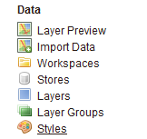

Click to go to the Styles page

2. Click the entry in the list called `point`.

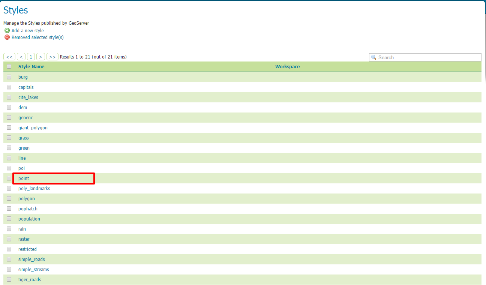

>  The "point" style

3. This brings up the Style Editor for this particular style. While we won't be editing this style now, take a look at it and refer back to it through the next few sections.

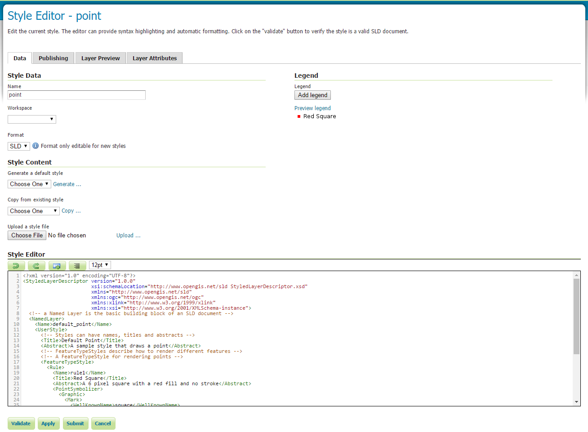

>  Viewing the "point" style

### 1.2 SLD structure

An SLD file contains the following hierarchical structure:

* Header

  * FeatureTypeStyles

    * Rules

      * Symbolizers

The header of the SLD contains metadata about XML namespaces, and is usually identical among different SLDs. The details of the header are beyond the scope of this workshop. 

A **FeatureTypeStyle** is a group of styling rules. (Recall that a `featuretype` is another word for a `layer`.)  Grouping by FeatureTypeStyle affects rendering order; the first FeatureTypeStyle will be rendered first, followed by the second, etc, allowing for precise control of drawing order.

A **Rule** is a single styling directive. It can apply globally to a layer, or it can have logic associated with it so that the rule is conditionally applied. These conditions can be based on the attributes of the data or based on the scale (zoom) level of the data being rendered.

A **Symbolizer** is the actual style instruction. There are five types of symbolizers:

* PointSymbolizer
* LineSymbolizer
* PolygonSymbolizer
* RasterSymbolizer
* TextSymbolizer

There can be one or more FeatureTypeStyles per SLD, one or more Rules per FeatureTypeStyles, and one or more Symbolizers per Rule.

### 1.3 Simple SLD


The point style draws a simple 6-pixel red circle for each feature in a given layer.

```xml
<?xml version="1.0" encoding="UTF-8"?>
<StyledLayerDescriptor version="1.0.0" 
                       xsi:schemaLocation="http://www.opengis.net/sld StyledLayerDescriptor.xsd" 
                       xmlns="http://www.opengis.net/sld" 
                       xmlns:ogc="http://www.opengis.net/ogc" 
                       xmlns:xlink="http://www.w3.org/1999/xlink" 
                       xmlns:xsi="http://www.w3.org/2001/XMLSchema-instance">
  <!-- a Named Layer is the basic building block of an SLD document -->
  <NamedLayer>
    <Name>default_point</Name>
    <UserStyle>
      <!-- Styles can have names, titles and abstracts -->
      <Title>Default Point</Title>
      <Abstract>A sample style that draws a point</Abstract>
      <!-- FeatureTypeStyles describe how to render different features -->
      <!-- A FeatureTypeStyle for rendering points -->
      <FeatureTypeStyle>
        <Rule>
          <Name>rule1</Name>
          <Title>Red Circle</Title>
          <Abstract>A 6 pixel square with a red fill and no stroke</Abstract>
          <PointSymbolizer>
            <Graphic>
              <Mark>
                <WellKnownName>circle</WellKnownName>
                <Fill>
                  <CssParameter name="fill">#FF0000</CssParameter>
                </Fill>
              </Mark>
              <Size>6</Size>
            </Graphic>
          </PointSymbolizer>
        </Rule>
      </FeatureTypeStyle>
    </UserStyle>
  </NamedLayer>
</StyledLayerDescriptor>
```

The first 11 lines are the header, which contain XML namespace information, as well as the Name and Title of the SLD. The actual styling happens inside the `<FeatureTypeStyle>` tag (**lines 17-34**), of which there is only one in this example. The tag contains one `<Rule>` (**lines 18-33**) and the rule contains one symbolizer, a `<PointSymbolizer>` (**lines 22-32**). The symbolizer directive creates a graphic mark of a "well known name", in this case a circle (**line 25**). This shape has a `<Fill>` parameter of #FF0000 (**line 27**), which is an RGB color code for 100% red. The shape also has a `<Size>` of 6 (**line 30**), which is the diameter of the circle in pixels.

When applied to a hypothetical layer, the result would look like this:

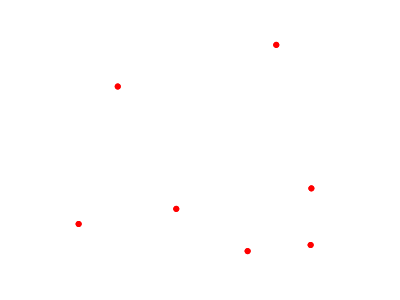

>  Simple style applied to a layer
>
>  Access the layer at [http://mapious.ceoas.oregonstate.edu/geoserver/mapious/wms?service=WMS&version=1.1.0&request=GetMap&layers=mapious:cities&styles=&bbox=-175.22056447761656,-41.29997393927641,179.21664709402887,64.15002361973922&width=768&height=330&srs=EPSG:4326&format=application/openlayers](http://mapious.ceoas.oregonstate.edu/geoserver/mapious/wms?service=WMS&version=1.1.0&request=GetMap&layers=mapious:cities&styles=&bbox=-175.22056447761656,-41.29997393927641,179.21664709402887,64.15002361973922&width=768&height=330&srs=EPSG:4326&format=application/openlayers)

### 1.4 Another SLD example

Here is an example of an SLD that includes attribute-based styling. The SLD also contains three rules. Each rule has an attribute-based condition, with the outcome determining the size of the shape being rendered. The attribute in question is called "pop2015", and the three rules are "**less than 5000**", "**5000 to 10000**", and "**greater than 10000**". The result is a blue circle with a size of 8, 12, of 16 pixels, depending on the rule.

| Rule name | Population (“pop2015”) | Size (pixels) |
| --------- | ---------------------- | ------------- |
| SmallPop  | Less than 5,000 k      | 8             |
| MediumPop | 5,000k to 10,000k      | 12            |
| LargePop  | Greater than 10,000k   | 16            |

```xml
<?xml version="1.0" encoding="ISO-8859-1"?>
   <StyledLayerDescriptor version="1.0.0" 
    xsi:schemaLocation="http://www.opengis.net/sld StyledLayerDescriptor.xsd" 
    xmlns="http://www.opengis.net/sld" 
    xmlns:ogc="http://www.opengis.net/ogc" 
    xmlns:xlink="http://www.w3.org/1999/xlink" 
    xmlns:xsi="http://www.w3.org/2001/XMLSchema-instance">
     <NamedLayer>
       <Name>Attribute-based point</Name>
       <UserStyle>
         <Title>Attribute-based point</Title>
         <FeatureTypeStyle>
           <Rule>
             <Name>SmallPop</Name>
             <Title>1 to 5000k</Title>
             <ogc:Filter>
               <ogc:PropertyIsLessThan>
                 <ogc:PropertyName>POP2015</ogc:PropertyName>
                 <ogc:Literal>5000</ogc:Literal>
               </ogc:PropertyIsLessThan>
             </ogc:Filter>
             <PointSymbolizer>
               <Graphic>
                 <Mark>
                   <WellKnownName>circle</WellKnownName>
                   <Fill>
                     <CssParameter name="fill">#0033CC</CssParameter>
                   </Fill>
                 </Mark>
                 <Size>8</Size>
               </Graphic>
             </PointSymbolizer>
           </Rule>
           <Rule>
             <Name>MediumPop</Name>
             <Title>5000k to 10000k</Title>
             <ogc:Filter>
               <ogc:And>
                 <ogc:PropertyIsGreaterThanOrEqualTo>
                   <ogc:PropertyName>POP2015</ogc:PropertyName>
                   <ogc:Literal>5000</ogc:Literal>
                 </ogc:PropertyIsGreaterThanOrEqualTo>
                 <ogc:PropertyIsLessThan>
                   <ogc:PropertyName>POP2015</ogc:PropertyName>
                   <ogc:Literal>10000</ogc:Literal>
                 </ogc:PropertyIsLessThan>
               </ogc:And>
             </ogc:Filter>
             <PointSymbolizer>
               <Graphic>
                 <Mark>
                   <WellKnownName>circle</WellKnownName>
                   <Fill>
                     <CssParameter name="fill">#0033CC</CssParameter>
                   </Fill>
                 </Mark>
                 <Size>12</Size>
               </Graphic>
             </PointSymbolizer>
           </Rule>
           <Rule>
             <Name>LargePop</Name>
             <Title>Greater than 10000k</Title>
             <ogc:Filter>
               <ogc:PropertyIsGreaterThanOrEqualTo>
                 <ogc:PropertyName>POP2015</ogc:PropertyName>
                 <ogc:Literal>10000</ogc:Literal>
               </ogc:PropertyIsGreaterThanOrEqualTo>
             </ogc:Filter>
             <PointSymbolizer>
               <Graphic>
                 <Mark>
                   <WellKnownName>circle</WellKnownName>
                   <Fill>
                     <CssParameter name="fill">#0033CC</CssParameter>
                   </Fill>
                 </Mark>
                 <Size>16</Size>
               </Graphic>
             </PointSymbolizer>
           </Rule>
         </FeatureTypeStyle>
       </UserStyle>
     </NamedLayer>
   </StyledLayerDescriptor>
```

It is helpful to break the SLD down into components when it gets large. There are three rules in this style, all of which are contained inside of a single FeatureTypeStyle. Looking at the first rule (**lines 13-33**), there is a filter tag (`<ogc:Filter>`). This filter specifies that if the attribute value of `pop2015` for a given feature is less than 5000, then the condition is true and the feature is displayed. The second rule (**lines 34-60**) has a compound filter that specifies that the attribute value must be both greater than or equal to 5000 and less than 10000 in order for the feature to be rendered. Finally, the third rule (**lines 61-77**) has a filter that specifies that the attribute value must be greater that or equal to 10000 in order for the feature to be rendered.

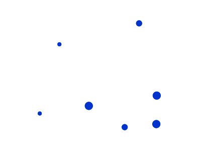

>  The result of the above style
>
>  Access the layer at [http://mapious.ceoas.oregonstate.edu/geoserver/mapious/wms?service=WMS&version=1.1.0&request=GetMap&layers=mapious:cities2&styles=&bbox=-175.22056447761656,-41.29997393927641,179.21664709402887,64.15002361973922&width=768&height=330&srs=EPSG:4326&format=application/openlayers](http://mapious.ceoas.oregonstate.edu/geoserver/mapious/wms?service=WMS&version=1.1.0&request=GetMap&layers=mapious:cities2&styles=&bbox=-175.22056447761656,-41.29997393927641,179.21664709402887,64.15002361973922&width=768&height=330&srs=EPSG:4326&format=application/openlayers)

**SLD Cookbook**

The GeoServer documentation (available at http://docs.geoserver.org) contains a collection of styles called the SLD Cookbook, designed for those wishing to learn SLD, or those who want a quick reference. The SLD Cookbook is available at [http://docs.geoserver.org/stable/en/user/styling/sld-cookbook/](http://docs.geoserver.org/stable/en/user/styling/sld-cookbook/). 

## 2. Styles in GeoServer

 Every layer published in GeoServer must have a style associated with it. When manually loading layers, GeoServer will look at the geometry of the data and assign a generic style based on that data type. 

### 2.1 Viewing an existing style

1. Navigate to the `Layers` list. Select a layer from the list of published layers. This example will use `ceoas:ore_counties`, but any layer will do.

2. Preview the layer to see its visualization by navigating to the `Layer Preview`, then clicking on the `OpenLayers` link next to that layer.

   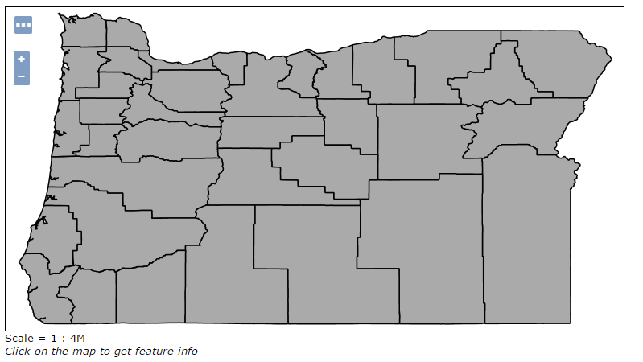

> Previewing the "ore_counties" layer

3. Leave this preview window open and open up a new browser tab. In the new tab, navigate back to the main page.

4. In order to view the SLD for this layer, we need to find out which style is associated with this layer. To do this, click on `Layers` under `Data` on the left side of the page, then click on the `Layer Name` link of `ore_counties`.

   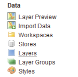

> Click to go to the Layers page

   

The earth:countries layer in the layer list

5. You are now back at the layer configuration page. Notice there are four tabs on this page, `Data` (the default), `Publishing`, `Dimensions`, and `Tile Caching`. Click on the `Publishing` tab, then scroll down to the entry that says `Default Styles`. Make a note of the name of the style. (In the case of `mapious:ore_counties`, the name of the style is called `polygon`.)

   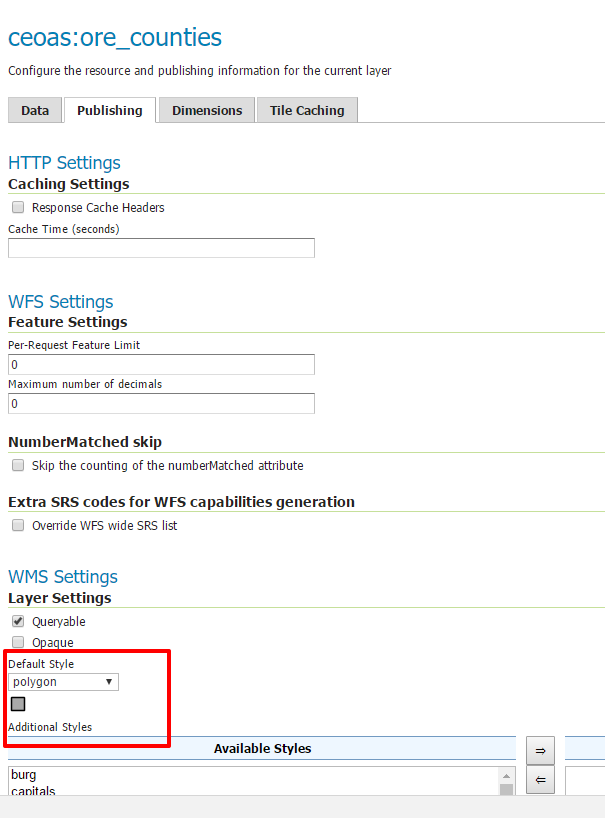

>  Layer configuration page: Publishing tab

6. Now that we know the name of the style, we can view the style's code. Click on the `Styles` link, under `Data` on the left side of the page.

   

Click to go to the Styles page

7. Click on the style name as determined above.

8. A text editor will open up, displaying the SLD code for this style.

   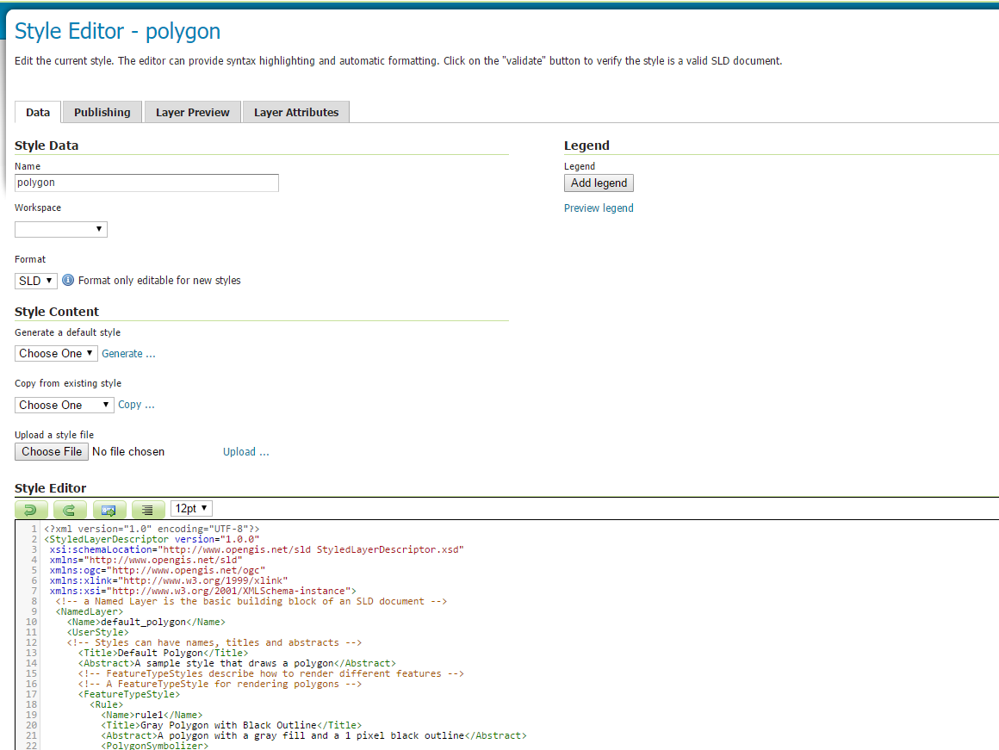

Viewing the SLD code for this style


### 2.2 Editing an existing style

It is helpful when learning about SLD to edit existing styles rather than creating new ones from scratch. We will now do this with the style that was just opened.

1. Make a change to an RGB color value in a <CssParameter> value. For example, find the line that starts with `<CssParameter name="fill">` and change the RGB code to `#0000ff` (blue).

   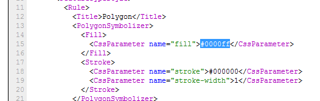

Editing the SLD code

2. When done, click `Validate` to make sure that the changes you have made are valid. If you receive an error, go back and check your work.

   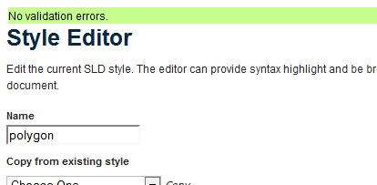

SLD code with no validation errors

3. Click `Submit` to commit the style change.

4. Now go back to the browser tab that contains the OpenLayers preview map. Refresh the page (`Ctrl/Cmd-F5`), and you should see the color change to blue.

> **note:** GeoServer and your browser will sometimes cache images. If you don't see a change immediately, zoom or pan the map to display a new area.

   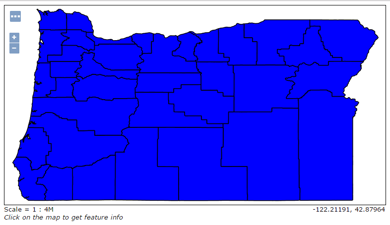

> Layer with a changed style

## References

[1] http://workshops.boundlessgeo.com/geoserver-intro/styling/index.html

[2] Google Earth http://workshops.boundlessgeo.com/geoserver-intro/googleearth/index.html