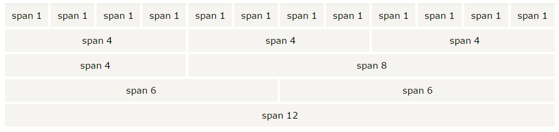
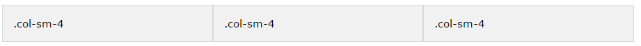
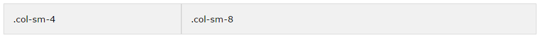
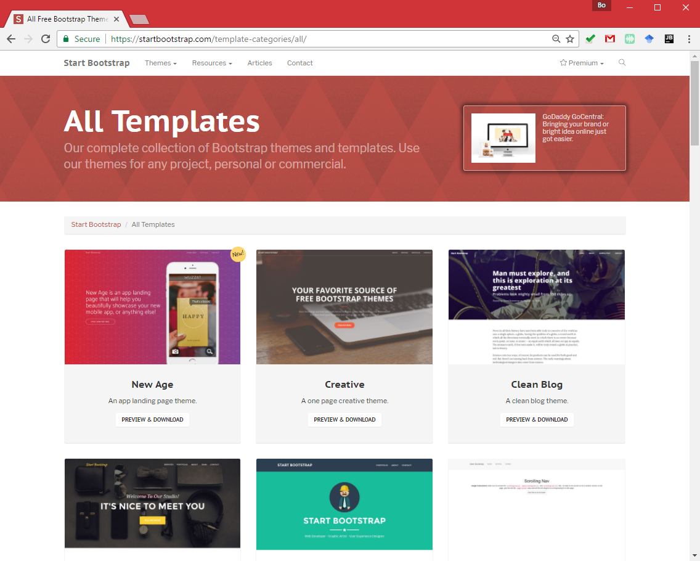
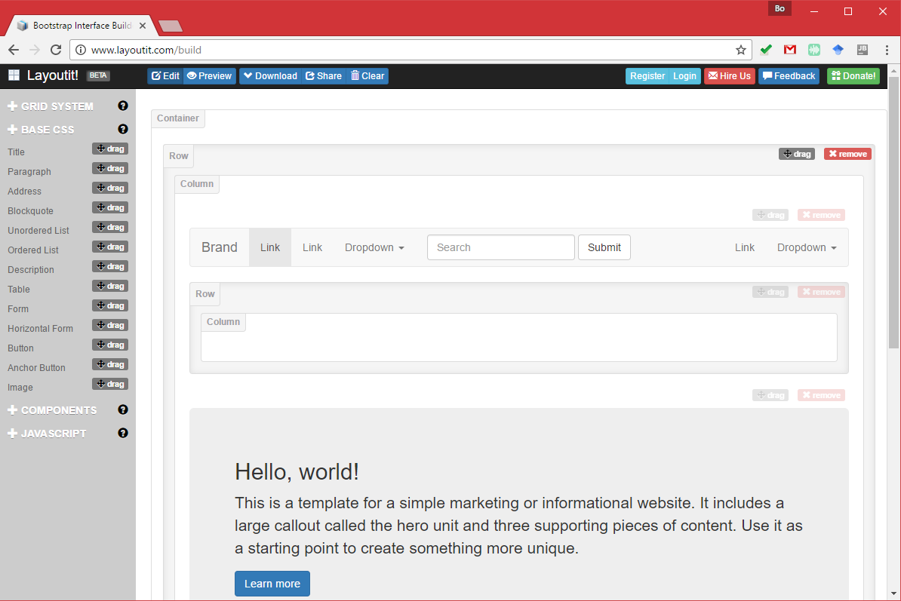

# Map Design I: Web Framework and Template

> Fall 2017 | Geography 371 | Geovisualization: Web Mapping
>
> **Instructor:** Bo Zhao | **Location:** WLKN 235 | **Time:** MWF 1200 - 1250

**Learning Objectives**

- Learn the basic syntax of Bootstrap;
- Learn how to use Bootstrap to set up a web user interface.

This lecture introduces the layout design of web based geovisualization. In this lecture, we start to list the two design principles - one for designing web site, and the other for designing map. In the second section of this lecture, we will use the library storymap.js to talk about how to design.

## 1. Overview
The framework we are going to focus on today is called **Bootstrap**. Bootstrap is a website framework built with HTML, CSS, and Javascript. A framework means that many page elements, common functions, and foundational components are already created for you to use and customize. You can use the pieces of the framework and customize the pieces and components for your own page, and even create your own. The components can be customized using HTML, CSS, and Javascript. Bootstrap was developed by Twitter, and is one of the most common frameworks for websites on the web today. More reading on Bootstrap, including lots of examples, can be found on the [**Bootstrap homepage**](http://getbootstrap.com/).

Here are some principal features of Bootstrap:

- Bootstrap is a free front-end framework for faster and easier web development
- Bootstrap includes HTML and CSS based design templates for typography, forms, buttons, tables, navigation, modals, image carousels and many other, as well as optional JavaScript plugins
- Bootstrap also gives you the ability to easily create **responsive (web) designs**.

>  **What is Responsive (Web) Design?** It is about creating web sites which automatically adjust themselves to look good on all devices, from small phones to large desktops.

One of the most important is that Bootstrap is designed to be friendly on mobile, meaning your site will resize to be viewable on mobile devices. Another is that Bootstrap has an excellent grid system that allows us a nice ability to layout our site into columns and divisions. **The grid system** uses the div element (remember, these are containers for the elements on our page), and arranges them into rows. More on the grid system: [http://getbootstrap.com/examples/grid/](http://getbootstrap.com/examples/grid/). The components provided by the Bootstrap framework and templates are on the [Bootstrap components site](http://getbootstrap.com/components), note that there are tables, dropdown menus, panels, dividers, and more. 

## 2. Bootstrap: Basics

**Download and include**

If you want to download and host Bootstrap yourself, go to [getbootstrap.com](http://getbootstrap.com/getting-started/), and follow the instructions there. If you don't want to download and host Bootstrap yourself, you can include it from a CDN (Content Delivery Network).

MaxCDN provides CDN support for Bootstrap's CSS and JavaScript. You must also include jQuery:

```js
<!-- Latest compiled and minified CSS -->
<link rel="stylesheet" href="https://maxcdn.bootstrapcdn.com/bootstrap/3.3.7/css/bootstrap.min.css">

<!-- jQuery library -->
<script src="https://ajax.googleapis.com/ajax/libs/jquery/3.1.1/jquery.min.js"></script>

<!-- Latest compiled JavaScript -->
<script src="https://maxcdn.bootstrapcdn.com/bootstrap/3.3.7/js/bootstrap.min.js"></script>
```

**Add the HTML doctype**

Bootstrap uses HTML elements and CSS properties that require the HTML5 doctype. Always include the HTML5 doctype at the beginning of the page, along with the `lang` attribute and the correct character set.

```html
<!DOCTYPE html>
<html lang="en">
  <head>
    <meta charset="utf-8"> 
  </head>
</html>	
```

**Bootstrap 3 is mobile-first**

Bootstrap 3 is designed to be responsive to mobile devices. Mobile-first styles are part of the core framework.

To ensure proper rendering and touch zooming, add the following tag inside the element:

```html
<meta name="viewport" content="width=device-width, initial-scale=1">	
```

The `width=device-width` part sets the width of the page to follow the screen-width of the device (which will vary depending on the device).

The `initial-scale=1` part sets the initial zoom level when the page is first loaded by the browser.

**Containers**

Bootstrap also requires a containing element to wrap site contents.

There are two container classes to choose from:

1. The `.container` class provides a responsive **fixed width container**
2. The `.container-fluid` class provides a **full width container**, spanning the entire width of the viewport

Please keep in mind that *Containers* are not nestable. Meaning you cannot put a container inside another container. Please execute the following two examples to see the differences.

```html
<!DOCTYPE html>
<html lang="en">
<head>
  <title>Bootstrap Example</title>
  <meta charset="utf-8">
  <meta name="viewport" content="width=device-width, initial-scale=1">
  <link rel="stylesheet" href="https://maxcdn.bootstrapcdn.com/bootstrap/3.3.7/css/bootstrap.min.css">
  <script src="https://ajax.googleapis.com/ajax/libs/jquery/3.1.1/jquery.min.js"></script>
  <script src="https://maxcdn.bootstrapcdn.com/bootstrap/3.3.7/js/bootstrap.min.js"></script>
</head>
<body>

<div class="container">
  <h1>My First Bootstrap Page</h1>
  <p>This is some text.</p> 
</div>

</body>
</html>
```

>  A basic Bootstrap page (with a responsive fixed width container)

```html
<!DOCTYPE html>
<html lang="en">
<head>
  <title>Bootstrap Example</title>
  <meta charset="utf-8">
  <meta name="viewport" content="width=device-width, initial-scale=1">
  <link rel="stylesheet" href="https://maxcdn.bootstrapcdn.com/bootstrap/3.3.7/css/bootstrap.min.css">
  <script src="https://ajax.googleapis.com/ajax/libs/jquery/3.1.1/jquery.min.js"></script>
  <script src="https://maxcdn.bootstrapcdn.com/bootstrap/3.3.7/js/bootstrap.min.js"></script>
</head>
<body>

<div class="container-fluid">
  <h1>My First Bootstrap Page</h1>
  <p>This is some text.</p> 
</div>

</body>
</html>
```

> A basic Bootstrap page (with a full width container)

**Bootstrap grids**

Bootstrap's grid system allows up to 12 columns across the page. If you do not want to use all 12 columns individually, you can group the columns together to create wider columns:



Bootstrap's grid system is responsive, and the columns will re-arrange automatically depending on the screen size.

**Grid Classes**

The Bootstrap grid system has four classes:

| Class Name  | Size           | Usage                        |
| ----------- | -------------- | ---------------------------- |
| `.col-xs-*` | Extra Small    | Phones Less than 768px       |
| `.col-sm-*` | Small Devices  | Tablets 768px and Up         |
| `.col-md-*` | Medium Devices | Desktops 992px and Up        |
| `.col-lg-*` | Large Devices  | Large Desktops 1200px and Up |

The classes above can be combined to create more dynamic and flexible layouts.

**Basic Structure of a Bootstrap Grid**

The following is a basic structure of a Bootstrap grid:

```js
<div class="row">
  <div class="col-*-*"></div>
</div>
<div class="row">
  <div class="col-*-*"></div>
  <div class="col-*-*"></div>
  <div class="col-*-*"></div>
</div>
<div class="row">
  ...
</div>
```

First; create a row (`<div class="row">`). Then, add the desired number of columns (tags with appropriate `.col-*-*` classes). Note that numbers in `.col-*-*` should always add up to 12 for each row.

Below we have collected some examples of basic Bootstrap grid layouts.

**Three Equal Columns**



The following example shows how to get a three equal-width columns starting at tablets and scaling to large desktops. On mobile phones, the columns will automatically stack:

```html
<div class="row">
  <div class="col-sm-4">.col-sm-4</div>
  <div class="col-sm-4">.col-sm-4</div>
  <div class="col-sm-4">.col-sm-4</div>
</div>
```

**Two Unequal Columns**



The following example shows how to get two various-width columns starting at tablets and scaling to large desktops:

```html
<div class="row">
  <div class="col-sm-4">.col-sm-4</div>
  <div class="col-sm-8">.col-sm-8</div>
</div>
```

## 3. Bootstrap Templates

To further enrich your web map templates, I encourage you browse some robust Boostrap templates. Two recommended sites for Bootstrap templates are:

- [StartBootstrap](http://startbootstrap.com/)
- [BootstrapZero](http://bootstrapzero.com/)



> Browse and download templates from **Start Bootstrap**

To facilitate the process of template design and customization, you can use the following tools to design interface or buttons.



> **Bootstrap Interface Builder** at [http://www.layoutit.com/build](http://www.layoutit.com/build)


## References:

[1] http://duspviz.mit.edu/web-map-workshop/bootstrap-templates/

[2] http://www.tutorialrepublic.com/twitter-bootstrap-tutorial/

[3] http://www.w3schools.com/bootstrap/

[4] https://www.toptal.com/front-end/what-is-bootstrap-a-short-tutorial-on-the-what-why-and-how

[5]  https://www.smashingmagazine.com/2008/01/10-principles-of-effective-web-design/

