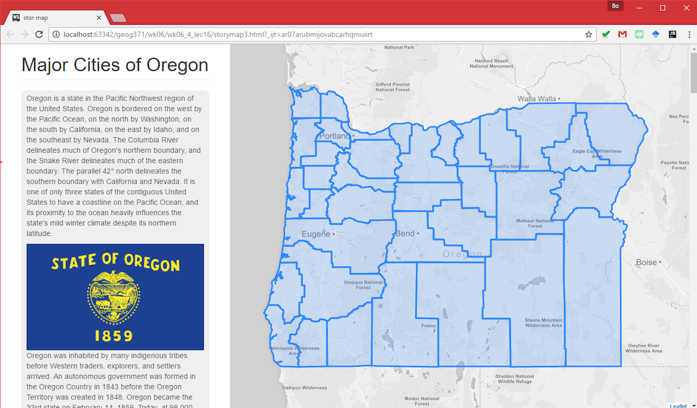
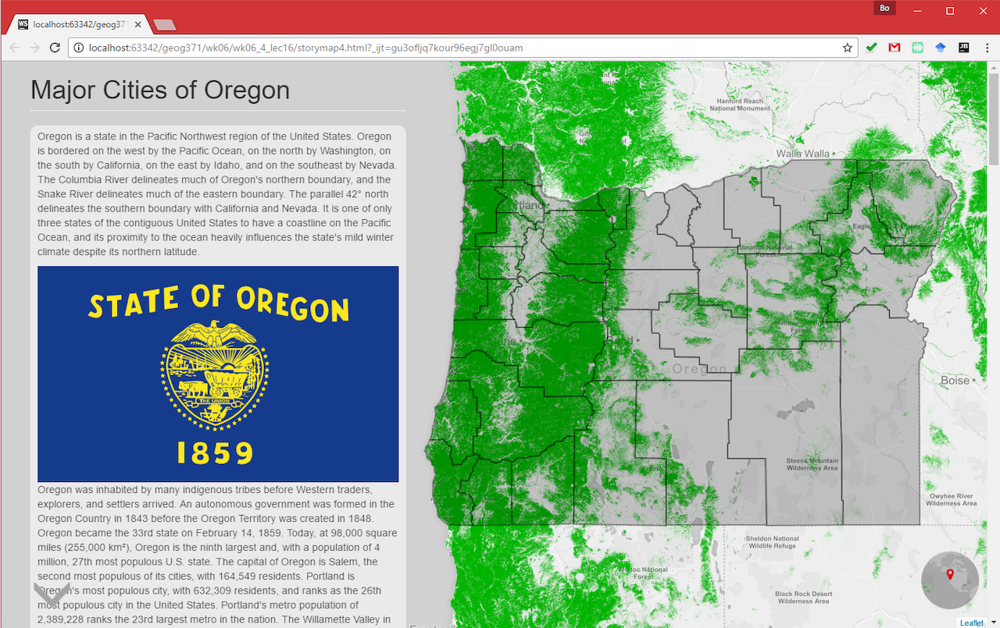
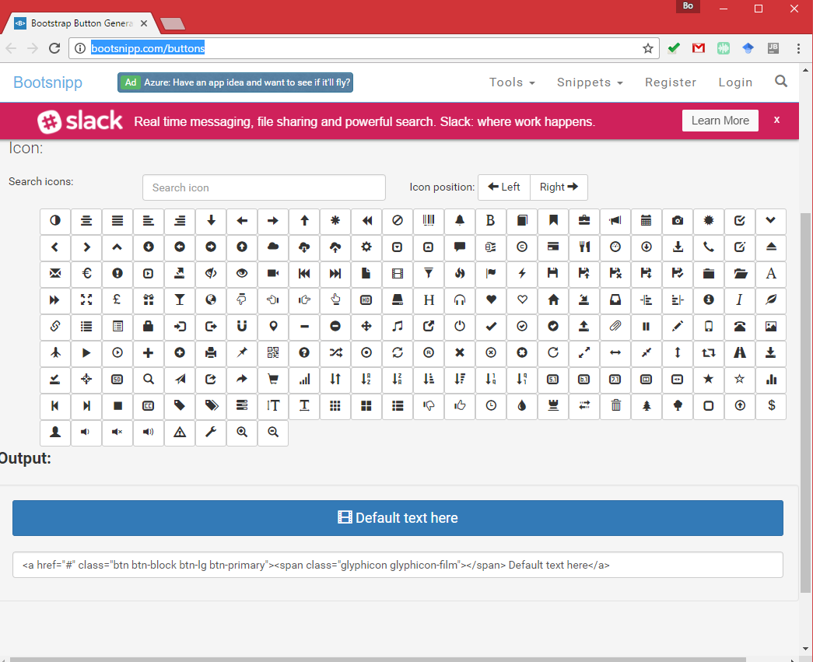
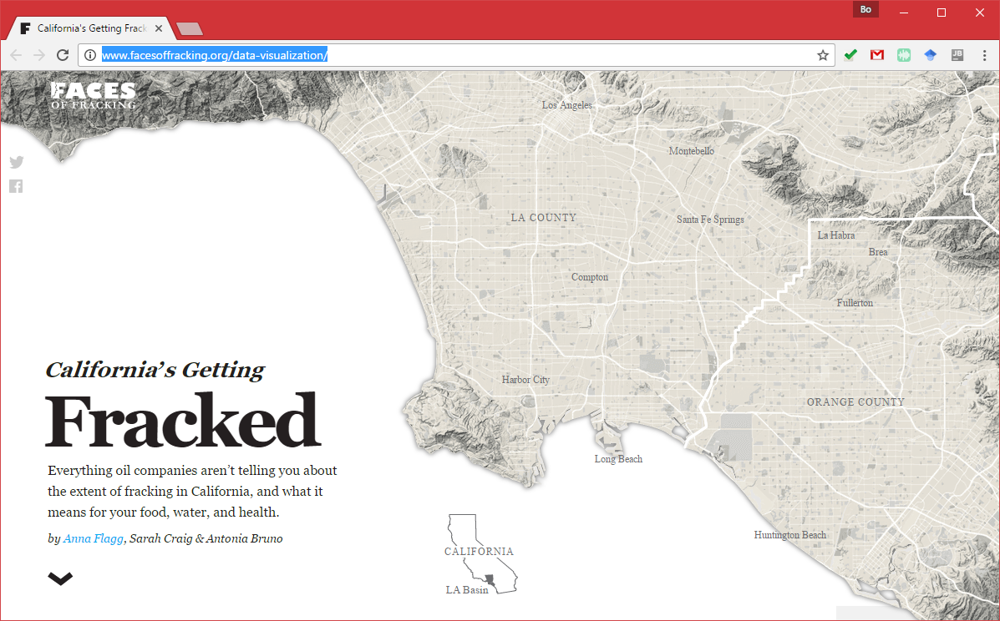

# Map Design I: Template and Framework

> Fall 2017 | Geography 371 | Geovisualization: Web Mapping
>
> Instructor: Bo Zhao | Location: 235 Wilkinson | Time: Wednesday 1200 to 1250

**Learning Objectives**

- Learning the basic syntax of Bootstrap; and
- Make a web template for a web based story map.

When developing a new web page, the best way to get ideas and learn is to look at other web sites and find things that inspire you. Look for page layouts, colors, interactivity, and structures you like, and note them for inclusion in your site. There is often no reason to reinvent the wheel, and for many tasks and layouts, templates will exist that you can download, modify, customize, and make your own. Most of them are even available open source at no cost. Templates provide code for you get started on your page. Frameworks are templates that provide the code for common components and tasks that users will want to complete on your website. Templates and frameworks are designed to be a base for you to modify and build on.

A couple template galleries:

- [Foundation](http://foundation.zurb.com/templates.html)
- [WIX](http://www.wix.com/website/templates/html/design/1)
- [HTML5up](http://html5up.net/)
- [Open Designs](http://www.opendesigns.org/website-templates/)
- [Bootstrap](http://getbootstrap.com/)

## 1. The Bootstrap Framework

The framework we are going to focus on today is called Bootstrap. Bootstrap is a website framework built with HTML, CSS, and Javascript. A framework means that many page elements, common functions, and foundational components are already created for you to use and customize. You can use the pieces of the framework and customize the pieces and components for your own page, and even create your own. The components can be customized using HTML, CSS (for styling), and Javascript (for functionality, ie what happens when you click on something). Bootstrap was developed by Twitter, and is one of the most common frameworks for websites on the web today. More reading on Bootstrap, including lots of examples, can be found on the [Bootstrap homepage](http://getbootstrap.com/).

### 1.1 What is Bootstrap?

- Bootstrap is a free front-end framework for faster and easier web development
- Bootstrap includes HTML and CSS based design templates for typography, forms, buttons, tables, navigation, modals, image carousels and many other, as well as optional JavaScript plugins
- Bootstrap also gives you the ability to easily create responsive designs.

>  **What is Responsive Web Design?** Responsive web design is about creating web sites which automatically adjust themselves to look good on all devices, from small phones to large desktops.

**Why Bootstrap?**

Why are we focusing on Bootstrap? One of the most important is that Bootstrap is designed to be friendly on mobile, meaning your site will resize to be viewable on mobile devices. Another is that Bootstrap has an excellent grid system that allows us a nice ability to layout our site into columns and divisions. The grid system uses the `div` element (remember, these are containers for the elements on our page), and arranges them into rows. More on the grid system: [http://getbootstrap.com/examples/grid/](http://getbootstrap.com/examples/grid/)

The components provided by the Bootstrap framework and templates are on the [Bootstrap components site](http://getbootstrap.com/components), note that there are tables, dropdown menus, panels, dividers, and more. Don't worry if this is confusing or there are words you don't understand, we are just getting started. The point is to notice the HTML, you will recognize some elements!

### 1.2 Use Bootstrap

**Download and include**

If you want to download and host Bootstrap yourself, go to [getbootstrap.com](http://getbootstrap.com/getting-started/), and follow the instructions there. If you don't want to download and host Bootstrap yourself, you can include it from a CDN (Content Delivery Network).

MaxCDN provides CDN support for Bootstrap's CSS and JavaScript. You must also include jQuery:

```js
<!-- Latest compiled and minified CSS -->
<link rel="stylesheet" href="https://maxcdn.bootstrapcdn.com/bootstrap/3.3.7/css/bootstrap.min.css">

<!-- jQuery library -->
<script src="https://ajax.googleapis.com/ajax/libs/jquery/3.1.1/jquery.min.js"></script>

<!-- Latest compiled JavaScript -->
<script src="https://maxcdn.bootstrapcdn.com/bootstrap/3.3.7/js/bootstrap.min.js"></script>
```

**Add the HTML doctype**

Bootstrap uses HTML elements and CSS properties that require the HTML5 doctype. Always include the HTML5 doctype at the beginning of the page, along with the lang attribute and the correct character set.

```html
<!DOCTYPE html>
<html lang="en">
  <head>
    <meta charset="utf-8"> 
  </head>
</html>	
```

**Bootstrap 3 is mobile-first**

Bootstrap 3 is designed to be responsive to mobile devices. Mobile-first styles are part of the core framework.

To ensure proper rendering and touch zooming, add the following `` tag inside the `` element:

```html
<meta name="viewport" content="width=device-width, initial-scale=1">	
```

The `width=device-width` part sets the width of the page to follow the screen-width of the device (which will vary depending on the device).

The `initial-scale=1` part sets the initial zoom level when the page is first loaded by the browser.

**Containers**

Bootstrap also requires a containing element to wrap site contents.

There are two container classes to choose from:

1. The `.container` class provides a responsive **fixed width container**
2. The `.container-fluid` class provides a **full width container**, spanning the entire width of the viewport

> **Note:** Containers are not nestable (you cannot put a container inside another container).

a basic Bootstrap page (with a responsive fixed width container)

```html
<!DOCTYPE html>
<html lang="en">
<head>
  <title>Bootstrap Example</title>
  <meta charset="utf-8">
  <meta name="viewport" content="width=device-width, initial-scale=1">
  <link rel="stylesheet" href="https://maxcdn.bootstrapcdn.com/bootstrap/3.3.7/css/bootstrap.min.css">
  <script src="https://ajax.googleapis.com/ajax/libs/jquery/3.1.1/jquery.min.js"></script>
  <script src="https://maxcdn.bootstrapcdn.com/bootstrap/3.3.7/js/bootstrap.min.js"></script>
</head>
<body>

<div class="container">
  <h1>My First Bootstrap Page</h1>
  <p>This is some text.</p> 
</div>

</body>
</html>
```

a basic Bootstrap page (with a full width container)

```html
<!DOCTYPE html>
<html lang="en">
<head>
  <title>Bootstrap Example</title>
  <meta charset="utf-8">
  <meta name="viewport" content="width=device-width, initial-scale=1">
  <link rel="stylesheet" href="https://maxcdn.bootstrapcdn.com/bootstrap/3.3.7/css/bootstrap.min.css">
  <script src="https://ajax.googleapis.com/ajax/libs/jquery/3.1.1/jquery.min.js"></script>
  <script src="https://maxcdn.bootstrapcdn.com/bootstrap/3.3.7/js/bootstrap.min.js"></script>
</head>
<body>

<div class="container-fluid">
  <h1>My First Bootstrap Page</h1>
  <p>This is some text.</p> 
</div>

</body>
</html>
```

**Bootstrap grids**

Bootstrap's grid system allows up to 12 columns across the page.

If you do not want to use all 12 columns individually, you can group the columns together to create wider columns:


**Bootstrap's grid system is responsive, and the columns will re-arrange automatically depending on the screen size.**

**Grid Classes**

The Bootstrap grid system has four classes:

- xs (for phones)
- sm (for tablets)
- md (for desktops)
- lg (for larger desktops)

The classes above can be combined to create more dynamic and flexible layouts.

**Basic Structure of a Bootstrap Grid**

The following is a basic structure of a Bootstrap grid:

```js
<div class="row">
  <div class="col-*-*"></div>
</div>
<div class="row">
  <div class="col-*-*"></div>
  <div class="col-*-*"></div>
  <div class="col-*-*"></div>
</div>
<div class="row">
  ...
</div>
```

First; create a row (`<div class="row">`). Then, add the desired number of columns (tags with appropriate `.col-*-*` classes). Note that numbers in `.col-*-*` should always add up to 12 for each row.

Below we have collected some examples of basic Bootstrap grid layouts.

**Three Equal Columns**


The following example shows how to get a three equal-width columns starting at tablets and scaling to large desktops. On mobile phones, the columns will automatically stack:

```html
<div class="row">
  <div class="col-sm-4">.col-sm-4</div>
  <div class="col-sm-4">.col-sm-4</div>
  <div class="col-sm-4">.col-sm-4</div>
</div>
```

**Two Unequal Columns**


The following example shows how to get two various-width columns starting at tablets and scaling to large desktops:

```html
<div class="row">
  <div class="col-sm-4">.col-sm-4</div>
  <div class="col-sm-8">.col-sm-8</div>
</div>
```

## 2. Template for the storymap

Regarding the storymap I illustrated in the previous lecture, I also use Bootstrap to make the web template. As you might recall, there are two panel side by side, the right panel shows the map, the left shows the texts. This layout actually uses the two unequal columns as below. (refer to **`storymap1.html`**)

```html
<!DOCTYPE html>
<html lang="en">
<head>
    <title>stor map</title>
    <meta charset="utf-8">
    <meta name="viewport" content="width=device-width, initial-scale=1">
    <link rel="stylesheet" href="https://maxcdn.bootstrapcdn.com/bootstrap/3.3.7/css/bootstrap.min.css">
    <script src="https://ajax.googleapis.com/ajax/libs/jquery/3.1.1/jquery.min.js"></script>
    <script src="https://maxcdn.bootstrapcdn.com/bootstrap/3.3.7/js/bootstrap.min.js"></script>
</head>
<body>

<div class="container-fluid">
    <div class="row">
    <div class="col-sm-6 col-md-4 main">
        <h1 class="page-header">Major Cities of Oregon</h1>
    </div>
    <div id="map" class="col-sm-6 col-md-8 sidebar"></div>
    </div>
</div>


</body>
</html>
```

Once determining the template, you can add on all the javascript libraries and concomitant styles (refer to **`storymap2.html`**).

```html
<!DOCTYPE html>
<html lang="en">
<head>
    <title>stor map</title>
    <meta charset="utf-8">
    <meta name="viewport" content="width=device-width, initial-scale=1">
    <link rel="stylesheet" href="https://maxcdn.bootstrapcdn.com/bootstrap/3.3.7/css/bootstrap.min.css">
    <link rel="stylesheet" href="https://unpkg.com/leaflet@1.0.2/dist/leaflet.css" />
    <link rel="stylesheet" type="text/css" href="css/style.css">

    <script src="https://unpkg.com/leaflet@1.0.2/dist/leaflet.js"></script>
    <script src="https://ajax.googleapis.com/ajax/libs/jquery/3.1.1/jquery.min.js"></script>
    <script src="https://maxcdn.bootstrapcdn.com/bootstrap/3.3.7/js/bootstrap.min.js"></script>
    <script src="js/leaflet.ajax.min.js"></script>
    <script src="js/storymap.js"></script>

</head>
<body>

<div class="container-fluid">
    <div class="row">
        <div class="col-sm-6 col-md-4 main">
            <h1 class="page-header">Major Cities of Oregon</h1>
        </div>
        <div id="map" class="col-sm-6 col-md-8 sidebar"></div>
    </div>
</div>
<!-- libraries for adding on bing maps -->
<script src="https://cdn.polyfill.io/v2/polyfill.min.js?features=Promise"></script>
<script src="http://gmaclennan.github.io/leaflet-bing-layer/leaflet-bing-layer.js"></script>
<script type="text/javascript">

</script>
</body>
</html>
```

And then, I fill in the content for the main tag (refer to **`storymap3.html`**).

```html
 <div class="col-sm-6 col-md-4 main">
            <h1 class="page-header">Major Cities of Oregon</h1>
            <section data-scene="overview">
                <p>Oregon is a state in the Pacific Northwest region of the United States. Oregon is bordered on the west by the Pacific Ocean, on the north by Washington,...</p>
                
              ...
            </section>
            <section data-scene="portland">
                <h2>Portland</h2>...
            </section>
            <section data-scene="corvallis">
                <h2>Corvallis</h2>...
            </section>
            <section data-scene="oregon">
                <h2>Oregon</h2>...
            </section>
        </div>
        <div id="map" class="col-sm-6 col-md-8 sidebar"></div>
    </div>
</div>
```

Please pay attention to the image, A `img-responsive` class is applied to the `img` tag. Then the image can automatically adjust its size when resizing the windows or opening in a different platform.

```html
 
```

Also, I embed the main script for the story map as below:

```js
   var layers = {
        'bing' : L.tileLayer.bing('AuhiCJHlGzhg93IqUH_oCpl_-ZUrIE6SPftlyGYUvr9Amx5nzA-WqGcPquyFZl4L'),
        'counties': L.geoJson.ajax('assets/counties.geojson'),
        'corvallis admin': L.geoJson.ajax('http://www.mapio.us/geoserver/ceoas/ows?service=WFS&version=1.0.0&request=GetFeature&typeName=ceoas:admin&outputFormat=application%2Fjson')
    };

    var scenes = {
        overview: {lat: 44.2514788, lon: -120.3869201, zoom: 7, layers: ['counties']},
        portland: {lat: 45.5186089, lon: -122.6270297, zoom: 11},
        corvallis: {lat: 44.5701158, lon: -123.2749388, zoom: 14, layers: ['bing','corvallis admin']},
        eugene: {lat: 44.0549563, lon: -123.0758048, zoom: 13 },
        salem: {lat: 44.9419055, lon: -123.0356407, zoom: 13},
        bend: {lat: 44.0519385, lon: -121.3042125, zoom: 14, layers: ['bing']},
        oregon: {lat: 44.2514788, lon: -120.3869201, zoom: 7, layers: ['counties']}
    };

    $('.main').storymap({
        scenes: scenes,
        createMap: function () {
            // create a map in the "map" div, set the view to a given place and zoom
            var map = L.map('map', {zoomControl: false}).setView([44, -120], 7);
            // add an basemap, which can be either OSM, mapbox, tilelayer, wmslayer or those designed by yourself.
            L.tileLayer('https://api.tiles.mapbox.com/v4/{id}/{z}/{x}/{y}.png?access_token=pk.eyJ1IjoibWFwYm94IiwiYSI6ImNpandmbXliNDBjZWd2M2x6bDk3c2ZtOTkifQ._QA7i5Mpkd_m30IGElHziw', {
                maxZoom: 18,
                attribution: '',
                id: 'mapbox.light'
            }).addTo(map);
            return map;
        }
    });
```

In the end, you can view this story map like the screenshot below:



For more custumizations (e.g., miniglobemap, float text panel, adding google earth engine layers, and etc.), I recommend you open **`storymap4.html`** , debug and read the codes.



## 3. Bootstrap Templates

To further enrich your web map templates, I encourage you browse some robust Boostrap templates. Two recommended sites for Bootstrap templates are:

- [StartBootstrap](http://startbootstrap.com/)
- [BootstrapZero](http://bootstrapzero.com/)


> Browse and download templates from **Start Bootstrap**

To facilitate the process of template design and customization, you can use the following tools to design interface or buttons.


> **Bootstrap Interface Builder** at [http://www.layoutit.com/build](http://www.layoutit.com/build)



> Bootstrap Button Design at [http://bootsnipp.com/buttons](http://bootsnipp.com/buttons)

## References:

[0] http://duspviz.mit.edu/web-map-workshop/bootstrap-templates/
[1] http://www.tutorialrepublic.com/twitter-bootstrap-tutorial/
[2] http://www.w3schools.com/bootstrap/
[3] https://www.toptal.com/front-end/what-is-bootstrap-a-short-tutorial-on-the-what-why-and-how
[4]  https://www.smashingmagazine.com/2008/01/10-principles-of-effective-web-design/
[5]  http://www.facesoffracking.org/data-visualization/



