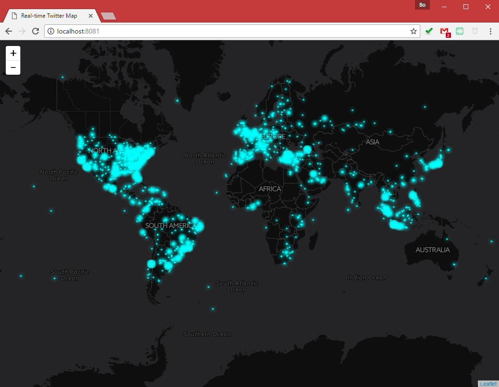

# Thematic Web Maps II: Real-Time Mapping: TweetMap

> Fall 2017 | Geography 371 | Geovisualization: Web Mapping
>
> Instructor: Bo Zhao | Location: Wilkinson 235 | Time: MWF 1200 to 1250

**Learning Objectives**

- Get to know the Server-side Javascript;
- Understand some basic packages for Server-side Javascript; and
- Making a real-time twitter map using Node.js.

In this lecture, we will show how to stream real-time twitter data to leaflet map using NodeJS. Before coding, we will firstly cover some basic concepts, such as Server-side Javascript, nodejs, npm, express.js, socket.io and twitter. After that, I will take you walk through how to make a real-time twitter map like below.



[tweetmap-osu.herokuapp.com](http://tweetmap-osu.herokuapp.com)

## 1. Server-side Javascript

[Node.js](https://nodejs.org/en/about/) is an open-source, cross-platform JavaScript run-time environment for executing JavaScript code server-side. Historically, JavaScript was used primarily for client-side scripting, in which scripts written in JavaScript are embedded in a webpage's HTML, to be run client-side by a JavaScript engine in the user's web browser. Node.js enables JavaScript to be used for server-side scripting, and runs scripts server-side to produce dynamic web page content before the page is sent to the user's web browser. Consequently, Node.js has become one of the foundational elements of the **"JavaScript everywhere"** paradigm, allowing web application development to unify around a single programming language, rather than rely on a different language for writing server side scripts.

As an asynchronous event driven JavaScript runtime, Node is designed to build scalable network applications. In the following "hello world" example, many connections can be handled concurrently. Upon each connection the callback is fired, but if there is no work to be done Node is sleeping. A piece of sample code:

```javascript
const http = require('http');

const hostname = '127.0.0.1';
const port = 3000;

const server = http.createServer((req, res) => {
  res.statusCode = 200;
  res.setHeader('Content-Type', 'text/plain');
  res.end('Hello World\n');
});

server.listen(port, hostname, () => {
  console.log(`Server running at http://${hostname}:${port}/`);
});
```

This is in contrast to today's more common concurrency model where OS threads are employed. Thread-based networking is relatively inefficient and very difficult to use. Furthermore, users of Node are free from worries of dead-locking the process, since there are no locks. Almost no function in Node directly performs I/O, so the process never blocks. Because nothing blocks, scalable systems are very reasonable to develop in Node.

**npm**

npm is a package manager for the JavaScript programming language. It is the default package manager for the JavaScript runtime environment Node.js. It consists of a command line client, also called npm, and an online database of public packages, called the npm registry. The registry is accessed via the client, and the available packages can be browsed and searched via the npm website.

> **Note:** the `npm install` command is often used to install nodejs packages. For more inforamtion, please refer to [https://docs.npmjs.com/cli/install](https://docs.npmjs.com/cli/install).

**express**

[Express.js](https://expressjs.com/), or simply Express, is a web application framework for Node.js, released as free and open-source software under the MIT License. It is designed for building web applications and APIs. It is the de facto standard server framework for Node.js. To use the express framework, First create a working directory, navigate to it (via `cd` command) and run `npm init`. Then install `express` as a dependency, In the working directory, create a file named app.js and add the following code:

```javascript
var express = require('express')
var app = express()

app.get('/', function (req, res) {
  res.send('Hello World!')
})

app.listen(3000, function () {
  console.log('Example app listening on port 3000!')
})
```

Run the app with the following command:

```javascript
$ node app.js
```


**twitter**
An asynchronous client library for the Twitter REST and Streaming API's.  A piece of sample code:

```javascript
var Twitter = require('twitter');

var client = new Twitter({
  consumer_key: '',
  consumer_secret: '',
  access_token_key: '',
  access_token_secret: ''
});

var params = {screen_name: 'nodejs'};
client.get('statuses/user_timeline', params, function(error, tweets, response) {
  if (!error) {
    console.log(tweets);
  }
});
```

**Sokect.io**

[Socket.IO](https://socket.io/docs/faq/) is a JavaScript library for realtime web applications. It enables realtime, bi-directional communication between web clients and servers. It has two parts: a client-side library that runs in the browser, and a server-side library for Node.js. Both components have a nearly identical API. Like Node.js, it is event-driven.

Socket.IO primarily uses the WebSocket protocol with polling as a fallback option, while providing the same interface. Although it can be used as simply a wrapper for WebSocket, it provides many more features, including broadcasting to multiple sockets, storing data associated with each client, and asynchronous I/O.  A piece of sample code for streaming twitter data.

```javascript
var io = require('socket.io')(80);
var cfg = require('./config.json');
var tw = require('node-tweet-stream')(cfg);
tw.track('socket.io');
tw.track('javascript');
tw.on('tweet', function(tweet){
  io.emit('tweet', tweet);
});
```

## 2. Real-time Twitter Map

This section is greatly inspired by [Stewart Harper](https://plus.google.com/114695899984217574143?rel=author)'s post on [Using the Twitter Stream API to Visualize Tweets on Google Maps](https://blog.safe.com/2014/03/twitter-stream-api-map/) [chriswhong's crossfilter-geo-input](https://github.com/chriswhong/crossfilter-geo-input).


### 2.1 Server-side

Two files power the server side: `package.json` and `app.js`.

`Package.json` holds a variety of metadata related to the project and lists dependencies.

`Server.js` is where all of the logic lies. This code first sets up a web server using `express`, which serves the static web pages, loads `socket.io` the web socket module, and loads the `Twitter` API module.

To stream Twitter data, you will need to use the twitter API. To use that, you must create an application on Twitter. It’s free and it doesn’t take long. Once you have created your application, load it from the dashboard and then click on API keys tab at the top. The values in the web interface correspond with the following in the JSON:

- API key --> consumer_key
- API secret --> consumer_secret
- Access token --> access_token_key
- Access token secret --> access_token_secret

IN a nutshell, the steps are:

1\. The client mapping application **connects** to the web socket server and triggers the connection listener.

2\. Another listener, **start tweets**, is set up and a connected message is sent to the client telling them they are connected and everything is ready.

3\. When the client receives this message, it sends a message to the **start tweets** listener and the Tweets get streamed. We only want to stream Tweets with location, so they are parsed, and if they have coordinates we create a simple piece of JSON containing the location.

> **Note:** One thing to understand is that every time a client connects, they will create a new connection process.

### 2.2 Client Side

The webpages are all served from the root folder. The index.html file loads the relevant js libraries and then there is a tag for the Leaflet Map. The javascript script is included in the index.html.

The javscript script sets up the Leaflet Map then opens up a websocket connection with the server. Once the server confirms it has received the connection and is ready to start sending Tweets, the connected listener is called and the client sends a message back to the server to say it is ready via socket.emit(“start tweets”);. The server responds with a stream of Tweets captured in the twstreaming listener, where they are added to an array bound to a leaflet Maps heat layer.


Read and download the source codes of this real-time twitter map from this lecture's directory. (Execute the server.js on Webstorm). While you read the code, you can refer to the lecture material.

## 3. Sum-up

How do we take this further? It would be great to dig deeper into the incoming data and rather than just visualizing the data explore trends and gain intelligence. I also wonder what happens if we want to mashup different data sources and read data from other web services or lower-level protocols, such as TCP/IP or WebSockets.

