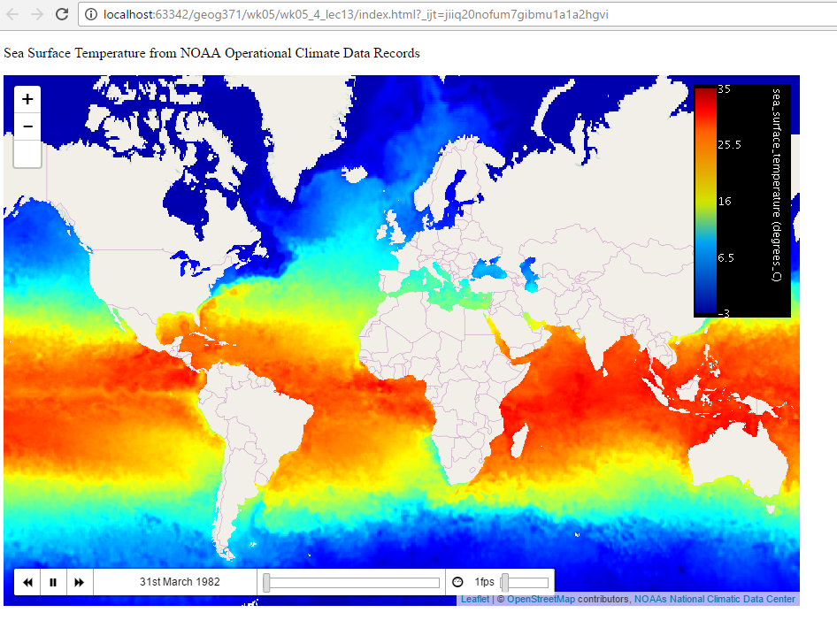

# Thematic Web Maps I: Time Series

> Fall 2017 | Geography 371 | Geovisualization: Web Mapping
>
> Instructor: Bo Zhao | Location: 235 Wilkinson | Time: Wednesday 1200 to 1250


**Learning Objectives**

- Understand the structure of WMS-time; and
- Make a time series map.

GeoServer supports a TIME attribute in GetMap requests for layers that are properly configured with a time dimension. This is used to specify a temporal subset for rendering.

For example, you might have a single dataset with weather observations collected over time and choose to plot a single day’s worth of observations.

The attribute to be used in TIME requests can be set up through the GeoServer web interface by navigating to *Layers -> [specific layer] -> Dimensions tab*.

## 1. Time Support in GeoServer WMS

### 1.1 Configuring an attribute for TIME requests

GeoServer supports adding specific dimensions to WMS layers, as specified in `WMS 1.1.1` and `WMS 1.3.0` standards. There are two pre-defined dimensions in the WMS standards mentioned above, **TIME** and **ELEVATION**. Enabling dimensions for a layer allows users to specify those as extra parameters in GetMap requests, useful for creating maps or animations from underlying multi-dimensional data.

These dimensions can be enabled and configured on the Dimensions tab.


>  TIME dimension enabled for a WMS layer

For each enabled dimension the following configuration options are available:

- **Attribute**—Attribute name for picking the value for this dimension (vector only). This is treated at start of the range if **End attribute** is also given.
- **End attribute**—Attribute name for picking the end of the value range for this dimension (optional, vector only).
- **Presentation**—The presentation type for the available values in the capabilities document. Either *each value separately (list)*, *interval and resolution*, or *continuous interval*.
- **Default value**—Default value to use for this dimension if none is provided with the request. Select one of from four strategies:**smallest domain value**—Uses the smallest available value from the data**biggest domain value**—Uses the biggest available value from the data**nearest to the reference value**—Selects the data value closest to the given reference value**reference value**—Tries to use the given reference value as-is, regardless of whether its actually available in the data or not.
- **Reference value**—The default value specifier. Only shown for the default value strategies where its used.

For time dimension the value must be in ISO 8601 DateTime format `yyyy-MM-ddThh:mm:ss.SSSZ` For elevation dimension, the value must be and integer of floating point number.

Only for the “Reference value” strategy, it is also possible to use ranges or times and ranges of elevation, in the form fromValue/toValue. Only for the “Reference value” strategy, and limited to times, it’s also possible to use relative times like P1M/PRESENT, but caution is given that the reference value is copied verbatim into the capabilities document, and as a result, not all client might be recognizing that syntax.

### 1.2 Specifying a time

The format used for specifying a time in the WMS TIME parameter is based on [ISO-8601](http://en.wikipedia.org/wiki/ISO_8601). Times may be specified up to a precision of 1 millisecond; GeoServer does not represent time queries with more precision than this.

The parameter is:

`TIME=<timestring>`

Times follow the general format:

`yyyy-MM-ddThh:mm:ss.SSSZ`

where:

- `yyyy`: 4-digit year
- `MM`: 2-digit month
- `dd`: 2-digit day
- `hh`: 2-digit hour
- `mm`: 2-digit minute
- `ss`: 2-digit second
- `SSS`: 3-digit millisecond

The day and intraday values are separated with a capital `T`, and the entire thing is suffixed with a Z, indicating [UTC](http://en.wikipedia.org/wiki/Coordinated_Universal_Time) for the time zone. (The WMS specification does not provide for other time zones.)

GeoServer will apply the `TIME` value to all temporally enabled layers in the `LAYERS` parameter of the `GetMap` request. Layers without a temporal component will be served normally, allowing clients to include reference information like political boundaries along with temporal data.

| Description                  | Time specification       |
| ---------------------------- | ------------------------ |
| December 12, 2001 at 6:00 PM | `2001-12-12T18:00:00.0Z` |
| May 5, 1993 at 11:34 PM      | `1993-05-05T11:34:00.0Z` |

### 1.3 Specifying an absolute interval

A client may request information over a continuous interval instead of a single instant by specifying a start and end time, separated by a `/` character.

In this scenario the start and end are *inclusive*; that is, samples from exactly the endpoints of the specified range will be included in the rendered tile.

| Description                         | Time specification                       |
| ----------------------------------- | ---------------------------------------- |
| The month of September 2002         | `2002-09-01T00:00:00.0Z/2002-09-30T23:59:59.999Z` |
| The entire day of December 25, 2010 | `2010-12-25T00:00:00.0Z/2010-12-25T23:59:59.999Z` |

### 1.4 Specifying a relative interval

A client may request information over a relative time interval instead of a set time range by specifying a start or end time with an associated duration, separated by a `/` character.

One end of the interval must be a time value, but the other may be a duration value as defined by the ISO 8601 standard. The special keyword PRESENT may be used to specify a time relative to the present server time.

| Description                              | Time specification           |
| ---------------------------------------- | ---------------------------- |
| The month of September 2002              | `2002-09-01T00:00:00.0Z/P1M` |
| The entire day of December 25, 2010      | `2010-12-25T00:00:00.0Z/P1D` |
| The entire day preceding December 25, 2010 | `P1D/2010-12-25T00:00:00.0Z` |
| 36 hours preceding the current time      | `PT36H/PRESENT`              |

> **`Note`**: The final example could be paired with the KML service to provide a [*Google Earth*](http://docs.geoserver.org/latest/en/user/services/wms/googleearth/index.html#google-earth) network link which is always updated with the last 36 hours of data.

### 1.5 Reduced accuracy times

The WMS specification also allows time specifications to be truncated by omitting some of the time string. In this case, GeoServer treats the time as a range whose length is equal to the *most precise unit specified* in the time string.

For example, if the time specification omits all fields except year, it identifies a range one year long starting at the beginning of that year.

> **Note:** GeoServer implements this by adding the appropriate unit, then subtracting 1 millisecond. This avoids surprising results when using an interval that aligns with the actual sampling frequency of the data - for example, if yearly data is natively stored with dates like 2001-01-01T00:00:00.0Z, 2002-01-01T00:00:00Z, etc. then a request for 2001 would include the samples for both 2001 and 2002, which wouldn’t be desired.

| Description                  | Reduced Accuracy Time | Equivalent Range                         |
| ---------------------------- | --------------------- | ---------------------------------------- |
| The month of September 2002  | `2002-09`             | `2002-09-01T00:00:00.0Z/2002-09-30T23:59:59.999Z` |
| The day of December 25, 2010 | 2010-12-25            | `2010-12-25T00:00:00.0Z/2010-12-25T23:59:59.999Z` |

### 1.6 Reduced accuracy times with ranges

Reduced accuracy times are also allowed when specifying ranges. In this case, GeoServer effectively expands the start and end times as described above, and then includes any samples from after the beginning of the start interval and before the end of the end interval.

> **Note:** Again, the ranges are inclusive.

| Description                              | Reduced Accuracy Time                    | Equivalent Range |
| ---------------------------------------- | ---------------------------------------- | ---------------- |
| The months of September through December 2002 | `2002-09/2002-12             | 2002-09-01T00:00:00.0Z/2002-12-31T23:59:59.999Z` |                  |
| 12PM through 6PM, December 25, 2010      | `2010-12-25T12/2010-12-25T18 | 2010-12-25T12:00:00.0Z/2010-12-25T18:59:59.999Z` |                  |

> **Note:** In the last example, note that the result may not be intuitive, as it includes all times from 6PM to 6:59PM.

### 1.7 Specifying a list of times

GooServer can also accept a list of discrete time values. This is useful for some applications such as animations, where one time is equal to one frame. The elements of a list are separated by commas.

> **Note:** GeoServer currently does not support lists of ranges, so all list queries effectively have a resolution of 1 millisecond. If you use reduced accuracy notation when specifying a range, each range will be automatically converted to the instant at the beginning of the range.

If the list is evenly spaced (for example, daily or hourly samples) then the list may be specified as a range, using a start time, end time, and period separated by slashes.

| Description                              | List notation                            | Equivalent range notation                |
| ---------------------------------------- | ---------------------------------------- | ---------------------------------------- |
| Noon every day for August 12-14, 2012    | `TIME=2012-08-12T12:00:00.0Z,2012-08-13T12:00:00.0Z,2012-08-14T12:00:00.0Z` | `TIME=2012-08-12T12:00:00.0Z/2012-08-18:T12:00:00.0Z/P1D` |
| Midnight on the first of September, October, and November 1999 | `TIME=1999-09-01T00:00:00.0Z,1999-10-01T00:00:00.0Z,1999-11-01T00:00:00.0Z` | `TIME=1999-09-01T00:00:00.0Z/1999-11-01T00:00:00.0Z/P1M` |

### 1.8 Specifying a periodicity

The periodicity is also specified in ISO-8601 format: a capital **P** followed by one or more interval lengths, each consisting of a number and a letter identifying a time unit:

| Unit    | Abbreviation |
| ------- | ------------ |
| Years   | `Y`          |
| Months  | `M`          |
| Days    | `D`          |
| Hours   | `H`          |
| Minutes | `M`          |
| Seconds | `S`          |

The Year/Month/Day group of values must be separated from the Hours/Minutes/Seconds group by a Tcharacter. The T itself may be omitted if hours, minutes, and seconds are all omitted. Additionally, fields which contain a 0 may be omitted entirely.

Fractional values are permitted, but only for the most specific value that is included.

> **Note:** The period must divide evenly into the interval defined by the start/end times. So if the start/end times denote 12 hours, a period of 1 hour would be allowed, but a period of 5 hours would not.

For example, the multiple representations listed below are all equivalent.

- One hour:

```
  P0Y0M0DT1H0M0S

  PT1H0M0S

  PT1H
```

- 90 minutes:

```
  P0Y0M0DT1H30M0S

  PT1H30M

  P90M

```

- 18 months:

```
  P1Y6M0DT0H0M0S

  P1Y6M0D

  P0Y18M0DT0H0M0S

  P18M
```

> **Note:** P1.25Y3M would not be acceptable, because fractional values are only permitted in the most specific value given, which in this case would be months.

## 2 Leaflet TimeDimension

**Leaflet TimeDimension Plugin** add time dimension capabilities on a [Leaflet](http://leafletjs.com/) map. Checkout the [Leaflet TimeDimension Demos](http://apps.socib.es/Leaflet.TimeDimension/examples/) to get a sense how this plugin works.


### 2.1NOAA Operational Climate Data Records

The example in this section uses [NOAA's Climate Data Record Program](http://www.ncdc.noaa.gov/cdr/operationalcdrs.html).




```js
var map = L.map('map', {
    zoom: 2,
    fullscreenControl: true,
    timeDimension: true,
    timeDimensionOptions:{
        timeInterval: "1981-09/" + currentMonth.format("yyyy-mm"),
        period: "P1M",
        currentTime: Date.parse("1981-09-01T00:00:00Z")
    },    
    center: [20.0, 0.0],
});

L.tileLayer('http://{s}.tile.osm.org/{z}/{x}/{y}.png', {
    attribution: '&copy; <a href="http://osm.org/copyright">OpenStreetMap</a> contributors'    
}).addTo(map);

var proxy = 'server/proxy.php';
var testWMS = "http://www.ncdc.noaa.gov/thredds/wms/OISST-V2-AVHRR_agg_combined"
var testLayer = L.tileLayer.wms(testWMS, {
    layers: 'sst',
    format: 'image/png',
    transparent: true,
    style: 'boxfill/sst_36',
    colorscalerange: '-3,35',
    abovemaxcolor: "extend",
    belowmincolor: "extend",    
    attribution: '<a href="http://www.ncdc.noaa.gov">NOAAs National Climatic Data Center</a>'
});
var testTimeLayer = L.timeDimension.layer.wms(testLayer, {
    proxy: proxy,
    updateTimeDimension: false,
});
testTimeLayer.addTo(map);

var testLegend = L.control({
    position: 'topright'
});
testLegend.onAdd = function(map) {
    var src = testWMS + "?SERVICE=WMS&VERSION=1.3.0&REQUEST=GetLegendGraphic&LAYER=sst&PALETTE=sst_36&COLORSCALERANGE=-3,35";
    var div = L.DomUtil.create('div', 'info legend');
    div.innerHTML +=
        '';
    return div;
};
testLegend.addTo(map);

L.Control.TimeDimensionCustom = L.Control.TimeDimension.extend({
    _getDisplayDateFormat: function(date){
        return date.format("dS mmmm yyyy");
    }    
});
var timeDimensionControl = new L.Control.TimeDimensionCustom({
    playerOptions: {
        buffer: 1,
        minBufferReady: -1
    }
});
map.addControl(this.timeDimensionControl);
```

### 2.2 Leaflet Time Dimenson Plugin API

#### 2.2.1 L.Map

This plugin will attach to a Map a TimeDimension object and a related TimeDimension Control if `timeDimension` and `timeDimensionControl` options are included.

| Option                        | Description                              |
| ----------------------------- | :--------------------------------------- |
| `timeDimension`               | Creates a new TimeDimension object linked to the map. |
| `timeDimensionOptions`        | [Options](#timeDimensionOptions) for the TimeDimension object. |
| `timeDimensionControl`        | Adds a TimeDimension Control to the map. |
| `timeDimensionControlOptions` | [Options](#timeDimensionControlOptions) for the TimeDimension Control object. |

#### 2.2.2 L.TimeDimension

TimeDimension object manages the time component of a layer. It can be shared among different layers and it can be added to a map, and become the default timedimension component for any layer added to the map. 

In order to include a TimeDimension in the map, add `timeDimension: true` as an option when creating the map.    

**Options**

This options can be set up when creating the map with the option `timeDimensionOptions`.

| Option           | Default                | Description                              |
| :--------------- | :--------------------- | :--------------------------------------- |
| `times`          | `null`                 | It can be: a) An array of times (in milliseconds). b) String of dates separated by commas. c) String formed by `start date`/`end date`/`period`. If null, it will be constructed according to `timeInterval` and `period` |
| `timeInterval`   | `"P1M/" + today`       | String to construct the first available time and the last available time. Format: [ISO8601 Time inverval](http://en.wikipedia.org/wiki/ISO_8601#Time_intervals) |
| `period`         | `"P1D"`                | Used to construct the array of available times starting from the first available time. Format: [ISO8601 Duration](http://en.wikipedia.org/wiki/ISO_8601#Durations) |
| `validTimeRange` | `undefined`            | Filter the array of available times by start hour and end hour (for any date). Format "HH:MM/HH:MM" |
| `currentTime`    | Closest available time | Current time to be loaded. Time in ms.   |
| `loadingTimeout` | `3000`                 | Maximum time in milliseconds that the component will wait to apply a new time if synced layers are not ready |

**Events**

| Event                   | Data                   | Description                              |
| ----------------------- | ---------------------- | ---------------------------------------- |
| `timeloading`           | time                   | Fired when a new time is required to load |
| `timeload`              | time                   | Fired when a all synced layers have been loaded/prepared for a new time (or timeout) |
| `availabletimeschanged` | -                      | Fired when the list of available times have been updated |
| `limitschanged`         | lowerLimit, upperLimit | Fired when range limits changed. Limits are expressed in index value |

**Methods**

| Method                                   | Returns          | Description                              |
| ---------------------------------------- | ---------------- | ---------------------------------------- |
| `getAvailableTimes()`                    | `Array of times` | Array of all the available times of the TimeDimension |
| `getCurrentTime()`                       | `time`           | Current time of the Time Dimension       |
| `setCurrentTime(time)`                   | -                | Modify the current time. If the time argument is not among the available times, the previous closest time will be selected |
| `nextTime(numSteps)`                     | -                | Move the current time n steps forward in the available times array |
| `previousTime(numSteps)`                 | -                | Move the current time n steps backward in the available times array |
| `prepareNextTimes(numSteps, howmany)`    | -                | Fire 'timeloading' for severals times (in order to pre-load layers) |
| `registerSyncedLayer(L.TimeDimension.Layer layer)` | -                | TimeDimension will check if all layers are ready before firing timeload. It will listen to "timeload" event of these layers. |
| `unregisterSyncedLayer(L.TimeDimension.Layer layer)` | -                |                                          |
| `setAvailableTimes(times, mode)`         | -                | Update available times of the TimeDimension with a new array of times (in ms). Mode : [Update modes](#timeDimensionModes) |

#### 2.2.3 L.TimeDimension.Layer

TimeDimension.Layer is an abstract Layer that can be managed/synchronized with a TimeDimension. The constructor recieves a layer (of any kind) and options.

Any children class should implement `_onNewTimeLoading`, `isReady` and `_update` functions to react to time changes.

**Options**

| Option          | Default | Description                              |
| --------------- | ------- | ---------------------------------------- |
| `timeDimension` | `null`  | TimeDimension object which will manage this layer. If it is not defined, the map TimeDimension will be attached when adding this layer to the map. |

**Events**

| Event      | Data | Description                              |
| ---------- | ---- | ---------------------------------------- |
| `timeload` | time | Fires when a the layer has been loaded/prepared for a new time |

#### 2.2.4 L.TimeDimension.Layer.WMS

Implements a TimeDimension Layer for a given WMS layer, which can be a [L.TileLayer.WMS](http://leafletjs.com/reference.html#tilelayer-wms) or a [L.NonTiledLayer.WMS](https://github.com/ptv-logistics/Leaflet.NonTiledLayer).

This component synchronizes the WMS with a TimeDimension, modifying the `time` parameter in the WMS requests.

**Options**

| Option                        | Default                            | Description                              |
| ----------------------------- | ---------------------------------- | ---------------------------------------- |
| `timeDimension`               | `null`                             |                                          |
| `cache`                       | `0`                                |                                          |
| `cacheBackward`               | `cache || 0`                       | Number of layers that can be kept hidden on the map for previous times |
| `cacheForward`                | `cache || 0`                       | Number of layers that can be kept hidden on the map for future times |
| `updateTimeDimension`         | `false`                            | Update the list of available times of the attached TimeDimension with the available times obtained by getCapabilities |
| `updateTimeDimensionMode`     | `intersect`                        | Operation to merge the available times of the TimeDimension and the layer (intersect, union, replace or extremes). See [Update modes](#timeDimensionModes) |
| `requestTimeFromCapabilities` | `false || updateTimeDimension`     | Get list of available times for this layer from getCapabilities |
| `proxy`                       | `null`                             | URL of the proxy used to obtain getCapabilities responses from the WMS server avoiding cross site origin problems |
| `getCapabilitiesParams`       | `{}`                               | Extra parameters needed to create getCapabilities request |
| `setDefaultTime`              | `false`                            | If true, it will change the current time to the default time of the layer (according to getCapabilities) |
| `wmsVersion`                  | `"1.1.1" || layer.options.version` | WMS version of the layer. Used to construct the getCapabilities request |

#### 2.2.5 L.TimeDimension.Layer.GeoJSON

Manages a GeoJSON layer with a TimeDimension. According to GeoJSON specification, geometry coordinates can have only three dimensions: latitude, longitude and elevation. There isn't a standard way to add time dimension information. This plugin will search for some attributes inside properties: 
- `coordTimes`, `times` or `linestringTimestamps`: array of times that can be associated with a geometry (datestrings or ms). In the case of a LineString, it must have as many items as coordinates in the LineString. (Note: `coordTimes` is the name of the property [recently](https://github.com/mapbox/togeojson/blob/master/CHANGELOG.md#0100) included at [Mapbox toGeoJSON library](http://mapbox.github.io/togeojson/))
- `time`: time of the feature

This component will create and show new GeoJSON layers which include only those features (or part of them) that are active for the time of the TimeDimension (according to a duration option). These new layers will inherit the baseLayer options. In the case of LineStrings, if `addlastPoint` option is enabled, a Point feature will be added with the property `last` (that can be used to customize the marker of this special Point).

**Options**

| Option                    | Default    | Description                              |
| ------------------------- | ---------- | ---------------------------------------- |
| `timeDimension`           | `null`     |                                          |
| `duration`                | `null`     | Period of time which the features will be shown on the map after their time has passed. If null, all previous times will be shown. Format: [ISO8601 Duration](http://en.wikipedia.org/wiki/ISO_8601#Durations) |
| `addlastPoint`            | `false`    | Add a Point at the last valid coordinate of a LineString. |
| `waitForReady`            | `false`    | If `true`, it will wait until the baseLayer is loaded to mark itself as ready. You can use it with layers created using [leaflet-omnivore](https://github.com/mapbox/leaflet-omnivore). |
| `updateTimeDimension`     | `false`    | Update the list of available times of the attached TimeDimension with the available times of this GeoJSON |
| `updateTimeDimensionMode` | `extremes` | Operation to merge the available times of the TimeDimension and the layer (intersect, union, replace or extremes) |

#### 2.2.6 L.Control.TimeDimension

Leaflet control to manage a timeDimension. With play|pause, next, back, current time, time slider and speed slider controls.

**Options**

| Option                 | Default | Description                              |
| ---------------------- | ------- | ---------------------------------------- |
| `timeDimension`        | `null`  |                                          |
| `backwardButton`       | `true`  | Show backward button                     |
| `forwardButton`        | `true`  | Show forward button                      |
| `playButton`           | `true`  | Show play/pause button                   |
| `loopButton`           | `false` | Show loop button to enable/disable loop animation |
| `displayDate`          | `true`  | Show display date control                |
| `timeSlider`           | `true`  | Show time slider control                 |
| `timeSliderDragUpdate` | `false` | Update the map when dragging             |
| `speedSlider`          | `true`  | Show speed slider control                |
| `minSpeed`             | `0.1`   | Minimum selectable value for speed slider in fps (`1000/transitionTime`) |
| `maxSpeed`             | `10`    | Maximum selectable value for speed slider in fps |
| `speedStep`            | `0.1`   | Speed slider step size                   |
| `limitSliders`         | `false` | Show limit knobs on the time slider to restrict animation range |
| `limitMinimumRange`    | `5`     | The minimum number of steps allowed in animation range |
| `timeSteps`            | `1`     | Number of time steps applied to the TimeDimension (forwards or backwards) in a time change |
| `autoPlay`             | `false` | Animate the map automatically            |
| `player`               | -       | Attach an existing player to that control |
| `playerOptions`        | -       | [Options](#timeDimensionPlayerOptions) for the TimeDimension Player object attached.(Cannot be used with `player` option) |


#### 2.2.7 L.TimeDimension.Player

Component to animate a map with a TimeDimension, changing the time periodically.  

**Options **

| Option           | Default | Description                              |
| ---------------- | ------- | ---------------------------------------- |
| `timeDimension`  | `null`  |                                          |
| `transitionTime` | `1000`  | Milliseconds that the player will wait to check and launch the next time in the TimeDimension |
| `buffer`         | `5`     | *(Number or Function)* Number of times forward that will be requested in each iteration. Function callback will be called with 3 parameters (`transitionTime`, `minBufferReady`, `loop`) |
| `minBufferReady` | `1`     | If this option is greater than 0, the player will full the buffer every time the number of next ready times (next layers ready) is below this number. |
| `loop`           | `false` | Loop the animation when it reaches the last available time |
| `startOver`      | `false` | When the player is at the last position, it start over to the beginning when the user press play |

**Methods**

| Method                        | Returns     | Description                              |
| ----------------------------- | ----------- | ---------------------------------------- |
| `start()`                     | -           | Start animation                          |
| `stop()`                      | -           | Stop active animation                    |
| `getTransitionTime()`         | `<int>`     | Return the time interval between two animation steps (in milliseconds) |
| `setTransitionTime(interval)` | -           | Change the time interval between two animation steps |
| `isLooped()`                  | `<boolean>` | Return the loop state                    |
| `setLooped(boolean)`          | -           | Activate/Desactivate the loop state      |

**Events**

List of events triggered by the player. Register with `.on()`

| Event               | Data                       | Description                              |
| ------------------- | -------------------------- | ---------------------------------------- |
| `play`              | -                          | When the animation is started/unpaused   |
| `running`           | -                          | When the animation is resuming after a waiting state |
| `stop`              | -                          | When the animation is stopped/paused     |
| `waiting`           | `available`, `buffer`      | When the animation is waiting for some layers to be loaded |
| `animationfinished` | -                          | When the animation has reached the end of the timeline (`loop` is disabled) |
| `loopchange`        | `loop`                     | When the `loop` setting is changed       |
| `speedchange`       | `transitionTime`, `buffer` | When the `transitionTime` setting is changed |

TimeDimension update modes

Update mode can be one of these values: `intersect`, `union`, `replace`, `extremes`.
- ```replace``` It replaces available times with only the new ones (from layer or ```setAvailableTimes```).
- ```union``` It adds new times and merge them to existing ones.
- ```intersect``` It keeps only the time shared in both existing and new ones.
- ```extremes``` It can recompute periodic times according to [options.period](#timeDimensionOptions) and extreme values of the set.


## References

[1] http://docs.geoserver.org/latest/en/user/services/wms/time.html
[2] Timeslider examples https://github.com/socib/Leaflet.TimeDimension