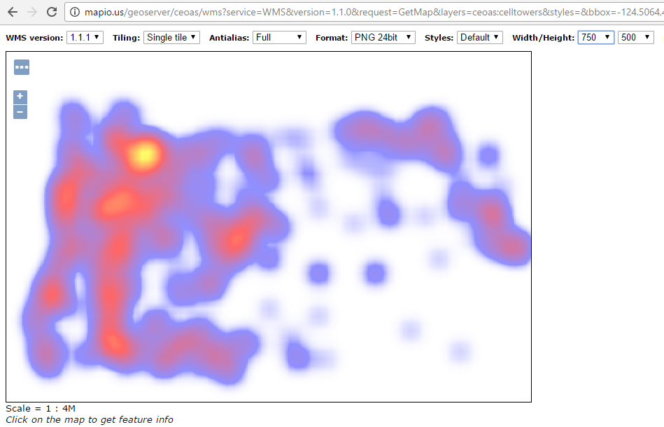
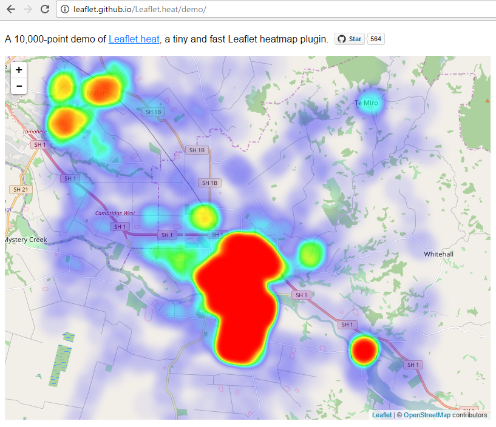
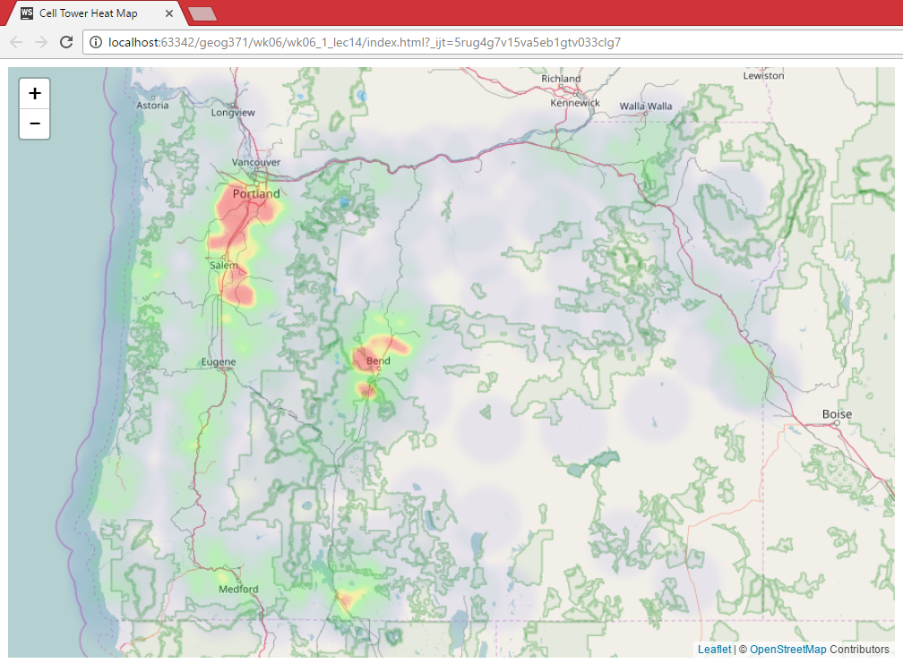

# Thematic Web Maps II: Heatmap

> Fall 2017 | Geography 371 | Geovisualization: Web Mapping
>
> Instructor: Bo Zhao | Location: Wilkinson 235 | Time: MWF 1200 to 1250

**Learning Objectives**

- Create Heatmap using GeoServer;
- Create Heatmap using Leaflet.heat; and
- Reflect on the load balance between server and client.

A Heat Map is a way of representing the density or intensity value of point data by assigning a colour gradient to a raster where the cell color is based on clustering of points or an intensity value. The colour gradient usually ranges from cool/cold colors such as hues of blue, to warmer/hot colors such as yellow, orange and hot red. When mapping the density of points that represent the occurrence of an event, a raster cell is coloured red when many points are in close proximity and blue when points are dispersed (if using the colour range above). Therefore, the higher the concentration of points in an area the greater the ‘heat’ applied to the raster. When mapping intensity, points are assigned an intensity value, the higher the value the hotter the color assigned to the raster, with lower intensity values assigned cooler colours. Here, we will look at mapping density.

## 1. Making Heat Map at the server side

### 1.1 Rendering Transformations

**Rendering Transformations** allow processing to be carried out on datasets within the GeoServer rendering pipeline. A typical transformation computes a derived or aggregated result from the input data, allowing various useful visualization effects to be obtained. Transformations may transform data from one format into another (i.e vector to raster or vice-versa), to provide an appropriate format for display.

The following table lists examples of various kinds of rendering transformations available in GeoServer:

| **Type**         | **Examples**                             |
| ---------------- | ---------------------------------------- |
| Raster-to-Vector | **Contour** extracts contours from a DEM raster. **RasterAsPointCollections** extracts a vector field from a multi-band raster |
| Vector-to-Raster | **BarnesSurfaceInterpolation** computes a surface from scattered data points.**Heatmap** computes a heatmap surface from weighted data points. |
| Vector-to-Vector | **PointStacker** aggregates dense point data into clusters. |

Rendering transformations are invoked within SLD styles. Parameters may be supplied to control the appearance of the output. The rendered output for the layer is produced by applying the styling rules and symbolizers in the SLD to the result of transformation.

Rendering transformations are implemented using the same mechanism as [*WPS Processes*](http://docs.geoserver.org/2.8.x/en/user/extensions/wps/processes.html#wps-processes). They can thus also be executed via the WPS protocol, if required. Conversely, any WPS process can be executed as a transformation, as long as the input and output are appropriate for use within an SLD.

This section is a general guide to rendering transformation usage in GeoServer. For details of input, parameters, and output for any particular rendering transformation, refer to its own documentation.

### 1.2 Usage

Rendering Transformations are invoked by adding the <Transformation> element to a <FeatureTypeStyle> element in an SLD document. This element specifies the name of the transformation process, and usually includes parameter values controlling the operation of the transformation.

The <Transformation> element syntax leverages the OGC Filter function syntax. The content of the element is a <ogc:Function> with the name of the rendering transformation process. Transformation processes may accept some number of parameters, which may be either required (in which case they must be specified), or optional (in which case they may be omitted if the default value is acceptable). Parameters are supplied as name/value pairs. Each parameter’s name and value are supplied via another function <ogc:Function name="parameter">. The first argument to this function is an <ogc:Literal>containing the name of the parameter. The optional following arguments provide the value for the parameter (if any). Some parameters accept only a single value, while others may accept a list of values. As with any filter function argument, values may be supplied in several ways:

- As a literal value
- As a computed expression
- As an SLD environment variable, whose actual value is supplied in the WMS request (see [*Variable substitution in SLD*](http://docs.geoserver.org/2.8.x/en/user/styling/sld-extensions/substitution.html#sld-variable-substitution)).
- As a predefined SLD environment variable (which allows obtaining values for the current request such as output image width and height).

The order of the supplied parameters is not significant.

Most rendering transformations take as input a dataset to be transformed. This is supplied via a special named parameter which does not have a value specified. The name of the parameter is determined by the particular transformation being used. When the transformation is executed, the input dataset is passed to it via this parameter.

The input dataset is determined by the same query mechanism as used for all WMS requests, and can thus be filtered in the request if required.

In rendering transformations which take as input a featuretype (vector dataset) and convert it to a raster dataset, in order to pass validation the SLD needs to mention the geometry attribute of the input dataset (even though it is not used). This is done by specifying the attribute name in the symbolizer <Geometry>element.

The output of the rendering transformation is styled using symbolizers appropriate to its format:[*PointSymbolizer*](http://docs.geoserver.org/2.8.x/en/user/styling/sld-reference/pointsymbolizer.html#sld-reference-pointsymbolizer), [*LineSymbolizer*](http://docs.geoserver.org/2.8.x/en/user/styling/sld-reference/linesymbolizer.html#sld-reference-linesymbolizer), [*PolygonSymbolizer*](http://docs.geoserver.org/2.8.x/en/user/styling/sld-reference/polygonsymbolizer.html#sld-reference-polygonsymbolizer), and [*TextSymbolizer*](http://docs.geoserver.org/2.8.x/en/user/styling/sld-reference/textsymbolizer.html#sld-reference-textsymbolizer) for vector data, and [*RasterSymbolizer*](http://docs.geoserver.org/2.8.x/en/user/styling/sld-reference/rastersymbolizer.html#sld-reference-rastersymbolizer) for raster coverage data.

If it is desired to display the input dataset in its orginal form, or transformed in another way, there are two options:

- Another <FeatureTypeStyle> can be used in the same SLD
- Another SLD can be created, and the layer displayed twice using the different SLDs

### 1.3 Heatmap generation

`gs:Heatmap` is a **Vector-to-Raster** rendering transformation which generates a heatmap surface from weighted point data. The following SLD invokes a Heatmap rendering transformation on a featuretype with point geometries. The output is styled using a color ramp across the output data value range [0 .. 1].

```xml
<?xml version="1.0" encoding="ISO-8859-1"?>
   <StyledLayerDescriptor version="1.0.0"
       xsi:schemaLocation="http://www.opengis.net/sld StyledLayerDescriptor.xsd"
       xmlns="http://www.opengis.net/sld"
       xmlns:ogc="http://www.opengis.net/ogc"
       xmlns:xlink="http://www.w3.org/1999/xlink"
       xmlns:xsi="http://www.w3.org/2001/XMLSchema-instance">
     <NamedLayer>
       <Name>Heatmap</Name>
       <UserStyle>
         <Title>Heatmap</Title>
         <Abstract>A heatmap surface</Abstract>
         <FeatureTypeStyle>
           <Transformation>
             <ogc:Function name="gs:Heatmap">
               <ogc:Function name="parameter">
                 <ogc:Literal>data</ogc:Literal>
               </ogc:Function>
               <ogc:Function name="parameter">
                 <ogc:Literal>radiusPixels</ogc:Literal>
                 <ogc:Function name="env">
                   <ogc:Literal>radius</ogc:Literal>
                   <ogc:Literal>35</ogc:Literal>
                 </ogc:Function>
               </ogc:Function>
               <ogc:Function name="parameter">
                 <ogc:Literal>pixelsPerCell</ogc:Literal>
                 <ogc:Literal>10</ogc:Literal>
               </ogc:Function>
               <ogc:Function name="parameter">
                 <ogc:Literal>outputBBOX</ogc:Literal>
                 <ogc:Function name="env">
                   <ogc:Literal>wms_bbox</ogc:Literal>
                 </ogc:Function>
               </ogc:Function>
               <ogc:Function name="parameter">
                 <ogc:Literal>outputWidth</ogc:Literal>
                 <ogc:Function name="env">
                   <ogc:Literal>wms_width</ogc:Literal>
                 </ogc:Function>
               </ogc:Function>
               <ogc:Function name="parameter">
                 <ogc:Literal>outputHeight</ogc:Literal>
                 <ogc:Function name="env">
                   <ogc:Literal>wms_height</ogc:Literal>
                 </ogc:Function>
               </ogc:Function>
             </ogc:Function>
           </Transformation>
          <Rule>
            <RasterSymbolizer>
            <!-- specify geometry attribute to pass validation -->
              <Geometry>
                <ogc:PropertyName>SHAPE</ogc:PropertyName></Geometry>
              <Opacity>0.6</Opacity>
              <ColorMap type="ramp" >
                <ColorMapEntry color="#FFFFFF" quantity="0" label="nodata"
                  opacity="0"/>
                <ColorMapEntry color="#4444FF" quantity=".1" label=".1"/>
                <ColorMapEntry color="#FF0000" quantity=".5" label=".5" />
                <ColorMapEntry color="#FFFF00" quantity="1.0" label="1.0" />
              </ColorMap>
            </RasterSymbolizer>
           </Rule>
         </FeatureTypeStyle>
       </UserStyle>
     </NamedLayer>
    </StyledLayerDescriptor>
```
Once applying this SLD file to the cell tower shapefile, we can access the heatmap from the url below:

```http
http://mapious.ceoas.oregonstate.edu/geoserver/mapious/wms?service=WMS&version=1.1.0&request=GetMap&layers=mapious:heatmap_celltowers&styles=&bbox=-124.5064,42.0056,-116.9653,46.1664&width=768&height=423&srs=EPSG:4326&format=application/openlayers
```



## 2. Create a heat map at the client side



Leaflet.heat is a tiny, simple and fast [Leaflet](http://leafletjs.com) heatmap plugin.

**Demos**

- [10,000 points ](http://leaflet.github.io/Leaflet.heat/demo)
- [Adding points dynamically ](http://leaflet.github.io/Leaflet.heat/demo/draw.html)

### 2.1 Usage

```js
var heat = L.heatLayer([
	[50.5, 30.5, 0.2], // lat, lng, intensity
	[50.6, 30.4, 0.5],
	...
], {radius: 25}).addTo(map);
```

To include the plugin, just use `leaflet-heat.js` from the `dist` folder:

```html
<script src="leaflet-heat.js"></script>
```

### 2.2 L.heatLayer(latlngs, options)

Constructs a heatmap layer given an array of points and an object with the following options:
- **minOpacity** - the minimum opacity the heat will start at
- **maxZoom** - zoom level where the points reach maximum intensity (as intensity scales with zoom),
  equals `maxZoom` of the map by default
- **max** - maximum point intensity, `1.0` by default
- **radius** - radius of each "point" of the heatmap, `25` by default
- **blur** - amount of blur, `15` by default
- **gradient** - color gradient config, e.g. `{0.4: 'blue', 0.65: 'lime', 1: 'red'}`

Each point in the input array can be either an array like `[50.5, 30.5, 0.5]`,
or a [Leaflet LatLng object](http://leafletjs.com/reference.html#latlng).

Optional third argument in each `LatLng` point (`altitude`) represents point intensity.
Unless `max` option is specified, intensity should range between `0.0` and `1.0`.

### 2.3 Methods

- **setOptions(options)**: Sets new heatmap options and redraws it.
- **addLatLng(latlng)**: Adds a new point to the heatmap and redraws it.
- **setLatLngs(latlngs)**: Resets heatmap data and redraws it.
- **redraw()**: Redraws the heatmap.


Using this Heatmap plugin for leaflet, I created a heatmap of cell towers in Oregon. Please pay attention to how to link in the **leaflet heat plugin**, and how to use the **heatlayer**.

### 2.4 Heatmap generation

```HTML
<!DOCTYPE html>
<html>
<head>
  <title>Cell Tower Heat Map </title>
  <link rel="stylesheet"  href="http://cdn.leafletjs.com/leaflet-0.7/leaflet.css" />
  <link rel="stylesheet" href="https://unpkg.com/leaflet@1.0.2/dist/leaflet.css" />
  <script src="https://unpkg.com/leaflet@1.0.2/dist/leaflet.js"></script>
  <script src="http://leaflet.github.io/Leaflet.heat/dist/leaflet-heat.js"></script>
  <script src="https://ajax.googleapis.com/ajax/libs/jquery/3.1.0/jquery.min.js"></script>
</head>
<body>
	<div id="map" style="width: 900px; height: 600px"></div>
<script src="assets/2013-earthquake.js"></script>
<script>
	var map = L.map('map').setView([44.1, -120.5], 7);
	L.tileLayer( 'http://{s}.tile.openstreetmap.org/{z}/{x}/{y}.png', {
		attribution: '&copy; \<a href="http://openstreetmap.org"\>OpenStreetMap\</a\> Contributors',
		maxZoom: 18
    }).addTo(map);

	var heat = null;
	// Get GeoJSON and put on it on the map when it loads
	$.getJSON("assets/cell_towers.geojson",function(data){
      // set cellTowers to the dataset, and add the cell towers GeoJSON layer to the map
      cell_tower_data = [];
      for (var i = 0; i < data.features.length; i++ ) {
          cell_tower_data[i] = [
                      data.features[i].geometry.coordinates[0][1],
                      data.features[i].geometry.coordinates[0][0]]
      }

      heat = L.heatLayer(cell_tower_data,{
            radius: 35,
            blur: 10,
            maxZoom: 17,
            gradient: {0.05: 'blue', 0.25: 'lime',  0.27: 'yellow', 0.3: 'red'}
          }).addTo(map);
	});

</script>
</body>
</html>
```


> using leaflet.heat to create a heat map at the client side.

## References:

1. https://glenbambrick.com/2016/01/18/heatmap-with-leaflet/
2. http://bl.ocks.org/d3noob/8973028
3. http://www.digital-geography.com/csv-heatmap-leaflet/#.WFiDNrYrK50
4. https://github.com/Leaflet/Leaflet.heat
5. http://docs.geoserver.org/2.8.x/en/user/styling/sld-extensions/rendering-transform.html#heatmap-generation
6. http://docs.geoserver.org/2.8.x/en/user/extensions/wps/install.html#wps-install
7. http://docs.geoserver.org/2.7.1/user/extensions/wps/operations.html