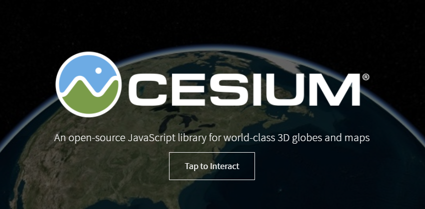
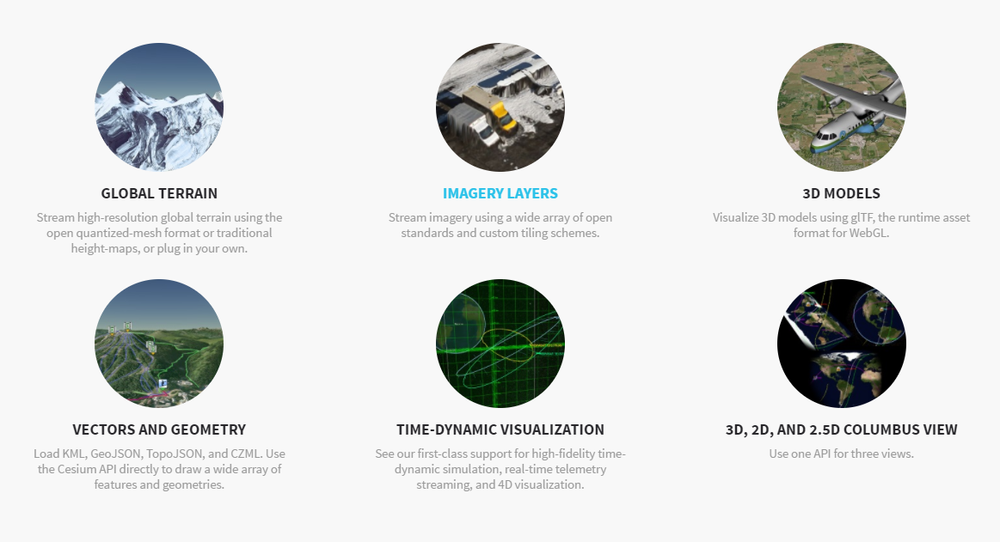
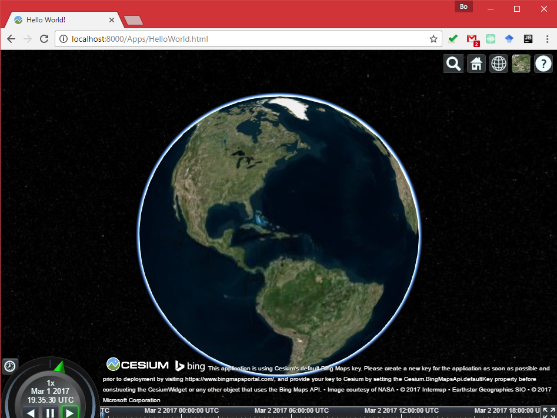

# 3D Web Mapping II: Cesium.js

> Fall 2017 | Geography 371 | Geovisualization: Web Mapping
>
> Instructor: Bo Zhao | Location: Wilkinson 235 | Time: MWF 1200 to 1250

**Learning Objectives**

- Get to know the basics of 3D visualization on web, including the history, browsers, libraries and applications;
- Get to know the virtual globe library Cesium.js;
- Make a virtual globe application using cesium.js; and
- overlay different map service providers.

## 1. WebGL

WebGL (Web Graphics Library) is a JavaScript API for rendering 3D graphics within any compatible web browser without the use of plug-ins. WebGL is integrated completely into all the web standards of the browser allowing GPU accelerated usage of physics and image processing and effects as part of the web page canvas. WebGL elements can be mixed with other HTML elements and composited with other parts of the page or page background. WebGL programs consist of control code written in JavaScript and shader code that is written in GLSL, a language similar to C/C++, and is executed on a computer's Graphics Processing Unit (GPU). WebGL is designed and maintained by the non-profit Khronos Group.


### 1.1 History

WebGL evolved out of the Canvas 3D experiments started by Vladimir Vukićević at Mozilla. Vukićević first demonstrated a Canvas 3D prototype in 2006. By the end of 2007, both `Mozilla` and `Opera` had made their own separate implementations.

In early 2009, the non-profit technology consortium Khronos Group started the WebGL Working Group, with initial participation from Apple, Google, Mozilla, Opera, and others. Version 1.0 of the WebGL specification was released March 2011. As of March 2012, the chair of the working group is Ken Russell.

Early applications of WebGL include Zygote Body. In November 2012 Autodesk announced that they ported most of their applications to the cloud running on local WebGL clients. These applications included Fusion 360 and AutoCAD 360.

Development of the WebGL 2 specification started in 2013. This specification is based on OpenGL ES 3.0.

### 1.2 Support

WebGL is widely supported in modern browsers. However its availability is dependent on other factors like the GPU supporting it. The official WebGL website offers [a simple test page](https://get.webgl.org/).


- Google Chrome – WebGL has been enabled on all platforms that have a capable graphics card with updated drivers since version 9, released in February 2011. By default on Windows, Chrome uses the ANGLE (Almost Native Graphics Layer Engine) renderer to translate OpenGL ES to Direct X 9.0c or 11.0, which have better driver support. On Linux and Mac OS X the default renderer is OpenGL however. It is also possible to force OpenGL as the renderer on Windows. Since September 2013, Chrome also has a newer Direct3D 11 renderer, which however requires a newer graphics card.
- Mozilla Firefox – WebGL has been enabled on all platforms that have a capable graphics card with updated drivers since version 4.0. Since 2013 Firefox also uses DirectX on the Windows platform via ANGLE.
- Safari – Safari 6.0 and newer versions installed on OS X Mountain Lion, Mac OS X Lion and Safari 5.1 on Mac OS X Snow Leopard implemented support for WebGL, which was disabled by default before Safari 8.0.
- Opera – WebGL has been implemented in Opera 11 and 12, although was disabled by default in 2014.
- Internet Explorer – WebGL is partially supported in Internet Explorer 11. It initially failed the majority of official WebGL conformance tests, but Microsoft later released several updates. The latest 0.94 WebGL engine currently passes ~97% of Khronos tests. WebGL support can also be manually added to earlier versions of Internet Explorer using third-party plugins such as IEWebGL.
- Microsoft Edge – The initial stable release supports WebGL version 0.95 (context name: "experimental-webgl") with an open source GLSL to HLSL transpiler.

### 1.3 WebGL Libraries

The WebGL API may be too tedious to use directly without some utility libraries, which for example set up typical view transformation shaders (e.g. for view frustum). Loading scene graphs and 3D objects in the popular industry formats is also not directly provided for. JavaScript libraries have been built (or sometimes ported to WebGL) to provide the additional functionality. A non-exhaustive list of libraries that provide many high-level features includes `A-Frame (VR)`, `BabylonJS`, `PlayCanvas`, `three.js`, `OSG.JS` and `CopperLicht`. There also has been a rapid emergence of game engines for WebGL, including `Unreal Engine 4` and `Unity 5`. The Stage3D/Flash-based `Away3D` high-level library also has a port to WebGL via `TypeScript`. A more light-weight utility library that provides just the vector and matrix math utilities for shaders is `sylvester.js`. It is sometimes used in conjunction with a WebGL specific extension called `glUtils.js`. Although not very common, some 3D libraries, like the one used by `LAI4D`, can work with HTML5 canvas when WebGL is not supported.

There are also some 2D libraries built on top of WebGL like `Cocos2d-x` or `Pixi.js`, which were implemented this way for performance reasons, in a move that parallels what happened with the `Starling Framework` over `Stage3D` in the Flash world. The WebGL-based 2D libraries fall back to HTML5 canvas when WebGL is not available.

**X3D** also made a project called `X3DOM` to make X3D and VRML content running on WebGL. The 3D model will in XML tag `<X3D>` in HTML5 and interactive script will use JavaScript and DOM. **BS Content Studio** and **InstantReality X3D exporter** can exported X3D in HTML and running by WebGL.

### 1.4 Experience curiosity

NASA developed an interactive web application called [Experience Curiosity](https://eyes.nasa.gov/curiosity/) ([https://eyes.nasa.gov/curiosity/](https://eyes.nasa.gov/curiosity/))to celebrate the 3rd anniversary of the Curiosity rover landing on Mars. This Blend4Web-based app makes it possible to operate the rover, control its cameras and the robotic arm, and reproduces some of the prominent events of the Mars Science Laboratory mission.[The application was presented at the beginning of the WebGL section at SIGGRAPH 2015.

Experience Curiosity won the [Webby Award](http://webbyawards.com/) as the best "Government & Civil Innovation" website of 2016. The 5-word speech at the award ceremony was **Rockin' and Rovin' on Mars**, voiced by NASA's representative Brian Kumanchik.


## 2. Intro to Cesium.js

`Cesium` is an open-source JavaScript library for world-class 3D globes and maps. It creates the leading 3D globe and map for static and time-dynamic content, with the best possible performance, precision, visual quality, platform support, community, and ease of use.



Cesium was founded by [AGI](http://www.agi.com/) (AGI) in 2011 as a cross-platform virtual globe for dynamic-data visualization in the space and defense industries. Since then, Cesium has grown into a 3D globe serving industries from geospatial and oil and gas to agriculture, real estate, entertainment, and sports. Currently, Cesium is lead by the Cesium Consortium, started by [Analytical Graphics, Inc.](http://www.agi.com/) and [Bentley Systems](https://www.bentley.com/). The consortium was started to accelerate open-source Cesium development and support long-term open-source Cesium sustainability.

AGI uses Cesium in many of its own applications, such as [ComSpOC](https://comspoc.com/) and [NORAD Tracks Santa](http://cesiumjs.org/demos/noradtrackssanta.html), and develops value-add products for Cesium including the [STK Terrain Server](http://www.agi.com/products/stk/terrain-server/).

### 2.1 Open Standards and Formats

A number of open 3D geospatial formats have grown out of Cesium. Open formats create interoperability for a full ecosystem of tools.

[CZML](https://github.com/AnalyticalGraphicsInc/czml-writer/wiki/CZML-Guide), the Cesium Language, is a JSON schema for describing time-dynamic 3D scenes such as of satellites and aircraft. The [quantized-mesh](https://github.com/AnalyticalGraphicsInc/quantized-mesh)format enables efficient 3D terrain streaming and rendering. The Cesium team has worked closely with Khronos to create [glTF](https://www.khronos.org/gltf), the GL Transmission Format, which is the open-standard runtime asset format for WebGL engines. [3D Tiles](https://cesiumjs.org/2015/08/10/Introducing-3D-Tiles/) are a specification for streaming massive heterogeneous 3D geospatial datasets.

###  2.2 Dynamic Geospatial Visualization



- Visualize high-resolution global [terrain](http://cesiumjs.org/Cesium/Apps/Sandcastle/index.html?src=Terrain.html).
- [Layer imagery](http://cesiumjs.org/Cesium/Apps/Sandcastle/index.html?src=Imagery%20Layers.html) from multiple sources, including WMS, TMS, WMTS, Bing Maps, Mapbox, Google Earth Enterprise, OpenStreetMap, ArcGIS MapServer, standard image files, and custom tiling schemes. Each layer can be alpha-blended with the layers below it, and its brightness, contrast, gamma, hue, and saturation can be dynamically changed.
- Industry standard vector formats, such as [KML](http://cesiumjs.org/Cesium/Apps/Sandcastle/index.html?src=KML.html&label=DataSources), [GeoJSON, and TopoJSON](http://cesiumjs.org/Cesium/Apps/Sandcastle/index.html?src=GeoJSON%20and%20TopoJSON.html&label=DataSources), including terrain clamping.
- Draw [3D models](http://cesiumjs.org/Cesium/Apps/Sandcastle/index.html?src=3D%20Models.html) using glTF with animations and skins. Clamp models to terrain. Convert COLLADA and OBJ to glTF using the [online converter](http://cesiumjs.org/convertmodel.html). Use [KHR_binary_glTF](https://github.com/KhronosGroup/glTF/blob/master/extensions/Khronos/KHR_binary_glTF/README.md) and [WEB3D_quantized_attributes](https://github.com/KhronosGroup/glTF/blob/master/extensions/Vendor/WEB3D_quantized_attributes/README.md) extensions to reduce the file size.
- Create data-driven time-dynamic scenes using [CZML](http://cesiumjs.org/Cesium/Apps/Sandcastle/index.html?src=CZML.html).
- Draw and style a wide range of geometries:
- [Shadows](http://cesiumjs.org/Cesium/Apps/Sandcastle/index.html?src=Shadows.html&label=Showcases), including self-shadows and soft-shadows for terrain, 3D models, and geometries, based on the sun position.
- Draw the atmosphere, fog, sun, sun lighting, moon, stars, and water.
- Individual object [picking](http://cesiumjs.org/Cesium/Apps/Sandcastle/index.html?src=Picking.html).
- [Camera](http://cesiumjs.org/Cesium/Apps/Sandcastle/index.html?src=Camera.html) navigation with mouse and touch handlers for rotate, zoom, pan with inertia, flights, free look, and terrain collision detection.
- Batching, culling, and JavaScript and GPU optimizations for performance.
- Precision handling for large view distances (avoiding [z-fighting](http://www.sjbaker.org/steve/omniv/love_your_z_buffer.html)) and large world coordinates (avoiding [jitter](http://blog.virtualglobebook.com/2010/11/vertex-transform-precision.html)).
- A 3D globe, 2D map, and Columbus view (2.5D) with the same API.
- Display military symbology, such as MIL-STD-2525 and STANAG APP6, by [integrating with milsymbol](http://cesiumjs.org/2016/07/20/Cesium-and-milsymbol/)
- [Cluster](http://cesiumjs.org/Cesium/Apps/Sandcastle/index.html?src=Clustering.html&label=Showcases) points, labels and billboards.

### 2.3 Widgets

- Timeline and animation widgets for controlling simulation time.
- Base layer picker widget for selecting imagery and terrain.
- Selection and info box widgets for highlighting objects and displaying information.
- Geocoder widget for flying to addresses and landmarks.
- Home view widget to fly to the default camera view.
- Scene mode picker widget to morph between 3D, 2D, and Columbus view.
- Fullscreen widget for toggling fullscreen mode.
- Navigation help widget for providing mouse and touch instructions.
- Performance watch dog for monitoring the frame rate.
- [Inspector widget](http://cesiumjs.org/Cesium/Apps/Sandcastle/index.html?src=Cesium%20Inspector.html) for advanced graphics debugging.
- [WebVR widget](http://cesiumjs.org/Cesium/Apps/Sandcastle/index.html?src=Cardboard.html) for viewing Cesium with VR devices like Google Cardboard.

### 2.4 High-Precision Math and Time

- Reference frames such as World Geodetic System (WGS84), International Celestial Reference Frame (ICRF), and east-north-up.
- Equidistant Cylindrical and Mercator 2D map projections.
- Conversions such as longitude/latitude/height to Cartesian.
- Fast Cartesian, spherical, cartographic, matrix, and quaternion types.
- Julian dates, leap seconds, and UTC and TAI time standards.

## 3. The first virtual globe

### 3.1 Making sure that your browser is Cesium-ready

The easiest way to verify that Cesium works in your web browser is to run the Hello World example by clicking here (opens a new window). If you see something like the below image, congratulations, your system can run Cesium and you can safely skip to the next section; otherwise, continue reading.



Cesium is built on several new HTML5 technologies, the most important of which is [WebGL](http://en.wikipedia.org/wiki/WebGL). Even though these new standards are quickly becoming widely adopted, some browsers and systems need to be updated to support them. If the example application doesn’t work for you, here are a few things to try.

1. Update your web browser. Most of the Cesium team uses Google Chrome, but Firefox, Internet Explorer 11, and Opera will also work. If you’re already using one of the above browsers, make sure it’s updated to the latest version.

2. Update your video card driver to better support 3D. If you know what type of video card you have, you can check the vendor web site for updates. The three most popular are: [Nvidia](http://www.nvidia.com/drivers), [AMD](http://www.amd.com/drivers), and [Intel](https://downloadcenter.intel.com/default.aspx).

3. If you’re still having problems, try visiting [http://get.webgl.org/](http://get.webgl.org/), which offers additional trouble-shooting advice. You can also ask for help on the [Cesium forum](http://cesiumjs.org/forum.html).

### 3.2 Hello world! Example.

If you open up `helloworld.html` in an editor, you’ll find the following simple application.

```html
<!DOCTYPE html>
<html lang="en">
<head>
    <!-- Use correct character set. -->
    <meta charset="utf-8">
    <!-- Tell IE to use the latest, best version. -->
    <meta http-equiv="X-UA-Compatible" content="IE=edge">
    <!-- Make the application on mobile take up the full browser screen and disable user scaling. -->
    <meta name="viewport" content="width=device-width, initial-scale=1">
    <title>Hello World!</title>
    <link rel="stylesheet" href="https://cesiumjs.org/releases/1.39/Build/Cesium/Widgets/widgets.css">
    <script src="https://cesiumjs.org/releases/1.39/Build/Cesium/Cesium.js"></script>
    <style>
        html, body, #cesiumContainer {
            width: 100%; height: 100%; margin: 0; padding: 0; overflow: hidden;
        }
    </style>
</head>
<body>
<div id="cesiumContainer"></div>
<script>

    //Cesium.BingMapsApi.defaultKey = "AgUQJFnmoxa47CoxZf-zslnbrBqBzATAxYAiQnd__-q8eGgLZu1ygR8_p2jI3Y9u";
    var viewer = new Cesium.Viewer('cesiumContainer');
</script>
</body>
</html>

```

These are the four lines needed to add Cesium to an application:

The first step is to include Cesium.js in a script tag. This defines the Cesium object, which contains everything we need.

```html
 <script src="https://cesiumjs.org/releases/1.39/Build/Cesium/Cesium.js"></script>
```

In order to use the Cesium Viewer widget, we need to include its CSS.

```css
<link rel="stylesheet" href="https://cesiumjs.org/releases/1.39/Build/Cesium/Widgets/widgets.css">
```

In the HTML body, we create a div for the viewer to live.

```html
 <div id="cesiumContainer"></div>
```

Finally, we create an instance of viewer.

```javascript
 var viewer = new Cesium.Viewer('cesiumContainer');
```

### 3.4 Imagery Layers

Cesium supports drawing and layering high-resolution imagery (maps) from several standard services. Layers can be ordered, and blended together. Each layer’s brightness, contrast, gamma, hue, and saturation can be dynamically changed. This tutorial introduces imagery layer concepts and the related Cesium APIs.

Let’s ignore the details for the moment and just jump in by writing code to add a few imagery layers. Open the index.html in the root directory of this lecture. This example creates a `Viewer` widget which, which, by default, has a single layer rendering Bing Maps imagery. We can specify a different base layer by providing an additional parameter to the `Viewer` constructor. Let’s use a layer from an [Esri ArcGIS MapServer](http://server.arcgisonline.com/ArcGIS/rest/services/World_Street_Map/MapServer):

```javascript
var viewer = new Cesium.Viewer('cesiumContainer', {
    imageryProvider : new Cesium.ArcGisMapServerImageryProvider({
        url : 'http://server.arcgisonline.com/ArcGIS/rest/services/World_Street_Map/MapServer'
    })
});
```

### 3.5 Imagery providers

High-resolution imagery like the first two layers used above is too large to fit into memory or often even a single disk, so imagery is divided into smaller images, called *tiles*, that can be streamed to a client as needed based on the view. Cesium supports several standards for requesting tiles using *imagery providers*. Most imagery providers use a [REST interface](http://rest.elkstein.org/) over HTTP to request tiles. Imagery providers differ based on how requests are formatted and how tiles are organized. Cesium has the following imagery providers:

- [Web Map Service](http://www.opengeospatial.org/standards/wms) (WMS) - An OGC standard for requesting map tiles for a geographic region from distributed geospatial databases. In Cesium, see [WebMapServiceImageryProvider](http://cesiumjs.org/Cesium/Build/Documentation/WebMapServiceImageryProvider.html).
- [Tile Map Service](http://cesiumjs.org/Cesium/Build/Documentation/TileMapServiceImageryProvider.html) (TMS) - A REST interface for accessing map tiles. Tiles can be generated with [MapTiler](http://www.maptiler.org/) or [GDAL2Tiles](http://www.klokan.cz/projects/gdal2tiles/). In Cesium, see [TileMapServiceImageryProvider](http://cesiumjs.org/Cesium/Build/Documentation/TileMapServiceImageryProvider.html).
- [OpenGIS Web Map Tile Service](http://www.opengeospatial.org/standards/wmts) (WMTS) - An OGC standard for serving pre-rendered georeferenced map tiles over the Internet. In Cesium, see [WebMapServiceImageryProvider](http://cesiumjs.org/Cesium/Build/Documentation/WebMapTileServiceImageryProvider.html).
- [OpenStreetMap](http://wiki.openstreetmap.org/wiki/Main_Page) - Access to OpenStreetMap tiles or any [Slippy map tiles](http://wiki.openstreetmap.org/wiki/Slippy_map_tilenames). There are several ways to [host these tiles](http://switch2osm.org/serving-tiles/). In Cesium, see [createOpenStreetMapImageryProvider](http://cesiumjs.org/Cesium/Build/Documentation/createOpenStreetMapImageryProvider.html).
- [Bing Maps](http://www.bing.com/maps/) - Uses [Bing Maps REST Services](http://msdn.microsoft.com/en-us/library/ff701713.aspx) to access tiles. A Bing Maps key can be created at [https://www.bingmapsportal.com/](https://www.bingmapsportal.com/). In Cesium, see [BingMapsImageryProvider](http://cesiumjs.org/Cesium/Build/Documentation/BingMapsImageryProvider.html).
- Esri ArcGIS MapServer - Uses the [ArcGIS Server REST API](http://resources.esri.com/help/9.3/arcgisserver/apis/rest/) to access tiles hosted by an ArcGIS MapServer. In Cesium, see [ArcGisMapServerImageryProvider](http://cesiumjs.org/Cesium/Build/Documentation/ArcGisMapServerImageryProvider.html).
- [Google Earth Enterprise](http://www.google.com/enterprise/mapsearth/products/earthenterprise.html) - Provides access to the imagery stored in your organization’s Google Earth Enterprise server. In Cesium, see [GoogleEarthImageryProvider](http://cesiumjs.org/Cesium/Build/Documentation/GoogleEarthImageryProvider.html).
- [Mapbox](https://www.mapbox.com/) - Uses the [Mapbox API](https://www.mapbox.com/developers/api/) to access tiles. Create an account and supply your [access token](https://www.mapbox.com/account/apps/). In Cesium, see [MapboxImageryProvider](http://cesiumjs.org/Cesium/Build/Documentation/MapboxImageryProvider.html).
- Standard image files - Create a tile from a single image. In Cesium, see [SingleTileImageryProvider](http://cesiumjs.org/Cesium/Build/Documentation/SingleTileImageryProvider.html).
- Custom tiling schemes - Using [UrlTemplateImageryProvider](http://cesiumjs.org/Cesium/Build/Documentation/UrlTemplateImageryProvider.html), we can connect to a wide array of imagery sources by using a URL template. For example, a URL template for TMS is `//cesiumjs.org/tilesets/imagery/naturalearthii/{z}/{x}/{reverseY}.jpg`.
- [Tile coordinates](http://cesiumjs.org/Cesium/Build/Documentation/TileCoordinatesImageryProvider.html) - Shows how the globe is divided into tiles in a particular tiling scheme by drawing a border around each tile and labeling it with its level, X, and Y coordinates.

We can access other imagery services by implementing the [ImageryProvider](http://cesiumjs.org/Cesium/Build/Documentation/ImageryProvider.html) interface. If you do so, and think it is generally useful, please [contribute](https://github.com/AnalyticalGraphicsInc/cesium/wiki/Contributor%27s-Guide) it to Cesium for everyone’s benefit.

See the [reference documentation](http://cesiumjs.org/Cesium/Build/Documentation/?classFilter=ImageryProvider) for how to construct a particular imagery provider. We’ll look at the [SingleTileImageryProvider](http://cesiumjs.org/Cesium/Build/Documentation/SingleTileImageryProvider.html) here since many imagery providers share its construction properties:

- `url` - The url to the image. Like many imagery providers, this is the only required property. In other imagery providers this url points to the server or the root url of the service.
- `extent` - An optional longitude-latitude rectangle that the image should cover. The default is to cover the entire globe.
- `credit` - An optional string crediting the data source, which is displayed on the canvas. Some imagery providers, like [BingMapsImageryProvider](http://cesiumjs.org/Cesium/Build/Documentation/BingMapsImageryProvider.html) and [ArcGIS Server REST API](http://resources.esri.com/help/9.3/arcgisserver/apis/rest/), get a credit logo or string directly from their service.
- `proxy` - An optional proxy to use for requests to the service, which brings us to Cross-Origin Resource Sharing.

**Imagery providers vs. layers**

So far we haven’t clearly differentiated between imagery providers and layers. An imagery provider makes requests for tiles using a particular service, while a *layer* represents displayed tiles from an imagery provider. Code like

```javascript
var layer = layers.addImageryProvider(imageryProvider);
```

is shorthand for

```javascript
var layer = new ImageryLayer(imageryProvider);
layers.add(layer);
```

We usually construct an imagery provider just to create a layer, then we manipulate the layer to change its visual appearance using its properties like `show`, `alpha`, `brightness`, and `contrast`. See [ImageryLayer](http://cesiumjs.org/Cesium/Build/Documentation/ImageryLayer.html). Decoupling imagery providers and layers makes it easier to write new imagery providers.

An *imagery layer collection*, like `layers` in the above examples, determines the order in which layers are drawn. Layers are drawn bottom-to-top based on the order they are added. Imagery layer collections are manipulated like any other collection in Cesium using functions like `add`, `remove`, and `get`. In addition, layers can be reordered using `raise`, `raiseToTop`, `lower`, and `lowerToBottom`. See [ImageryLayerCollection](http://cesiumjs.org/Cesium/Build/Documentation/ImageryLayerCollection.html).


## References:

[1]. http://cesiumjs.org/tutorials/Imagery-Layers-Tutorial/

[2]. http://cesiumjs.org/tutorials/cesium-up-and-running/