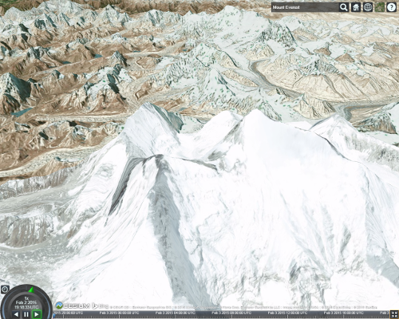
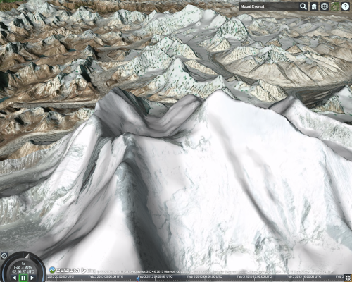
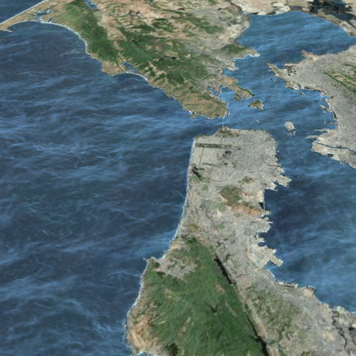
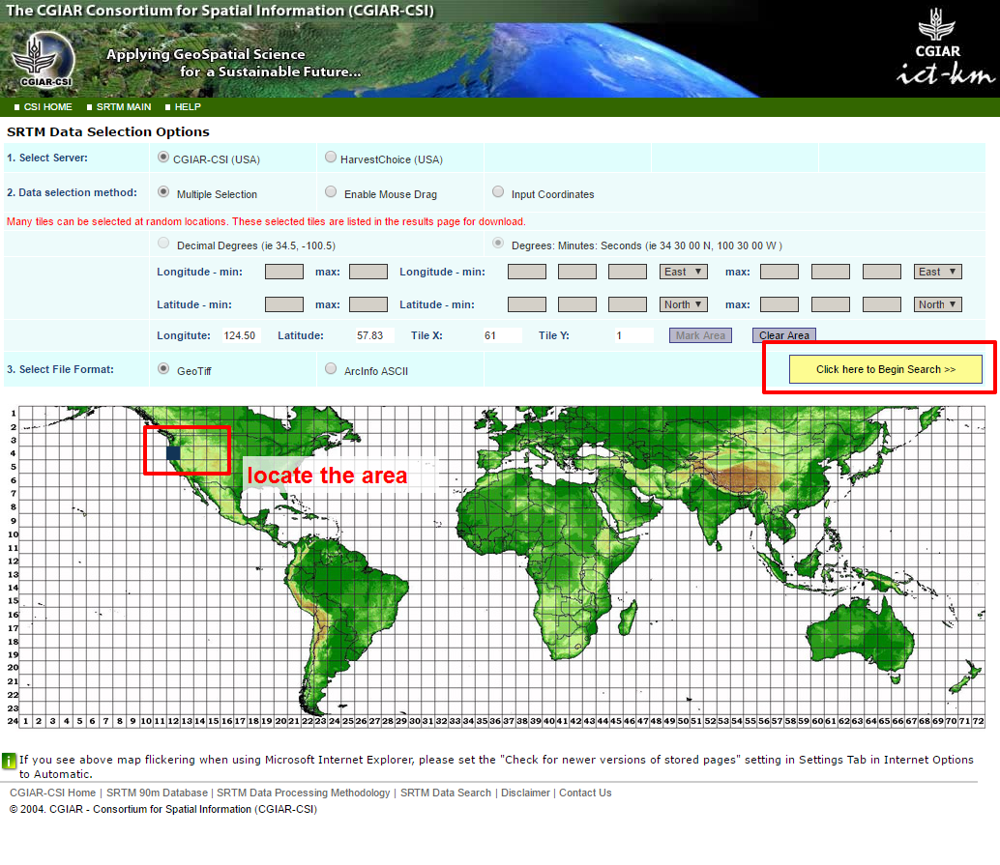
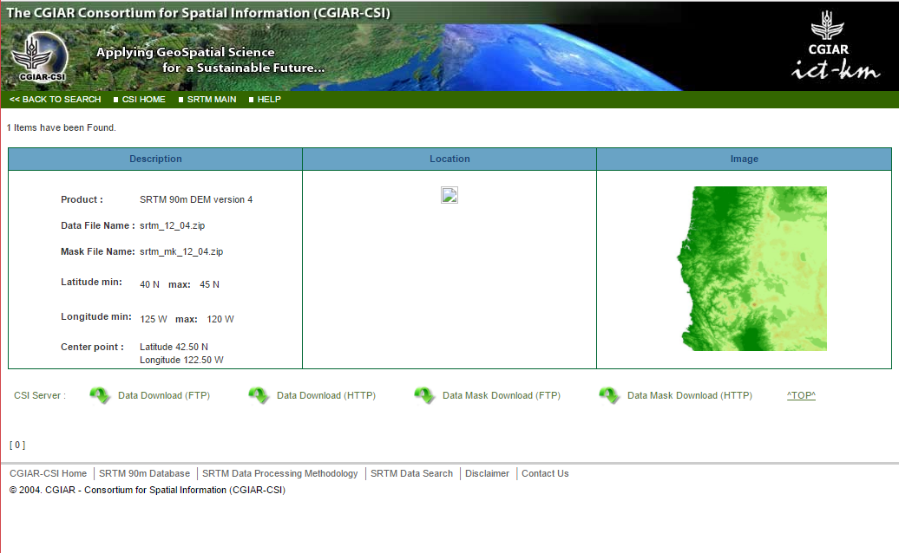
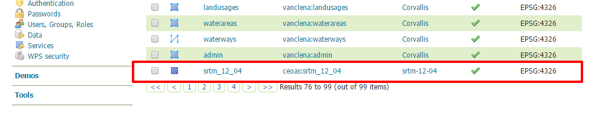
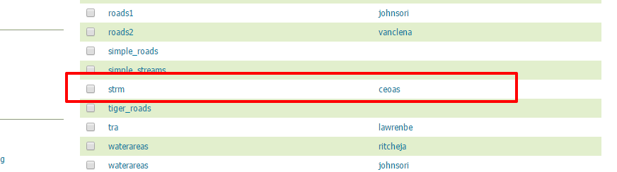
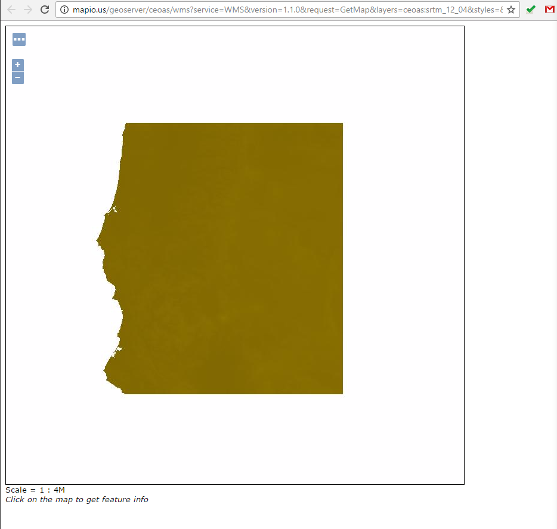
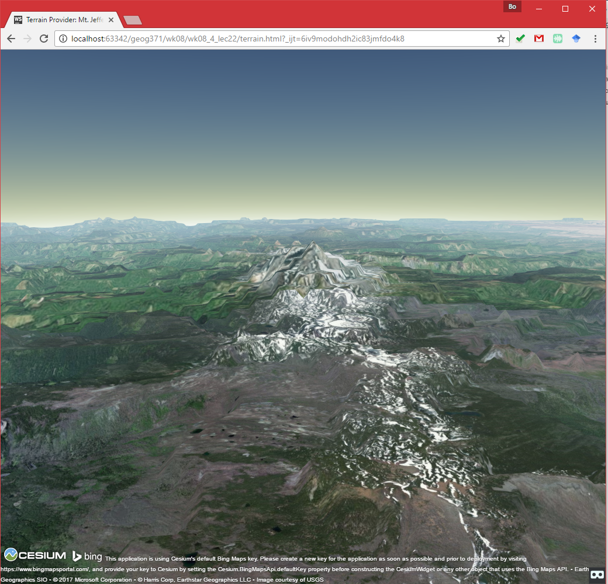

# 3D Web Mapping II: Building a Virtual Environment

> Fall 2017 | Geography 371 | Geovisualization: Web Mapping
>
> Instructor: Bo Zhao | Location: Wilkinson 235 | Time: MWF 1200 to 1250

**Learning Objectives**

- How to build a virtual environment using cesium.js; 
- Terrain lightning and water mask functions; and 
- How to create a terrain provider using geoserver.

Cesium supports streaming and visualizing global high-resolution terrain and water effects for oceans, lakes, and rivers. Mountain peaks, valleys, and other terrain features really show the benefit of a 3D globe compared to a 2D map.

Terrain datasets are huge, commonly totaling gigabytes or terabytes. Efficiently visualizing terrain with a low-level graphics API or with a general 3D engine involves quite a bit of work. Fortunately, Cesium has already done the heavy lifting so we only need to write a couple lines of code.

## 1\. Terrain usages

Let us start with an example. Open the [Hello World](http://cesiumjs.org/Cesium/Apps/Sandcastle/index.html?src=Hello%20World.html) example in Sandcastle. By default, the globe is a [WGS84 ellipsoid](http://earth-info.nga.mil/GandG/publications/tr8350.2/wgs84fin.pdf). To add terrain using the Cesium Terrain Server, add the following code to the bottom (after the line `var viewer = ...`):

```javascript
var terrainProvider = new Cesium.CesiumTerrainProvider({
    url : '//assets.agi.com/stk-terrain/world'
});
viewer.terrainProvider = terrainProvider;
```

After modifying the example, press F8 to run it. To get a feel for the terrain, zoom to a mountainous area, and hold down the middle mouse button and drag to tilt to a horizon view. Here’s what Mount Everest looks like:



As we zoom closer, Cesium requests higher resolution terrain based on what parts of the globe are visible and how far away they are.

> **NOTE**: Terrain and imagery are treated separately; above, the default imagery is draped over the terrain. Any imagery provider(s) can be used with any terrain provider. 

The Cesium Terrain Server also includes data for terrain lighting as well as coastline data needed for water effects. By default, the terrain server does not send lighting or coastline data with the terrain tiles; we must request the terrain lighting or coastline data when constructing a `CesiumTerrainProvider`.

To enabled terrain lighting, request the VertexNormals extension from the Terrain Server and enable lighting on the globe.

```javascript
var terrainProvider = new Cesium.CesiumTerrainProvider({
    url : '//assets.agi.com/stk-terrain/world',
	requestVertexNormals: true
});
viewer.terrainProvider = terrainProvider;
viewer.scene.globe.enableLighting = true;
```

Here is the same view of Mount Everest shown above, but now the terrain is shaded based on the location of the sun.



Water effects are enabled in a similar manner. To enable, we request the WaterMask extension from the Terrain Server as follows:

```javascript
var terrainProvider = new Cesium.CesiumTerrainProvider({
    url : '//assets.agi.com/stk-terrain/world',
	requestWaterMask: true
});
viewer.terrainProvider = terrainProvider;
```

Zoom to an area with water. For example, here is the San Francisco Bay:



The waves animate over time and bright specular highlights show the reflection of the sun and moon.

## 2\. Terrain providers

[cesiumjs.org](http://cesiumjs.org/data-and-assets/terrain/) maintains a catalog of Internet-accessible terrain tilesets. These tilesets can be used in your own Cesium-based applications, usually just by adding a couple of lines of code.

Cesium supports several methods for requesting terrain using *terrain providers*. Most terrain providers use a [REST interface](http://rest.elkstein.org/) over HTTP to request terrain tiles as height maps. Terrain providers differ based on how requests are formatted and how terrain data is organized. Cesium has the following terrain providers:

- [Cesium Terrain Server](http://cesiumjs.org/stk-world-terrain.html) - High resolution worldwide terrain, supporting both terrain lighting and water effects by extension. Terrain tiles are delivered to the client using the open runtime format, [quantized-mesh v1.0](https://github.com/AnalyticalGraphicsInc/quantized-mesh). In Cesium, see [CesiumTerrainProvider](http://cesiumjs.org/Cesium/Build/Documentation/CesiumTerrainProvider.html).
- [Esri ArcGIS Image Server](http://resources.arcgis.com/en/help/rest/apiref/index.html?imageserver.html) - Produces terrain from height maps requested from an Esri Image Service, such as the [World Digital Terrain Model (DTM) Ellipsoidal](http://goto.arcgisonline.com/elevation/DTM_Ellipsoidal), which has datasets ranging from less than 1 meter to 200 km. In Cesium, see [ArcGisImageServerTerrainProvider](http://cesiumjs.org/Cesium/Build/Documentation/ArcGisImageServerTerrainProvider.html).
- [VR-TheWorld Server](http://vr-theworld.com/) - Produces terrain from height maps requested from a VR-TheWorld Server. Their hosted server has 90-meter spacing for the entire globe, including bathymetry. In Cesium, see [VRTheWorldTerrainProvider](http://cesiumjs.org/Cesium/Build/Documentation/VRTheWorldTerrainProvider.html).
- Ellipsoid - Procedurally creates the smooth surface of an ellipsoid. This lacks the realistic appearance of terrain, but does not request data from a server, and is useful for many applications such as space. In Cesium, see [EllipsoidTerrainProvider](http://cesiumjs.org/Cesium/Build/Documentation/EllipsoidTerrainProvider.html).

We can access other terrain services by implementing the [TerrainProvider](http://cesiumjs.org/Cesium/Build/Documentation/TerrainProvider.html) interface. If you do so, and think it is generally useful, please [contribute](https://github.com/AnalyticalGraphicsInc/cesium/wiki/Contributor%27s-Guide) it to Cesium for everyone's benefit.

Some terrain providers, like [CesiumTerrainProvider](http://cesiumjs.org/Cesium/Build/Documentation/CesiumTerrainProvider.html), include coastline data needed for animated water. The water can be customized by changing the normal map used to create waves with [CentralBody.oceanNormalMapUrl](http://cesiumjs.org/Cesium/Build/Documentation/CentralBody.html). Changing the imagery provider also affects the water's appearance because the water color is blended with the underlying imagery.

## 3\. Make a customized terrain provider

We can also make a customized terrain provider using a plugin named cesium-GeoserverTerrainProvider, Find the library at [https://github.com/jakobzhao/Cesium-GeoserverTerrainProvider](https://github.com/jakobzhao/Cesium-GeoserverTerrainProvider)). To do that, we need to:

- Optional: import [mySLD.xml](https://github.com/jakobzhao/Cesium-GeoserverTerrainProvider/blob/master/mySLD.xml) as a new style in geoserver to render your layer (16 bits grayscale) in other color range.
- Import the [GeoserverTerrainProvider.js](https://github.com/jakobzhao/Cesium-GeoserverTerrainProvider/blob/master/GeoserverTerrainProvider.js) file into your html codes after importing Cesium.js.
- Create a new instance of GeoserverTerrainProvider with url of your geoserver and name of elevation layer.

After that, the GeoserverTerrainProvider will determine the capabilities of geoserver (request getCapabilities) and will be ready to provide terrain data.

Let us walk through a quick example. Firstly, we will need to download a piece of DEM data. So we go to the data portal of SRTM 90m DEM at CGIAR ([http://srtm.csi.cgiar.org/](http://srtm.csi.cgiar.org/)), and navigate to the download page at [http://srtm.csi.cgiar.org/SELECTION/inputCoord.asp](http://srtm.csi.cgiar.org/SELECTION/inputCoord.asp). So we locate the data which contains the Mt Jefferson, and click to search data.



The clicking directs us to a new page, and we can download the data by press `Data Download (HTTP)`.



The dem data is compressed, we extracted the data, and uploaded to Geoserver, and we make a new layer based on the dem data. We name the layer `ceoas:srtm_12_04`



Also, we upload the [mySLD.xml](https://github.com/kaktus40/Cesium-GeoserverTerrainProvider/blob/master/mySLD.xml) as a new sld file named `strm`, and then apply this sld file to the layer `ceoas:srtm_12_04`. 



As a result, we have published the dem data as a web map service.



To apply the elevation to cesium, we can use the following code (the code can be found in the folder of this lecture).

 ```javascript
    Cesium.BingMapsApi.defaultKey = "AgUQJFnmoxa47CoxZf-zslnbrBqBzATAxYAiQnd__-q8eGgLZu1ygR8_p2jI3Y9u";
    // create a terrain provider based on geoserver service
    var terrainProvider = new Cesium.GeoserverTerrainProvider({
        url : "http://mapious.ceoas.oregonstate.edu/geoserver/mapious/wms",
        layerName: "srtm_12_04",
        styleName:"srtm",
        waterMask:true
    });

    //turn off the unused tools.
    var viewer = new Cesium.Viewer('cesiumContainer', {
//        terrainProvider: new Cesium.CesiumTerrainProvider({
//            url: '//assets.agi.com/stk-terrain/world'
//        }),
        baseLayerPicker: false,
        fullscreenButton: false,
        homeButton: false,
        infoBox: false,
        sceneModePicker: false,
        selectionIndicator: false,
        timeline: false,
        navigationHelpButton: false,
        vrButton: true,
        geocoder: false,
        animation: false
    });

    viewer.scene.globe = new Cesium.Globe(Cesium.Ellipsoid.WGS84);
    // The globe must enable lighting to make use of the terrain's vertex normals
    viewer.scene.globe.enableLighting = true;
    var layers = viewer.scene.imageryLayers;
    var esri = new Cesium.ArcGisMapServerImageryProvider({
        url : 'https://services.arcgisonline.com/ArcGIS/rest/services/World_Imagery/MapServer'
    });

    layers.addImageryProvider(esri);
    viewer.terrainProvider = terrainProvider;

 ```

As the result, we will see the terrain around Mt Jefferson like below:



## References
[1]. https://cesiumjs.org/tutorials/Terrain-Tutorial/

[2]. https://github.com/kaktus40/Cesium-GeoserverTerrainProvider