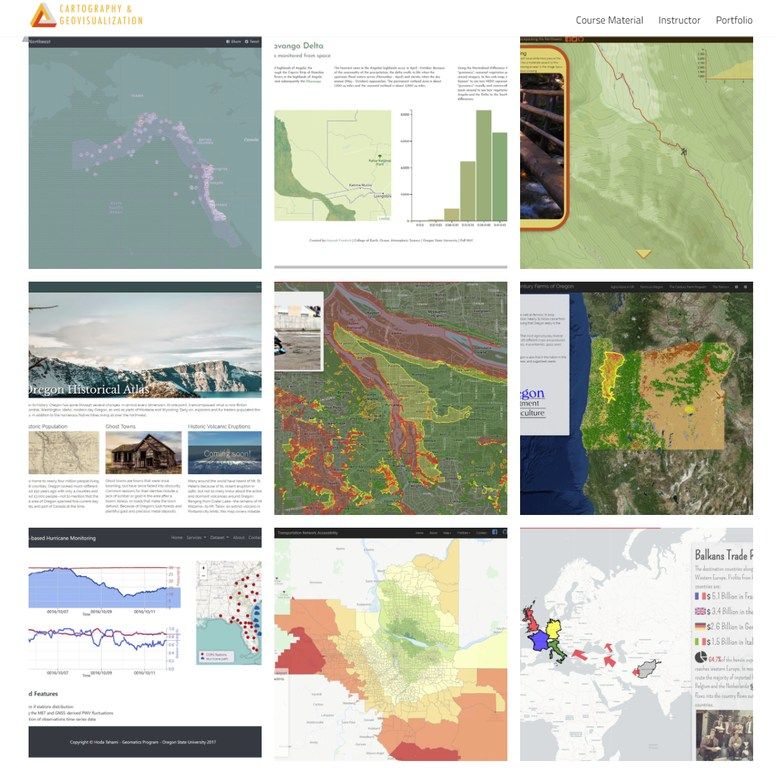
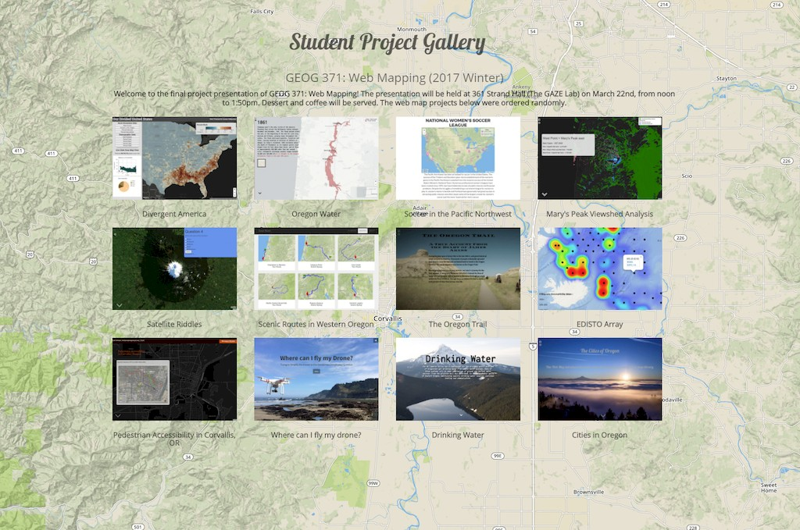
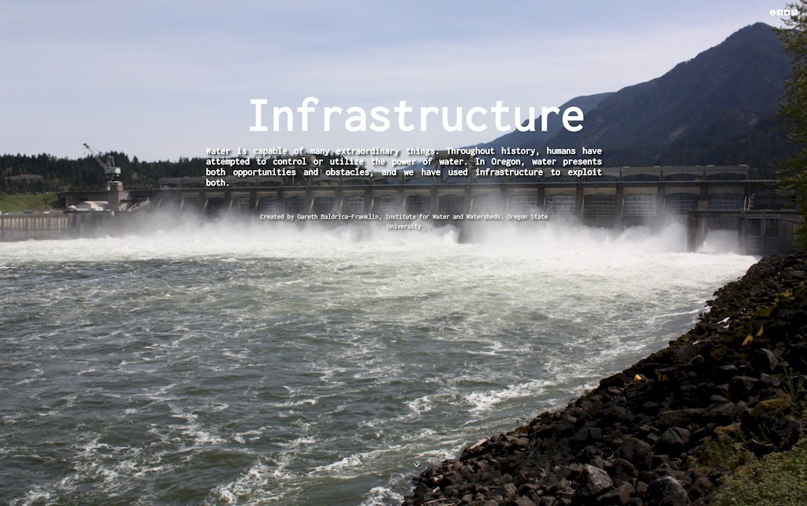

# GEOG 371: Web Mapping
>
>**Instructor:** Bo Zhao, zhao2@oregonstate.edu | **Office Hours:** W 1400-1500 or by appt. @STRAND 347
>
>**Lecture:** MWF 1200 - 1250 @WLKN 235 | **Lab:** Th 1000 to 1150 @WLKN 210
>
>**Catalog course description: GEOVISUALIZATION: WEB MAPPING (4).**
>
>Current developments in Internet mapping and advanced cartographic skills applied to web-based maps. Techniques of Internet mapping and principles of web-based cartography, including multimedia, animation, 3D visualization, and user interface design. **PREREQS:** GEOG 201 or GEO 301.

Welcome to GEOG 371: Web Mapping :earth_americas:! This course introduces current developments in web mapping and advanced cartographic skills applied to interactive map design. By using open sourced libraries (Leaflet, Cesium, storymap.js, Bootstrap, jQuery), free or open source software (QGIS, Webstorm), project management services (GitHub), and web mapping services (GeoServer, MapBox), students can learn both the principles of web-based cartography and the practical skills for web mapping, and develop the capabilities of map aesthetics and critique. The lectures focus on the theories and principles behind web mapping, including system architecture, responsive design, user graphic design, map design and geo-narrative. The lab exercises focus on practical skills for web programming, 2d and 3d web mapping, web mapping services, and digital storytelling. The mid-term focuses on basic concepts and web programming techniques. There is no final exam, but each student is expected to design a web map and deploy it to an openly accessible server. Feel free to contact Dr. Bo Zhao for more information. :raising_hand:

| Week  |               Lecture (M)                |               Lecture (W)                |                 Lab (Th)                 |               Lecture (F)                |                 Reading                  |
| :---: | :--------------------------------------: | :--------------------------------------: | :--------------------------------------: | :--------------------------------------: | :--------------------------------------: |
| Wk 00 |                  *N/A*                   |  [Intro to the Course](lectures/lec01)   | [Lab 1: Project Management for Web Mapping](labs/lab01)  |  [Intro to Web Mapping](lectures/lec02)  | [Markdown, Links and Command Lines](readings/wk00.md) |
| Wk 01 | [Web Programming Basics I: HTML 5 and CSS](lectures/lec03) | [System Architecture for Web Mapping](lectures/lec04) | [Lab 2: Web Programming Basics II: Javascript](labs/lab02) | [Web Programming Basics III: JQuery](lectures/lec05) | [HTML, CSS and Javascript](readings/wk01.md) |
| Wk 02 | [Spatial Data for Web Mapping](lectures/lec06), :raised_hands:[Final Project Guidelines](project/readme.md) | [Map Client I: Basics and Geographic Features](lectures/lec07) |          [Lab 3: Web Map Design](labs/lab03/readme.md)           | [Map Client II: Map Events and Mashup](lectures/lec08) |  [Leaflet and GeoJson](readings/wk02.md)  |
| Wk 03 | [Map Client III: Web Map Interaction](lectures/lec09) | [Map Server I: Intro to GeoServer](lectures/lec10) |              Lab 3: Cont'd               | [Map Server II: Styling](lectures/lec11) |    [GeoServer docs](readings/wk03.md)    |
| Wk 04 | [Map Server III: Web Map Services](lectures/lec12) |  [Map Server IV: Base Map Design using Mapbox](lectures/lec13)   |          [Lab 4: Web Map Services and Basemap](labs/lab04/)          | Midterm Exam  | [Bing Map Tile, WFS and WMS](readings/wk04.md) |
| Wk 05 |          [Map Server V: Map Tiles](lectures/lec14)                   | [Map Design I: Web Template and Framework](lectures/lec15) |              Lab 4: Cont'd               | [Map Design II: Bootstrap](lectures/lec16) | [Bootstrap docs](readings/wk05.md) |
| Wk 06 | [Storytelling with Web Map I](lectures/lec17) | Storytelling with Web Map II, cont'd with the last lecture |             [Lab 5: Story Map](labs/lab05/readme.md)             | [Map Design III: User Friendly Design Principles](lectures/lec19) |     [Web Map Design Principles](readings/wk06.md)      |
| Wk 07 |      [Real-Time Mapping: TweetMap](lectures/lec20)       |        [HeatMap](lectures/lec21)        |              Lab 5: Cont'd               |              *Veterans Day*              |         [Server Side JavaScript](readings/wk07.md)                                   |
| Wk 08 | [Map Design IV: Map Critiques](lectures/lec22) | [3D Web Mapping I: Basics](lectures/lec23) | [Lab 6:  Thematic Map on a Virtual Globe](labs/lab06) | [3D Web Mapping II: Build a Virtual Environment](lectures/lec24) |                                          |
| Wk 09 | [3D Web Mapping III: Thematic Map on a Virtual Globe](lectures/lec25) | Final Project Discussion and Preparation |              *Thanksgiving Break*             |           *Thanksgiving Break*           |                                          |
| Wk 10 | [Emerging Topics on Web Mapping](lectures/lec26) | Final Project Discussion and Preparation | Final Project Discussion and Preparation |   Final Project Presentation - *Strand Ag Hall (GAZE) Dec 1st Noon to 13:50pm*       | [Elwood et al. (2012), Sui and Zhao (2015)](readings/wk10.md) |

[**Syllabus**](resources/syllabus.pdf)

**Course Project:star:**
 - [Guideline](project/readme.md) (WK02)
 - [Proposal]() (WK03)
 - [Data Source](project/datasource.md) (WK04)
 - [Interface Sketch](project/sketch.md) (WK05)
 - [Map Critique](lectures/lec22) (WK08)
 - [Peer Review]() (WK10)
 - [Final Presentation]() (WK10)

### Tutorials

- [Favicon](lectures/lec16/readme.md)
- [Videos](resources/video.md)
- [Images](resources/image.md)
- [Iconagrpahy](resources/icon.md)
- [Web Fonts](resources/fonts.md)
- [Colors](resources/color.md)
- [Social media](lectures/lec16/readme.md)

### Texts

No required textbook, but required papers and online materials will be available on the course repository on GitHub.

### Programming Languages

Html, CSS, Javascript, Markdown and GeoJson

### Desktop Software

[Chrome](https://www.google.com/chrome/browser/desktop/index.html), [Webstorm](https://www.jetbrains.com/webstorm/buy/#edition=discounts), [Typora](https://typora.io), [QGIS](http://www.qgis.org/en/site/), and [GeoServer](http://geoserver.org/)
​	
### Web Services

[GitHub](https://github.com/), [jsfiddle](https://jsfiddle.net/), [Mapbox](https://www.mapbox.com/), [W3Schools](https://www.w3schools.com/), and [geojson.io](http://geojson.io)
​	
### Libraries for Web Mapping

[Jquery](https://jquery.com/), [Bootstrap](http://getbootstrap.com/), [Leaflet](https://leafletjs.com), [Storymap.js](https://github.com/jakobzhao/storymap), and [Cesium](cesiumjs.org)

### Previous Years

#### [2017 Fall](http://geoviz.ceoas.oregonstate.edu/geog371.html#portfolio)

#### [2017 Winter](http://geoviz.ceoas.oregonstate.edu/project_gallery/)

- :trophy: [A story map on Infrastructure for Water Management](http://rawgit.com/cartobaldrica/water_atlas/master/infrastructure_index.html) from a former student has won the environmental challenge 2017

### Credits
This course material is maintained by the [Cartography and Geovisualization Group at Oregon State University](http://geoviz.ceoas.oregonstate.edu). Some of the material in this course is based on the classes taught at MIT and Penn State University. We have heavily drawn on materials and examples found online and tried our best to give credit by linking to the original source. Please contact us if you find materials where the credit is missing or that you would rather have removed.
