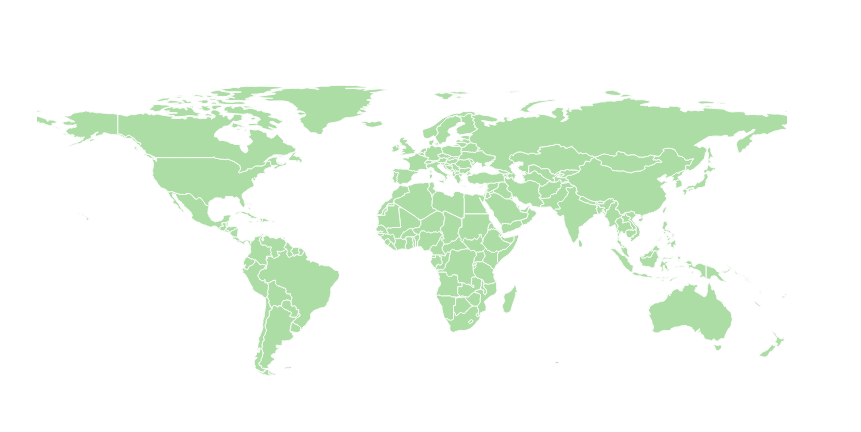

# Coordinate Systems for Web Map Design

## WGS 84 

The World Geodetic System (WGS) is a standard for use in cartography, geodesy, and navigation including GPS. It comprises a standard coordinate system for the Earth, a standard spheroidal reference surface (the datum or reference ellipsoid) for raw altitude data, and a gravitational equipotential surface (the geoid) that defines the nominal sea level.

WGS, *a.k.a.* Geographic, Plate Carrée, Equidistant Cylindrical, Equirectangular. The latest revision is WGS 84. Its official EPSG  (European Petroleum Survey Group)  identifier is **EPSG:4326**. Here is the projection information.

**Projection Information**
```
GEOGCS["WGS 84",
    DATUM["WGS_1984",
        SPHEROID["WGS 84",6378137,298.257223563,
            AUTHORITY["EPSG","7030"]],
        AUTHORITY["EPSG","6326"]],
    PRIMEM["Greenwich",0,
        AUTHORITY["EPSG","8901"]],
    UNIT["degree",0.01745329251994328,
        AUTHORITY["EPSG","9122"]],
    AUTHORITY["EPSG","4326"]]
```



## Web Mercator

Web Mercator (Google Web Mercator, Spherical Mercator, Pseudo Mercator) is a variation of the Mercator projection and is the de facto standard for Web mapping applications. It rose to prominence when used in the first Google Maps in 2005. It is used by virtually all major online map providers, including Google Maps, Bing Maps, OpenStreetMap, MapQuest, Esri, Mapbox, and many others. Its official EPSG identifier is **EPSG:3857**, although others have been used historically, such as **EPSG:900913**.

**Projection information**
```
PROJCS["WGS 84 / Pseudo-Mercator",
    GEOGCS["WGS 84",
        DATUM["WGS_1984",
            SPHEROID["WGS 84",6378137,298.257223563,
                AUTHORITY["EPSG","7030"]],
            AUTHORITY["EPSG","6326"]],
        PRIMEM["Greenwich",0,
            AUTHORITY["EPSG","8901"]],
        UNIT["degree",0.0174532925199433,
            AUTHORITY["EPSG","9122"]],
        AUTHORITY["EPSG","4326"]],
    PROJECTION["Mercator_1SP"],
    PARAMETER["central_meridian",0],
    PARAMETER["scale_factor",1],
    PARAMETER["false_easting",0],
    PARAMETER["false_northing",0],
    UNIT["metre",1,
        AUTHORITY["EPSG","9001"]],
    AXIS["X",EAST],
    AXIS["Y",NORTH],
    EXTENSION["PROJ4","+proj=merc +a=6378137 +b=6378137 +lat_ts=0.0 +lon_0=0.0 +x_0=0.0 +y_0=0 +k=1.0 +units=m +nadgrids=@null +wktext +no_defs"],
    AUTHORITY["EPSG","3857"]]
```


> **900913**: Due to slow adoption by standards body European Petroleum Survey Group (EPSG), the Web Mercator is represented by a confusing series of standard names and ids, including 900913, EPSG:3785 and EPSG:3857.
>
> The projected coordinate reference system originally lacked an official spatial reference identifier (SRID), and the European Petroleum Survey Group refused to provide it with one, declaring "We have reviewed the coordinate reference system used by Microsoft, Google, etc. and believe that it is technically flawed. We will not devalue the EPSG dataset by including such inappropriate geodesy and cartography." The unofficial code "900913" (GOOGLE [transliterated to numbers](https://en.wikipedia.org/wiki/Leet)) came to be used. It was originally defined by Christopher Schmidt in his Technical Ramblings blog.[http://crschmidt.net/blog/archives/243/google-projection-900913/](http://crschmidt.net/blog/archives/243/google-projection-900913/).