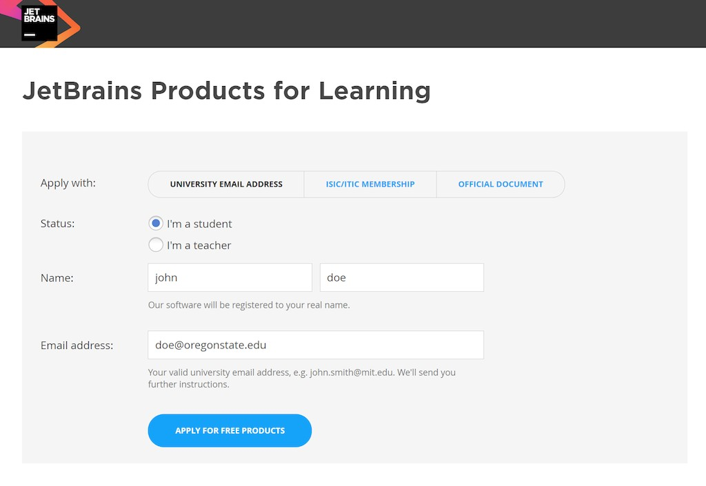
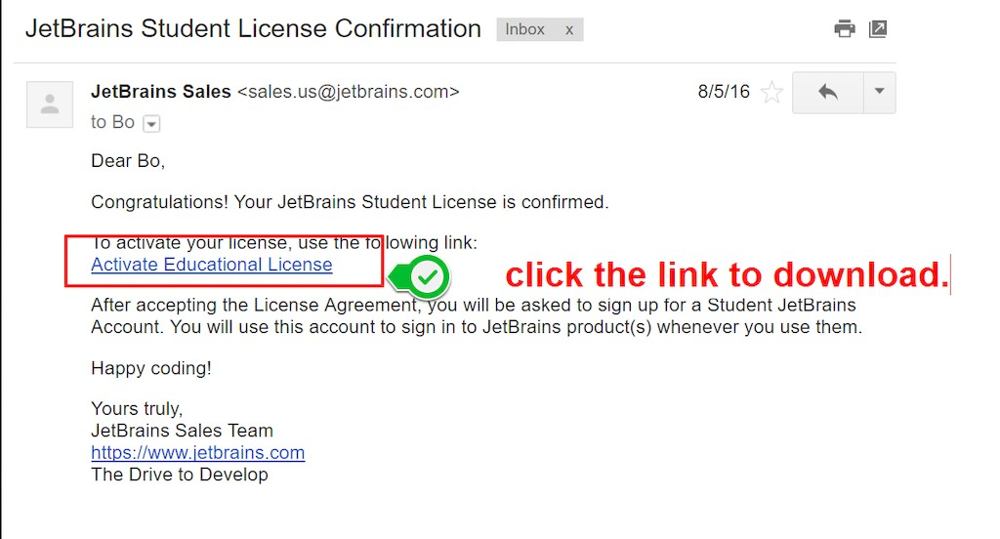
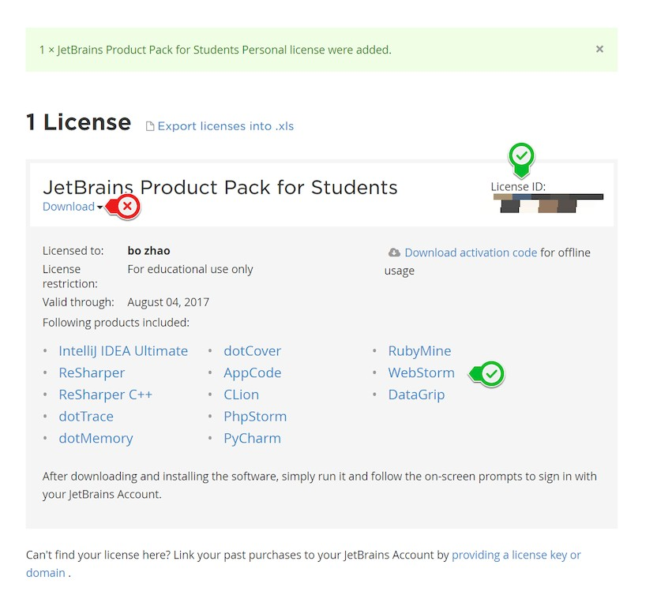

# Install WebStorm on your personal pc/mac

In Digital Lab @ Wilkinson 210, every computer has installed WebStorm.  To faciliate your use on your personal pc/mac, JetBrain actually allows students and teachers install a free edition of WebStorm on their personal PC or Mac. Besides, if you are working on an open source project, you can also apply for a free edition of WebStorm. (Think about someday you become an open source guru, or start up your own business on Web Mapping, you might want to have a powerful yet free/opensource IDE.)

To install WebStorm:

1\. Apply an JetBrains account with your university email at https://www.jetbrains.com/shop/eform/students.

2\. Once your application are approved, you will received an email with a link to download Webstrom.

3\. ​ Download WebStorm (**note:** you might not want to download all the product pack.) and activate it with your registration info and Licnese ID.

Above is a very brief tutorial on installing WebStorm. Let me know if you have any question or issues.